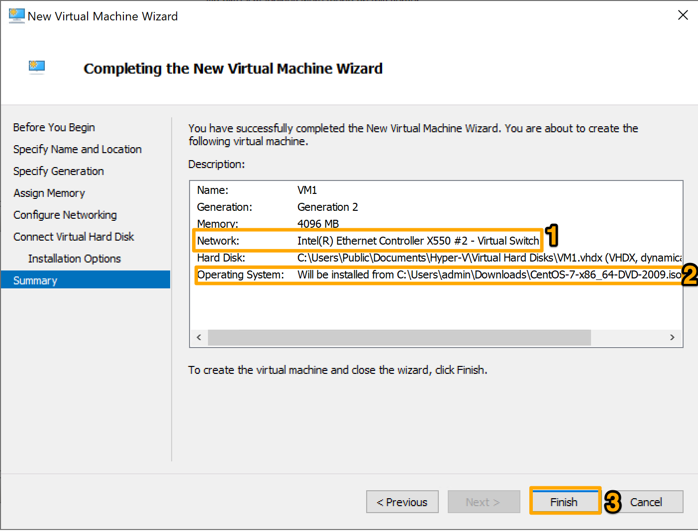
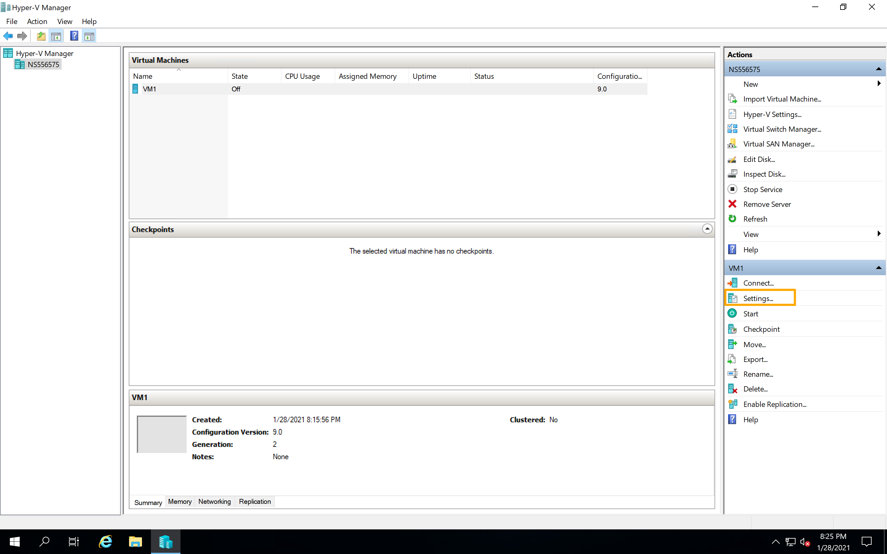

**Dernière mise à jour le 18/06/2020**

## Objectif

**Ce guide vous guidera tout au long du processus d'installation d'Hyper-V, d'association d'un switch virtuel et de configuration d'une machine virtuelle pour qu'elle fonctionne avec les Faiover IPs sur un vRack.**

## Prérequis

- Un serveur dédié compatible vRack avec Windows Server installé.
- Un ISO pour le système d'exploitation qui sera installé sur votre machine virtuelle. (CentOS 7 sera utilisé comme exemple dans ce guide)
- Un vRack livré à votre compte OVHcloud.
- Un Bloc IP  de 4 adresses IP ou plus.
- Accès à l'espace client OVHcloud

## En pratique

Ce guide suppose que vous avez déjà installé Windows Server, connecté via le Bureau à distance et que vous avez déjà affecté votre serveur dédié et votre bloc IP à un vRack. Pour plus d'informations sur ces étapes, reportez-vous aux étapes 1 à 4 de notre guide: [Configurer plusieurs serveurs dédiés dans le vRack](../configurer-plusieurs-serveurs-dedies-dans-le-vrack).

### Installation d'Hyper-V

La première étape consiste à installer Hyper-V.

Dans le Gestionnaire de serveur, cliquez sur 'Add roles and features'
 
{.thumbnail}

Dans l'Assistant, cliquez sur 'Next' pour passer à la page suivante.

{.thumbnail}

Vérifiez ensuite que l'option 'Role-Based or feature-based installation' est sélectionnée et cliquez sur "Next".

{.thumbnail}

Vérifiez ensuite que l'option 'Select a server from the server pool' est sélectionnée et que le serveur sur lequel vous travaillez est sélectionné dans la liste. Cliquez ensuite sur 'Next'.

{.thumbnail}

Ensuite, cochez 'Hyper-V', puis cliquez sur 'Next'.

{.thumbnail}

Sur la page suivante, il vous suffit de cliquer sur 'Next'

{.thumbnail}

Ensuite, il vous est demandé d'identifier la connexion réseau de votre serveur que vous souhaitez utiliser pour le commutateur virtuel.

Pour ce faire, ouvrez une Command Prompt ou PowerShell et exécutez la commande ipconfig /all.

Notez que dans notre exemple, Ethernet 2 est l'interface utilisée pour le vRack, il est possible que la carte réseau vRack soit une interface différente. Celui que vous voulez sera l'interface qui ne possède pas l'adresse IP principale du serveur ou qui a une adresse IP 169.254.x.x auto-attribuée.

{.thumbnail}

Une fois ces informations disponibles, revenez à le 'Add Roles and Features Wizard' et cliquez sur 'Next'.

{.thumbnail}

Ensuite, sélectionnez l'adaptateur pour le vRack que vous avez identifié dans le Command Prompt ou PowerShell, puis cliquez sur 'Next'.

{.thumbnail}

Les 2 pages suivantes vous permettent de choisir les options de migration et de stockage. Vous pouvez les configurer comme vous le souhaitez.

Une fois que vous avez atteint la page de confirmation, cochez la case 'Restart the destination server automatically if required', cliquez sur 'Yes', puis sur 'Install'.

{.thumbnail}

Hyper-V va maintenant s'installer et le serveur doit redémarrer.

### Création et configuration d'une machine virtuelle.

Une fois le serveur redémarré, connectez-vous et ouvrez le Hyper-V Manager.

Sélectionnez votre serveur sur la gauche, cliquez sur 'New; et sélectionnez 'Virtual Machine'

{.thumbnail}

Dans 'New Virtual Machine Wizard', configurez la machine virtuelle comme vous le souhaitez. Lorsque vous accédez à l'étape 'Configure Networking'. Veillez à sélectionner le switch virtuel. Une fois sélectionné, cliquez sur 'Next' pour continuer.

{.thumbnail}

Une fois que vous avez atteint la section 'Installation Options', veillez à ajouter l'ISO pour le système d'exploitation que vous allez installer. Cliquez sur 'Next'  pour continuer.

{.thumbnail}

Lorsque vous accédez à la page 'Summary', vérifiez que les paramètres du switch  virtuel et du système d'exploitation sont corrects, puis cliquez sur 'Finish'.

{.thumbnail}

### Installation et configuration de la machine virtuelle

Start the Virtual Machine, the OS installation should start automatically. If not, you will likely get the following error message:

Démarrez la machine virtuel. L'installation du système d'exploitation doit démarrer automatiquement. Si ce n'est pas le cas, le message d'erreur suivant s'affiche:

"The unsigned image's hash is not allowed (DB)"

Dans ce cas, vous devez désactiver le Secure Boot.

Éteignez la machine virtuelle et cliquez sur "Settings"

{.thumbnail}

Next, click on 'Security', deselect 'Enable Secure Boot', then click 'Apply'.

Ensuite, cliquez sur 'Security', désélectionnez 'Enable Secure Boot', puis cliquez sur 'Apply'.

{.thumbnail}

Une fois terminé, redémarrez l'ordinateur virtuel.

Configurez le système d'exploitation comme vous le souhaitez

Pour les paramètres réseau, vous définissez une adresse IP statique.

Dans notre exemple, le bloc IP assigné au vRack est 192.99.134.80/29. Voici la répartition du bloc:

192.99.134.80 -  Adresse réseau (Réservé - Inutilisable)
192.99.134.81 -  Premier IP utilisable
192.99.134.82
192.99.134.83
192.99.134.84
192.99.134.85 - Dernière adresse IP utilisable
192.99.134.86 - Passerelle par défaut (Réservée - Inutilisable)
192.99.134.87 - Adresse de diffusion (Réservé - Inutilisable)

Nous allons utiliser 192.99.134.81 dans notre exemple. La configuration doit se présenter comme suit

Address: 192.168.134.81
Subnet Mask: 255.255.255.248
Gateway: 192.99.134.86
DNS: 213.186.33.99 (Vous pouvez mettre un autre DNS si vous le souhaitez)

Une fois le système d'exploitation installé. Il aurait dû être déjà connecté.

Vous pouvez également voir comment le fichier ifcfg-eth0 doit apparaître.

{.thumbnail}

## Aller plus loin

Échangez avec notre communauté d'utilisateurs sur <https://community.ovh.com/>.
