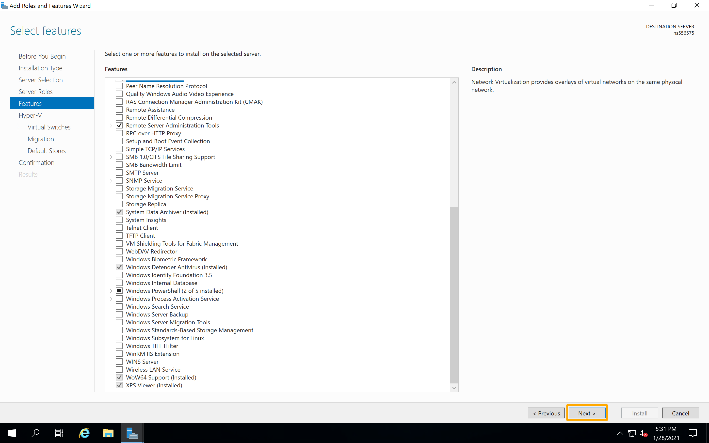
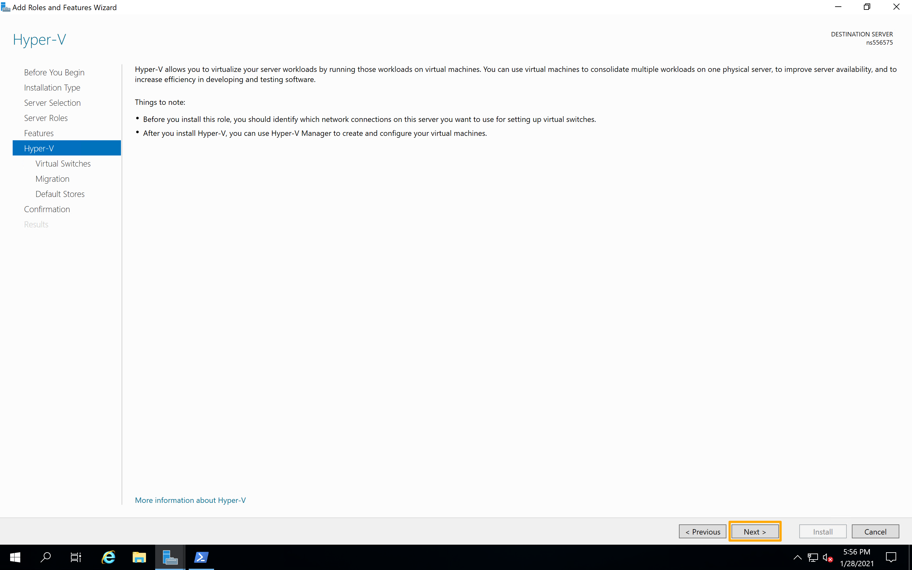
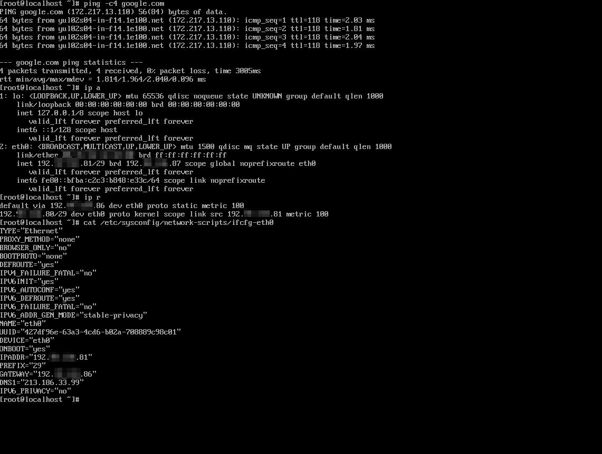

**Dernière mise à jour le 26/04/2021**

## Objectif

Suivez le processus d'installation d'Hyper-V, l'association d'un switch virtuel et la configuration d'une machine virtuelle pour fonctionner avec les IPs fail-over sur un vRack.

**Découvrez comment configurer une machine virtuelle avec des IPs fail-over et Hyper-V sur un vRack.**

## Prérequis

- Un serveur dédié (compatible [vRack](https://www.ovh.com/ca/fr/solutions/vrack/)) sur lequel Windows Server est installé.
- Un image ISO pour le système d'exploitation qui sera installé sur votre machine virtuelle (CentOS 7 sera utilisé comme exemple dans ce guide).
- Un vRack livré sur votre compte OVHcloud.
- Un Bloc IP  de 4 adresses IP ou plus.
- Etre connecté à l'[espace client OVHcloud](https://ca.ovh.com/auth/?action=gotomanager&from=https://www.ovh.com/ca/fr/&ovhSubsidiary=qc).

> [!warning]
> Cette fonctionnalité peut être indisponible ou limitée sur les [serveurs dédiés **Eco**](https://eco.ovhcloud.com/fr-ca/about/).
>
> Consultez notre [comparatif](https://eco.ovhcloud.com/fr-ca/compare/) pour plus d’informations.

## En pratique

Ce guide suppose que vous avez déjà installé Windows Server, que vous êtes connecté via le bureau à distance et que vous avez déjà affecté votre serveur dédié et votre bloc IP à un vRack. Pour plus d'informations sur ces étapes, reportez-vous aux étapes 1 à 4 de notre guide: [Configurer plusieurs serveurs dédiés dans le vRack](../configurer-plusieurs-serveurs-dedies-dans-le-vrack).

### Installation d'Hyper-V

La première étape consiste à installer Hyper-V.

Dans le gestionnaire de serveurs, cliquez sur `Add roles and features`{.action}

{.thumbnail}

Dans l'Assistant, cliquez sur `Next`{.action} pour passer à la page suivante.

{.thumbnail}

Vérifiez que l'option « Role-Based or feature-based installation » est sélectionnée, puis cliquez sur `Next`{.action}.

{.thumbnail}

Vérifiez que l'option « Select a server from the server pool » est sélectionnée, ainsi que le serveur sur lequel vous travaillez dans la liste en dessous. Cliquez ensuite sur `Next`{.action}.

{.thumbnail}

Dans la liste des roles, cochez « Hyper-V », puis cliquez sur `Next`{.action}.

{.thumbnail}

Sur la page suivante (« Features »), cliquez sur `Next`{.action}.

{.thumbnail}

Identifiez la connexion réseau de votre serveur que vous souhaitez utiliser pour le switch virtuel.

Afin de l'identifiez, ouvrez une Command Prompt ou PowerShell et exécutez la commande `ipconfig /all`.

Notez que, dans notre exemple, `Ethernet 2` est l'interface utilisée pour le vRack. Cependant, il est possible que la carte réseau vRack utilise une interface différente. Utilisez une interface qui ne possède pas l'adresse IP principale du serveur ou qui utilise une adresse IP auto-attribuée (169.254.x.x).

{.thumbnail}

Une fois ces informations disponibles, revenez sur la fenêtre `Add Roles and Features Wizard`{.action} et cliquez sur `Next`{.action}.

{.thumbnail}

Sélectionnez l'adaptateur pour le vRack que vous avez identifié dans le Command Prompt ou PowerShell, puis cliquez sur `Next`{.action}.

{.thumbnail}

Les deux pages suivantes vous permettent de choisir les options de migration et de stockage. Vous pouvez les configurer comme vous le souhaitez.

Une fois que vous avez atteint la page de confirmation, cochez la case « Restart the destination server automatically if required », cliquez sur `Yes`{.action}, puis sur `Install`{.action}.

{.thumbnail}

Hyper-V va maintenant s'installer et le serveur devrait redémarrer.

### Créer et configurer une machine virtuelle

Une fois le serveur redémarré, connectez-vous et ouvrez le Hyper-V Manager.

Sélectionnez votre serveur sur la gauche, cliquez sur `New`{.action} et sélectionnez « Virtual Machine ».

{.thumbnail}

Dans « New Virtual Machine Wizard », configurez la machine virtuelle comme vous le souhaitez. Lorsque vous accéderez à l'étape « Configure Networking », veillez à sélectionner le switch virtuel. Une fois celui-ci sélectionné, cliquez sur `Next`{.action} pour continuer.

{.thumbnail}

Une fois que vous avez atteint la section « Installation Options », veillez à ajouter l'image ISO pour le système d'exploitation que vous allez installer. Cliquez sur `Next`{.action} pour continuer.

{.thumbnail}

Lorsque vous accédez à la page « Summary », vérifiez que les paramètres du switch virtuel et du système d'exploitation sont corrects, puis cliquez sur `Finish`{.action}.

{.thumbnail}

### Installer l'OS et configurer l'IP

Démarrez la machine virtuelle. L'installation du système d'exploitation doit se lancer automatiquement. Si ce n'est pas le cas, le message d'erreur suivant s'affiche :

> « The unsigned image's hash is not allowed (DB) »

Dans ce cas, vous devez désactiver le « Secure Boot ».

Éteignez la machine virtuelle, puis cliquez sur `Settings`{.action}.

{.thumbnail}

Cliquez sur `Security`{.action}, désélectionnez « Enable Secure Boot », puis cliquez sur `Apply`{.action}.

{.thumbnail}

Une fois terminé, redémarrez la machine virtuelle.

Configurez le système d'exploitation comme vous le souhaitez.

Pour les paramètres réseau, il sera nécessaire de définir une adresse IP statique.

Dans notre exemple, le bloc IP assigné au vRack est 192.xxx.xxx.80/29. Voici la répartition du bloc :

 
192.xxx.xxx.80 -  Adresse réseau (Réservé - Inutilisable) 
192.xxx.xxx.81 -  Première adresse IP utilisable 
192.xxx.xxx.82 
192.xxx.xxx.83 
192.xxx.xxx.84 
192.xxx.xxx.85 - Dernière adresse IP utilisable 
192.xxx.xxx.86 - Passerelle par défaut (Réservée - Inutilisable) 
192.xxx.xxx.87 - Adresse de broadcast (Réservé - Inutilisable) 
 

Nous allons utiliser 192.xxx.xxx.81 dans notre exemple. La configuration doit se présenter comme ceci :

 
Address: 192.168.xxx.81 
Subnet Mask: 255.255.255.248 
Gateway: 192.xxx.xxx.86 
DNS: 213.186.33.99 (Vous pouvez mettre un autre DNS si vous le souhaitez) 
 

Une fois le système d'exploitation installé. Il devrait déjà être connecté.

L'exemple ci-dessous montre comment le fichier `ifcfg-eth0` doit apparaître.

{.thumbnail}

## Aller plus loin

Échangez avec notre communauté d'utilisateurs sur <https://community.ovh.com/>.
