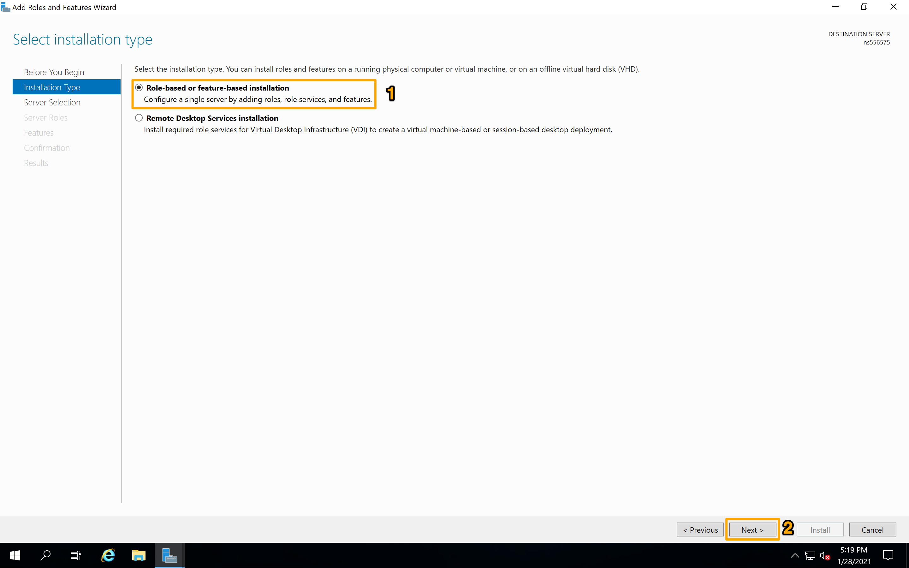
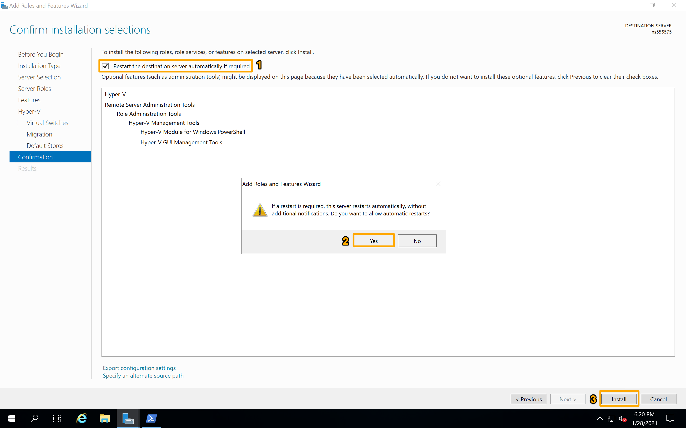
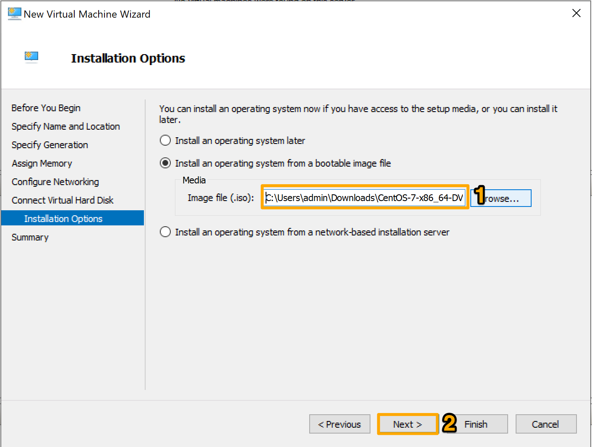

> [!primary]
> Questa traduzione è stata generata automaticamente dal nostro partner SYSTRAN. I contenuti potrebbero presentare imprecisioni, ad esempio la nomenclatura dei pulsanti o alcuni dettagli tecnici. In caso di dubbi consigliamo di fare riferimento alla versione inglese o francese della guida. Per aiutarci a migliorare questa traduzione, utilizza il pulsante "Modifica" di questa pagina.
>

**Ultimo aggiornamento: 26/04/2021**

## Obiettivo

Segui il processo di installazione di Hyper-V, l'associazione di uno switch virtuale e la configurazione di una macchina virtuale per funzionare con gli IP Failover su una vRack.

**Questa guida ti mostra come configurare una macchina virtuale con IP Failover e Hyper-V su una vRack.**

## Prerequisiti

- Un server dedicato (compatibile con [vRack](https://www.ovh.it/soluzioni/vrack/)) su cui Windows Server è installato.
- Un'immagine ISO per il sistema operativo che verrà installato sulla tua macchina virtuale (CentOS 7 sarà utilizzato come esempio in questa guida).
- Una vRack consegnata sul tuo account OVHcloud.
- Blocco IP di 4 o più indirizzi IP
- Avere accesso allo [Spazio Cliente OVHcloud](https://www.ovh.com/auth/?action=gotomanager&from=https://www.ovh.it/&ovhSubsidiary=it).

## Procedura

Questa guida ti mostra come utilizzare Windows Server, connetterti tramite desktop remoto e aver già assegnato il tuo server dedicato e il tuo blocco IP a una vRack. Per maggiori informazioni sugli step da 1 a 4, consulta la nostra guida: [Configurare diversi server dedicati nella vRack](../configurare-server-dedicati-vrack/).

### Installazione Hyper-V

Il primo step consiste nell'installare Hyper-V.

Nell'interfaccia di gestione dei server, clicca su `Add roles and features`{.action}

{.thumbnail}

Nell'assistente, clicca su `Next`{.action} per passare alla pagina successiva.

{.thumbnail}

Verifica che l'opzione "Role-Based or feature-based installazione" sia selezionata e clicca su `Next`{.action}.

{.thumbnail}

Verifica che l'opzione "Select a server from the server pool" sia selezionata, così come il server su cui lavori nella lista qui sotto. Clicca su `Next`{.action}.

{.thumbnail}

Nella lista delle role, seleziona "Hyper-V" e clicca su `Next`{.action}.

{.thumbnail}

Nella pagina successiva ("Features") clicca su `Next`{.action}.

{.thumbnail}

Identifica la connessione di rete del tuo server che vuoi utilizzare per lo switch virtuale.

Per identificarlo, apri un Command Prompt o PowerShell ed esegui il comando `ipconfig /all`.

Nel nostro esempio, `Ethernet 2` è l'interfaccia utilizzata per la vRack. ma è possibile che la scheda di rete vRack utilizzi un'interfaccia diversa. Utilizza un'interfaccia che non possiede l'indirizzo IP principale del server o che utilizza un indirizzo IP auto-attribuito (169.254.x.x).

{.thumbnail}

Una volta disponibili, torna alla finestra `Add Roles and Features Wizard`{.action} e clicca su `Next`{.action}.

{.thumbnail}

Seleziona l'adattatore per la vRack che hai identificato nel Command Prompt o PowerShell e clicca su `Next`{.action}.

{.thumbnail}

Le due pagine successive ti permettono di scegliere le opzioni di migrazione e di storage. Puoi configurarli come preferisci.

Una volta raggiunta la pagina di conferma, seleziona la voce "Restart the destination server automatically if required", clicca su `Yes`{.action} e poi su `Install`{.action}.

{.thumbnail}

A questo punto Hyper-V si installerà e il server dovrebbe riavviare.

### Creare e configurare una macchina virtuale

Una volta riavviato il server, accedi e apri l'Hyper-V Manager.

Seleziona il tuo server a sinistra, clicca su `New`{.action} e seleziona "Virtual Machine".

{.thumbnail}

In "New Virtual Machine Wizard", configura la macchina virtuale come vuoi. Quando accedi allo step "Configura Networking", seleziona lo switch virtuale. Una volta selezionato il Clicca su `Next`{.action} per continuare.

{.thumbnail}

Una volta raggiunta la sezione "Installation Opzioni", aggiungi l'immagine ISO per il sistema operativo che stai per installare. Clicca su `Next`{.action} per continuare

{.thumbnail}

Quando accedi alla pagina "Summary", verifica che le impostazioni dello switch virtuale e del sistema operativo siano corrette, poi clicca su `Finish`{.action}.

{.thumbnail}

### Installa il Sistema Operativo e configura l'IP

Avvia la macchina virtuale. L'installazione del sistema operativo deve iniziare automaticamente. In caso contrario, visualizzi questo messaggio di errore:

> "The unsigned image's hash is not allowed (DB)"

In questo caso, disattiva il "Secure Boot".

Spenga la macchina virtuale e clicca su `Settings`{.action}.

{.thumbnail}

Clicca su `Security`{.action}, seleziona "Enable Secure Boot" e poi clicca su `Apply`{.action}.

{.thumbnail}

Riavvia la macchina virtuale una volta terminata.

Configura il sistema operativo come preferisci.

Per i parametri di rete, sarà necessario definire un indirizzo IP statico.

Nel nostro esempio, il blocco IP assegnato alla vRack è 192.xxx.xxx.80/29. Ecco la ripartizione del blocco:

 
192.xxx.xxx.80 - Indirizzo di rete (riservato - non utilizzabile) 
192.xxx.xxx.81 - Primo indirizzo IP utilizzabile 
192.xxx.xxx.82 
192.xxx.xxx.83 
192.xxx.xxx.84 
192.xxx.xxx.85 - Ultimo indirizzo IP utilizzabile 
192.xxx.xxx.86 - Gateway predefinito (riservato) 
192.xxx.xxx.87 - Indirizzo di broadcast (riservato) 
 

Nel nostro esempio utilizzeremo 192.xxx.xxx.81. La configurazione deve presentarsi come segue:

 
Address: 192.168.xxx.81 
Subnet Mask: 255.255.255.248 
Gateway: 192.xxx.xxx.86 
DNS: 213.186.33.99 (È possibile aggiungere un altro DNS se lo desideri) 
 

Una volta installato il sistema operativo Dovrebbe già essere connesso.

L'esempio che segue mostra come visualizzare il file `ifcfg-eth0`.

{.thumbnail}

## Per saperne di più

Contatta la nostra Community di utenti all’indirizzo <https://community.ovh.com/en/>.
