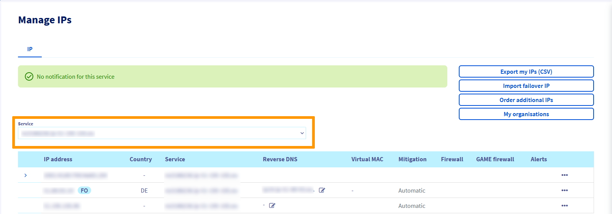

> [!primary]
> Questa traduzione è stata generata automaticamente dal nostro partner SYSTRAN. I contenuti potrebbero presentare imprecisioni, ad esempio la nomenclatura dei pulsanti o alcuni dettagli tecnici. In caso di dubbi consigliamo di fare riferimento alla versione inglese o francese della guida. Per aiutarci a migliorare questa traduzione, utilizza il pulsante "Modifica" di questa pagina.
> 

**Ultimo aggiornamento: 16/12/2021**

## Obiettivo

Le politiche anti-spam sono sempre più severe. Per rendere più fluido l'invio delle email e ricevere i tuoi destinatari senza bloccare gli strumenti di sicurezza, sono necessarie impostazioni per autenticare i tuoi messaggi e convalidarne il contenuto.

**Questa guida ti mostra come ottimizzare l'invio delle tue email.**

> [!warning]
>OVHcloud fornisce i servizi di cui sei responsabile per la configurazione e la gestione. Sei quindi responsabile del loro corretto funzionamento.
>
>Questa guida ti mostra come eseguire le operazioni necessarie per eseguire l'operazione. Tuttavia, in caso di difficoltà o dubbi relativamente all'amministrazione, all'utilizzo o alla realizzazione dei servizi su un server, ti consigliamo di contattare un fornitore di servizi specializzato.
>

## Prerequisiti

- Disporre di un server email già configurato

## Procedura

### Configura il record SPF

Per le infrastrutture dedicate (server dedicati, VPS, istanze Public Cloud o Hosted Private Cloud), il record SPF ottimale si presenta come: `v=spf1 ip4:server_ipv4 ~all`. Ricordati di sostituire 'server_ipv4' con l'indirizzo IPv4 del tuo server.

> [!primary]
>
> Il simbolo davanti *all* è molto importante:
>
> - `+`: accettare
> - `-`: non accettare
> - `~`: fallimento dolce (*soft fail*)
> - `?`: neutro
>

Per maggiori informazioni sulla sintassi del record SPF, clicca su questo link: <http://www.open-spf.org/>.

È possibile andare oltre configurando il record SPF di un dominio specifico o specificando un IPv6. Per effettuare questa operazione, consulta la nostra guida su come [aggiungere un record SPF](https://docs.ovh.com/it/domains/hosting_condiviso_il_record_spf/).

### Configura il record DKIM

La configurazione di un record DKIM (DomainKeys Identified Mail) offre una protezione aggiuntiva per evitare che le tue email siano contrassegnate come Spam. Il DKIM è una firma che permette di autenticare il dominio mittente.

Questa autenticazione si effettua con una chiave DKIM da aggiungere alla tua zona DNS. Troverai diversi generatori di chiavi DKIM, di cui <http://dkimcore.org/tools/keys.html>. Segui le indicazioni fornite sul sito del generatore scelto.

### Configura il reverse (*reverse IP*)

Per ottimizzare l'invio e ridurre i rischi di blocco delle tue email, è necessario configurare con il tuo dominio un reverse.

Per prima cosa, crea un record A nella zona DNS del tuo dominio con l'indirizzo IP del tuo server come destinazione.

Se i server DNS sono gestiti da OVHcloud, consulta questa [guida](https://docs.ovh.com/it/domains/web_hosting_modifica_la_tua_zona_dns/#accedere-alla-gestione-di-una-zona-dns-ovhcloud).

Una volta modificata la zona DNS del dominio, la propagazione delle modifiche potrebbe richiedere fino a 24 ore.

Aggiungi il record PTR (alias noto come reverse):

Nello [Spazio Cliente OVHcloud](https://www.ovh.com/auth/?action=gotomanager&from=https://www.ovh.it/&ovhSubsidiary=it){.external}, clicca sulla scheda `Bare Metal Cloud`{.action} e apri `IP`{.action}. 

Nel menu a tendina **Servizio**, seleziona un servizio con un indirizzo IPv4:

Clicca sul pulsante `...`{.action} a destra della riga corrispondente e poi su `Modifica il reverse`{.action}:

Inserisci il tuo dominio nella sezione `Reverse` e clicca su `Conferma`{.action}.

> [!primary]
> Quando inserisci il tuo dominio nel reverse, verifica immediatamente se il record A restituisce lo stesso IP. Questa operazione viene utilizzata nelle procedure anti-spam e il record A deve essere valido e divulgato. Per inserire il reverse, è necessario seguire alcune regole:
>
>  - il reverse non può iniziare con un `-`
>  - il reverse non può contenere più di 80 caratteri
>  - il reverse non può contenere caratteri maiuscoli
>  - il reverse deve terminare con un `.`
>
> Esempio: "MyDomain.ca" nel campo reverse sarebbe **mydomain.ca.**
>

### Casi specifici di invio di email

#### Verso un server Microsoft (Outlook, ecc...)
 
Microsoft usa una politica di whitelist list. Ciò significa che, inizialmente, tutti i server si trovano in una lista nera e per far convalidare il tuo server di posta è necessaria una procedura specifica.

Per farlo, apri una [richiesta di supporto](https://support.microsoft.com/en-us/getsupport?oaspworkflow=start_1.0.0.0&wfname=capsub&productkey=edfsmsbl3&ccsid=6364926882037750656) con Microsoft.

#### Verso un server Gmail

Aggiungere record specifici (ad esempio un record DMARC) può facilitare la ricezione delle email se il tuo destinatario è a casa di Gmail. Ecco un articolo di Google che può aiutarti in questa direzione: [Add a DMARC record](https://support.google.com/a/answer/2466563?hl=en){.external}.

### Verifica le tue informazioni

Potrebbe essere utile utilizzare un sito come [Mail Tester](http://www.mail-tester.com/) per verificare la correttezza delle impostazioni.

## Per saperne di più

Per essere accompagnato sull'implementazione delle soluzioni OVHcloud, contatta la nostra [rete di partner OVHcloud](https://partner.ovhcloud.com/it/directory/).

Contatta la nostra Community di utenti all’indirizzo <https://community.ovh.com/en/>.