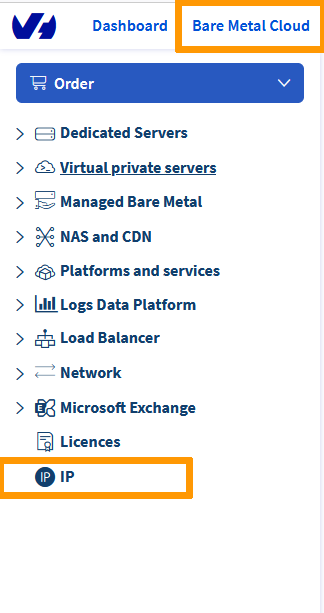

> [!primary]
> Tłumaczenie zostało wygenerowane automatycznie przez system naszego partnera SYSTRAN. W niektórych przypadkach mogą wystąpić nieprecyzyjne sformułowania, na przykład w tłumaczeniu nazw przycisków lub szczegółów technicznych. W przypadku jakichkolwiek wątpliwości zalecamy zapoznanie się z angielską/francuską wersją przewodnika. Jeśli chcesz przyczynić się do ulepszenia tłumaczenia, kliknij przycisk "Współtwórz" na tej stronie.
>

**Ostatnia aktualizacja z dnia 16-12-2021**

## Wprowadzenie

Polityka antyspamowa jest coraz bardziej rygorystyczna. Aby ograniczyć wysyłkę e-maili i zapewnić otrzymywanie wiadomości bez blokady narzędzi bezpieczeństwa, konieczne jest zdefiniowanie parametrów uwierzytelniania i weryfikacji treści wiadomości.

**Niniejszy przewodnik wyjaśnia, jak zoptymalizować wysyłkę e-maili.**

> [!warning]
>
> OVHcloud udostępnia różnorodne usługi, jednak to Ty odpowiadasz za ich konfigurację i zarządzanie nimi. Ponosisz więc odpowiedzialność za ich prawidłowe funkcjonowanie.
> 
> Oddajemy w Twoje ręce niniejszy przewodnik, którego celem jest pomoc w wykonywaniu bieżących zadań. W przypadku trudności lub wątpliwości związanych z administrowaniem, użytkowaniem lub wdrażaniem usług na serwerze zalecamy skorzystanie z pomocy wyspecjalizowanego usługodawcy.
> 

## Wymagania początkowe

- Posiadać już skonfigurowany serwer poczty elektronicznej

## W praktyce

### Konfiguracja rekordu SPF

W przypadku infrastruktury dedykowanej (serwer dedykowany, VPS, instancja Public Cloud lub Hosted Private Cloud) pole SPF ma postać: `v=spf1 ip4:server_ipv4 ~all`. Pamiętaj, aby zamienić "server_ipv4" na adres IPv4 serwera.

> [!primary]
>
> Symbol przed *all* ma wielkie znaczenie:
>
> - `+`: akceptuj
> - `-`: nie akceptuj
> - `~`: niepowodzenie miękkie (*soft fail*)
> - `?`: neutralny
>

Aby uzyskać więcej informacji na temat składni rekordu SPF, zapoznaj się z poniższym linkiem: <http://www.open-spf.org/>.

Możesz oczywiście pójść o krok dalej, konfigurując rekordu SPF danej domeny lub podając IPv6. Aby dowiedzieć się, jak to zrobić, zapoznaj się z naszym przewodnikiem dotyczącym [konfiguracji rekordu SPF](https://docs.ovh.com/pl/domains/uslugi_www_pole_spf/).

### Konfiguracja rekordu DKIM

Konfiguracja rekordu DKIM (DomainKeys Identified Mail) zapewnia dodatkową ochronę, aby konta e-mail nie były oznaczone jako spam. DKIM jest w uproszczeniu podpisem umożliwiającym uwierzytelnienie domeny nadawcy.

Weryfikacja odbywa się za pomocą klucza DKIM, który ma zostać dodany do strefy DNS. Znajdziesz tu różne generatory kluczy DKIM, w tym <http://dkimcore.org/tools/keys.html>. Prosimy o ścisłe przestrzeganie instrukcji podanych na stronie wybranego generatora.

### Konfiguracja rewers (*reverse IP*)

Aby zoptymalizować wysyłkę i zmniejszyć ryzyko blokady kont e-mail, należy skonfigurować rewers z Twoją domeną.

Najpierw należy utworzyć rekord A w strefie DNS domeny, używając adresu IP Twojego serwera jako celu.

Jeśli Twoje serwery DNS są zarządzane przez OVHcloud, zapoznaj się z tym [przewodnikiem](https://docs.ovh.com/pl/domains/hosting_www_jak_edytowac_strefe_dns/#dostep-do-interfejsu-zarzadzania-strefa-dns).

Czas propagacji wprowadzonych w strefie DNS zmian wynosi maksymalnie 24 godziny.

Następnie dodaj rekordu PTR (znany również jako rewers):

W [Panelu klienta OVHcloud](https://www.ovh.com/auth/?action=gotomanager&from=https://www.ovh.pl/&ovhSubsidiary=pl){.external} przejdź do zakładki `Bare Metal Cloud`{.action}, następnie kliknij sekcję `IP`{.action} na dole po lewej stronie. 

W rozwijanym menu **Usługa** wybierz usługę z adresem IPv4:

Kliknij przycisk `...`{.action} po prawej stronie odpowiedniej linii, a następnie `Zmień rewers`{.action}:

Wprowadź nazwę Twojej domeny w sekcji `Rewers` i kliknij `Zatwierdź`{.action}.

> [!primary]
> Po wpisaniu domeny do rewers sprawdzi on natychmiast, czy rekord A odnosi się do tego samego IP. Jest to używane w procedurach antyspamowych, więc nagranie A musi być ważne i propagowane. Podczas wprowadzania rewers obowiązują następujące zasady:
>
>  - rewers nie może się rozpocząć od `-`
>  - rewers nie może zawierać więcej niż 80 znaków
>  - rewers nie może zawierać wielkich liter
>  - rewers musi się kończyć znakiem `.`
>
> Przykład: "MyDomain.ca" w polu rewers byłoby **mydomain.ca.**
>

### Szczególne przypadki wysyłki e-maili

#### Na serwer Microsoft (Outlook, itp...)
 
Microsoft używa białej listy. Oznacza to, że najpierw każdy serwer znajduje się na czarnej liście, a do zatwierdzenia serwera e-mail konieczna jest specjalna procedura.

Aby to zrobić, należy otworzyć [zgłoszenie do pomocy technicznej](https://support.microsoft.com/en-us/getsupport?oaspworkflow=start_1.0.0.0&wfname=capsub&productkey=edfsmsbl3&ccsid=6364926882037750656) w firmie Microsoft.

#### Na serwer Gmail

Dodanie określonych rekordów (np. rekord DMARC) może ułatwić odbieranie e-maili, jeśli Twój odbiorca jest w Gmailu. Oto artykuł Google, który może Wam w tym pomóc: [Add a DMARC record](https://support.google.com/a/answer/2466563?hl=en){.external}.

### Sprawdź Twoje dane

Może być interesujące, aby korzystać ze strony jak [Mail Tester](http://www.mail-tester.com/), aby sprawdzić, czy wszystkie ustawienia są poprawne.

## Sprawdź również

Aby wesprzeć Cię w uruchomieniu Twoich rozwiązań OVHcloud, skontaktuj się z naszą [siecią partnerów OVHcloud](https://partner.ovhcloud.com/pl/directory/).

Dołącz do społeczności naszych użytkowników na stronie <https://community.ovh.com/en/>.