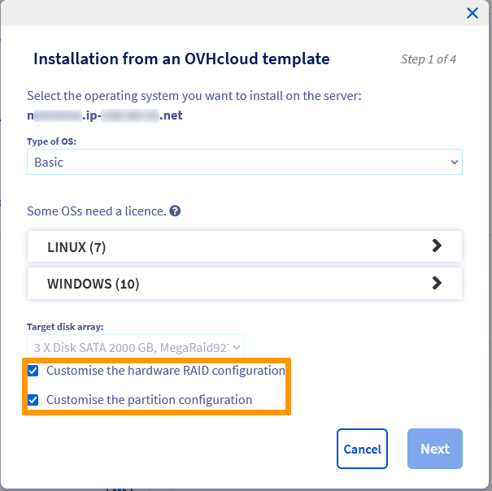
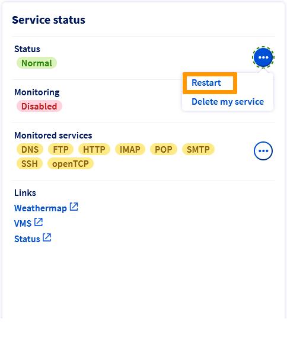

## Objetivo

Un grupo/matriz redundante de discos independientes (RAID) es una utilidad que mitiga la pérdida de datos en un servidor mediante la replicación de datos en dos o más discos.

El nivel de RAID predeterminado para las instalaciones del servidor OVHcloud es RAID 1, que duplica el espacio ocupado por sus datos, reduciendo a la mitad el espacio de disco utilizable.

**Esta guía le ayudará a configurar los discos de su servidor con RAID 0, lo que le permitirá usar el espacio útil de todos sus discos.**

> [!warning]
> 
> Tenga en cuenta: RAID 0 no proporciona TOLERANCIA SIN FALLOS ni REDUNDANCIA DE DATOS, lo que hace muy probable la pérdida de datos en caso de fallo del disco.
>

## Requisitos

* Un [servidor dedicado](https://www.ovhcloud.com/es/bare-metal/){.external} conhardware RAID 
* Acceso administrativo (root) al servidor a través de SSH

## Instrucciones

### Usando el panel de control de OVHcloud

En el [área de cliente de OVHcloud](https://ca.ovh.com/auth/?action=gotomanager&from=https://www.ovh.com/world/&ovhSubsidiary=ws) .external}, seleccione el servidor en la sección `Bare Metal Cloud`{.action} y, seguidamente, `Servidores dedicados`{.action}.

A continuación, en la pestaña **Información general**, haga clic en el botón `Reinstalar`{.action} para instalar un nuevo sistema operativo con su configuración RAID 0 personalizada.

Ahora seleccione  **Instalar desde una plantilla de OVHcloud** y luego haga clic en `Siguiente`{.action}. 

{.thumbnail}

Seleccione el sistema operativo que desea instalar y luego haga clic en `Siguiente`{.action}.

Marque las casillas para **Personalizar la configuración de hardware RAID** y **Personalizar la configuración de la partición**, luego haga clic en Siguiente {.action}.

{.thumbnail}

Seleccione RAID 0 de la lista desplegable y haga clic en `Siguiente`{.action}. 

{.thumbnail}

Configure las particiones como sea requeridoy luego haga clic en `Siguiente`{.action}.

{.thumbnail}

Finalmente, haga click en `Confirmar`{.action}

{.thumbnail}

Después de instalar su servidor, verifique los tamaños de partición iniciando sesión en el servidor a través de SSH y ejecutando el siguiente comando:

```sh
df -h
```

### Usando el modo de rescate

En el [área de cliente de OVHcloud](https://ca.ovh.com/auth/?action=gotomanager&from=https://www.ovh.com/world/&ovhSubsidiary=ws){.external}, seleccione el servidor en la sección `Bare Metal Cloud`{.action} y, seguidamente, `Servidores dedicados`{.action}.

Busque « Boot » en la zona **Información general** y haga clic en `...`{.action} y luego seleccione `Editar`{.action} para cambiar el sistema de arranque.

{.thumbnail}

A continuación, seleccione `Arrancar en modo rescue`{.action} luego seleccione `rescue64-pro`{.action} de la lista desplegable.

En el campo **Recibir las claves del modo seleccionado en la siguiente dirección de correo electrónico:**, especifique otra dirección de correo electrónico si no desea que se envíen las claves de acceso a la dirección principal de su cuenta de OVHcloud.


{.thumbnail}

Haga clic en `Siguiente`{.action} y luego haga clic en `Confirmar`{.action} en la siguiente pantalla.

{.thumbnail}

Una vez finalizada la edición, haga clic en `...`{.action} a la derecha de "Estado" en la zona titulada **Estado de los servicios.**

Haga clic en el botón `Reiniciar`{.action} y el servidor se reiniciará en modo de rescate. Esta operación puede tardar unos minutos.
 

{.thumbnail}

Cuando su servidor se reinicie, inicie sesión a través de SSH utilizando las credenciales del modo de rescate que le enviamos por correo electrónico.

Desde la línea de comandos, escriba los siguientes comandos para eliminar la configuración RAID existente. Todos los datos en el RAID serán eliminados:

```sh
MegaCli -CfgLdDel -L0 -a0
MegaCli -CfgLdDel -Lall -aAll
```

Escriba el siguiente comando para recuperar las ID de dispositivo de ranura de sus discos:

```sh
MegaCli -PdList -aALL | egrep "Slot|Device ID"
```

Escriba los siguientes comandos para configurar el nivel RAID 0:

```sh
MegaCli -CfgLDAdd -R0 [252: 0,252: 1] -a0
```

En este ejemplo, 252 es la ID del gabinete del disco.

Después de configurar el nuevo nivel RAID, puede verificar la configuración con el siguiente comando:

```sh
MegaCli -LDInfo -Lall -a0 | grep -i size
```

## Mas Infomacions

Únase a nuestra comunidad de usuarios en <https://community.ovh.com/en/>
