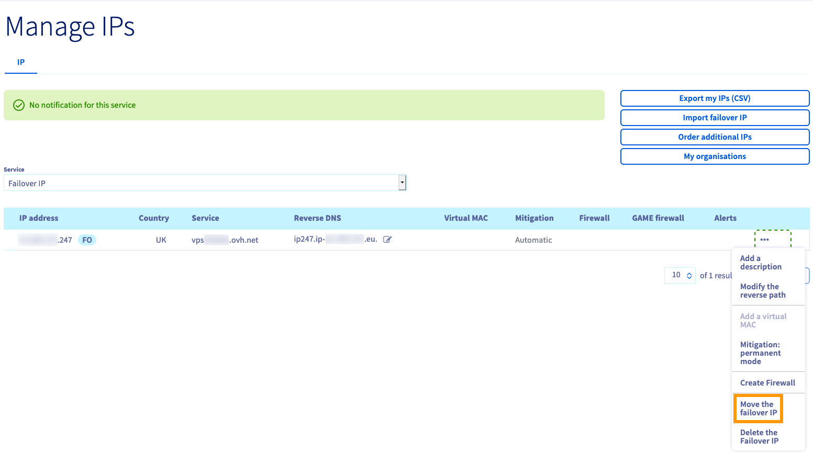
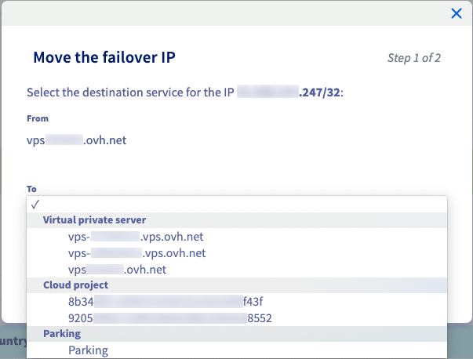

> [!primary]
> Diese Übersetzung wurde durch unseren Partner SYSTRAN automatisch erstellt. In manchen Fällen können ungenaue Formulierungen verwendet worden sein, z.B. bei der Beschriftung von Schaltflächen oder technischen Details. Bitte ziehen Sie beim geringsten Zweifel die englische oder französische Fassung der Anleitung zu Rate. Möchten Sie mithelfen, diese Übersetzung zu verbessern? Dann nutzen Sie dazu bitte den Button «Mitmachen» auf dieser Seite.
>

**Stand 12.03.2021**

## Ziel

Die Failover-IPs können zwischen den von Ihnen verwendeten Diensten umgezogen werden. Der Vorteil besteht darin, dass Sie Ihren Ruf, Ihre Referenzierung und die Dienstkontinuität Ihrer Anwendungen und Systeme nicht verlieren.
Diese Technologie erlaubt es Ihnen, die IP-Adressen von einer Lösung zur anderen in weniger als einer Minute auszutauschen, praktisch ohne Unterbrechung für Ihre Benutzer. Diese Technik kann bei der Migration von Diensten (zum Beispiel zur Übertragung von Projekten aus der Entwicklungs- in die Produktionsumgebung) oder im Falle von Störungen zum Failover auf einen Backup-Server verwendet werden.

**Erfahren Sie, wie Sie eine Failover-IP über Ihr OVHcloud Kundencenter oder die OVHcloud APIs umziehen**

## Voraussetzungen

- Sie verfügen über einen [dedizierten](https://www.ovhcloud.com/de/bare-metal/){.external} Server in Ihrem OVHcloud Kundencenter.
- Sie verfügen über eine [Failover-IP](https://www.ovhcloud.com/de/bare-metal/ip/).
- Sie sind in Ihrem [OVHcloud Kundencenter](https://www.ovh.com/auth/?action=gotomanager&from=https://www.ovh.de/&ovhSubsidiary=de){.external} angemeldet.

## In der praktischen Anwendung

> [!primary]
> Eine Failover-IP kann nicht von einer Zone zur anderen umgezogen werden. So kann beispielsweise eine IP im Rechenzentrum SBG auf GRA oder RBX umgezogen werden, aber nicht auf BHS umgezogen werden

### Eine IP über das OVHcloud Kundencenter umziehen

Loggen Sie sich [in Ihr OVHcloud Kundencenter ein](https://www.ovh.com/auth/?action=gotomanager&from=https://www.ovh.de/&ovhSubsidiary=de), klicken Sie auf das Menü `Bare Metal Cloud`{.action} und dann auf den Abschnitt `IP`{.action} am Ende der Spalte links auf der Seite.

{.thumbnail}

Mit dem Drop-down-Menü "Dienst" können Sie nur Failover-IPs auswählen.

Klicken Sie auf `...`{.action} rechts neben der umzuziehenden IP-Adresse und dann auf `Failover-IP umziehen`{.action}.

{.thumbnail}

Wählen Sie im angezeigten Kontextmenü den Dienst aus, auf den die IP-Adresse umgezogen werden soll.

Klicken Sie auf `Weiter`{.action} und dann auf `Bestätigen`{.action}.

{.thumbnail}

### Eine IP über die APIs umziehen

Loggen Sie sich auf der Webseite der OVHcloud [APIs ein](https://api.ovh.com/).

Zunächst ist es besser zu überprüfen, ob die IP-Adresse umgezogen werden kann.
 Um zu überprüfen, ob die IP auf einen Ihrer Dedicated Server umgezogen werden kann, verwenden Sie folgenden Anruf:

> [!api]
>
> @api {GET} /dedicated/server/{serviceName}/ipCanBeMovedTo
>

- `serviceName`: die Referenz des Zielservers
- `ip`: die umzuziehende Failover-IP

Um die IP-Adresse umzuziehen, verwenden Sie folgenden Anruf:

> [!api]
>
> @api {POST} /dedicated/server/{serviceName}/ipMove
>

- `serviceName`: die Referenz des Zielservers
- `ip`: die umzuziehende Failover-IP

## Weiterführende Informationen

Für den Austausch mit unserer User Community gehen Sie auf <https://community.ovh.com/en/>.
