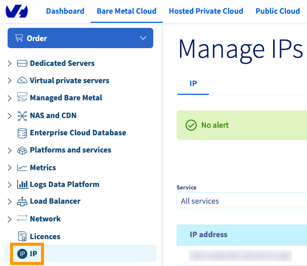

> [!primary]
> Esta traducción ha sido generada de forma automática por nuestro partner SYSTRAN. En algunos casos puede contener términos imprecisos, como en las etiquetas de los botones o los detalles técnicos. En caso de duda, le recomendamos que consulte la versión inglesa o francesa de la guía. Si quiere ayudarnos a mejorar esta traducción, por favor, utilice el botón «Contribuir» de esta página.
> 

**Última actualización: 09/12/2021**

## Objetivo

Las IP failover pueden moverse entre los servicios que utilice. El objetivo es no perder su reputación, su posicionamiento y mejorar la continuidad del servicio de sus aplicaciones y sistemas.

Esta tecnología le permite intercambiar las direcciones IP de una solución a otra en menos de un minuto, prácticamente sin interrupciones para sus usuarios. Asimismo, este mecanismo también puede utilizarse durante la migración de servicios, transfiriendo los proyectos del entorno de desarrollo al de producción, o durante la migración hacia un servidor de backup en caso de fallo.

> [!primary]
> Una IP failover no puede moverse de una zona a otra. Por ejemplo, una IP situada en el datacenter SBG podrá migrarse a GRA o RBX, pero no podrá migrarse a BHS.
>
> Sólo se puede mover todo el bloque, no es posible migrar IPs individuales dentro de un bloque.

**Cómo mover una IP failover desde el área de cliente de OVHcloud o a través de las API de OVHcloud**

## Requisitos

- Tener un [servidor dedicado](https://www.ovhcloud.com/es/bare-metal/){.external} en el área de cliente de OVHcloud.
- Tener una [dirección IP failover](https://www.ovhcloud.com/es/bare-metal/ip/).
- Haber iniciado sesión en el [área de cliente de OVHcloud](https://ca.ovh.com/auth/?action=gotomanager&from=https://www.ovh.com/world/&ovhSubsidiary=ws){.external}.

> [!warning]
> Si la dirección IP failover, o una de las direcciones IP del bloque, tiene una MAC virtual afectada, el servidor de destino debe soportar la funcionalidad de las MAC virtuales.
> Para ello, consulte [esta guía](https://docs.ovh.com/us/es/dedicated/network-support-virtual-mac/).
>
> En caso contrario, las MAC virtuales deben eliminarse de las IP failover antes de mover.

## Procedimiento

> [!primary]
> Cuando un bloque IP que contiene MAC virtuales únicas se mueve entre dos servidores, esas direcciones se suspenden temporalmente. Aparecerá en el nuevo servidor una vez que se haya completado el movimiento.
>
> Por otra parte, no se pueden mover los bloques que contienen direcciones MAC virtuales duplicadas. Primero debe eliminar la dirección MAC virtual duplicada en el bloque a mover.
>

### Migrar una IP desde el área de cliente de OVHcloud

Conéctese al [área de cliente de OVHcloud](https://ca.ovh.com/auth/?action=gotomanager&from=https://www.ovh.com/world/&ovhSubsidiary=ws), haga clic en el menú `Cloud`{.action} de la barra de herramientas y seleccione la sección `IP`{.action} situada en la esquina inferior izquierda de la página.

{.thumbnail}

El menú desplegable "Servicio" le permite seleccionar únicamente las IP Failover.

Haga clic en el botón `...`{.action} a la derecha de la dirección IP que quiera mover y, seguidamente, en `Mover la IP failover`{.action}.

{.thumbnail}

En el menú contextual, seleccione el servicio al que quiere mover la dirección IP.

Haga clic en `Siguiente`{.action} y, seguidamente, en `Aceptar`{.action}.

{.thumbnail}

### Mover una IP a través de las API

Conéctese a la página web de las [API de OVHcloud](https://ca.api.ovh.com/).

En primer lugar, es mejor comprobar si la dirección IP se puede mover correctamente.
 Para comprobar si la IP puede moverse a uno de sus servidores dedicados, utilice la siguiente llamada:

> [!api]
>
> @api {GET} /dedicated/server/{serviceName}/ipCanBeMovedTo
>

- `serviceName`: la referencia del servidor dedicado de destino
- `ip`: la dirección IP failover a mover

Para mover la dirección IP, utilice la siguiente llamada:

> [!api]
>
> @api {POST} /dedicated/server/{serviceName}/ipMove
>

- `serviceName`: la referencia del servidor dedicado de destino
- `ip`: la dirección IP failover a mover

## Más información

Interactúe con nuestra comunidad de usuarios en <https://community.ovh.com/en/>.