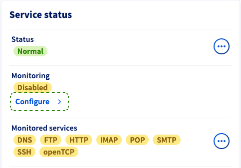
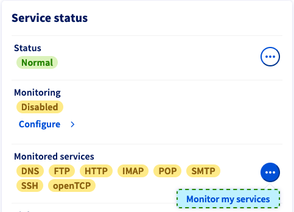

> [!primary]
> Esta traducción ha sido generada de forma automática por nuestro partner SYSTRAN. En algunos casos puede contener términos imprecisos, como en las etiquetas de los botones o los detalles técnicos. En caso de duda, le recomendamos que consulte la versión inglesa o francesa de la guía. Si quiere ayudarnos a mejorar esta traducción, por favor, utilice el botón «Contribuir» de esta página.
>

## Objetivo

El servicio de monitorización le permite a OVHcloud monitorear el estado de su máquina y activar automáticamente la intervención de un técnico en el centro de datos.

Todos los servidores de nuestros clientes y toda la red son monitoreados 24/7 por equipos técnicos de OVHcloud.
OVHcloud interviene tan pronto como se activa una alerta (ninguna respuesta de ping) para minimizar el tiempo de inactividad de los servidores y la red.

Para implementar un firewall restrictivo, especialmente en ICMP, y continuar beneficiándose del monitorización de OVHcloud, es necesario autorizar las IPs que encontrará a continuación.

## Requisitos

- Un producto OVHcloud en el que ha instalado un firewall.
- Tener acceso a las reglas de Firewall.

## IPs a ser autorizadas

|Reverse|IP|Protocol|
|---|---|---|
|netmon-rbx-probe|92.222.184.0/24|icmp|
|netmon-sbg-probe|92.222.185.0/24|icmp|
|netmon-gra-probe|92.222.186.0/24|icmp|
|netmon-bhs-probe|167.114.37.0/24|icmp|
|netmon-sgp-probe|139.99.1.144/28|icmp|
|ping.ovh.net|213.186.33.13|icmp|
||xxx.xxx.xxx.250 (xxx.xxx.xxx.aaa es la ip del servidor)|icmp|
||xxx.xxx.xxx.251 (xxx.xxx.xxx.aaa es la ip del servidor)|icmp + Puerto monitoreado por el servicio de monitorización|

**La comunicación entre el servicio RTM y su servidor también requiere que permita conexiones entrantes y salientes en los puertos UDP 6100 a 6200.**

> [!primary]
>
> Si su servidor está situado en Roubaix 3, deberá obtener la última IP a través de tcpdump.
>
> ```sh
> root@nsXXXX:# tcpdump host server.ip | grep ICMP
> ```
>

### Activar o desactivar la monitorización

En primer lugar, conéctese al [área de cliente de OVHcloud](https://ca.ovh.com/auth/?action=gotomanager&from=https://www.ovh.com/world/&ovhSubsidiary=ws){.external} y abra la pestaña `Bare Metal Cloud`{.action}. Seleccione el servidor correspondiente en el menú desplegable `Servidores dedicados`{.action}.

Puede activar o desactivar la monitorización de un servidor dedicado desde la pestaña `Información general`{.action}. La opción se encuentra en la sección `Estado de los servicios`.

{.thumbnail}

Haga clic en el botón `Configurar`{.action}. En el cuadro de diálogo, se mostrarán tres opciones para el comportamiento de la vigilancia:

- **Desactivado**: Esta opción detiene los mensajes de alerta y las intervenciones de OVHcloud. Seleccione esta opción si ejecuta acciones de administración relevantes en el servidor que impidan una respuesta ICMP.
- **Activado con intervención proactiva**: Si el servidor no responde, recibirá un mensaje de correo electrónico de alerta y el servidor será verificado por un técnico.
- **Activado sin intervención proactiva**: Recibirá un mensaje de alerta por correo electrónico en caso de que el servidor deje de responder. Para iniciar una intervención, es necesario crear una solicitud de asistencia.

{.thumbnail}

Haga clic en `Confirmar`{.action} para actualizar su configuración de monitorización.

### Activar la monitorización de servicios específicos

Además de la monitorización estándar, también puede autorizar a OVHcloud a supervisar servicios específicos como el HTTP, el SSH y otros protocolos.

Para ello, abra la pestaña `Información general`{.action} y haga clic en el recuadro **Estado de los servicios** en el botón `...`{.action} situado junto a "Servicios monitorizados". Haga clic en `Monitorizar mis servicios`{.action}.

{.thumbnail}

El sistema le redirigirá a la pantalla de abajo. Haga clic en `Monitorizar un servicio`{.action} e introduzca la dirección IP, el protocolo, el número de puerto, la respuesta del servidor y el tiempo entre las verificaciones de su servicio. Haga clic en el símbolo de validación (**V**) para confirmar los cambios.

{.thumbnail}

## Más información

[Configurar el firewall de red](/pages/cloud/dedicated/firewall_network)

Interactúe con nuestra comunidad de usuarios en <https://community.ovh.com/en/>.
