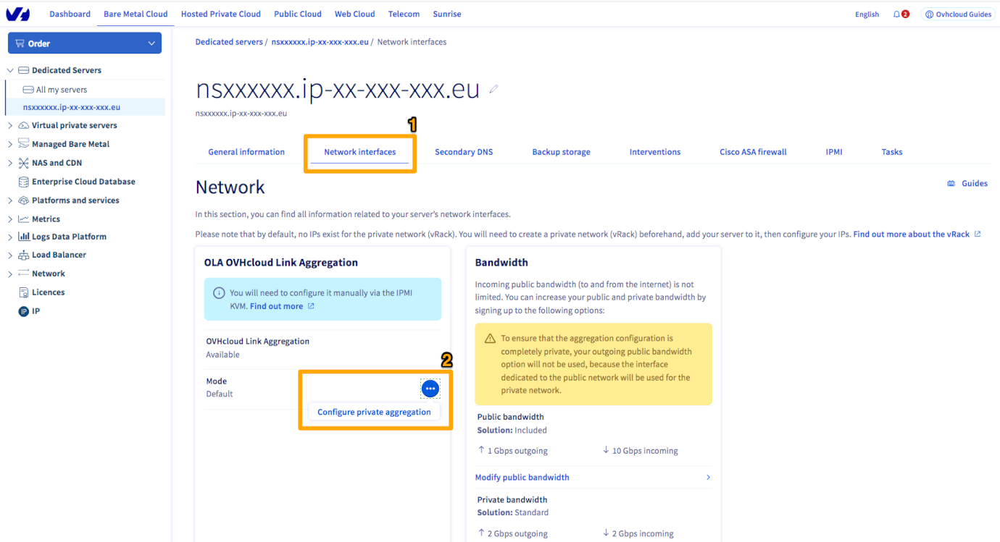

**Last updated 23/03/2021**

## Objective

OVHcloud Link Aggregation (OLA) technology is designed by our teams to increase your server’s availability, and boost the efficiency of your network connections. In just a few clicks, you can aggregate your network cards and make your network links redundant. This means that if one link goes down, traffic is automatically redirected to another available link.

**Find out how to configure OLA in the OVHcloud Control Panel.**

## Requirements

- an OVHcloud [dedicated server](https://www.ovhcloud.com/en-gb/bare-metal/)
- access to the [OVHcloud Control Panel](https://www.ovh.com/auth/?action=gotomanager&from=https://www.ovh.co.uk/&ovhSubsidiary=GB)

## Instructions

### Configuring OLA in the OVHcloud Control Panel

To start configuring OLA, log in to the [OVHcloud Control Panel](https://www.ovh.com/auth/?action=gotomanager&from=https://www.ovh.co.uk/&ovhSubsidiary=GB){.external} and select the `Bare Metal Cloud`{.action} universe. Click the `Dedicated Servers`{.action}  button at the top of the screen, then select your server in the dropdown menu on the left-hand sidebar. Then click the `Network interfaces`{.action}  (1) tab.

Click the `...`{.action} button (2) to the right of “Mode” in the “OLA: OVHcloud Link Aggregation” box. Next, click `Configure private aggregation`{.action}  (2).

{.thumbnail}

Make sure that both your interfaces, or interface groups, are selected and give the OLA a name. Click `Confirm`{.action} when your checks are complete.

{.thumbnail}

This may take a few minutes. Once it is complete, the next step is to configure the interfaces in your operating system via a NIC link or NIC team. For the method to use, refer to the following guides for the most popular operating systems:

[How to Configure Your NIC for OVHcloud Link Aggregation in Debian 9](../ola-debian9/).

[How to Configure Your NIC for OVHcloud Link Aggregation in CentOS 7](../ola-centos7/).

[How to Configure Your NIC for OVHcloud Link Aggregation in Windows Server 2019](../ola-w2k19/).

### Restore OLA to default values

To restore OLA to the default values, click on the `...`{.action} button to the right of “Mode” in the “OLA: OVHcloud Link Aggregation” box. Then click `Unconfigure Private Aggregation`{.action} . Click `Confirm`{.action} in the pop-up menu.

{.thumbnail}

This may take a few minutes.

## Go further

[How to Configure Your NIC for OVHcloud Link Aggregation in Debian 9](../ola-debian9/).

[How to Configure Your NIC for OVHcloud Link Aggregation in CentOS 7](../ola-centos7/).

[How to Configure Your NIC for OVHcloud Link Aggregation in Windows Server 2019](../ola-w2k19/).

Join our community of users on <https://community.ovh.com/en/>.
