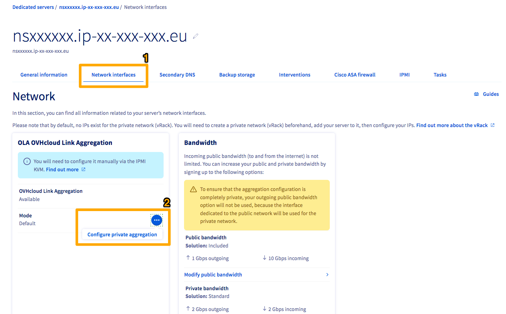
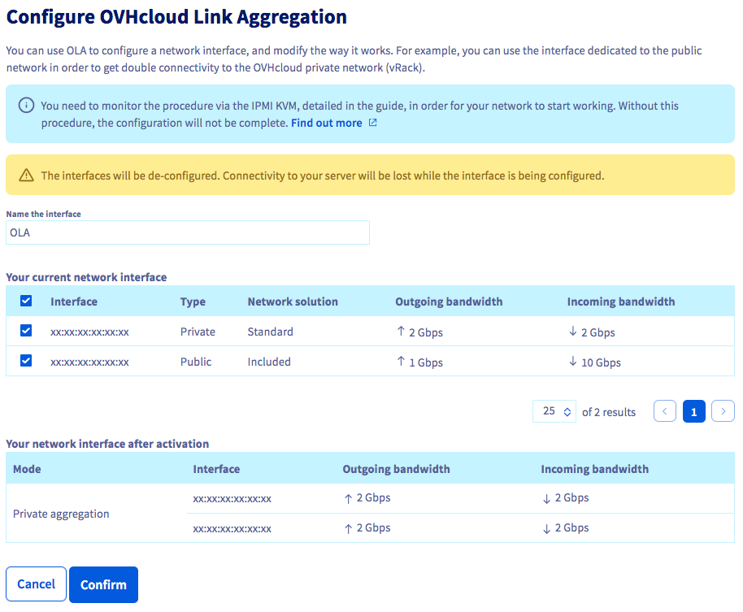

> [!primary]
> Questa traduzione è stata generata automaticamente dal nostro partner SYSTRAN. I contenuti potrebbero presentare imprecisioni, ad esempio la nomenclatura dei pulsanti o alcuni dettagli tecnici. In caso di dubbi consigliamo di fare riferimento alla versione inglese o francese della guida. Per aiutarci a migliorare questa traduzione, utilizza il pulsante "Contribuisci" di questa pagina.
>

**Ultimo aggiornamento: 18/05/2022**

## Obiettivo

La tecnologia OVHcloud Link Aggregation (OLA) è stata progettata dai team OVHcloud per aumentare la disponibilità dei server e potenziare le connessioni di rete. L’attivazione dell’opzione permette di aggregare in pochi click le schede di rete e rendere i collegamenti ridondati in modo che, in caso di malfunzionamenti, il traffico venga reindirizzato automaticamente verso il collegamento disponibile. 
L'aggregazione si basa sulla tecnologia IEEE 802.3ad o Link Aggregation Control Protocol (LACP).

**Questa guida ti mostra come configurare il servizio OLA nello Spazio Cliente di OVHcloud.**

## Prerequisiti

- Disporre di un [server dedicato OVHcloud](https://www.ovhcloud.com/it/bare-metal/)
- Avere accesso allo [Spazio Cliente OVHcloud](https://www.ovh.com/auth/?action=gotomanager&from=https://www.ovh.it/&ovhSubsidiary=it)
- Disporre di un sistema operativo / Hypervisor che supporta il protocollo di aggregazione 802.3ad (LACP)

## Procedura

> [!warning]
>
> La configurazione OLA viene eseguita su tutte le interfacce di rete. Esse formeranno un aggregato del tipo "aggregazione privata".
>
> Con l'implementazione di OLA, l'IP pubblico non sarà più accessibile.
>

### Configurare OLA nel tuo Spazio Cliente OVHcloud

Accedi allo [Spazio Cliente OVHcloud](https://www.ovh.com/auth/?action=gotomanager&from=https://www.ovh.it/&ovhSubsidiary=it) e seleziona la scheda `Bare Metal Cloud`{.action}. Clicca su `Server dedicati`{.action} e seleziona il tuo server nella lista.

{.thumbnail}

Nella scheda `Interfacce di rete`{.action} (1), clicca sul pulsante `...`{.action} (2) a destra di "Modo" nell'ambito **OLA: OVHcloud Link Aggregation**. Clicca su `Configura l'aggregazione privata`{.action} (2).

{.thumbnail}

Verifica che le tue due interfacce, o gruppi di interfacce, siano selezionate correttamente e assegna un nome all'interfaccia OLA. Clicca su `Conferma`{.action} una volta completata la verifica.

Questa operazione potrebbe richiedere qualche minuto. Lo step successivo consisterà nella configurazione delle interfacce del sistema operativo come NIC bond o NIC team. Per conoscere la procedura da seguire, consulta la nostra documentazione disponibile relativa ai sistemi operativi più diffusi:

[Configurare un NIC per il servizio OVHcloud Link Aggregation in Debian 9](../ola-debian9/)

[Configurare un NIC per il servizio OVHcloud Link Aggregation in CentOS 7](../ola-centos7/)

[Configurare un NIC per il servizio OVHcloud Link Aggregation in Windows Server 2019](../ola-w2k19/)

### Ripristina OLA ai valori predefiniti

Per ripristinare OLA ai valori predefiniti, clicca sul pulsante `...`{.action} a destra di "Modo" nell'ambito **OLA: OVHcloud Link Aggregation**. Clicca su `Deconfigurare l'aggregazione privata`{.action}. Clicca su `Conferma`{.action} nel menu contestuale.

{.thumbnail}

L'operazione potrebbe richiedere alcuni minuti.

## Per saperne di più

[Configurare un NIC per il servizio OVHcloud Link Aggregation in Debian 9](../ola-debian9/)

[Configurare un NIC per il servizio OVHcloud Link Aggregation in CentOS 7](../ola-centos7/)

[Configurare un NIC per il servizio OVHcloud Link Aggregation in Windows Server 2019](../ola-w2k19/)

Contatta la nostra Community di utenti all’indirizzo <https://community.ovh.com/en/>.
