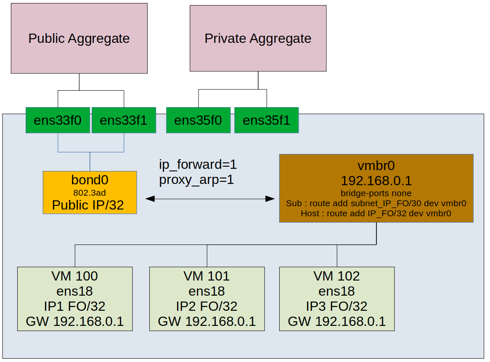
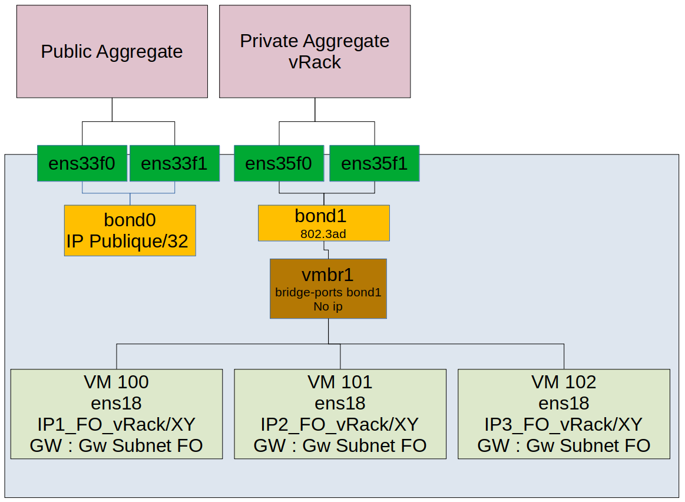

**Dernière mise à jour le 30/09/2021**

## Objectif

Sur les gammes High Grade & SCALE, le fonctionnement des IP fail-over en mode bridged (via des MAC Virtuelles) n'est pas possible. Il est donc nécessaire de configurer les IP fail-over en mode routé ou via le vRack.

**Découvrez comment configurer le réseau sous ProxMox VE.**

## Prérequis

* Disposer d'un [serveur dédié OVHcloud](https://www.ovhcloud.com/fr/bare-metal/)
* Être connecté à votre [espace client OVHcloud](https://www.ovh.com/auth/?action=gotomanager&from=https://www.ovh.com/fr/&ovhSubsidiary=fr)
* Disposer d'un [serveur dédié OVHcloud](https://www.ovhcloud.com/fr/bare-metal/)
* Disposer d'[IP fail-over](https://www.ovhcloud.com/fr/bare-metal/ip/)

> [!warning]
>
> Aucune MAC virtuelle ne doit être appliquée sur les IP fail-over dans l'espace client OVHcloud.
>

## En pratique

> [!primary]
>
> Sur ces gammes de serveurs, il y a 4 cartes réseaux. Les deux premières pour le public, les deux dernières pour le privé. Pour profiter de l'ensemble de la bande passante, des agrégats doivent être créés.
>


### IP fail-over en mode routé sur la patte publique

#### Schéma de la configuration cible

{.thumbnail}

#### Explications

Il faut :

- créer un agrégat;
- créer un bridge;
- autoriser le forwarding et ajouter les routes.

#### Configurer l'hyperviseur

Tout se passe dans le fichier `/etc/network/interfaces` :

```bash
vi /etc/network/interfaces
```

```bash
auto lo
iface lo inet loopback

# interface publique 1
auto ens33f0
iface ens33f0 inet manual

# interface publique 2
auto ens33f1
iface ens33f1 inet manual

# interface privée 1
auto ens35f0
iface ens35f0 inet manual

# interface privée 2
auto ens35f1
iface ens35f1 inet manual

auto bond0
# Agrégat LACP sur les interfaces publiques
# configuré en mode DHCP sur cet exemple
# Porte l'IP Publique du serveur
iface bond0 inet dhcp
	bond-slaves ens33f0 ens33f1
        bond-miimon 100
	bond-mode 802.3ad
        post-up echo 1 > /proc/sys/net/ipv4/conf/bond0/proxy_arp
        post-up echo 1 > /proc/sys/net/ipv4/ip_forward

#Private

auto vmbr0
# Configuration du bridge avec une adresse privée et l'ajout de routes pour y envoyer les IP fail-over
# A.B.C.D/X  => Subnet des IP fail-over affectées au serveur, cela peut être un host avec du /32
iface vmbr0 inet static
	address 192.168.0.1
        netmask 255.255.255.255
	bridge-ports none
	bridge-stp off
	bridge-fd 0
        post-up ip route add A.B.C.D/X dev vmbr0
```

A ce stade, relancez les services réseau ou redémarrez le serveur.

#### Exemple de configuration VM cliente Debian

Contenu du fichier `/etc/network/interfaces` :

```bash
auto lo ens18
iface lo inet loopback
iface ens18 inet static
    address IP_FO
    netmask 255.255.255.255
    gateway 192.168.0.1
```

### IP FailOver via le vRack

#### Prérequis

* Avoir réservé un bloc public d'adresses IP dans votre compte, avec un minimum de quatre adresses.
* Préparer votre plage d'adresses IP privées choisies.
* Posséder un [serveur compatible vRack](https://www.ovh.com/fr/serveurs_dedies/){.external}.
* Activer un service [vRack](https://www.ovh.com/fr/solutions/vrack/){.external}.
* Être connecté à l'[espace client OVHcloud](https://www.ovh.com/auth/?action=gotomanager&from=https://www.ovh.com/fr/&ovhSubsidiary=fr){.external}.

#### Schéma de la configuration cible

{.thumbnail}

#### Explications

Il vous faut:

- créer un agrégat;
- créer un bridge raccordé à l’agrégat;

#### Configurer une adresse IP utilisable

Dans le cas du vRack, la première, l'avant-dernière et la dernière adresses d'un bloc d'IP donné sont toujours réservées respectivement à l'adresse réseau, la passerelle réseau et au *broadcast* du réseau. Cela signifie que la première adresse utilisable est la deuxième adresse du bloc, comme indiqué ci-dessous :

```sh
46.105.135.96   # Réservée : adresse réseau
46.105.135.97   # Première IP utilisable
46.105.135.98
46.105.135.99
46.105.135.100
46.105.135.101
46.105.135.102
46.105.135.103
46.105.135.104
46.105.135.105
46.105.135.106
46.105.135.107
46.105.135.108
46.105.135.109   # Dernière IP utilisable
46.105.135.110   # Réservée : passerelle réseau Reserved: Network gateway
46.105.135.111   # Réservée : broadcast réseau
```

Pour configurer la première adresse IP utilisable, vous devez éditer le fichier de configuration réseau comme indiqué ci-dessous. Dans cet exemple, utilisez un masque de sous-réseau de **255.255.255.240**.

> [!primary]
>
> Le masque de sous-réseau utilisé dans cet exemple est approprié pour notre bloc IP. Votre masque de sous-réseau peut différer en fonction de la taille de votre bloc. Lorsque vous achetez votre bloc d'IP, vous recevez un e-mail vous indiquant le masque de sous-réseau à utiliser.
>

#### Configurer l'hyperviseur

Tout se passe dans le fichier `/etc/network/interfaces` :

```bash
vi /etc/network/interfaces
```

Ce qui compte ici, c'est la configuration `bond1` et `vmbr1` :

```bash
auto lo
iface lo inet loopback

# interface publique 1
auto ens33f0
iface ens33f0 inet manual

# interface publique 2
auto ens33f1
iface ens33f1 inet manual

# interface privée 1
auto ens35f0
iface ens35f0 inet manual

# interface privée 2
auto ens35f1
iface ens35f1 inet manual

auto bond0
iface bond0 inet dhcp
	bond-slaves ens33f0 ens33f1
        bond-miimon 100
	bond-mode 802.3ad
        post-up echo 1 > /proc/sys/net/ipv4/conf/bond0/proxy_arp
        post-up echo 1 > /proc/sys/net/ipv4/ip_forward

auto bond1
# Agrégat LACP sur les interfaces privées
# Pas d'IP dessus
iface bond1 inet manual
	bond-slaves ens35f0 ens35f1
        bond-miimon 100
	bond-mode 802.3ad


#Private

auto vmbr1
# Bridge raccordé sur l'agrégat bond1
# Pas besoin d'IP
iface vmbr1 inet static
	bridge-ports bond1
	bridge-stp off
	bridge-fd 0

```

A ce stade, relancez les services réseau ou redémarrez le serveur.

#### Exemple de configuration VM cliente Debian

Contenu du fichier `/etc/network/interfaces` :

```bash
auto lo ens18
iface lo inet loopback
iface ens18 inet static
    address 46.105.135.97
    netmask 255.255.255.240
    gateway 46.105.135.110
```

## Aller plus loin

Échangez avec notre communauté d'utilisateurs sur <https://community.ovh.com>
