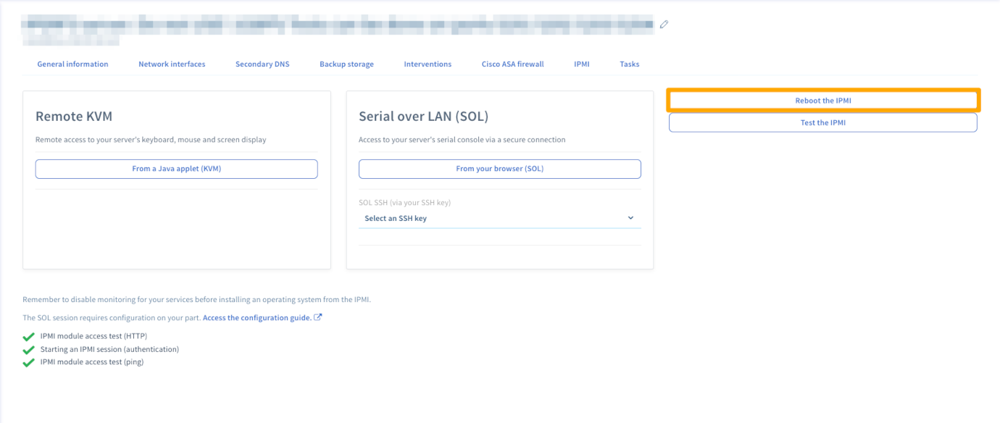

**Last updated 13th October 2020**

## Objective

With the IPMI (Intelligent Platform Management Interface) console, you can access your Dedicated Server directly, without needing to use any external software (e.g. a terminal or PuTTY). This guide will explain how to boot this console.

Please note that you may also see the term KVM (Keyboard Video and Mouse) used for this solution, particularly for VPS products.

## Requirements

- access to the [OVHcloud Control Panel](https://www.ovh.com/auth/?action=gotomanager)

## Instructions

You can access the IPMI using two different methods: the Java applet (recommended) or the browser (Serial over LAN).

### Access via the Java applet.

You will need to ensure that Java is installed on your desktop for the Java applet to work. If you do not have Java installed, go to the [official page](https://www.java.com/en/download/){.external} to do so.

In the `IPMI`{.action} section of the OVHcloud Control Panel, click on `From a Java applet (KVM)`{.action}:

{.thumbnail}

Download the file `kvm.jnlp` when you are prompted to do so, and run it:

{.thumbnail}

You will then land on the login page, where you will be prompted to enter your `root` credentials, as you would need to when logging in via a terminal or external software application:

{.thumbnail}

You can now manage your server.

### Access via your browser, using Serial over LAN (SoL).

Although we would recommend that you log in via the Java applet, you can also access the IPMI using Serial over LAN. To do so, click on `From your browser`{.action} in the `IPMI`{.action} section of the OVHcloud Control Panel:

{.thumbnail}

> [!warning]
>
> It may take several minutes to access the IPMI using SoL, which is why we would recommend using the applet instead.
>

### Test and reboot the IPMI.

Your IPMI may stop responding. If you cannot access it, you can test it first by clicking on `Test the IPMI`{.action}, and checking the result of the diagnostic:

{.thumbnail}

If everything appears to be normal, as per our example, you may be experiencing a local technical issue (internet connection, local desktop). If the IPMI encounters any issues, you can reboot it by clicking `Reboot the IPMI`{.action}.

{.thumbnail}

It will take several minutes for the IPMI to reboot.

### Installing an OS Utilizing IPMI v1.

[!warning] OVHcloud does not guarantee the functionality of any operating systems installed via IPMI. This route should only be taken by an experienced server administrator.
>
To begin, open IPMI in a Java applet as described in the section Accessing IPMI from the [OVHcloud Control Panel](https://www.ovh.com/auth/?action=gotomanager). Then, click **Device** from the menu bar and select **Redirect ISO** from the drop-down menu.
>
{.thumbnail}
>
Next, select the ISO you wish to use from your local computer's file system. Once you have selected your ISO, press the **Ctrl Alt Del** button in the top-right corner of the screen to reboot the server. Press the appropriate `F` key to access the boot options.

[!warning] Note: You may need to use the soft keyboard for inputs to register in IPMI. To access this, click the **Keyboard** option from the menu bar at the top of the window. Then, select **Soft Keyboard** from the dropdown menu and click **Show**.

>
Select the **UEFI Virtual CDROM 1.00** option from the boot menu to start the server from the ISO attached previously.
>
{.thumbnail}
>
Complete the steps required to install the operating system. Do not forget to remove the ISO from the **Redirect ISO** option.
>

### Installing an OS Utilizing IPMI v2

[!warning] OVHcloud does not guarantee the functionality of any operating systems installed via IPMI. This route should only be taken by an experienced server administrator.
>
To begin, open IPMI in a Java applet as described in the section Accessing IPMI from the [OVHcloud Control Panel](https://www.ovh.com/auth/?action=gotomanager). Then, click **Virtual Media** and select **Virtual Storage**.
>
{.thumbnail}
>
From the new screen, select **ISO File** from the **Logical Drive Type** drop-down. Next, click **Open Image** and navigate to your ISO file. Finally, click **Plug in** and **OK** to finish.
>
{.thumbnail}
>
In order to be able to boot from our ISO file, we need to access the BIOS and switch our boot options. To do so, select **Power Control** and click **Set Power Reset**.
>
{.thumbnail}

> [!warning]
>
> Note: You may need to use the soft keyboard for inputs to register in IPMI. To access this, click the **Virtual Media** option from the menu bar at the top of the window. Then, select **Virtual Keyboard** from the drop-down menu.
>
During the bootup process, press the `DEL` key when prompted to access the BIOS. You may also press the `F11` key and navigate to the BIOS by selecting the option **Enter Setup**.
>
{.thumbnail}
>
In the BIOS navigate to the **Boot** tab and change the **UEFI Boot Order #1** to **UEFI USB CD/DVD:UEFI: ATEN Virtual CDROM YSOJ**.
>
{.thumbnail}
>
Lastly, press the `F4` key to save your changes and restart the server.
>

## Conclusion

IPMI is an important tool for an experienced server administrator. Whether you need to access the BIOS, install a custom OS, or just access your server directly from the OVHcloud Control Panel, IPMI will allow you to accomplish your most important tasks.

## Go further

Join our community of users on <https://community.ovh.com/en/>.
