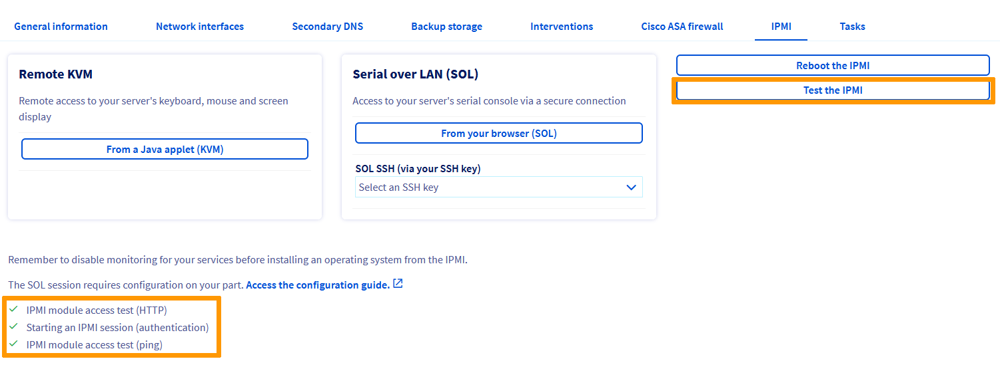
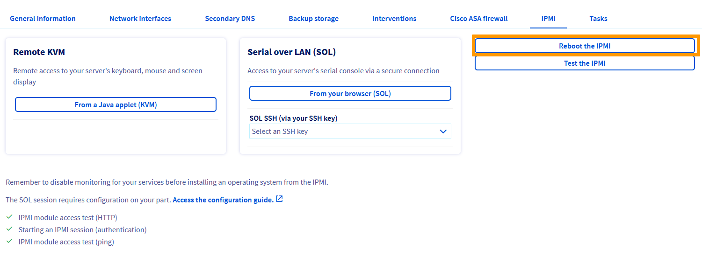

> [!primary]
> Esta tradução foi automaticamente gerada pelo nosso parceiro SYSTRAN. Em certos casos, poderão ocorrer formulações imprecisas, como por exemplo nomes de botões ou detalhes técnicos. Recomendamos que consulte a versão inglesa ou francesa do manual, caso tenha alguma dúvida. Se nos quiser ajudar a melhorar esta tradução, clique em "Contribuir" nesta página.
>

**Última atualização: 18/03/2021**

## Objetivo

A consola IPMI (Intelligent Platform Management Interface) permite estabelecer uma ligação direta ao seu servidor dedicado sem utilizar um software externo (um terminal ou PuTTY, por exemplo). Este manual explica-lhe como iniciar esta consola.

Atenção: por vezes, poderá encontrar o termo KVM (Keyboard Video and Mouse), o equivalente ao IPMI no âmbito dos VPS.

## Requisitos

- Ter acesso à [Área de Cliente OVHcloud](https://www.ovh.com/auth/?action=gotomanager&from=https://www.ovh.pt/&ovhSubsidiary=pt).

## Instruções

A ligação ao IPMI pode ser efetuada principalmente através de vários métodos: applet Java (aconselhado) ou o browser (Serial over LAN).

- **Applet Java** : permite utilizar uma ferramenta KVM (teclado, vídeo, rato) através de uma consola Java para efetuar as ações desejadas. Aqui existem duas opções: teclado e rato.

- **Browser (Serial over LAN)** : permite aceder remotamente à consola do servidor, através de um browser web.

- Um terceiro método, unicamente disponível para os servidores mais recentes, permite utilizar uma ferramenta KVM a partir de um browser web.

Para ativar um destes métodos, aceda à [Área de Cliente OVHcloud](https://www.ovh.com/auth/?action=gotomanager&from=https://www.ovh.pt/&ovhSubsidiary=pt)). Na secção `Bare Metal Cloud`{.action}, clique em `Servidores dedicados`{.action} e selecione o seu servidor e depois clique no separador `IPMI`{.action}.

### Aceder com a applet Java 

Para que a applet Java funcione, é necessário que o Java esteja instalado no seu computador. Se ainda não o fez, aceda à [página oficial](https://www.java.com/en/download/){.external}.

Na secção `IPMI`{.action} da Área de Cliente OVHcloud, clique em `A partir de applet Java (KVM)`{.action}:

{.thumbnail}

Faça o download do ficheiro `kvm.jnlp` quando for convidado a fazê-lo, e depois lance-o:

{.thumbnail}

De seguida, aceda à página de ligação. Introduza as suas credenciais `root`, como durante uma ligação através de um terminal ou de um software externo:

{.thumbnail}

Pode desde já gerir o seu servidor.

### Utilizar o KVM através do seu browser (apenas para os servidores mais recentes)

Na secção `IPMI`{.action} da sua Área de Cliente OVHcloud, clique em `A partir do navegador (KVM)`{.action}:

{.thumbnail}

A ativação demora alguns segundos. Receberá uma mensagem informando-o da disponibilidade da ligação via IPMI.

{.thumbnail}

A seguir, clique em `Aceder à consola (KVM)`{.action} para abrir a consola no seu browser.

{.thumbnail}

### Aceder através do navegador, via Serial over LAN (SoL)

Mesmo que o recomendemos para se ligar através da applet Java, também pode utilizar o IPMI através de Serial over LAN (SoL). Para isso, clique em `A partir do seu navegador (SoL)`{.action} na secção `IPMI`{.action} da sua Área de Cliente.

{.thumbnail}

> [!warning]
>
> A ligação em SoL pode demorar alguns minutos, razão pela qual a applet Java é aconselhada.
>

### Testar e reiniciar o IPMI

É possível que o IPMI não responda mais. Se não conseguir aceder, pode efetuar um teste clicando em `Testar o IPMI`{.action} e visualizar o resultado do diagnóstico:

{.thumbnail}

Se tudo é normal, como no nosso exemplo, poderá defrontar-se com um problema local (ligação à Internet, correio local). Se o problema com o IPMI persistir, pode reiniciá-lo clicando em `Reiniciar o IPMI`{.action}.

{.thumbnail}

A reinicialização do IPMI demora alguns minutos.

> [!primary]
> Esta operação não afeta o funcionamento do servidor.
>

### Instalação de um sistema operativo com o IPMI v1

> [!warning]
> A OVHcloud não garante a funcionalidade dos sistemas operativos instalados através do IPMI. Este método só deve ser considerado por um administrador de servidores experiente.

Para começar, abra o [IPMI a partir de uma applet Java](./#applet-java) através da sua [Área de Cliente OVHcloud](https://www.ovh.com/auth/?action=gotomanager&from=https://www.ovh.pt/&ovhSubsidiary=pt)). A seguir, clique em `Device`{.action} na barra de menus e selecione `Redirect ISO`{.action} no menu pendente.

{.thumbnail}

De seguida, selecione a norma ISO que deseja utilizar no sistema de ficheiros do seu computador local. Depois de selecionar a sua norma ISO, prima o botão `Ctrl Alt Del`{.action} no canto superior direito do ecrã para reiniciar o servidor. Carregue na tecla `F` para aceder às opções de arranque.

> [!primary]
> Poderá ter de utilizar o teclado de software para registar as entradas no IPMI. Para aceder, clique na opção `Keyboard`{.action} na barra de menus no topo da janela. De seguida, selecione `Soft Keyboard` no menu pendente e clique em `Show`{.action}.
>

Selecione a opção `UEFI Virtual CDROM 1.00` no menu de arranque (Boot) para iniciar o servidor a partir da ISO previamente associada.

{.thumbnail}

Siga os passos necessários para instalar o sistema operativo. Não se esqueça de eliminar a norma ISO da opção "Redirect ISO".

### Instalação de um sistema operativo com o IPMI v2

> [!warning]
> A OVHcloud não garante a funcionalidade dos sistemas operativos instalados através do IPMI. Este método só deve ser considerado por um administrador de servidores experiente.
>

Para começar, abra o [IPMI a partir de uma applet Java](./#applet-java) através da sua [Área de Cliente OVHcloud](https://www.ovh.com/auth/?action=gotomanager&from=https://www.ovh.pt/&ovhSubsidiary=pt)). A seguir, clique em `Virtual Media`{.action} e, a seguir, em `Virtual Storage`{.action}.

{.thumbnail}

Na nova janela, selecione a opção `ISO File` na lista pendente "Logical Drive Type". A seguir, clique em `Open Image`{.action} e navegue até ao seu ficheiro ISO. Finalmente, clique em `Plug-in`{.action} e `OK`{.action}.

{.thumbnail}

Para começar a partir do seu ficheiro ISO, deve aceder à BIOS e alterar as opções de arranque. Para isso, clique em `Power Control`{.action} e, a seguir, em `Set Power Reset`{.action}.

{.thumbnail}

> [!primary]
> Poderá ter de utilizar o teclado de software para registar as entradas no IPMI. Para aceder, clique na opção `Virtual Media`{.action} na barra de menus no topo da janela. De seguida, selecione `Virtual Keyboard`{.action} no menu pendente.
>

Durante o processo de arranque, prima a tecla `SUPR` quando for convidado a aceder à BIOS. Também pode carregar na tecla `F11` e aceder à BIOS selecionando a opção `Enter Setup`{.action}.

{.thumbnail}

Na BIOS, navegue até ao separador `Boot`{.action} e substitua `UEFI Boot Order #1` por `UEFI USB CD/DVD:UEFI: CDROM virtual ATEN YSOJ`.

{.thumbnail}

Por fim, carregue na tecla `F4` para registar as suas modificações e reiniciar o servidor.

## Quer saber mais?

Fale com a nossa comunidade de utilizadores em <https://community.ovh.com/en/>.
