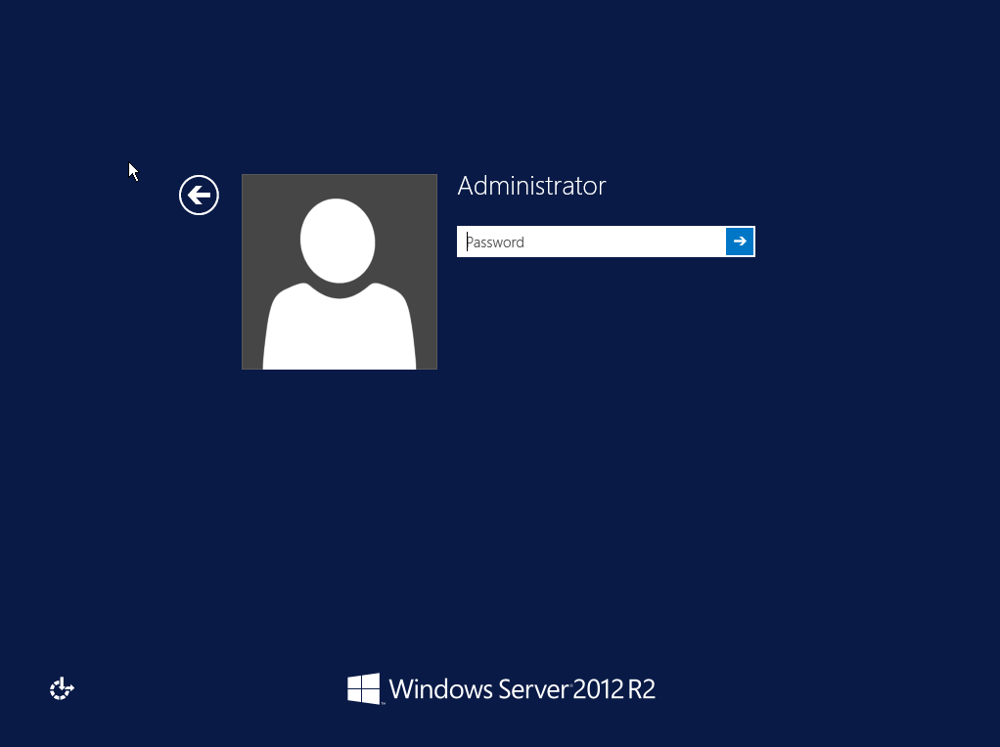
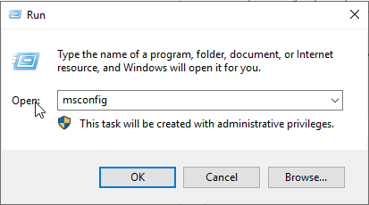

> [!primary]
> Esta traducción ha sido generada de forma automática por nuestro partner SYSTRAN. En algunos casos puede contener términos imprecisos, como en las etiquetas de los botones o los detalles técnicos. En caso de duda, le recomendamos que consulte la versión inglesa o francesa de la guía. Si quiere ayudarnos a mejorar esta traducción, por favor, utilice el botón «Contribuir» de esta página.
> 

**Última actualización: 14/02/2023**

## Objetivo

Después de una nueva instalación de un sistema operativo Windows Server en un servidor dedicado, en ocasiones puede desactivarse el acceso remoto y la respuesta ICMP (Internet Control Message Protocol).

**Esta guía explica cómo configurar Windows para reactivar el ICMP y autorizar las conexiones a través del protocolo Remote Desktop Protocol.**

## Requisitos

- Una distribución Windows instalada en un [servidor dedicado de OVHcloud](https://www.ovhcloud.com/es/bare-metal/).
- Tener acceso al [área de cliente](https://www.ovh.com/auth/?action=gotomanager&from=https://www.ovh.es/&ovhSubsidiary=es).

## Procedimiento

### Paso 1: acceso al KVM

Para acceder a la consola KVM, consulte la [guía KVM](https://docs.ovh.com/us/es/dedicated/utilizar-ipmi-servidor-dedicado/#utilizar-el-kvm-a-traves-de-su-navegador-web-solo-para-los-servidores-mas-recientes).

### Paso 2: finalizar la instalación de Windows

Una vez establecida la sesión KVM, se mostrarán los monitores de configuración inicial. Aquí debe configurar su **país/región**, el **idioma de Windows** y su **teclado**. Una vez realizada la operación, haga clic en `Next`{.action}.

{.thumbnail}

En la segunda pantalla, introduzca una contraseña para su cuenta de administrador y confírmela y haga clic en `Finish`{.action}.

{.thumbnail}

Windows aplicará sus preferencias y mostrará la pantalla de conexión. Haga clic en el botón `Send CtrlAltDel`{.action} en la esquina superior derecha para conectarse.

{.thumbnail}

Introduzca la contraseña que haya creado para su cuenta de administrador y haga clic en la flecha.

{.thumbnail}

La configuración inicial ha finalizado. Una vez conectado, deberá modificar los parámetros necesarios del firewall de Windows.

### Paso 3: modificar el firewall de Windows

Abra las `Herramientas de administración`{.action} del panel de configuración `Sistema y Seguridad`{.action} y haga doble clic en `Firewall Windows con seguridad avanzada`{.action}.

{.thumbnail}

Aquí puede activar las respectivas reglas "ICMP" y "Remote Desktop" (escritorio remoto). Haga clic derecho en la regla y seleccione `Autorizar regla`{.action} en el menú contextual.

{.thumbnail}

El servidor debe responder a las solicitudes que utilicen estos protocolos.

> [!primary]
> Para proteger su sistema Windows con reglas de firewall, consulte nuestra guía [Configurar el firewall de Windows](https://docs.ovh.com/us/es/dedicated/firewall-windows/).
>

### Activación de los logs de arranque (boot logs) Windows (opcional)

La activación de los logs de arranque (*boot logs*) Windows puede ser útil para los diagnósticos de errores del servidor.

Conéctese al servidor a través de una sesión de escritorio remoto o de [KVM](https://docs.ovh.com/us/es/dedicated/utilizar-ipmi-servidor-dedicado/#utilizar-el-kvm-a-traves-de-su-navegador-web-solo-para-los-servidores-mas-recientes). Abra el menú Iniciar Windows y haga clic en `Ejecutar`{.action}.

{.thumbnail}

Introduzca "msconfig" y haga clic en `OK`{.action}.

{.thumbnail}

En la nueva ventana, marque la casilla situada junto a `Boot log`. Haga clic en `OK`{.action}.

{.thumbnail}

La próxima vez que inicie el servidor, los logs se guardarán en un archivo .txt. La ruta del archivo es `C:\Windows\ntbtlog.txt`.

Para acceder al contenido de este archivo en modo de rescate, siga las indicaciones de [la guía del modo de rescate](https://docs.ovh.com/us/es/dedicated/modo_de_rescate/).

## Más información

Configurar el firewall de Windows](https://docs.ovh.com/us/es/dedicated/firewall-windows/)

Si necesita formación o asistencia técnica para implantar nuestras soluciones, póngase en contacto con su representante de ventas o haga clic en [este enlace](https://www.ovhcloud.com/es/professional-services/) para obtener un presupuesto y solicitar un análisis personalizado de su proyecto a nuestros expertos del equipo de Servicios Profesionales.

Interactúe con nuestra comunidad de usuarios en <https://community.ovh.com/en/>.