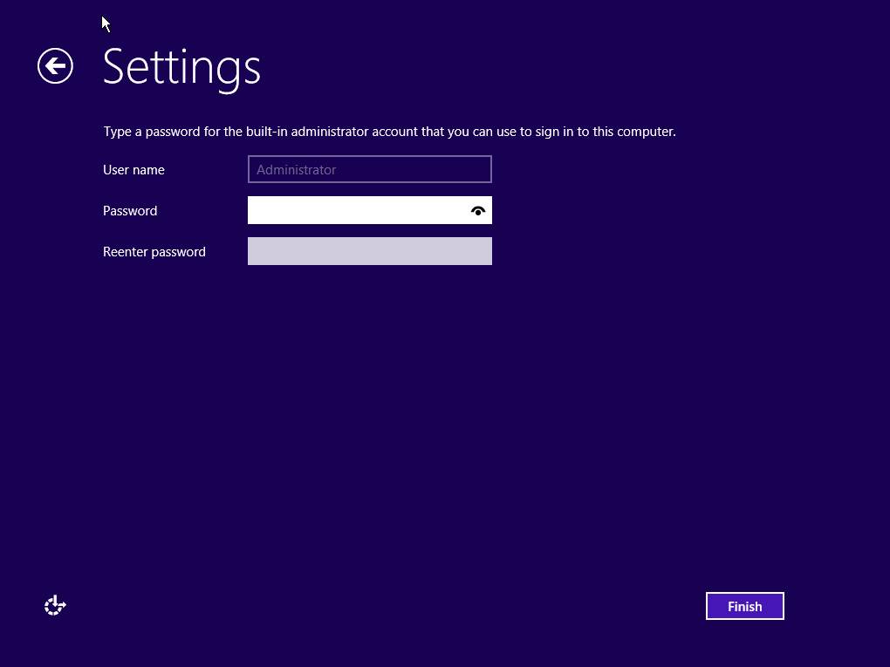

**Derniére mise à jour le 18/01/2022**

## Objectif

Après une nouvelle installation d'un système d'exploitation Windows Server sur un serveur dédié, l'accès à distance et la réponse ICMP (Internet Control Message Protocol) peuvent parfois être désactivés.

**Ce guide explique comment configurer Windows afin de réactiver l'ICMP et d'autoriser les connexions via le protocole Remote Desktop Protocol.**

## Prérequis

- Une distribution Windows installée sur un [serveur dédié OVHcloud](https://www.ovhcloud.com/fr-ca/bare-metal/).
- Avoir accès à votre [espace client](https://www.ovh.com/auth/?action=gotomanager&from=https://www.ovh.com/fr/&ovhSubsidiary=fr).

## En pratique

### Étape 1 : accès au KVM

Pour accéder à la console KVM de votre serveur dédié, consultez le [guide KVM](../utilisation-ipmi-serveurs-dedies/#utiliser-le-kvm-via-votre-navigateur-web-uniquement-pour-les-serveurs-les-plus-recents).

### Étape 2 : terminer l'installation de Windows

Une fois la session KVM établie, les écrans de configuration initiale s'affichent. Vous devez configurer ici votre **pays/région**, la **langue de Windows** et votre **disposition de clavier**. Une fois que vous avez effectué cette opération, cliquez sur `Next`{.action}.

{.thumbnail}

Dans le deuxième écran, entrez un mot de passe pour votre compte Administrateur et confirmez-le, puis cliquez sur `Finish`{.action}.

{.thumbnail}

Windows appliquera vos paramètres, puis affichera l'écran de connexion. Cliquez sur le bouton `Send CtrlAltDel`{.action} dans le coin supérieur droit pour vous connecter.

{.thumbnail}

Entrez le mot de passe que vous avez créé pour votre compte Administrateur et cliquez sur la flèche.

{.thumbnail}

La configuration initiale est terminée. Une fois connecté, vous devez modifier les paramètres nécessaires du pare-feu Windows.

### Étape 3 : modifier le pare-feu Windows

Ouvrez les `Outils d'administration`{.action} du panneau de configuration `Système and Sécurité`{.action} et double-cliquez sur `Pare-feu Windows avec sécurité avancée`{.action}.

{.thumbnail}

Vous pouvez activer ici les règles « ICMP » et « Remote Desktop » (bureau à distance) respectives. Faites un clic droit sur la règle et sélectionnez `Autoriser la règle`{.action} dans le menu contextuel.

{.thumbnail}

Votre serveur devrait maintenant répondre aux demandes utilisant ces protocoles.

## Aller plus loin

Échangez avec notre communauté d'utilisateurs sur <https://community.ovh.com>.
