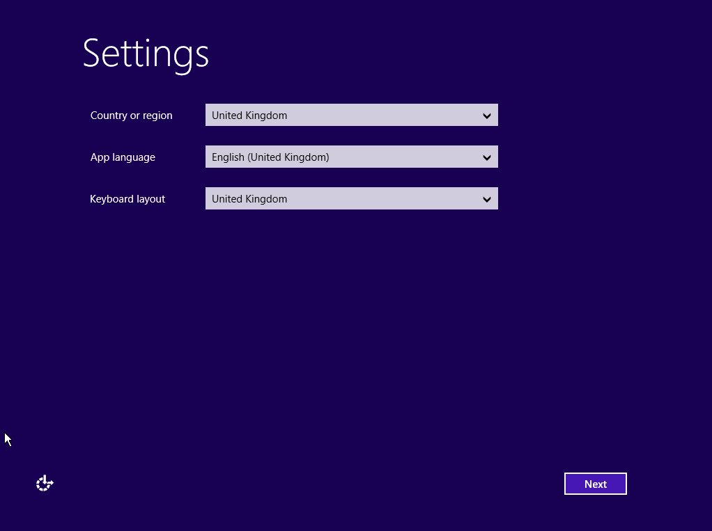

> [!primary]
> Esta tradução foi automaticamente gerada pelo nosso parceiro SYSTRAN. Em certos casos, poderão ocorrer formulações imprecisas, como por exemplo nomes de botões ou detalhes técnicos. Recomendamos que consulte a versão inglesa ou francesa do manual, caso tenha alguma dúvida. Se nos quiser ajudar a melhorar esta tradução, clique em "Contribuir" nesta página.
>

**Última atualização: 18/01/2022**

## Objetivo

Após uma nova instalação de um sistema operativo Windows Server num servidor dedicado, o acesso remoto e a resposta ICMP (Internet Control Message Protocol) podem por vezes ser desativados.

**Este guia explica como configurar o Windows para reativar o ICMP e autorizar as ligações através do protocolo Remote Desktop Protocol.**

## Requisitos

- Uma distribuição Windows instalada num [servidor dedicado OVHcloud](https://www.ovhcloud.com/pt/bare-metal/).
- Ter acesso à [Área de Cliente OVHcloud](https://www.ovh.com/auth/?action=gotomanager&from=https://www.ovh.pt/&ovhSubsidiary=pt)

## Instruções

### Etapa 1: acesso ao KVM

Para aceder à consola KVM, consulte o [guia KVM](../usar-ipmi-servidores-dedicados/#utilizar-o-kvm-atraves-do-seu-browser-apenas-para-os-servidores-mais-recentes).

### Etapa 2: terminar a instalação do Windows

Uma vez estabelecida a sessão KVM, aparecem os ecrãs de configuração inicial. Deve configurar aqui o seu **país/região**, a **língua do Windows** e a sua **disposição de teclado**. Depois de realizar esta operação, clique em `Next`{.action}.

{.thumbnail}

No segundo ecrã, introduza uma palavra-passe para a sua conta Administrador e confirme-a e clique em `Finish`{.action}.

{.thumbnail}

O Windows irá aplicar os seus parâmetros e visualizar o ecrã de ligação. Clique no botão `Send CtrlAltDel`{.action} no canto superior direito para se ligar.

{.thumbnail}

Introduza a password que criou para a sua conta Administrador e clique na seta.

{.thumbnail}

A configuração inicial está terminada. Uma vez ligado, deve modificar os parâmetros necessários da firewall Windows.

### Etapa 3: modificar a firewall Windows

Abra as `ferramentas de administração`{.action} do painel de configuração `Sistema e Segurança`{.action} e clique duas vezes em `Firewall Windows com segurança avançada`{.action}.

{.thumbnail}

Pode ativar aqui as regras "ICMP" e "Remote Desktop" (ambiente de trabalho remoto) respetivas. Clique com o botão direito da regra e selecione `Autorizar a regra`{.action} no menu contextual.

{.thumbnail}

O seu servidor deverá responder aos pedidos que utilizam estes protocolos.

## Quer saber mais?

Junte-se à nossa comunidade de utilizadores em <https://community.ovh.com/en/>.