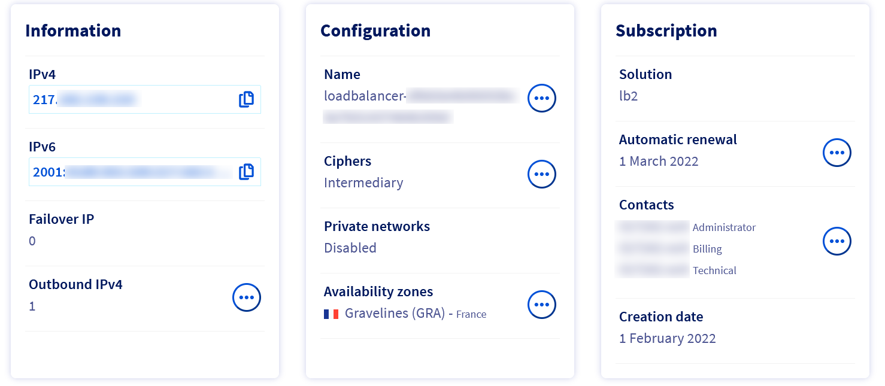
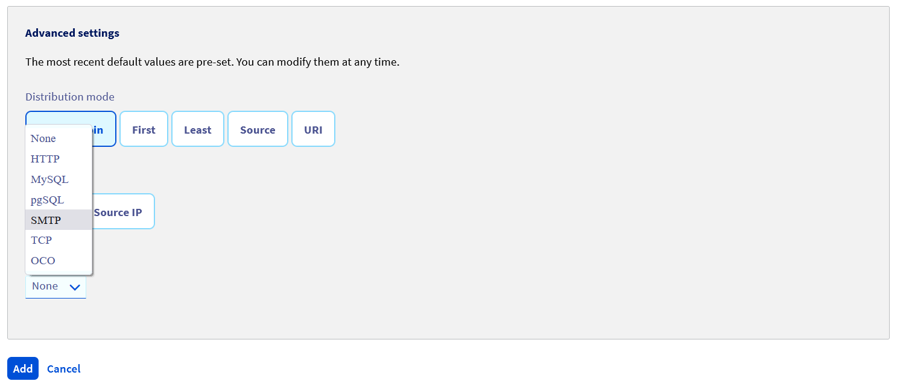
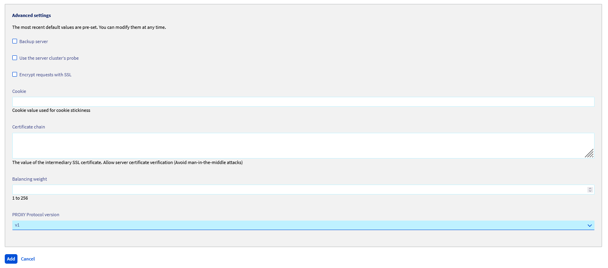
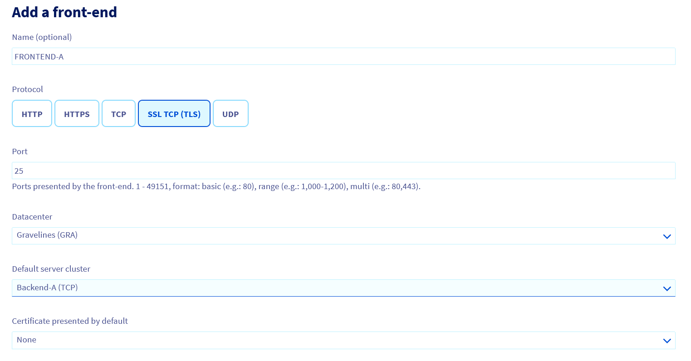

**Dernière mise à jour le à 01/02/2022**

## Objectif

Ce guide a pour but de vous aider à configurer un service OVHcloud Load Balancer pour répartir la charge sur plusieurs serveurs répondant convenablement en SMTP.

## Prérequis

- Posséder une offre [OVHcloud Load balancer](https://www.ovh.com/fr/solutions/load-balancer/) dans votre compte OVHcloud.
- Être connecté à votre [espace client OVHcloud](https://www.ovh.com/auth/?action=gotomanager&from=https://www.ovh.com/fr/&ovhSubsidiary=fr).
- Posséder un service SMTP de type postfix installé et configuré sur vos serveurs

## En pratique

> [!warning]
>
> La définition d'un service SMTP et son fonctionnement sont des notions qui ne seront pas abordées ici.
> Il est considéré ici que ces informations sont raisonnablement comprises et/ou maîtrisées.
>
> Nous allons vous guider au travers des différentes étapes.
> Dépendant de vos choix d'architecture, certaines configurations peuvent différer.
> 

Dans ce guide, nous allons configurer un service simple de Load Balancing TCP, pour un (ou plusieurs) serveur(s) SMTP. Un frontend TCP écoutera le trafic TCP sur le port 25. Il sera configuré pour diriger le trafic sur une ferme TCP, avec un ou plusieurs serveurs TCP, selon votre configuration.

Pour rappel, chaque protocole (HTTP, TCP et UDP) dans le service OVHcloud Load Balancer dispose de ses propres frontends, fermes et serveurs associés.

> [!warning]
>
> L'ordre de création des éléments est important.
> En particulier, les fermes de serveurs doivent être configurées **avant** de pouvoir leur attacher des serveurs.
> 

Dans l'espace client OVHcloud, nous allons retrouver les fonctionnalités détaillées ci-dessous :

{.thumbnail}

Depuis l'API OVHcloud :

> [!api]
>
> @api {GET} /ipLoadbalancing
> 

Pour plus d'informations sur les fonctionnalités de l'API, consultez la page « [Détails des fonctions API](../api-details/) ».

### Ajouter une ferme de serveurs

Nous allons ajouter une ferme de serveurs TCP à notre service, c'est à dire la partie en charge de répartir le trafic sur les serveurs.

#### Depuis l'espace client OVHcloud

Dans l'onglet `Fermes`{.action} de serveurs, cliquez sur le bouton `+TCP/TLS`{.action}.

Remplissez les différents champs. Les champs obligatoires pour une configuration simple sont le *Port* et la *Zone*. Dans notre cas, pour SMTP, le port utilisé est le port 25. Si aucun port n'est spécifié, votre OVHcloud Load Balancer utilisera automatiquement le même port que le frontend correspondant.

{.thumbnail}

Cliquez sur le bouton `Ajouter`{.action} une fois les champs remplis.

Vous pouvez optionnelement ajouter une sonde de type SMTP sur votre ferme.

{.thumbnail}

Votre ferme de serveurs devrait apparaître dans la liste, sous l'onglet `Fermes`{.action}.

{.thumbnail}

#### Depuis l'API OVHcloud 

- Liste des Fermes de serveurs TCP :

> [!api]
>
> @api {GET} /ipLoadbalancing/{serviceName}/tcp/farm
> 

- Détails d'un serveur TCP spécifique :

> [!api]
>
> @api {GET} /ipLoadbalancing/{serviceName}/tcp/farm/{farmId}
> 

- Ajout d'une nouvelle ferme de serveurs TCP :

> [!api]
>
> @api {POST} /ipLoadbalancing/{serviceName}/tcp/farm
> 

- Modification d'une ferme de serveurs spécifique :

> [!api]
>
> @api {PUT} /ipLoadbalancing/{serviceName}/tcp/farm/{farmId}
> 

- Suppression d'une ferme de serveurs spécifique :

> [!api]
>
> @api {DELETE} /ipLoadbalancing/{serviceName}/tcp/farm/{farmId}
> 

### Ajouter un serveur

Nous allons maintenant ajouter un serveur à notre ferme de serveurs.

#### Depuis l'espace client OVHcloud

Toujours dans l'onglet `Fermes`{.action}, sélectionnez la ferme dans laquelle vous souhaitez ajouter un serveur en cliquant sur la ligne correspondante. La liste des serveurs déjà configurés dans la ferme apparaît en dessous de la liste des fermes, ainsi qu'un bouton `+Server`{.action}. Cliquez sur ce bouton pour ajouter un nouveau serveur.

Seuls les champs *Adresse IPv4*,  *État* et *Version du ProxyProtocol* sont obligatoires. Si un serveur n'utilise pas le même port que celui défini plus haut dans la ferme, il est possible de le surcharger dans la configuration du serveur. Cependant, afin de conserver une configuration la plus homogène et maintenable possible, il est recommandé de n'utiliser ce paramètre que dans les cas avancés.


> [!warning]
>
> Il est important de configurer le ProxyProtocol en version v1, afin d'obtenir l'IP source réelle sur votre service SMTP.
> Postfix est compatible avec ce protocole.
> 

{.thumbnail}
{.thumbnail}

Cliquez sur le bouton `Ajouter`{.action} une fois les champs remplis.

Votre serveur devrait apparaître dans la liste des serveurs dans l'onglet `Fermes`{.action}, juste en dessous de la liste des fermes.

{.thumbnail}

### Depuis l'API OVHcloud

- Liste des serveurs de la ferme :

> [!api]
>
> @api {GET} /ipLoadbalancing/{serviceName}/tcp/farm/{farmId}/server
> 

- Détails d'un serveur spécifique :

> [!api]
>
> @api {GET} /ipLoadbalancing/{serviceName}/tcp/farm/{farmId}/server/{serverId}
> 

- Ajout d'un nouveau serveur :

> [!api]
>
> @api {POST} /ipLoadbalancing/{serviceName}/tcp/farm/{farmId}/server
> 

- Modification d'un serveur spécifique :

> [!api]
>
> @api {PUT} /ipLoadbalancing/{serviceName}/tcp/farm/{farmId}/server
> 

- Suppression d'un serveur spécifique :

> [!api]
>
> @api {DELETE} /ipLoadbalancing/{serviceName}/tcp/farm/{farmId}/server
> 

### Ajouter un frontend

Nous allons maintenant ajouter un frontend à notre service et le connecter à notre ferme de serveurs. Le frontend est la partie de votre OVHcloud Load Balancer qui sert à exposer votre service sur Internet.

#### Depuis l'espace client OVHcloud

Dans l'onglet `+Frontends`{.action}, cliquez sur le bouton `+TCP/TLS`{.action}.

Remplissez les différents champs. Les seuls champs obligatoires pour une configuration simple sont le *Port* (25 pour un service SMTP standard), la *Zone* et la *Sonde* si vous en avez configuré une dans votre Ferme. Si vous souhaitez que votre service soit disponible sur plusieurs ports en même temps, vous pouvez spécifier une liste de ports séparés par des virgules ou une plage de ports de la forme "<port_de_départ>-<port_de_fin>".

Si vous avez routé des IP Failover vers votre service OVHcloud Load Balancer, vous pouvez également attacher un frontend à une ou plusieurs IP Failover spécifiques.

N'oubliez pas de spécifier comme « Ferme par défaut » la ferme créée précédemment.

{.thumbnail}

Cliquez sur le bouton `Ajouter`{.action} une fois les champs remplis.

Votre frontend devrait apparaître dans la liste, sous l'onglet `Frontends`{.action}.

{.thumbnail}

#### Depuis l'API OVHcloud

- Liste des frontends TCP :

> [!api]
>
> @api {GET} /ipLoadbalancing/{serviceName}/tcp/frontend
> 


- Détails d'un frontend spécifique :

> [!api]
>
> @api {GET} /ipLoadbalancing/{serviceName}/tcp/frontend/{frontendId}
> 

- Ajout d'un nouveau frontend :

> [!api]
>
> @api {POST} /ipLoadbalancing/{serviceName}/tcp/frontend
> 

- Modification d'un frontend spécifique :

> [!api]
>
> @api {PUT} /ipLoadbalancing/{serviceName}/tcp/frontend/{frontendId}
> 

- Suppression d'un frontend spécifique :

> [!api]
>
> @api {DELETE} /ipLoadbalancing/{serviceName}/tcp/frontend/{frontendId}
> 

### Appliquer les modifications

Les modifications apportées à votre service OVHcloud Load Balancer doivent être *appliquées explicitement* dans chacune des zones configurées pour votre service OVHcloud Load Balancer. C'est seulement à ce moment qu'elles seront visibles pour vos visiteurs. Cela permet de faire un changement complexe de configuration en plusieurs fois, et de ne l'appliquer que lorsque la configuration est prête.

Si vous avez plusieurs zones, vous devrez appliquer la même configuration pour chacune de vos zones.

#### Depuis l'espace client OVHcloud

Rendez-vous sur la page principale de votre service OVHcloud Load Balancer et cliquez sur les boutons `Appliquer:Zone`{.action} pour chacune des zones concernées.

#### Depuis l'API OVHcloud

- Rafraîchir une zone :

> [!api]
>
> @api {POST} /ipLoadbalancing/{serviceName}/refresh
> 


### Configuration de postfix

Afin de rendre postfix compatible avec le *ProxyProtocol* de haproxy, une option est requise dans le fichier de configuration `postfix main.cf`.

```bash
smtp_upstream_proxy_protocol = haproxy
```

Vous devez ensuite redémarrer votre démon postfix.

### Validation

Une fois toutes ces étapes terminées, vous devriez disposer d'un service de répartition de charge fonctionnel pour vos serveurs SMTP. Vous pouvez alors valider l'état du service en interrogeant votre IPLB comme un serveur SMTP.

{.thumbnail}

## Aller plus loin

Échangez avec notre communauté d'utilisateurs sur <https://community.ovh.com>.