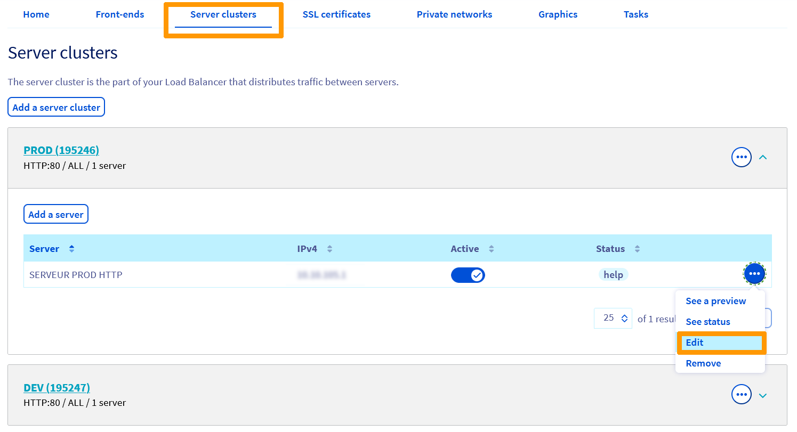

**Poslední aktualizace 02/02/2018**

## Cíl

Nová verze služby OVH Load Balancer nabízí různé režimy redistribuce datové zátěže. Tyto režimy určují způsob, jakým OVH Load Balancer zachází s dotazy odesílanými na Vaše servery.

V této příručce se seznámíte s jednotlivými režimy redistribuce datové zátěže a zjistíte, jakým způsobem s nimi lze pracovat.

## Prerekvizity

- Přístup do [Zákaznického prostoru OVH](https://www.ovh.com/auth/?action=gotomanager&from=https://www.ovh.ie/&ovhSubsidiary=ie){.external}.
- Farma serverů.

## Postup

### Režimy redistribuce datové zátěže

Datová zátěž je přerozdělována v rámci farem serverů. Od režimu redistribuce datové zátěže se odvíjí způsob, jakým jsou příchozí dotazy přerozdělovány mezi servery obsaženými v příslušné farmě.

Základní informace týkající se fungování služby OVH Load Balancer naleznete v následující příručce: [Úvod do služby OVH Load Balancer](https://docs.ovh.com/fr/load-balancer/iplb-presentation/){.external}.

|Algoritmus|Vlastnosti|
|---|---|
|First|Spojení navazuje první dostupný server. Server je vybírán na základě svého ID, od nejmenšího po největší.|
|LeastConn|Vybírá server s nejmenším počtem aktivních připojení. Tento režim je doporučován pro dlouhotrvající relace s nízkými úrovněmi datové zátěže. Algoritmus *RoundRobin* je aplikován v případě skupin serverů se stejným počtem aktivních připojení.|
|RoundRobin|Vybírá jeden server za druhým pro každé připojení. Jedná se o výchozí algoritmus.|
|Source|Tento algoritmus hašuje (hash; hašovací funkce) zdrojovou IP adresu a výsledek dělí počtem aktuálně běžících serverů. Jedna a ta samá zdrojová IP adresa tedy bude vždy směrována na stejný server, pokud tento server bude aktivní.|
|URI|Tento algoritmus hašuje (hash; hašovací funkce) část či celý řetězec URI a výsledek dělí počtem aktuálně běžících serverů. Jeden a ten samý řetězec URI tedy bude vždy směrován na stejný server, pokud tento server bude aktivní.|

### Úprava režimu redistribuce datové zátěže farmy serverů prostřednictvím Zákaznického prostoru OVH

- V sekci `Farmy serverů`{.action} (1) naleznete přehled svých farem. Farmu lze modifikovat kliknutím na tři tečky po pravé straně (2) a následným vybráním možnosti `Upravit`{.action}:

{.thumbnail}

V sekci `Pokročilé nastavení`{.action} lze nastavit požadovaný `Režim redistribuce datové zátěže`{.action}:

{.thumbnail}

Jakmile vyberete požadovaný režim redistribuce datové zátěže, klikněte na tlačítko `Aktualizovat`{.action} a své rozhodnutí ještě potvrďte kliknutím na `Aplikovat konfiguraci`{.action} ve žlutém vyskakovacím okně:

{.thumbnail}

### Úprava režimu redistribuce datové zátěže farmy serverů prostřednictvím API

Úprava režimu redistribuce datové zátěže se provádí prostřednictvím modifikace nastavení farmy serverů.

- Získání detailních informací o farmě

Pokud znáte ID farmy, můžete získat její detailní informace. V následujícím příkladu budeme pracovat s HTTP farmou:

> [!api]
>
> @api {GET} /ipLoadbalancing/{serviceName}/http/farm/{farmId}
> 

|Parametr|Význam|
|---|---|
|ServiceName*|ID Vaší služby Load Balancer|
|farmId*|Numerický identifikátor farmy|

|Odpověď (BackendHttp)|Význam|
|---|---|
|farmId|Numerický identifikátor farmy|
|balance|Aktuálně nastavený režim redistribuce datové zátěže farmy|
|zone|Název zóny, v níž je farma nakonfigurována|
|port|Port používaný pro navazování spojení se servery ve farmě|
|probe|Typ sondy, která je na farmě aktuálně nakonfigurována|
|displayName|Název farmy|
|stickiness|Režim monitoringu připojení, který je na farmě aktuálně nakonfigurován|

- Úprava režimu redistribuce datové zátěže farmy serverů

Pokud znáte ID farmy, můžete upravit její konfiguraci. V následujícím příkladu budeme pracovat s HTTP farmou. Pro změnu režimu redistribuce datové zátěže je zapotřebí aktualizovat následující pole:  `BackendHttp.balance`

> [!api]
>
> @api {PUT} /ipLoadbalancing/{serviceName}/http/farm/{id}
> 

|Parametr|Význam|
|---|---|
|ServiceName*|ID Vaší služby Load Balancer|
|farmId*|Numerický identifikátor farmy|
|BackendHttp.balance|Požadovaný režim redistribuce datové zátěže|

- Aplikace provedených úprav

> [!api]
>
> @api {POST} /ipLoadbalancing/{serviceName}/refresh
> 

|Parametr|Význam|
|---|---|
|ServiceName*|ID Vaší služby Load Balancer|
|zone*|Název zóny, v níž má být konfigurace aplikována|

## Kam dál

Přidejte se k naší uživatelské komunitě na <https://community.ovh.com>.
