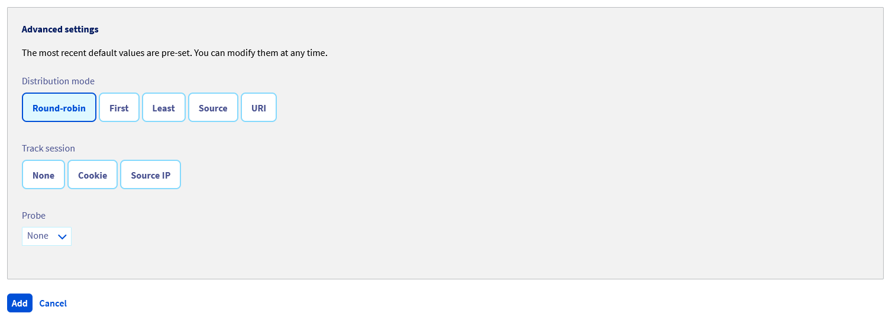
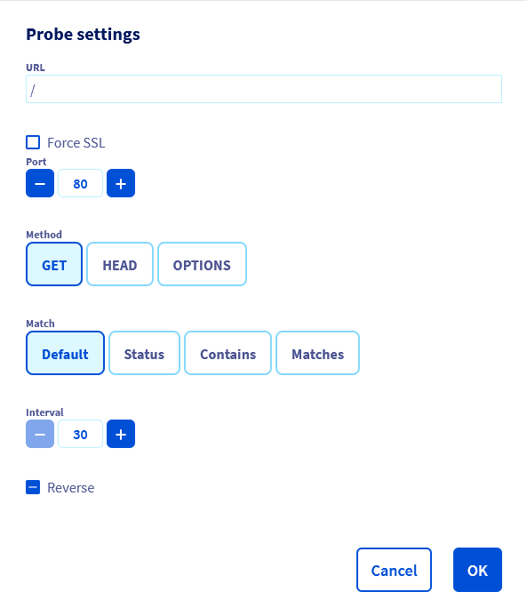

## Objective

With the OVH Load Balancer, you can distribute a front-end’s incoming traffic across a set of servers in a destination farm.

There may be instances where a server in your farm becomes unavailable for a number of reasons, including oversaturation, an incident, or scheduled maintenance. When the OVH Load Balancer detects a connection error, it will try to redirect traffic to another server. The connection will be slower, but it will continue to work.

However, the reasons behind certain types of unavailability can be harder to pinpoint. For example, if a new version of code is being deployed, the application may momentarily experience a glitch, and return a 500 error. In this particular case, a solution would be to mark the servers concerned as unavailable in the API before you begin the maintenance work, apply the configuration and update, then mark the server as available again. This method is not ideal, but it works. For more information on deploying a blue-green architecture with an OVH Load Balancer, please read our guide: <https://docs.ovh.com/sg/en/load-balancer/blue-green/>.

The purpose of a probe is to test an infrastructure’s health. It periodically examines each of your servers, to ensure that they are working properly. If it detects an error, the server is automatically disabled until the situation is resolved.

Since this service is still very new, its basic features are only available in the API.

**This guide will explain the general principles behind probes, and provide practical examples of probes being used.**

## Requirements

- a correctly configured OVH Load Balancer, with farms and servers set

## Instructions

### An introduction to the API.

The API for probes in the OVH Load Balancer is designed to be flexible and scalable.

The probes can be configured directly on the farms. All of the servers from a single farm will have exactly the same probe applied. However, probe activation and deactivation is specific for each server. As a result, it is possible to only monitor certain servers within a single farm.

You can view the list of available probes and their settings with the following API call:

> [!api]
>
> @api {GET} /ipLoadbalancing/{serviceName}/availableFarmProbes
> 

For more information on this call, please read the *Available probes* section at the bottom of this guide.

The probes in this list can be configured on `http` and `tcp` farms via the following calls:

> [!api]
>
> @api {POST} /ipLoadbalancing/{serviceName}/http/farm
> 

> [!api]
>
> @api {PUT} /ipLoadbalancing/{serviceName}/http/farm/{farmId}
> 

> [!api]
>
> @api {POST} /ipLoadbalancing/{serviceName}/tcp/farm
> 

> [!api]
>
> @api {PUT} /ipLoadbalancing/{serviceName}/tcp/farm/{farmId}
> 

For more information on these calls, please read the *Probe configuration* section at the bottom of this guide.

### Examples

#### Check if the server accepts TCP connections.

This is the simplest method to set up. It is compatible with `tcp` and `http` farms. If no other probes are configured, you can activate it to start. It works by periodically attempting to establish a connection on each of your servers. If the connection fails twice in a row, the server is put aside until it responds again.

In practice, this gives a probe:

|Field|Value and description|
|---|---|
|serviceName|Your OVH Load Balancer ID|
|farmId|Your TCP or HTTP farm|
|probe.type|"tcp"|

All other probe fields can keep their default values. Just apply the configuration to the zone concerned, and the probe will begin to work.

#### Test a specific HTTP page.

By default, the HTTP `probe` sends an "OPTIONS" request on "/" in HTTP/1.0, without a domain name. In many cases, this is sufficient, but some servers do not manage this method. You can carry out much more powerful tests with the HTTP probe. For example, a good practice when exposing a HTTP service is to add a router dedicated to probes. It is normal to see "/status", "/health", and "/check", which summarise the service’s status.

In practice, if you want to configure the probe to send a "GET" request on [http://api.example.com/status](http://api.example.com/status){.external}, it gives:

|Field|Value and description|
|---|---|
|serviceName|Your OVH Load Balancer ID|
|farmId|Your TCP or HTTP farm|
|probe.type|http|
|probe.method|GET|
|probe.url|[http://api.example.com/status](http://api.example.com/status){.external}|
|probe.match|status|
|probe.pattern|200 (multiple status codes can be added, provided they are separated by commas)|

All other probe fields can keep their default values. Finally, apply the configuration to the zone concerned.

#### Use an external HTTP test.

What happens if, for example, your service is an IMAP server that relies on an LDAP server for authentication? The server may accept connections, but experience a temporary connection issue with the LDAP server. If this happens, the customers redirected to this server would be able to connect, but wouldn’t be able to authenticate. As a result, the server would need to be removed from the farm.

If you are using a `tcp` probe, it will manage to connect. As a result, it will consider the service to be available, even though this is not the case.

In this situation, the health test would ideally be able to confirm that the basic service works. You can provide a specific port to use in the tests. This way, you can set up arbitrary tests for a service, and expose them to HTTP on a dedicated port.

For example, in this situation, you can have a HTTP server on port 8080\. It will test the IMAP server via the URL "/service/imap/status", and will return ‘OK’ when everything is working properly. In practice, this will return:

|Field|Value and description|
|---|---|
|serviceName|Your OVH Load Balancer ID|
|farmId|Your TCP or HTTP farm|
|probe.type|http|
|probe.port|8080|
|probe.method|GET|
|probe.url|/service/imap/status|
|probe.match|contains|
|probe.pattern|OK|

Just apply the configuration to the zone concerned, and the probe will begin to work.

> [!warning]
>
> If the HTTP service dedicated to monitoring your IMAP service experiences a fault, the IMAP service will also be considered faulty, even if it is working properly.
> 

### Reference

#### Probe configuration.

##### Configure a probe.

Probes can be configured on a new farm (`POST`) or an existing one (`PUT`). Since the two methods are equivalent, only the second (`PUT`) method is presented here.

> [!faq]
>
> Service:
>
>> > [!api]
>> >
>> > @api {PUT} /ipLoadbalancing/{serviceName}/http/farm/{farmId}
>> >
>>
>
> Settings:
>
>> > **serviceName**
>> >
>> >> Your OVH Load Balancer ID.
>> >
>> > **farmId**
>> >
>> >> Your `farm` ID number.
>> >
>> > **probe**
>> >
>> >> **type**
>> >>
>> >> > The type of `probe` to activate. The probe types managed are:
>> >> >
>> >> > `tcp` for a basic TCP connection test.
>> >> >
>> >> > `http` for a HTTP connection test. You can specify the URL and the method.
>> >> >
>> >> > `smtp` for a basic SMTP connection test.
>> >> >
>> >> > `mysql` for a basic MySQL connection test.
>> >> >
>> >> > `pgsql` for a basic PostgreSQL connection test.
>> >> >
>> >> > `oco` for a confirmation of the general status returned on port 79.
>> >
>> >> **interval**
>> >>
>> >> > The interval (in seconds) between a probe’s two connection attempts. It must be at least 30 seconds.
>> >
>> >> **port**
>> >>
>> >> > The port that the probe must use, if it is different to the port configured on the farm.
>> >> > This enables you to delegate a server’s status validation to a separate service on the machine, and carry out arbitrary probes.
>> >
>> >> **method**
>> >>
>> >> > The HTTP method to use if the probe is a “http” probe.
>> >> > Compatible methods are `GET`, `HEAD` and `OPTIONS` (by default).
>> >
>> >> **url**
>> >>
>> >> > The URL to use for tests, if it is a “http” probe type.
>> >> > It should be formulated as follows: `[[https?://]www.example.com]/path/to/check`.
>> >> > If a domain is specified, its request will be sent to HTTP/1.1 rather than HTTP/1.0 by default.
>> >
>> >> **match**
>> >>
>> >> > The type of comparison to use to check if the server is in good health.
>> >> > The managed comparison types are `default`, `status`, `contains` and `matches`.
>> >> > Comparison types are compatible with both “http” and “tcp” probes.
>> >
>> >> **pattern**
>> >>
>> >> > The value to use as an argument of the comparison type if it is different from “default”.
>> >
>> >> **forceSsl**
>> >>
>> >> > This defines whether the probe must work in SSL/TLS, even if the farm is configured to connect via standard TCP.
>> >> > This can be useful when, for example, your OVH Load Balancer is configured to monitor HTTPS traffic in TCP without decrypting it.
>

Other settings can be edited via this call. Since this guide focuses on probes, they are not documented here.

If a port other than the farm’s base port is configured on the probe, the `proxyprotocol` and `ssl` settings are reset. As an example, we will take a configured farm to use `proxyprotocol` on **port 4242**, and an associated probe using **port 8080**. The probe will not send the `proxyprotocol` header when it connects on **port 8080**. The same goes for `ssl`, but it can be forced.

> [!warning]
>
> When a probe is configured on a farm, it must be activated on the servers.
> 

##### Activate probes on a server.
For a probe to be active, it must be configured on the farm and activated on the servers concerned. With this call, you can activate the probe being taken into account:

> [!faq]
>
> Service:
>
>> > [!api]
>> >
>> > @api {PUT} /ipLoadbalancing/{serviceName}/http/farm/{farmId}/server/{serverId}
>> >
>>
>
> Settings:
>
>> > **serviceName**
>> >
>> >> Your OVH Load Balancer ID.
>> >
>> > **farmId**
>> >
>> >> Your `farm` ID number.
>> >
>> > **serverId**
>> >
>> >> Your `server’s` ID number.
>> >
>> > **probe**
>> >
>> >> Whether or not the `probes` must be taken into account.
>

Other settings can be edited via this call. Since this guide focuses on probes, they are not documented here.

#### Available comparison types.

Four comparison types are available to confirm a probe’s results:

|Comparison type|Description|
|---|---|
|default|Launches a basic test, without any settings.|
|status|A list of valid HTTP response codes, separated by commas.|
|contains|Checks that the pattern can be found in the response.|
|matches|Checks that the response corresponds to a regular expression pattern.|

‘Contains’ and ‘matches’ comparison types find a correspondence in the first 16 KB of the response. If the response is longer than 16 KB, whatever comes afterwards will be ignored during the test. Please note that to optimise your performance, we recommend returning as little information as possible in your probes.

#### Available probes.

You can get a list of the available probes using the following API call:

> [!faq]
>
> Service:
>
>> > [!api]
>> >
>> > @api {GET} /ipLoadbalancing/{serviceName}/availableFarmProbes
>> >
>>
>
> Response:
>
>> > **type**
>> >
>> >> The type of `probe` to configure in the  `probe.type` of `farms`.
>> >>
>> >> The probe types managed are:
>> >>
>> >> `tcp` for a basic TCP connection test.
>> >>
>> >> `http` for a HTTP connection test. You can specify the URL and the method.
>> >>
>> >> `smtp` for a basic SMTP connection test.
>> >>
>> >> `mysql` for a basic MySQL connection test.
>> >>
>> >> `pgsql` for a basic PostgreSQL connection test.
>> >>
>> >> `oco` for a confirmation of the general status returned on port 79.
>> >
>> > **port**
>> >
>> >> This defines whether the port can be configured for this probe.
>> >
>> > **method**
>> >
>> >> The list of HTTP methods managed, or `null` if none are managed.
>> >
>> > **url**
>> >
>> >> This defines if the probe’s URL can be configured.
>> >
>> > **matches**
>> >
>> >> The list of comparison types available for this probe.
>> >> The interpretation of the `probe.pattern` field depends on this field.
>> >> The comparison types potentially managed are:
>> >>
>> >> `default`. The most simple test, without any particular conditions.`probe.pattern` must be empty.
>> >>
>> >> `status`. Checks if the HTTP status code is in the list separated by commas.
>> >>
>> >> `contains`. Checks that the server response contains `probe.pattern`.
>> >>
>> >> `matches`. Checks that the server response matches `probe.pattern`.
>

##### TCP

This probe attempts to establish a TCP connection to the server. If the server sends a “banner”, you can check if it matches a schema. The default test simply ensures that the connection can be established.

|Fields|Description|
|---|---|
|type|`tcp`|
|port|Configurable|
|method|Not supported|
|URL|Not supported|
|matches|`default`, `contains` or `matches`|

##### HTTP

This probe attempts to establish a HTTP connection to the server. If the server responds, you can check its HTTP status code, and that the response body matches a schema. The default test sends an OPTIONS request to the '/' page in HTTP/1.0, without a Host field.

|Fields|Description|
|---|---|
|type|`http`|
|port|Configurable|
|method|`GET`, `HEAD` or `OPTIONS`|
|URL|URL in the form: \[\[https?://]www.example.com]/path/to/check|
|matches|`default`, `contains` or `matches`|

If the URL is specified, the domain name and protocol are operational. If a domain name is specified, the “Host” field of the request will be filled in, and the request will be sent to HTTP/1.1. If the protocol is specified, it must be consistent with the farm’s SSL configuration.

> [!primary]
>
> We recommend configuring the method, at least, with GET.
> Some servers, including NGINX, do not manage the OPTIONS method without it being configured in advance.
> 

##### SMTP

This probe attempts to establish an SMTP connection with the server, and sends the command "HELLO localhost". If the server responds, the probe checks that the response code starts with a ‘2’ (success). This probe does not have any specific configuration options.

|Fields|Description|
|---|---|
|type|`smtp`|
|port|Configurable|
|method|Not supported|
|URL|Not supported|
|matches|`default`|

##### MySQL

This probe attempts to establish a MySQL connection with the server, and analyses the server’s response. This probe does not have any specific configuration options.

|Fields|Description|
|---|---|
|type|`mysql`|
|port|Configurable|
|method|Not supported|
|URL|Not supported|
|matches|`default`|

##### PostgreSQL

This probe attempts to establish a PostgreSQL connection with the server, and analyses the server’s response. This probe does not have any specific configuration options.

|Fields|Description|
|---|---|
|type|`pgsql`|
|port|Configurable|
|method|Not supported|
|URL|Not supported|
|matches|`default`|

##### oco

This probe attempts to establish a TCP connection on port 79 of your server, and checks that the response starts with a ‘2’ (success). This probe does not have any specific configuration options.

|Fields|Description|
|---|---|
|type|`oco`|
|port|Not configurable|
|method|Not supported|
|URL|Not supported|
|matches|`default`|

## Via the OVH Control Panel.

You can configure probes when you add (or modify) a server farm, in advanced settings.

{.thumbnail}

This is how you access the probe type’s configuration.

{.thumbnail}

If you are able to do so with the probe type you have selected, you can configure specific advanced settings for the probe.

{.thumbnail}

A new configuration window will appear, with the probe’s settings.

{.thumbnail}
