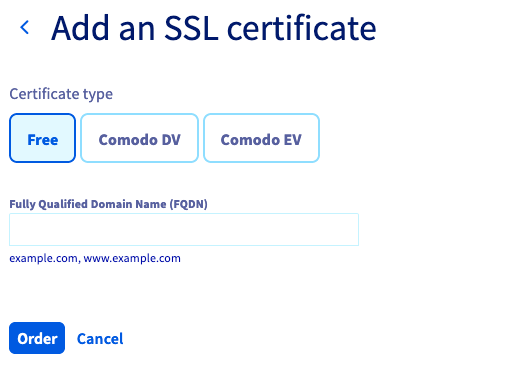

## Presentation
The OVH Load Balancer service can be configured to support SSL termination..

The purpose of SSL termination is to decrypt the incoming encrypted stream before forwarding it to the appropriate service (web server for example).

SSL termination has a cost for the service that manages it. Rather than letting your servers do it, it is possible to configure your OVH Load Balancer service to do it.

Moreover, all your certificates are centralized in one place and their maintenance is easier.

## Configuring the frontend for SSL termination
The first thing to do is to configure your frontend to handle SSL termination.

### Via the Manager
In the `Frontends` section of your Manager, click on the `Add Frontend`{.action} button to create a new frontend. An edit window will appear, select the `HTTPS` protocol. You will also need to fill in the `Default Close` or `HTTPS Redirection` field in the advanced settings..

{.thumbnail}

Once the frontend has been created, you will be prompted to `Apply configuration`{.action} to apply your changes to the relevant area.

### Via API
In the API, the SSL termination is specified by the ssl boolean: (Don't forget to set defaultFarmId or redirectLocation)

> [!api]
>
> @api {POST} /ipLoadbalancing/{serviceName}/http/frontend
>

Then apply the changes :

> [!api]
>
> @api {POST} /ipLoadbalancing/{serviceName}/refresh
>

## Order the free SSL certificate

### Via the Manager
In the `SSL Certificates` section of your Manager, click the `Order SSL Certificate`{.action} button to create a new one. An edit window will appear with an `FQDN` field to be filled in.

{.thumbnail}

### Via API
In the API, the command is as follows. For the order to be finalized, the chosen domain name must point to your OVH Load Balancer service.

> [!api]
>
> @api {POST} /ipLoadbalancing/{serviceName}/freeCertificate
>

## Follow-up of the order

### Via the Manager
In the `Tasks`{.action} section of your Manager, the tasks related to ordering a free SSL Certificate are of the type `orderFreeCertificate`.

### Via API

#### Return to task list
You can specify the action type orderFreeCertificate to refine the search.

> [!api]
>
> @api {GET} /ipLoadbalancing/{serviceName}/task
>

#### Returning the status of a particular stain

> [!api]
>
> @api {GET} /ipLoadbalancing/{serviceName}/task/{id}
>

## Delivery of the free SSL certificate
Once the order is complete, the SSL Certificate is automatically installed on your OVH Load Balancer service..
