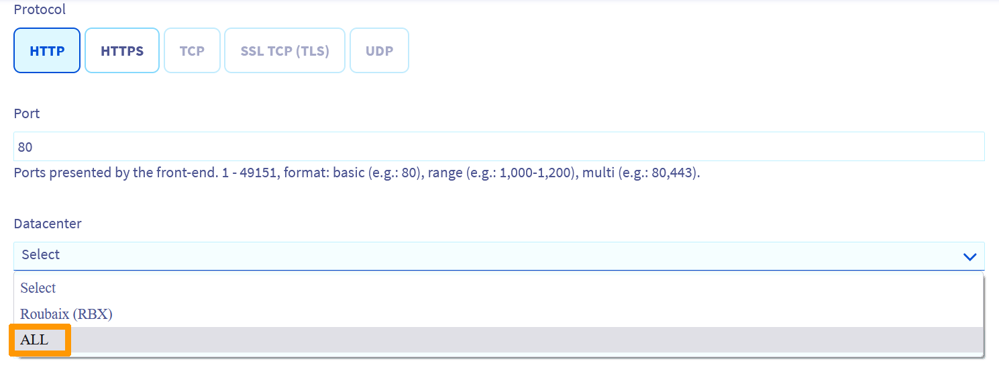
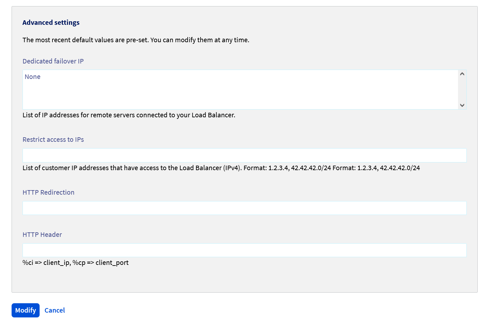
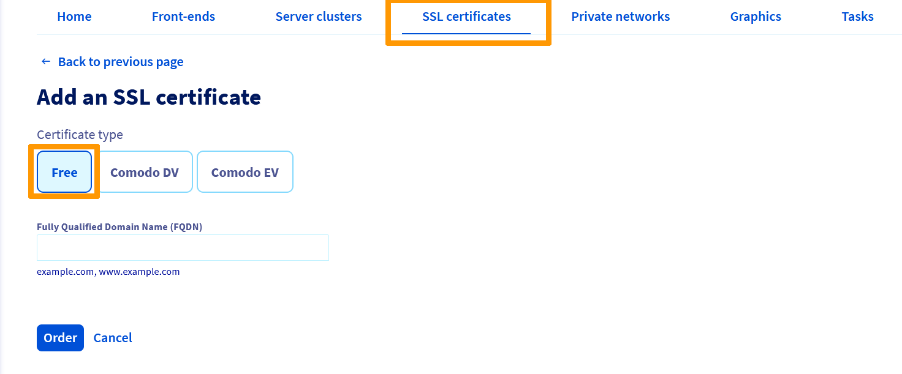
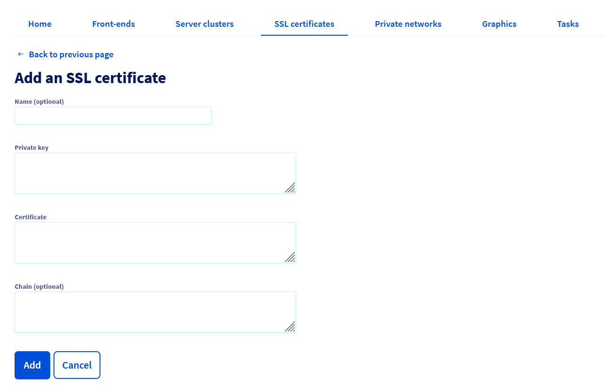

## Obiettivo

Questa guida ti mostra come utilizzare il Load Balancer e presenta le principali funzionalità del servizio.

## Prerequisiti

- Avere accesso allo Spazio Cliente OVH
- Disporre di un [Load Balancer](https://www.ovh.it/soluzioni/ip-load-balancing/){.external} attivo

## Procedura

### Gestisci il Load Balancer dallo Spazio Cliente OVH

Accedi alla sezione `Cloud`{.action} (1) del tuo Spazio Cliente OVH e seleziona `Load Balancer`{.action} (2) dal menu a sinistra. Si apre la pagina principale del servizio:

{.thumbnail}

In questa interfaccia sono disponibili le seguenti informazioni:

|Elemento|Descrizione|
|---|---|
|Stato|Riepilogo delle informazioni relative al tuo Load Balancer: nome del servizio, frontend, server farm attive e server aggiunti|
|Utilizzo|Riepilogo dei dati relativi ai consumi del tuo Load Balancer|
|Grafici|Grafici associati al tuo servizio, elaborati in base alle connessioni simultanee o al numero di richieste al minuto|
|Informazioni|IPv4 e IP Failover associati e numero di IPv4 di uscita (per visualizzare i dettagli, clicca sui tre puntini di sospensione)|
|Configurazione|Sezione in cui è possibile personalizzare il nome del tuo servizio (che verrà visualizzato in alto e nella colonna di sinistra), i Cipher e il datacenter in cui è localizzato il Load Balancer |
|Abbonamento|Sezione in cui vengono mostrati i dettagli amministrativi del servizio|

Per aggiungere `Frontend`{.action} e `Server Farm`{.action}, è sufficiente cliccare sul pulsante corrispondente: un form ti guiderà nella configurazione. 

### Gestisci i frontend

Per aggiungere un frontend, seleziona la scheda `Frontend`{.action} e clicca su `Aggiungi un frontend`{.action}. Accedi a questo menu:

{.thumbnail}

Ecco gli elementi del frontend:

|Elemento|Descrizione|
|---|---|
|Nome|È possibile assegnare un nome al tuo frontend per identificarlo più facilmente|
|Protocollo|Puoi scegliere tra HTTP, HTTPS, TCP, TCP SSL (TLS) e UDP|
|Porta|Scegli la porta da utilizzare|
|Datacenter|Scegli un datacenter o seleziona “Tutti”|
|Farm predefinita|Se hai configurato più farm, puoi sceglierne una predefinita per ogni frontend|

Inoltre, hai accesso alle opzioni avanzate

{.thumbnail}

|Elemento|Descrizione|
|---|---|
|IP Failover dedicato|Lista degli indirizzi IP dei server remoti a cui si connette il tuo Load Balancer|
|Restringi l'accesso ad alcuni IP|Lista che permette di restringere l’accesso remoto al Load Balancer, esclusivamente in IPv4|
|Reindirizzamento HTTP|Aggiunta di un URL di reindirizzamento HTTP|
|Header HTTP|Aggiunta di un header HTTP|

### Gestisci le server farm
Per aggiungere una server farm, seleziona la scheda `Server Farm`{.action} e clicca su `Aggiungi una Server Farm`{.action}. Le opzioni principali disponibili sono le stesse del frontend. Le opzioni avanzate sono invece differenti:

{.thumbnail}

|Elemento|Descrizione|
|---|---|
|Modalità di ripartizione|Scegli tra Round-robin, First, Last, Source o URI|
|Monitoraggio della sessione|Scegli se effettuare il monitoraggio tramite Cookie o Source IP o non attivarlo|
|Sonda|Scegli e attiva la sonda|

### Gestisci i server
Una volta creata la farm, non ti resta che aggiungervi dei server. Di seguito, i dettagli delle opzioni standard e avanzate disponibili:

{.thumbnail}

{.thumbnail}

|Elemento|Descrizione|
|---|---|
|Nome|È possibile assegnare un nome al tuo server per identificarlo più facilmente|
|Indirizzo IPv4|Aggiunta dell’IP del servizio che funzionerà come server|
|Porta|Porta del server|
|Server di recupero|Specifica che questa macchina è un server di recupero|
|Utilizza la sonda di disponibilità della Farm|Scegli di utilizzare la sonda convalidata durante la creazione della Farm|
|Cifra le richieste con SSL|Codifica le richieste utilizzando un certificato SSL|
|Cookie|Aggiunta di un cookie di sessione personalizzato|
|Catena di certificazione|Aggiunta di una catena di certificazione|
|Peso di bilanciamento|Scelta del peso di bilanciamento per la ripartizione del carico|

### Gestisci i certificati SSL

Dalla scheda `Certificati SSL`{.action} è possibile aggiungere un SSL al servizio di Load Balancer. Hai 2 possibilità: ordinare un certificato SSL OVH o aggiungerne uno esterno.

#### Certificato SSL OVH

Per ordinare un certificato SSL, seleziona la scheda `Certificati SSL`{.action}, clicca su `Ordina un certificato SSL`{.action} e segui gli step:

{.thumbnail}

|Elemento|Descrizione|
|---|---|
|Nome|È possibile assegnare un nome al tuo certificato per identificarlo più facilmente|
|Tipo di certificato|Gratuito (Let's Encrypt), Comodo DV o Comodo EV (per maggiori dettagli, consulta la pagina <https://www.ovhcloud.com/it/web-hosting/options/ssl/>)|
|Fully Qualified Domain Name (FQDN)|I domini interessati|

#### Aggiungi un certificato SSL

Se hai già attivato il tuo certificato SSL, è possibile aggiungerlo direttamente:

{.thumbnail}

|Elemento|Descrizione|
|---|---|
|Nome|È possibile assegnare un nome al tuo certificato per identificarlo più facilmente|
|Chiave privata|Campo in cui inserire la chiave privata da aggiungere al servizio|
|Certificato|Campo in cui aggiungere il certificato|
|Chain|Campo in cui aggiungere, se necessario, un certificato root.|

## Per saperne di più

Contatta la nostra Community di utenti all’indirizzo <https://www.ovh.it/community/>.