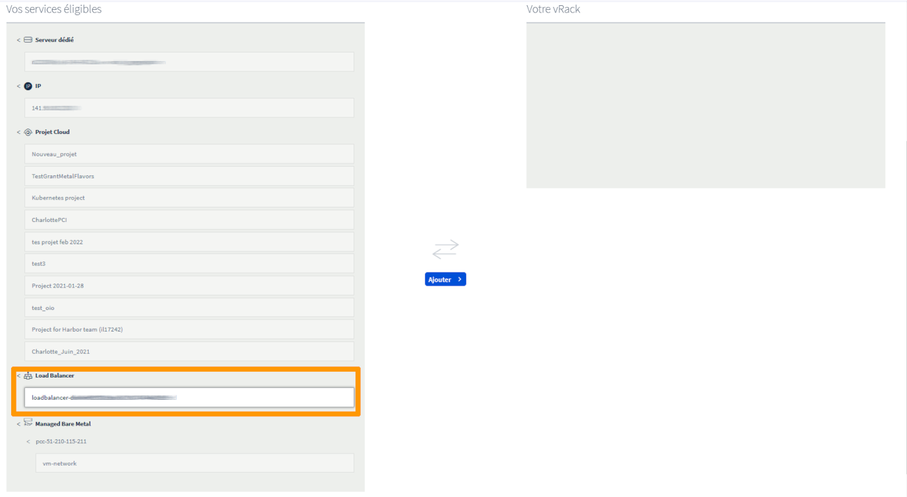

**Dernière mise à jour le 07/02/2022**

## Objectif

Ce guide a pour but de vous aider à lier et à configurer votre Load Balancer dans le vRack via l'APIv6 OVHcloud.

Le vRack est un réseau privé dédié qui crée un lien entre tous vos produits cloud. Pour plus d'informations n'hésitez pas à consulter la page sur le [vRack](https://www.ovh.com/fr/solutions/vrack/)

Avant de vous lancer, si vous ne l’avez pas encore lue, nous vous conseillons de consulter la présentation générale du service [Load Balancer](https://docs.OVHcloud.com/fr/load-balancer/iplb-presentation/).

## Prérequis

- Posséder une offre [OVHcloud Load balancer](https://www.ovh.com/fr/solutions/load-balancer/) dans votre compte OVHcloud.
- Être connecté à votre [espace client OVHcloud](https://www.ovh.com/auth/?action=gotomanager&from=https://www.ovh.com/fr/&ovhSubsidiary=fr).
- Être connecté à votreà l'[API OVH](https://api.ovh.com/){.external}.
- Posséder une ferme configurée
- Posséder un Frontend configuré

> [!warning]
>
> Attention, une fois liées à votre vRack, les fermes de votre Load Balancer seront dans l'incapacité de communiquer avec vos serveurs via leurs adresses IP publiques. Vous serez alors obligé d'utiliser leur adresse IP privée à l'intérieur du vRack.***
>
### Depuis l'API OVHcloud 
#### Lister les services Load Balancer éligibles au vRack

Vous pouvez consulter la liste de vos services Load Balancer pouvant être connectés à un vRack.

Le `serviceName` dans l'API ci-dessous est celui de votre vRack, ex : `pn-1234`.

> [!api]
>
> @api {GET} /vrack/{serviceName}/allowedServices
>

Vous trouverez vos services Load Balancer à l'index : `ipLoadbalancing`.

Vous pouvez aussi voir l'éligibilité d'un service Load Balancer particulier grâce à l'attribut `vrackEligibility` de la réponse à l'appel :

> [!api]
>
> @api {GET} /ipLoadbalancing/{serviceName}
>
>

#### Lier un service Load Balancer à un vRack

Pour attacher votre service Load Balancer à votre vRack, voici l'API concernée:

> [!api]
>
> @api {POST} /vrack/{serviceName}/ipLoadbalancing
>

Comme précédemment le `serviceName` ici est celui de votre vRack, ex: `pn-1234`.

#### Configurer un réseau vRack

Pour fonctionner, votre Load Balancer a besoin de connaître la topologie réseau que vous utilisez au sein de votre vRack et avoir une plage d'adresses IP lui étant spécifiquement dédiée au sein de ce réseau. Cette plage d'adresses IP sera utilisée pour contacter vos serveurs dans votre vRack. Aucune autre adresse IP ne sera utilisée pour communiquer avec vos serveurs.

> [!api]
>
> @api {POST} /ipLoadbalancing/{serviceName}/vrack/network
>

Exemple de configuration :

-  serviceName : loadbalancer-1234...
-  subnet : 192.168.0.0/16
- natIp : 192.168.100.0/24
- vlan : 42

La plage natIp doit bien entendu être contenue dans votre subnet.

Une fois votre réseau créé, vous aurez besoin de récupérer son `vrackNetworkId` pour la configuration de vos fermes.

Pour connaître la taille minimale de la plage à attribuer à natIp, un call API est à votre disposition.

> [!api]
>
> @api {GET} /ipLoadbalancing/{serviceName}/vrack/networkCreationRules
>

#### Configurer une ferme liée à un vRack

Vous pouvez maintenant créer votre ferme de serveurs dans le vRack. Pour ce faire, configurez normalement votre ferme TCP ou HTTP et renseignez simplement le `vrackNetworkId` que vous avez précédemment obtenu dans le champ du même nom.

> [!api]
>
> @api {POST} /ipLoadbalancing/{serviceName}/http/farm
>

> [!api]
>
> @api {POST} /ipLoadbalancing/{serviceName}/tcp/farm
>

#### Suite de la configuration

Vous pouvez maintenant utiliser les call API habituels ou même l'espace client pour continuer la configuration du Load Balancer.

Pour rappel, un guide de configuration du Load Balancer est disponible: [https://docs.ovh.com/fr/load-balancer/configure-iplb](https://docs.ovh.com/fr/load-balancer/configure-iplb/).
 
#### Depuis l'espace client OVHcloud

#### Lister les services Load Balancer éligibles au vRack

Vous pouvez consulter la liste de vos services Load Balancer pouvant être connectés à un vRack depuis l'[espace client OVHcloud](https://www.ovh.com/auth/?action=gotomanager&from=https://www.ovh.com/fr/&ovhSubsidiary=fr){.external} dans la partie `Bare Metal Cloud`{.action}, puis `Network`{.action}.

Sélectionnez votre vRack puis, 
{.thumbnail}

## Aller plus loin

Échangez avec notre communauté d'utilisateurs sur <https://community.ovh.com>.
