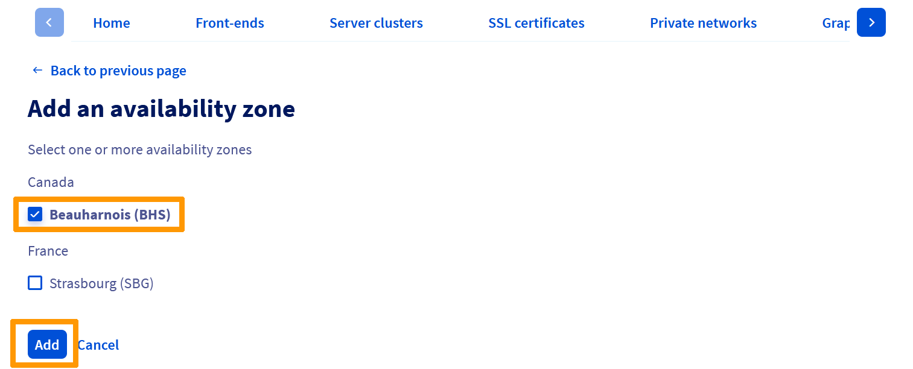
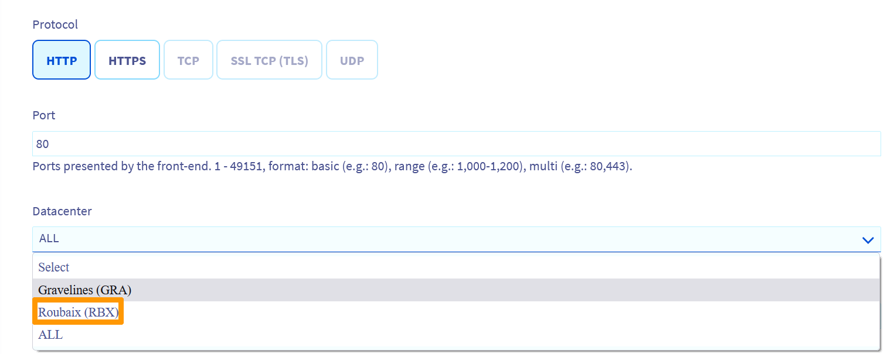

**Dernière mise à jour le 20/01/2021**

## Objectif

Le service OVHCloud Load Balancer est localisé dans une ou plusieurs zone(s) de disponibilité,
définie(s) lors de la souscription au service.

Vous avez la possibilité de commander des zones supplémentaires pour votre service.
Vous augmentez ainsi la disponibilité de votre service Load Balancer en cas d'indisponibilité d'une zone.

Il est également possible, si configuré de façon appropriée, d'utiliser plusieurs zones afin de minimiser la latence pour vos visiteurs.

## Prérequis

- Posséder une offre [OVHcloud Load balancer](https://www.ovh.com/fr/solutions/load-balancer/) dans votre compte OVHcloud.
- Être connecté à votre [espace client OVHcloud](https://www.ovh.com/auth/?action=gotomanager&from=https://www.ovh.com/fr/&ovhSubsidiary=fr)

## En pratique

Dans la suite de ce document, nous allons voir 2 cas d’usages distincts.

### Depuis le manager

####  Commander une zone supplémentaire 

Il est possible de commande une zone supplémentaire depuis l'[espace client](https://www.ovh.com/auth/?action=gotomanager&from=https://www.ovh.com/fr/&ovhSubsidiary=fr){.external} dans la partie `Bare Metal Cloud`{.action}, section `Load Balancer`{.action}.

{.thumbnail}

Sélectionnez votre Load Balancer, dans `Accueil`{.action} puis dans la partie `Configuration`{.action}, cliquez sur `Ajouter`{.action}

{.thumbnail}

 Vous aurez alors accès à la fénétre suivante pour choisir le(s) zonne(s) que souhaitez commander.
 
 {.thumbnail}

####  ajouter une zone

Une fois que votre Zone commander vous pouvez l'jouter depuis l'[espace client](https://www.ovh.com/auth/?action=gotomanager&from=https://www.ovh.com/fr/&ovhSubsidiary=fr){.external} dans la partie `Bare Metal Cloud`{.action}, section `Load Balancer`{.action}.

Après avoir sélectionné le Load Balancer que vous souhaitez modifier,
créez un nouveau Frontend, ou éditez en un existants.

Dans `Datacenter`{.action}, vous pourrez choisir la zone que vous souhaitez associer à votre Frontend.

{.thumbnail}

Une fois le frontend configuré, cliquez sur `Ajouter`{.action} ou `Modifier`{.action} selon que vous configuriez un nouveau frontend, ou un frontend existant.
N'oubliez pas de déployer la configuration.
Pour ce faire, dans le bandeau de rappel du Manager vous précisant que la configuration n'est pas appliquée,
cliquez sur `Appliquer la configuration`{.action}.

{.thumbnail}

#### Utiliser plusieurs zones

##### Pour la haute disponibilité

Si vous voulez utiliser plusieurs zones afin d'obtenir une haute disponibilité, vous pouvez utiliser la zone spéciale `all` lorsque vous déclarez un `frontend` et une `farm`.

{.thumbnail}

Cette zone spéciale `all` va permettre de déployer la même configuration sur toutes les zones souscrites sur votre service Load Balancer, et vous évite de dupliquer la configuration pour toutes les zones.

##### Pour réduire la latence

Si le but est de réduire la latence, on peut imaginer diriger les requêtes venant depuis le load balancer de la zone1 vers des serveurs backends proches géographiquement de cette zone1, et similairement, diriger les requêtes venant depuis le load balancer de la zone2 vers des serveurs backends proches de la zone2.

Pour réaliser cela, il faut spécifier un frontend dans chaque zone qui utilise une farm dans la même zone.
Cela va nous permettre de déclarer les serveurs backends dans des farms différentes par zone et de controler les serveurs backends utilisés en fonction de la zone.

{.thumbnail}

Par example, si on a des serveurs backends dans les datacentres de Gravelines (gra) et Beauharnois (bhs),
on peut commander un service Load Balancer dans les zones `gra` et `bhs` et configurer :

- un frontend dans la zone gra avec comme ferme (farm) par défaut dans la zone gra qui contient des serveurs dans le datacentre de Gravelines
- un frontend dans la zone bhs avec comme ferme (farm) par défaut dans la zone bhs qui contient des serveurs dans le datacentre de Beauharnois

### Depuis l'API

Pour commander une zone via l'API, vous devez tout d'abord créer un panier ("cart")

> [!api]
>
> @api {POST} /order/cart
>

Veuillez noter le numéro du panier ("cart"), il vous sera utile pour la suite.

Puis vous l'assigner via

> [!api]
>
> @api {POST} /order/cart/{cartId}/assign
>

Vous pouvez lister les options disponibles sur votre service Load Balancer via

> [!api]
>
> @api {GET} /order/cartServiceOption/ipLoadbalancing/{serviceName}
>

Quand vous avez trouvé l'option correspondant à la zone souhaitée, vous pouvez l'ajouter à votre panier ("cart") via

> [!api]
>
> @api {POST} /order/cartServiceOption/ipLoadbalancing/{serviceName}
>

Enfin, vous pouvez valider votre panier ("cart") via

> [!api]
> @api {POST} /order/cart/{cartId}/checkout
>

N'oubliez pas de payer le bon de commande ainsi généré.

## Aller plus loin

Échangez avec notre communauté d'utilisateurs sur <https://community.ovh.com>.

