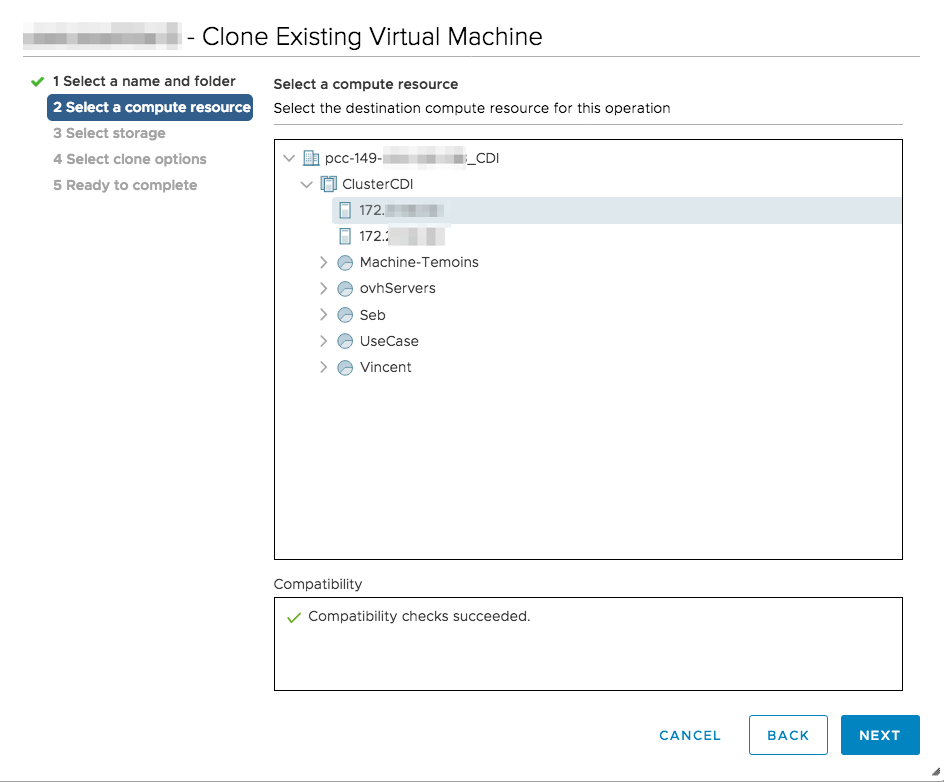

**Ostatnia aktualizacja z dnia 18-11-2020**

## Wprowadzenie

Klonowanie wirtualnej maszyny umożliwia utworzenie kopii maszyny źródłowej.

**Ten przewodnik wyjaśnia, jak przeprowadzić tę operację**

## Wymagania początkowe

- Posiadanie usługi [Managed Bare Metal](https://www.ovhcloud.com/pl/managed-bare-metal/){.external}.
- Posiadanie co najmniej jednej wirtualnej maszyny w klastrze.
- Dostęp do [interfejsu vSphere](../polaczenie-interfejs-vsphere/)

## W praktyce

### Klonowanie wirtualnej maszyny

Przejdź do [interfejsu vSphere](../polaczenie-interfejs-vsphere/), a następnie do widoku `Hosty i klastry`.

Kliknij prawym przyciskiem myszy wirtualną maszynę, którą chcesz sklonować, a następnie kliknij `Klonuj`{.action} i `Klonuj wirtualną maszynę...`{.action}. 

{.thumbnail}

Nadaj nazwę nowej wirtualnej maszynie i określ jej lokalizację w strukturze drzewa.

{.thumbnail}

### Wybór zasobu

Określ klaster, host, vApp lub pulę zasobów wirtualnej maszyny.

{.thumbnail}

### Wybór przestrzeni dyskowej

Określ lokalizację przestrzeni dyskowej dla tej wirtualnej maszyny. 

Format dysku wirtualnego w tym przypadku to "Thin Provision", co oznacza, że wirtualny dysk zostanie utworzony, ale będzie wykorzystywał tylko rzeczywistą przestrzeń dyskową, niezależnie od przestrzeni dyskowej wcześniej wykorzystywanej na źródłowej wirtualnej maszynie.

Więcej informacji o rodzajach formatów dysków znajdziesz w [tym przewodniku](../jaki-format-dysku-wybrac/).

Za pomocą linii `VM Storage Policy` będziesz mógł wybrać domyślną politykę przechowywania danych w przypadku datastore lub opcji [VM encryption](../szyfrowanie-vm/).

{.thumbnail}

### Konfiguracja systemu

W tym kroku zdefiniuj konfigurację sieci, która zostanie zastosowana do wirtualnej maszyny. Masz dwie opcje do wyboru:

- Jeśli nic nie zaznaczysz, nie nastąpią żadne zmiany w konfiguracji sieciowej nowej wirtualnej maszyny w porównaniu do źródła;

- `Dostosuj sprzęt wirtualnej maszyny`{.action}\: opcja ta umożliwia określenie nowych konfiguracji, które zostaną zaimplementowane na nowej wirtualnej maszynie.

{.thumbnail}

> [!warning]
>
> Jeśli nie przeprowadziłeś dostosowania wirtualnej maszyny, konieczne jest zmodyfikowanie konfiguracji klonu przed jej uruchomieniem, aby uniknąć konfliktu IP / MAC. 
>
>W tym przypadku należy usunąć zaznaczenie przy karcie sieciowej w ustawieniach wirtualnej maszyny po jej sklonowaniu, tuż przed jej uruchomieniem.
>
>{.thumbnail}
>

## Sprawdź również

Dołącz do społeczności naszych użytkowników na stronie <https://community.ovh.com/en/>.
