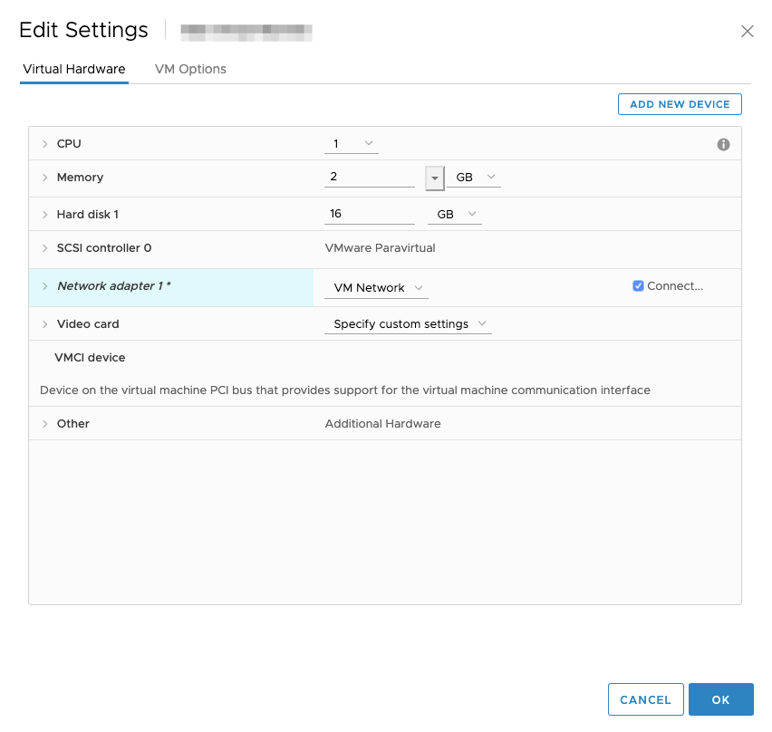

**Última atualização: 18/11/2020**

## Objetivo

Uma vez a máquina criada, os seus recursos não são fixos e, com algumas restrições, podem ser modificados para aumentar a agilidade da sua infraestrutura.

**Este manual explica-lhe como fazer evoluir a sua máquina virtual.**

## Requisitos

- Ter criado uma máquina virtual.
- Ter acesso ao client vSphere HTML.

## Instruções

Todas as modificações abaixo descritas devem ser realizadas a partir do seu Managed Bare Metal em vSphere, clicando com o botão direito do rato numa máquina virtual e na opção `Modificar os parâmetros`{.action}.

{.thumbnail}

Neste menu, tem a possibilidade de aumentar os recursos da sua máquina virtual. 

{.thumbnail}

Na parte superior desta imagem, poderá ver que tem a possibilidade de adicionar periféricos, opção esta que iremos abordar mais à frente.

### O processador (CPU)

O número de CPU será limitado às slots disponíveis no host.

Se a sua máquina virtual for migrada para um host com um número de processadores inferior àquele alocado à sua máquina, será ativado o estado `CPU ready` que provocará uma redução do desempenho.

{.thumbnail}

Também tem a possibilidade de reservar uma determinada frequência (mínimo e máximo) e escolher o número de cores por socket.

Se selecionar a opção `Enable CPU Hot add`{.action}, poderá modificar esses valores quando a máquina virtual for iniciada.

Dependendo do sistema operativo utilizado, a adição a quente pode não funcionar e provocar uma avaria do host.

À máquina virtual pode ser alocado um mínimo de *MHz* (MegaHertz):

o limite, ilimitado por predefinição, permite restringir o processador da VM para um valor em *MHz*. Poderá, por exemplo, limitar uma máquina virtual de desenvolvimento.

### A memória RAM

Como para a CPU, a memória (RAM) é limitada aos recursos do host.

Também pode alocar a memória para que a máquina virtual tenha sempre um mínimo de RAM reservada.

{.thumbnail}

### O disco rígido

No que diz respeito ao disco rígido, pode aumentar o seu tamanho em função do espaço restante no datastore que a máquina virtual utiliza.

{.thumbnail}

Recomenda-se que utilize controladores de discos SCSI em vez de IDE. O backup através de Veeam não é possível com controladores IDE, por exemplo.

Também é possível selecionar o modo do disco:

- `Dependent`: inclui o disco durante a snapshot;

- `Independent - persistent`: permite a conservação dos dados aquando do reboot de uma máquina, mas não é considerado numa snapshot;

- `Independent - non-persistent`: tem a particularidade de não conservar os dados. Se efetuar um reboot da máquina, todos os dados serão suprimidos.

### Placa de rede

É possível modificar a placa de rede da sua máquina virtual, a ligação da placa no arranque da máquina virtual, modificar o tipo de placa, verificar a porta ID e o seu endereço MAC.

{.thumbnail}

Esta interface é interessante em caso de avaria da rede. Pode assegurar que a *porta ID* corresponde à porta indicada no separador `Networking`{.action} e `Ports`{.action} na placa em questão.

### Leitor CD/DVD

O leitor CD/DVD permite, por exemplo, a montagem de imagens ISO na sua máquina virtual.

{.thumbnail}

Recomenda-se que elimine o leitor CD/DVD após a sua utilização, pois este poderá impedir que a máquina virtual seja movida.

### Adição de periférico

No canto superior direito da janela, é possível adicionar periféricos adicionais.

Pode adicionar discos provenientes de outro datastore ou placas de rede, se a sua atividade requerer a utilização de várias redes privadas.

{.thumbnail}

## Quer saber mais?

Fale com a nossa comunidade de utilizadores em <https://community.ovh.com/en/>.
