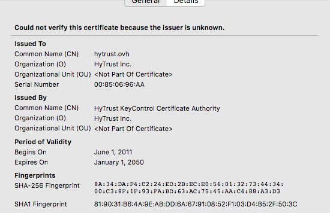
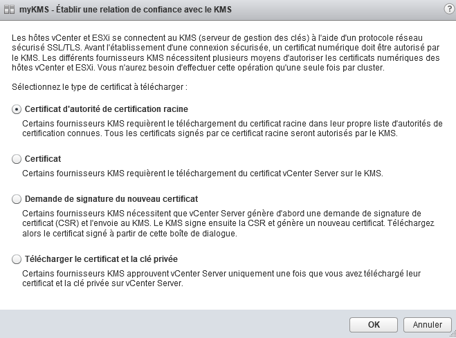

**Ultimo aggiornamento: 18/11/2020**

## Obiettivo

Per abilitare la funzionalità di crittografia delle macchine virtuali sul servizio Managed Bare Metal di OVHcloud è possibile adottare una strategia di storage che utilizzi un *Key Management Server* (KMS) esterno.

**Questa guida ti mostra come attivare la  crittografia delle macchine virtuali con VM Encryption.**

## Prerequisiti

- Disporre di una soluzione [Managed Bare Metal](https://www.ovh.com/it/private-cloud/){.external}
- Disporre di un KMS esterno compatibile con **[KMIP](https://en.wikipedia.org/wiki/Key_Management_Interoperability_Protocol_(KMIP)){.external} 1.1** e presente nella [matrice di compatibilità](https://www.vmware.com/resources/compatibility/search.php?deviceCategory=kms&details=1&feature=293&page=1&display_interval=500&sortColumn=Partner&sortOrder=Asc){.external} VMware
- Avere accesso all’interfaccia di gestione vSphere
- Disporre di macchine virtuali con almeno una versione hardware 13

## Procedura

### Recupera il thumbprint del certificato dal Key Management Server (KMS)

In base al KMS utilizzato, è possibile accedere al server tramite browser cliccando su `View Certificate`{.action} > `Thumbprint`{.action}.

{.thumbnail}

{.thumbnail}

Estrai il valore della riga `SHA1 Fingerprint`.

Ecco un altro metodo con OpenSSL:

```shell
openssl s_client -connect 192.0.2.1:5696 < /dev/null 2>/dev/null | openssl x509 -fingerprint -noout -in /dev/stdin
```

In questo caso, è il valore a destra del simbolo uguale:


```shell
> SHA1 Fingerprint=7B:D9:46:BE:0C:1E:B0:27:CE:33:B5:2E:22:0F:00:84:F9:18:C6:61
```

### Registra il KMS

#### Dallo Spazio Cliente

Accedi allo Spazio Cliente e, nella sezione `Bare Metal Cloud`, clicca su `Managed Bare Metal`{.action} nella colonna a sinistra e seleziona il servizio in questione.

Nella pagina principale, clicca sulla scheda `Sicurezza`{.action}.

{.thumbnail}

Nella parte inferiore della pagina è disponibile la sezione **Virtual Machine Encryption Key Management Servers**. Clicca sul pulsante `Aggiungi un nuovo server KMS`{.action}.

{.thumbnail}

Nella nuova finestra, inserisci le informazioni richieste:

* indirizzo IP del KMS
* SSL Thumbprint del KMS precedentemente recuperato
* seleziona la casella in cui dichiari di aver preso visione e compreso la documentazione e le azioni da effettuare. Clicca su `Continua`{.action} per confermare l’operazione. 

{.thumbnail}

Una barra di progressione mostrerà lo stato di avanzamento del processo.

#### Con l’API OVHcloud

Le funzionalità di crittografia possono essere attivate anche tramite l’API OVHcloud.

Per recuperare il “serviceName” utilizza questa chiamata API:

> [!api]
>
> @api {GET} /dedicatedCloud
>

Per verificare che la cifratura non sia ancora attiva, esegui questa chiamata API:

> [!api]
>
> @api {GET} /dedicatedCloud/{serviceName}/vmEncryption
>

```shell
>     "state": "disabled"
```


A questo punto registra il KMS:

> [!api]
>
> @api {POST} /dedicatedCloud/{serviceName}/kms
>

Per effettuare questa operazione, assicurati di avere a disposizione le seguenti informazioni:

* “serviceName” precedentemente recuperato
* indirizzo IP del KMS
* SSL Thumbprint del KMS precedentemente recuperato

### Aggiungi il KMS sul vCenter

#### A proposito di questa sezione

**Il vCenter Server crea un cluster KMS al momento dell’aggiunta della prima istanza KMS.** 

- Quando aggiungi il KMS, viene suggerito di impostare questo cluster come predefinito. È comunque possibile modificarlo successivamente
- Una volta che il vCenter ha creato il primo cluster, è possibile aggiungervi nuove istanze dello stesso fornitore 
- Per configurare il cluster è sufficiente disporre di un’istanza KMS
- Se l’ambiente utilizzato gestisce le soluzioni KMS di diversi fornitori, è possibile aggiungere più cluster KMS
- Se l’ambiente utilizzato include più cluster KMS e il cluster predefinito viene cancellato, è necessario definirne un altro. Consulta la sezione “Definire un cluster KMS predefinito”

#### Procedura

Per prima cosa accedi al Managed Bare Metal con il client Web vSphere, esplora la lista dell’inventario e seleziona il vCenter in questione. Clicca su “Manage” > “Key Management Servers”. Clicca su `Add KMS`{.action}, inserisci le informazioni nella configurazione guidata e clicca su `OK`{.action}.
Clicca su `Trust`{.action} per convalidare il certificato.

{.thumbnail}

Scegli le seguenti opzioni:

|Nome|Descrizione|
|---|---|
|KMS cluster|Seleziona “Create new cluster” per ottenerne uno nuovo. Se esiste già un cluster, è possibile selezionarlo.|
|Cluster name|Nome del cluster KMS. Questa informazione potrebbe essere necessaria per connettersi al KMS in caso di irraggiungibilità del cluster. È molto importante che il nome del cluster sia univoco e rappresentativo di questo elemento.|
|Server alias|Alias per il KMS. Questa informazione potrebbe essere necessaria per connettersi al KMS in caso di irraggiungibilità del cluster.|
|Server address|Indirizzo IP o FQDN del KMS.|
|Server port|Porta su cui il server vCenter si connette al KMS. La porta KMIP standard è la 5696, ma può variare se il KMS di un altro fornitore è configurato su una porta specifica.|
|Proxy address|Lascia vuoto questo campo.|
|Proxy port|Lascia vuoto questo campo.|
|User name|Alcuni fornitori di KMS permettono agli utenti di isolare le chiavi di crittografia usate dai diversi utilizzatori o gruppi, definendo un nome utente e una password. Inserisci questa informazione esclusivamente se il KMS supporta questa funzionalità e intendi utilizzarla.|
|Password|Alcuni fornitori di KMS permettono agli utenti di isolare le chiavi di crittografia usate dai diversi utilizzatori o gruppi, definendo un nome utente e una password. Inserisci questa informazione esclusivamente se il KMS supporta questa funzionalità e intendi utilizzarla.|


#### Importazione del certificato KMS

La maggior parte dei fornitori di KMS hanno bisogno di un certificato per [stabilire una connessione sicura](https://docs.vmware.com/en/VMware-vSphere/6.5/com.vmware.vsphere.security.doc/GUID-0212CEF2-7871-4E00-ADF2-0C71401D5E1A.html){.external} con il vCenter.

Accedi al vCenter in cui hai aggiunto il KMS e selezionalo. Nella sezione “All options”, clicca su “Establish a trust relationship with KMS”.

> [!warning]
>
> Assicurati che il certificato non sia criptato con una password quando effettui il download dal KMS. Ad esempio, durante la registrazione di un utente, creane uno senza password e scarica il certificato per il KMS.
> 

{.thumbnail}

#### Verifica la configurazione del KMS

In **Connection Status**, verifica che lo stato del KMS risulti in modalità “Normal”.

{.thumbnail}

#### Modifica la politica dello storage di VM Encryption Storage

Crea una macchina virtuale. Una volta completata l’operazione, clicca con il tasto destro sulla VM e seleziona `VM Policies`{.action} > `Edit VM Storage Policies`{.action}.

{.thumbnail}

Seleziona i file della macchina virtuale e dei dischi da cifrare.

{.thumbnail}

Assicurati che le operazioni vengano eseguite senza errori.

> [!primary]
>
> Se il KMS non è configurato correttamente e si verificano malfunzionamenti con lo scambio di chiavi tra vCenter e KMS, l’operazione restituirà un errore di tipo “RuntimeFault” con il messaggio “Cannot generate key”.
>

#### vMotion cifrato

Relativamente a vMotion, la cifratura funziona al livello della macchina virtuale. Per la sincronizzazione vengono utilizzate chiavi di crittografia da 256 bit.

La cifratura del traffico vMotion funziona al livello del kernel della macchina virtuale con l’algoritmo AES-GCM (Advanced Encryption Standard-Galois Counter Mode) largamente utilizzato.

Modifica la macchina virtuale e clicca su `VM Options`{.action}.

A questo punto è necessario selezionare le opzioni nel caso in cui vMotion debba essere cifrato. Per questa operazione esistono tre politiche:

|Stato|Descrizione|
|---|---|
|Disabled|Off|
|Opportunistic|Cifratura solo se supportata dall’host sorgente e l’host ESXi di destinazione. In caso contrario vMotion non verrà cifrato|
|Required|Verrà utilizzata la crittografia|

{.thumbnail}

Il trasferimento di macchine tra gli host avviene tramite lo scambio di chiavi univoche generate e fornite dal server vCenter invece che dal KMS.

#### Verifica della configurazione

{.thumbnail}

{.thumbnail}

{.thumbnail}

## Per saperne di più

Contatta la nostra Community di utenti all’indirizzo <https://community.ovh.com/en/>.

