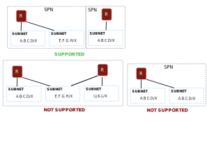

**Last updated 27th September, 2022**

## Objective

Discover the details on how to implement subnets with SPN.

## Instructions

### Subnet

A subnet is the smallest network object. It defines a layer-2/ethernet segment with an IPv4 prefix. It's not extendable to other SecNumCloud zones or with vRack.

SecNumCloud products are attached to subnets : they will share the same ethernet segment and the same IPv4 prefix.

The IPv4 prefix matches the following rules:

* minimum size: /28
* maximum size: /24
* the 3 first IP are reserved for OVHcloud: the first one for VIP, the two others for OVHcloud routers
* no vlan tag

A subnet can also be configured for a static route using the optional `next-hop` field: `next-hop` is the IP address of the next-hop to reach the subnet (i.e the next-hop is acting as a router, like a firewall). 
Next-hop must be part of another subnet.  
Subnet for static routing are limited in size (i.e not limited to /24).

### SPN - SecurePrivateNetwork

SPN is the container for subnets acting like a (unique) routing instance.

Attaching subnets to SPN depends on two rules:

* an SPN can be attached to several subnets
* a subnet can be attached to only one SPN

{.thumbnail}

**Behavior using next-hop feature:**

{.thumbnail}

#### BGP configuration

BGP is required on VPN-SPN and optional in a SPN. Enabling BGP in a SPN disables VRRP configuration, meaning the first IP address of the subnet won't be reachable anymore.

- Configuration needs an AS. This AS must be independent from the customer BGP AS to form an eBGP relation. The recommended value is in the range 64512-65534.
- eBGP Multihop is not supported
- With several neighbors, ECMP is automatically enabled. MED and/or AS-PATH must be tuned to have path selection.
- Each SPN supports up to 4 BGP peers.
- Up to 50 prefixes can be announced per BGP session.
- For each SPN you must establish a BGP session with ‘A’ device and ‘B’ device.
- By default, BFD is activated on all BGP sessions. This protocol is higly recommended to have a faster convergence.

Expected topology:

{.thumbnail}

* SPN is configured with A.B.C.D/X subnet
* Ra and Rb devices have their own IP address, respectively 2nd and 3rd of the subnet
* Rc is customer routing device
* Rc must have an eBGP session with Ra and Rb
* Local subnet Q.R.S.T/X will be learned through BGP on devices Ra and Rb then announce to be forwarded on SPN Connector (so destinating to InterDC and/or VPN-SPN)
* Ra and Rb devices forward announces from InterDC and/or VPN-SPN

## Go further

Join our community of users on <https://community.ovh.com/en/>.
