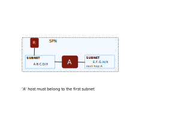

**Last updated 18th November, 2021**

## Objective

Discover the details on how to implement subnets with SPN.

## Instructions

### Subnet

A subnet is the smallest network object. It defines a layer-2/ethernet segment with an IPv4 prefix. It's not extendable to other SecNumCloud zones or with vRack.

SecNumCloud products are attached to subnets : they will share the same ethernet segment and the same IPv4 prefix.

The IPv4 prefix matches the following rules:

* minimum size: /28
* maximum size: /24
* the 3 first IP are reserved for OVHcloud: the first one for VIP, the two others for OVHcloud routers
* no vlan tag

A subnet can also be configured for a static route using the optional `next-hop` field: `next-hop` is the IP address of the next-hop to reach the subnet (i.e the next-hop is acting as a router, like a firewall). 
Next-hop must be part of another subnet.  
Subnet for static routing are limited in size (i.e not limited to /24).

### SPN - SecurePrivateNetwork

SPN is the container for subnets acting like a (unique) routing instance.

Attaching subnets to SPN depends on two rules:

* an SPN can be attached to several subnets
* a subnet can be attached to only one SPN

{.thumbnail}

**Behavior using next-hop feature:**

{.thumbnail}

## Go further

Join our community of users on <https://community.ovh.com/en/>.
