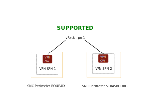
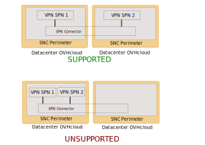

**Last updated 18th November, 2021**

## Objective

VPN-SPN defines the external connection of a SecNumCloud zone for a given tenant.

## Instructions

### Basic rules

VPN-SPN manages the external connectivity of a network tenant in a SecNumCloud zone to vRack :

{.thumbnail}

* VPN-SPN can be attached to 1 or several vRack.
* Nx VPN-SPN can be attached to Nx vRack.

{.thumbnail}

* Two VPN-SPN can be attached to the same vRack.

Through SPN Connector, VPN-SPN is accessible with SPN of the same SecNumCloud zone or any remote one using InterDC option.

{.thumbnail}

* Two VPN-SPN can not be attached on the same SPN Connector in the same area.

### IPsec configuration

#### Overview

2x tunnels are provided by default, attached to two devices on OVHcloud side. Both tunnels are active. Dynamic and static routing are supported, but dynamic is default, preferred and recommended.

SPN-VPN Gateway must be attached to vRack. Only IPsec trafic is allowed from vRack. Tunnel mode is GRE over IPsec.

Thus, the outside IPSec connectivity inherits from vRack connectivity. Supported options are:

* OVHcloud Connect L3
* Any OVHcloud product (Hosted Private Cloud, Baremetal Cloud, Public Cloud) running a VPN Endpoint.

As vRack supports jumbo frames up to 9000 bytes, the tunnel supports jumbo up to 8900 bytes.

The example below shows a VPN endpoint running in vRack with a tunnel to two SNC zones:

{.thumbnail}

#### IP configuration

Inside SecNumCloud zone, VPN-SPN must be attached to an SPN Connector with an attached SPN and subnets. All attached subnets are automatically forwarded from and to VPN-SPN.

Needed information:

* Two (2x) external IP addresses (IP + netmask) within the range subnet in vRack (managed by OVHcloud Connect or with other OVHcloud product) → tunnel source
* One (1x) remote IP → VPN endpoint
* Security configuration (PSK)
* Two (2x) subnets for tunnels (netwmask: /30)

By default, remote IP (VPN endpoint) will be statically routed through virtual router (first IP of the OVHcloud Connect subnet).

Here's an example with a configuration running OVHcloud Connect:

{.thumbnail}

#### IKE policy

Only IKEv2 is supported.

**Encryption:**

* aes-cbc-128
* aes-cbc-256
* aes-gcm-128
* aes-gcm-256

**Integrity (not needed if GCM):**

* Sha256

Sha1 is not supported

**DH Group:**

* 14: 2048
* 16: 4096
* 19: 256-bit ECDH
* 20: 384-bit ECDH
* 24: 2048-bit ECDH

**Pseudo-Random Function (PRF):**

* Same as integrity if not GCM
* SHA1 / SHA256 / SHA512

#### Routing over tunnel

Dynamic mode is the recommended setup to provide high availability with the two VPN devices.

A eBGP session is to be configured inside IPsec tunnel:

* Up to 50 prefixes can be announced from remote endpoint
* OVHcloud will announce all SPN subnets
* The first IP address of the tunnel is OVHcloud device
* The second IP address of the tunnel is customer device
* BFD is active by default

{.thumbnail}

## Go further

Join our community of users on <https://community.ovh.com/en/>.