**Last updated 10th May 2022**

## Objective

Find out how to manage virtual machines in a Nutanix cluster, and how to create and migrate a virtual machine.

> [!warning]
> OVHcloud provides services for which you are responsible, with regard to their configuration and management. It is therefore your responsibility to ensure that they work properly.
>
> This guide is designed to assist you as much as possible with common tasks. Nevertheless, we recommend contacting a specialist provider if you experience any difficulties or doubts when it comes to managing, using or setting up a service on a server.
>
> Some software requires a licence such as Microsoft products, so make sure that all installed systems and software have these licences.

## Requirements

- a Nutanix cluster in your OVHcloud account
- access to the [OVHcloud Control Panel](https://www.ovh.com/auth/?action=gotomanager&from=https://www.ovh.pt/&ovhSubsidiary=pt)
- You must be connected to Prism Central on the cluster

## Overview of Virtual Machine Management in Prism Central

The Nutanix system uses the same interfaces to manage storage and virtualisation, it can be installed with multiple hypervisors (**Hyper-V, VMware ESXi, AHV**). **AHV** comes with Nutanix without the need to purchase additional licences for the hypervisor. 

The OVHcloud solution is delivered with the **AHV hypervisor**.

**AHV** enables:

- Using virtual machines on Windows and Linux.
- Migrating virtual machines from one node to another in a cluster.
- Micro-segmentation and network security between virtual machines using **Flow** software. 

The **Move** tool makes it easy to migrate existing virtual machines in other environments (**ESXi, Hyper-V & AWS**) to Nutanix and its **AHV** hypervisor.

For more information on **AHV**, see the [Go further](#gofurther) section of this guide.

## Instructions

The following instructions show the creation of a virtual machine in Windows Server 2022 and the migration of a virtual machine.

### Creating a Virtual Machine for a Windows 2022 Operating System

Installing a virtual machine on Windows Server 2022 requires a particular setup because Microsoft does not provide the driver for the **AHV** hypervisor disk controller.

#### Creating a Windows Server 2022 VM
 
In the left-hand menu of **Prism Central**, expand `Compute & Storage`{.action} and click `VMs`{.action}

{.thumbnail}

Click the `Create VM`{.action} button.

{.thumbnail}

Type a name in `Name`{.action}, choose the options in `VM Properties`{.action} and click `Next`{.action}

{.thumbnail}

##### **Adding a system disk**

Click the `Attach Disk`{.action} button.

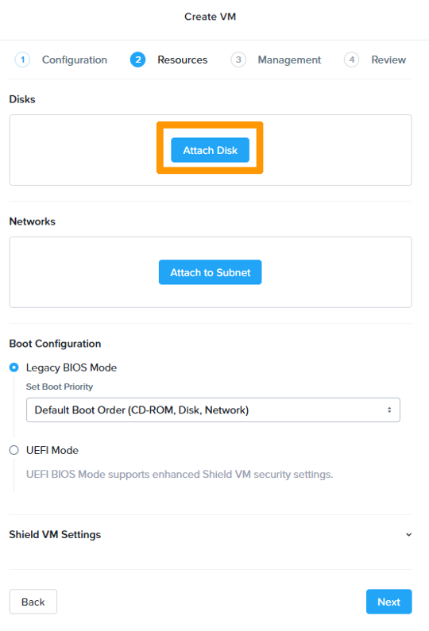{.thumbnail}

Enter **60** in the `Capacity` field and click `Save`{.action} to create a 60 GB disk.

{.thumbnail}

##### **Adding Windows Server 2022 Installation ISO Image**

The image must be imported before it can be used in a new virtual machine.

For more information on importing images, see the [Go further](#gofurther) section of this guide.

Click `Attach Disk`{.action}.

{.thumbnail}

Change the `Type`{.action} settings to **CD-ROM**, `Operation`{.action} to **Clone from Image**, `Image`{.action} to **WS2022EN.ISO**.

Click `Save`{.action}.

{.thumbnail}

##### **Adding an ISO image containing AHV-specific drivers** 

This image contains the disk controller driver and should also be imported. It is available on the Nutanix website if you have a Nutanix customer account.

Click `Attach Disk`{.action}.

{.thumbnail}

Change the `Type`{.action} settings to **CD-ROM**, `Operation`{.action} to **Clone from Image**, `Image`{.action} to **Nutanix-VirtIO-1.1.7.iso**.

Click `Save`{.action}.

{.thumbnail}

##### **Network configuration**

Click `Attach Subnet`{.action}.

{.thumbnail}

Leave the default fields and click `Save`{.action}.

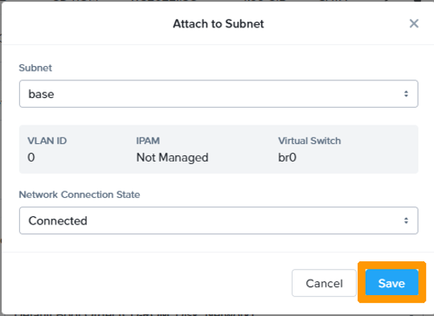{.thumbnail}

Click `Next`{.action}.

{.thumbnail}

Select your timezone and click `Next`{.action}.

{.thumbnail}

Click `Create VM`{.action}.

{.thumbnail}

The newly created virtual machine will then appear in the dashboard.

{.thumbnail}.
 
#### Windows Server 2022 setup

Select the virtual machine on which you want to install Windows Server 2022, by ticking the box to the left of the VM.

{.thumbnail}

##### **Powering on the virtual machine**

Click the `Actions`{.action} menu then `Power ON`{.action}.

{.thumbnail}

##### **Launching the console**

Click the `Actions`{.action} menu then `Launch Console`{.action}.

{.thumbnail}

##### **Starting the installation**

Choose your local settings and click `Next`{.action}.

{.thumbnail}

Click `Install now`{.action}.

{.thumbnail}

Select **Windows Server 2022 Standard (Desktop Experience)** and click `Next`{.action}.

{.thumbnail}

Review the Microsoft software licence terms and conditions, accept them and click `Next`{.action}.

{.thumbnail}

Click `Custom: Install Microsoft Server Operating System only (advanced)`{.action}.

{.thumbnail}

Click on `Load driver`{.action}.

{.thumbnail}

Click `Browse`{.action}.

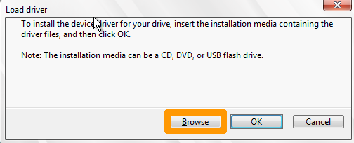{.thumbnail}

Select the correct folder `e:\Windows Server 2022\amd64` and click `OK`{.action}.

{.thumbnail}

Select these drivers:

* `Nutanix VirtIO Balloon Driver`{.action}
* `Nutanix VirtIO Ethernet Adapter`{.action}
* `Nutanix VirtIO SCSI pass-through controller`{.action}
* `QEMU FWCfg Device`{.action}

Click `Next`{.action}.

{.thumbnail}

The 60 GB disk will appear, click `Next`{.action}.

{.thumbnail}

Enter and confirm the password in both fields and click `Finish`{.action}.

{.thumbnail}

Windows Server 2022 and WS2022 specific drivers for the **AHV** hypervisor have been installed.

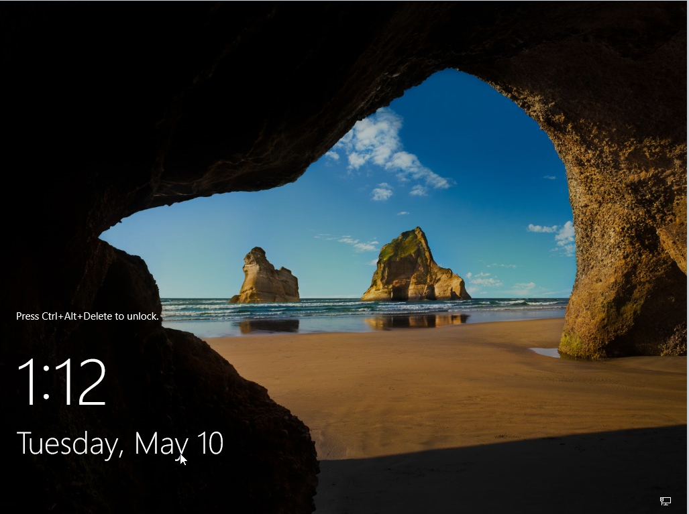{.thumbnail}

#### Installing NGT (Nutanix Guest Tools)

NGT are tools that enable better interaction with Nutanix, particularly in terms of backups and snapshots.

Start the virtual machine console, right-click a CDROM drive, and click `Eject`{.action}.

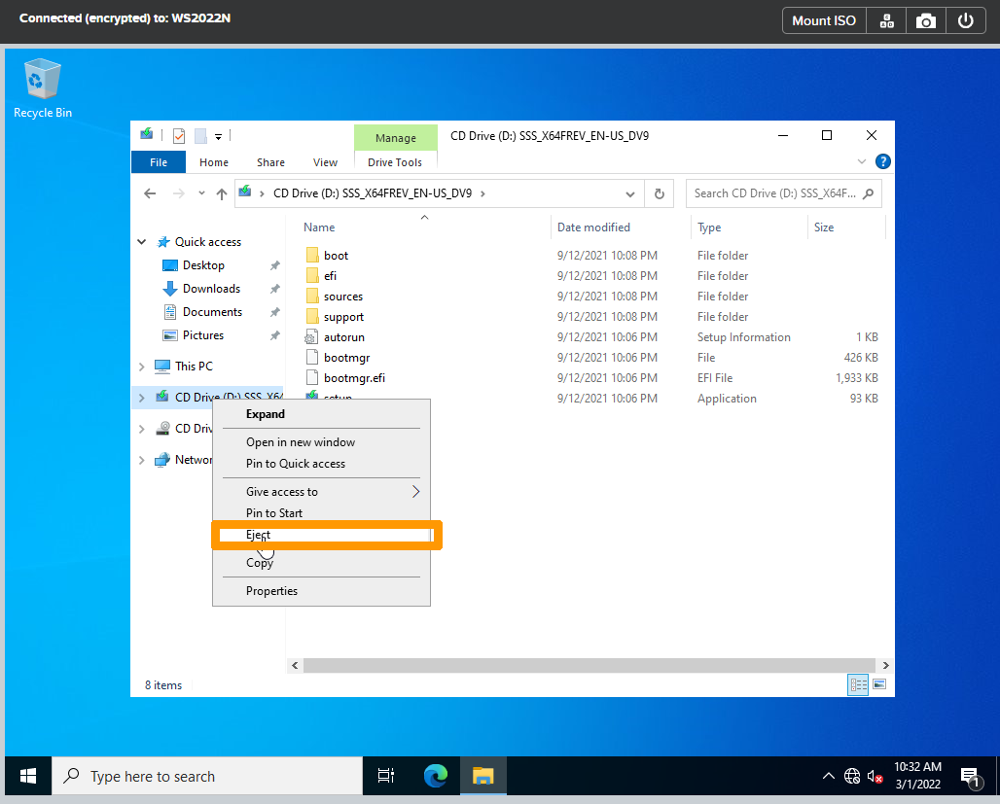{.thumbnail}

Go back to Prism Central and select the virtual machine.

{.thumbnail}

On the `Actions`{.action} menu, click `Install NGT`{.action}.

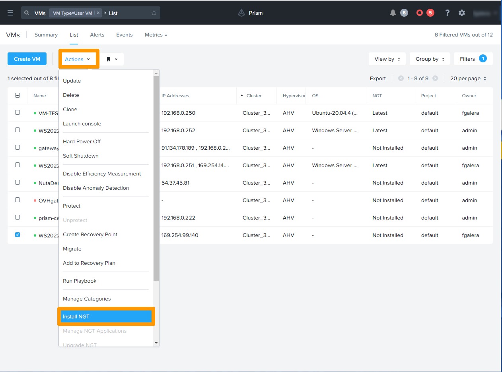{.thumbnail}

Click `Confirm & Enter Password`{.action}. 

{.thumbnail}

Click `Skip and Mount`{.action}.

{.thumbnail}

Return to the virtual machine console and right-click the CDROM drive containing the NGT.

Click `Install Nutanix Guest Tools`{.action}.

{.thumbnail}

Review the terms and conditions, accept them, then click `Install`{.action}.

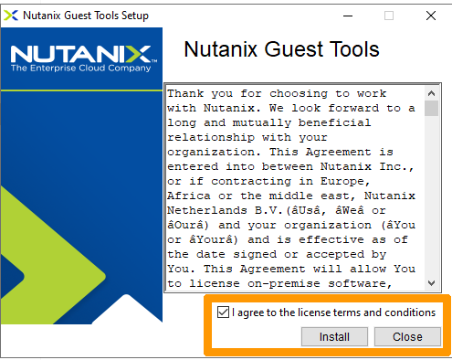{.thumbnail}

The installation will then begin.

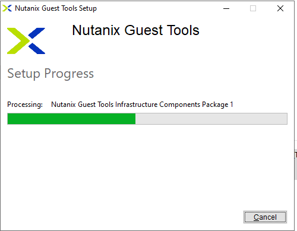{.thumbnail}

Once the installation is complete, close the installation wizard using the `Close`{.action} button.

{.thumbnail}

The installation of a virtual machine on Windows is then complete.

### Migrating a virtual machine

Migrating a virtual machine involves moving a hot VM from one node to another in a cluster. 

If you have several clusters and the appropriate licences, you can also migrate a VM from one cluster to another. 

This guide only shows you how to migrate a VM within the same cluster.

In Prism Central VM Management, click `WS2022N`{.action}.

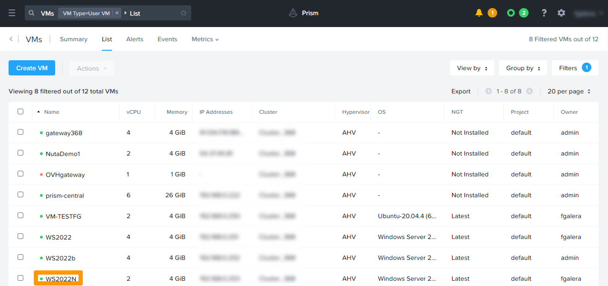{.thumbnail}

Check which node the VM is currently running on. It is displayed next to **Host**.

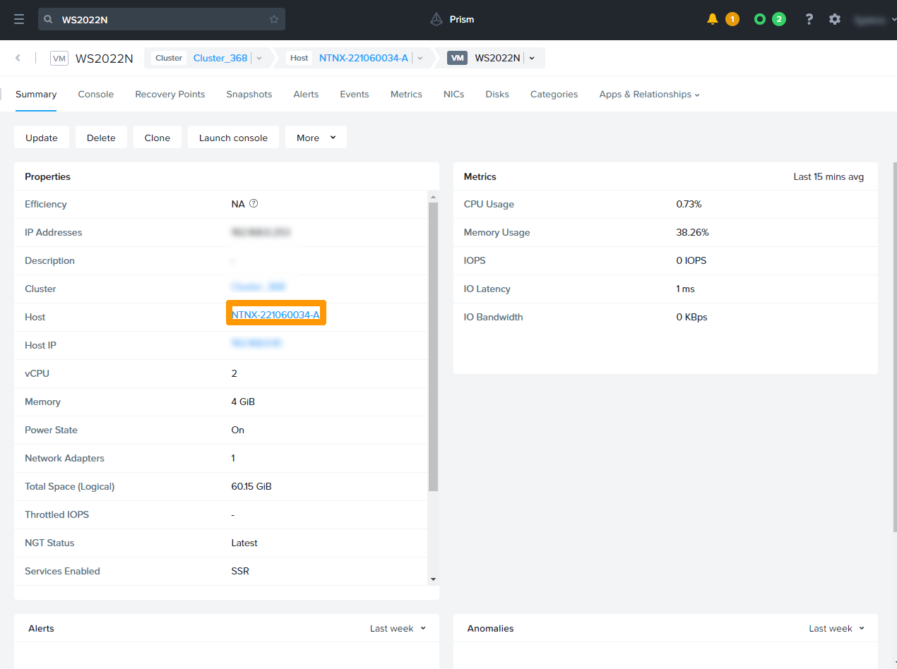{.thumbnail}

Click the `More`{.action} button, then `Migrate`{.action}.

{.thumbnail}

Choose a destination node.

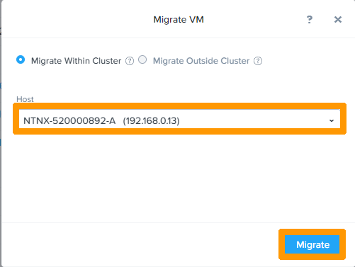{.thumbnail}

The name of the new node will appear in front of **Host** if the migration is complete.

{.thumbnail}

## Go further 

[Presentation of a Nutanix cluster](https://docs.ovh.com/pt/nutanix/nutanix-hci/)

[Importing images into Nutanix](https://docs.ovh.com/pt/nutanix/image-import/)

[Nutanix documentation on AHV](https://portal.nutanix.com/page/documents/details?targetId=AHV-Admin-Guide-v5_20:AHV-Admin-Guide-v5_20)

[Nutanix licences](https://www.nutanix.com/products/software-options)

If you need training or technical assistance to implement our solutions, contact your sales representative or click on [this link](https://www.ovhcloud.com/pt/professional-services/) to get a quote and ask our Professional Services experts for assisting you on your specific use case of your project.

Join our community of users on <https://community.ovh.com/en/>.
