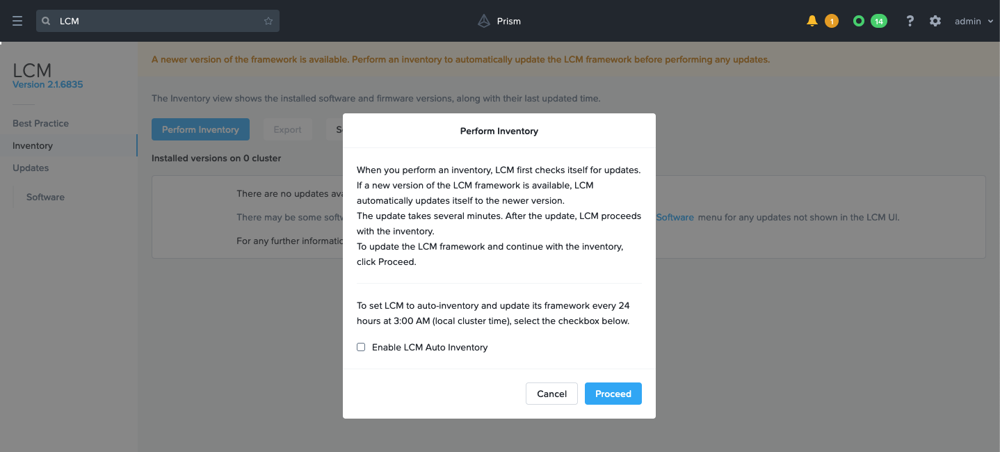
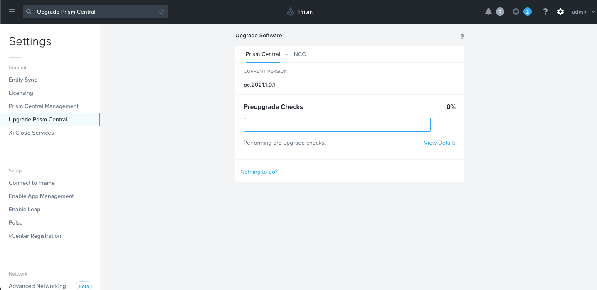
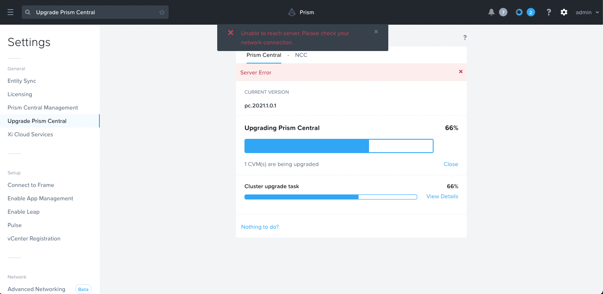
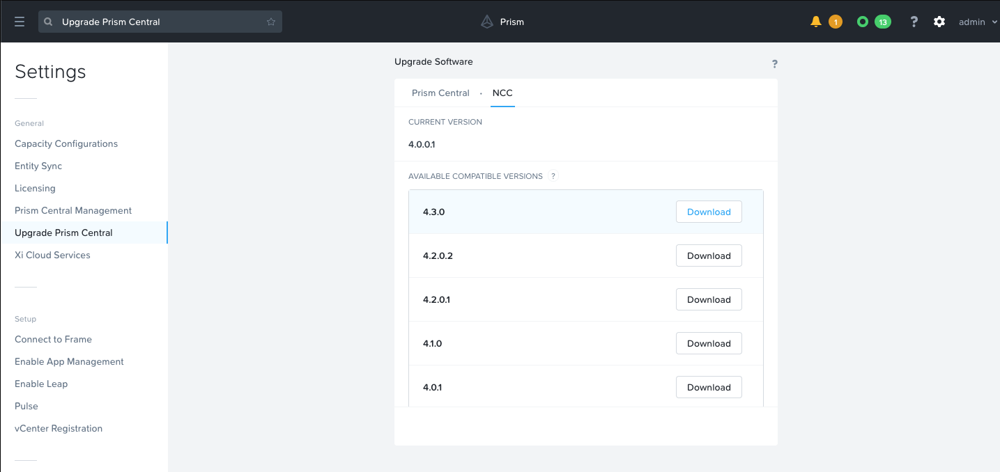
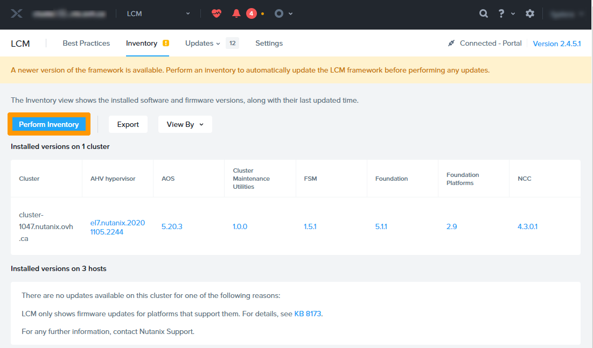
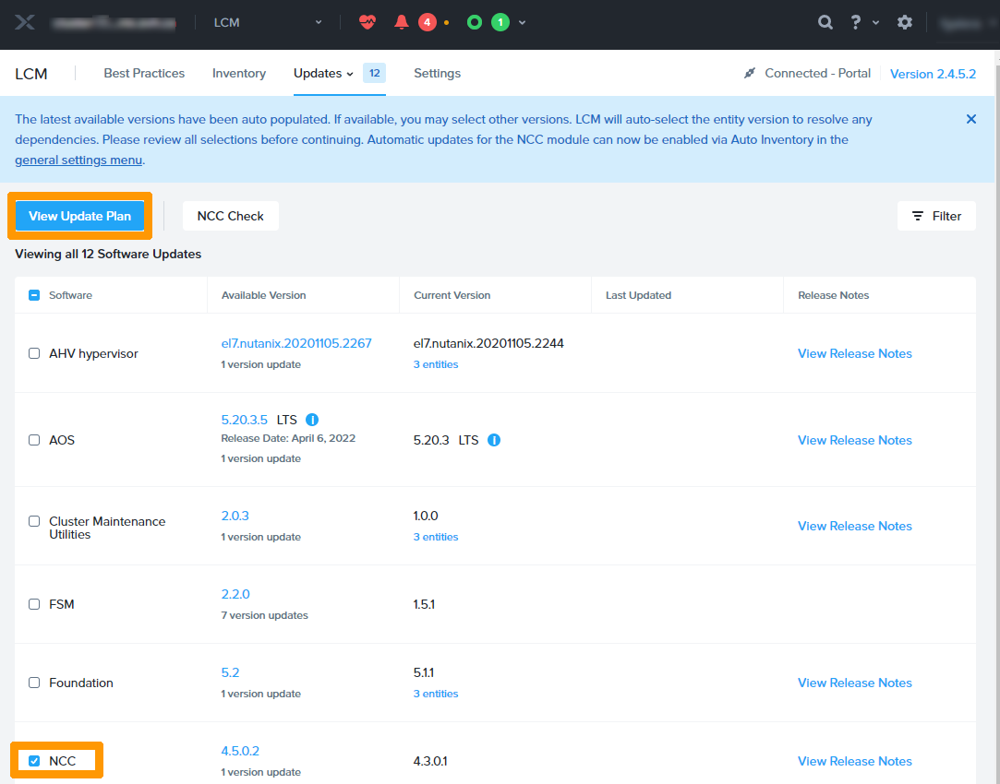
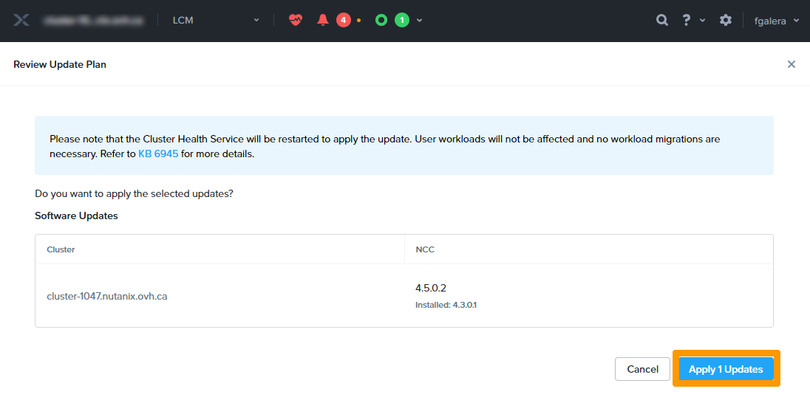
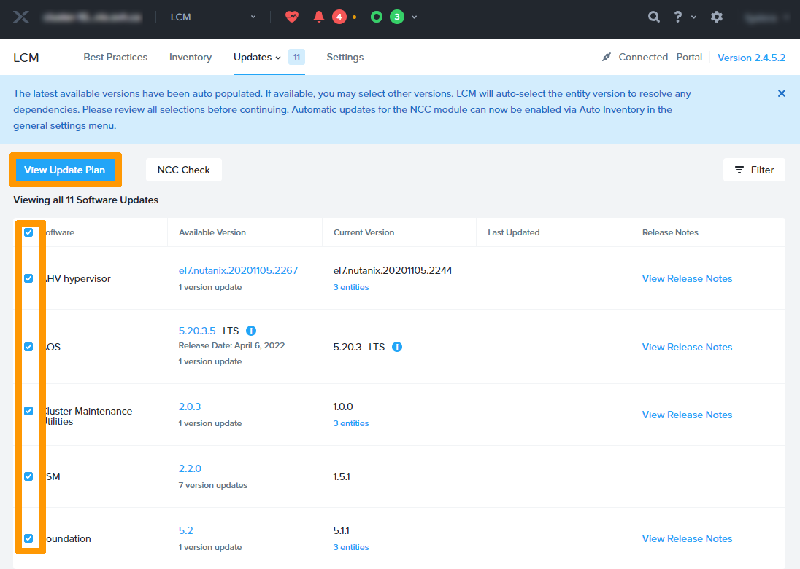
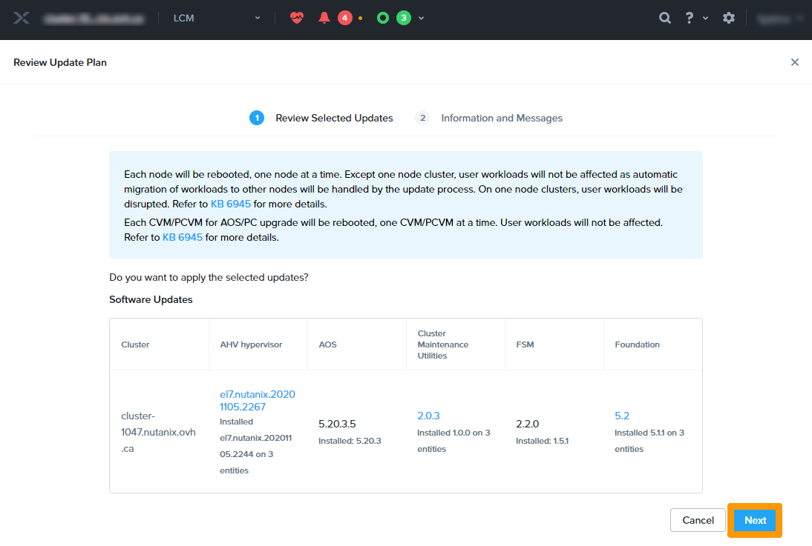

**Dernière mise à jour le 16/05/2022**

## Objectif

Une fois qu'une mise à niveau d'un composant logiciel Nutanix est nécessaire, voici toutes les étapes principales pour l'appliquer.

**Ce guide vous explique les étapes de la mise à jour de votre cluster Nutanix.**

## Prérequis

- Disposer d'un cluster Nutanix dans votre compte OVHcloud
- Être connecté à votre [espace client OVHcloud](https://ca.ovh.com/auth/?action=gotomanager&from=https://www.ovh.com/ca/fr/&ovhSubsidiary=qc)

> [!warning]
> OVHcloud vous met à disposition des services dont la configuration, la gestion et la responsabilité vous incombent. Il vous appartient donc de ce fait d’en assurer le bon fonctionnement.
>
> Ce guide a pour but de vous accompagner au mieux sur des tâches courantes. Néanmoins, nous vous recommandons de faire appel à un prestataire spécialisé si vous éprouvez des difficultés ou des doutes concernant l’administration, l’utilisation ou la mise en place d’un service sur un serveur.
>

## En pratique

### Documentation officielle des mises à jour

Vous pouvez rechercher le document suivant : "The Nutanix upgrades : Life Cycle Manager" ou visitez le site officiel de Nutanix pour les documentations archivées : [Software Documentation: Upgrade Guide](https://portal.nutanix.com/page/documents/details?targetId=Acropolis-Upgrade-Guide-v5_20:Acropolis-Upgrade-Guide-v5_20){.external}.

### Sauvegarde

Avant toute action sur la configuration du système en cluster, il est fortement recommandé de créer une nouvelle sauvegarde ou de vérifier la dernière en date.

### Eléments à mettre à jour

Une partie des mises à jour se fait à partir de **Prism Central**. Il s'agit des mises à jour de :

- **Prism Central** lui même
- **NCC** 

Une autre partie doit être exécutée à partie de **Prism Element**. Il s'agit des mises à jour de :

- **LCM**
- **AOS**
- **Foundation**
- **AHV**

> [!warning]
>
> Avant de procéder à une mise à jour, assurez-vous que les versions de **Prim Element** soient supportées par OVHcloud et que la version de **Prism Central** à mettre à jour soit compatible avec **Prism Element**
>
> Les versions supportées de **Prism Element** par OVHcloud sont les versions 5.20 LTS et 6.1 STS. Vous pouvez effectuer les mises à jour de ces sous-versions mais il est préférable d'attendre un mois après la sortie d'une nouvelle sous-version.
>
> La compatibilité de la version de **Prism Central** avec **Prism Element** peut être vérifiée sur le site [Interopérabilité NUTANIX](https://portal.nutanix.com/page/documents/compatibility-interoperability-matrix/interoperability) si vous disposez d'un compte client sur le site de Nutanix.
>

### Mise à jour Prism Central

#### Inventaire LCM 

Comme l'indique le processus officiel de mise à niveau, vous devez d'abord lancer un inventaire LCM pour avoir une vue de l'état du logiciel du cluster Nutanix.

{.thumbnail}

Procédez à l'exécution de la première ou d'une nouvelle mise à jour d'inventaire :

{.thumbnail}

Après une phase de pré-vérification, vous recevrez les résultats dès la fin de l’inventaire. Les mises à jour disponibles seront affichées :

{.thumbnail}

Sélectionnez les mises à jour souhaitées ou mettez à jour tous les composants. Vous pouvez également décider de gérer directement ces mises à jours comme expliqué dans les deux sections suivantes.

#### Exécution de la mise à jour

Une fois que vous êtes certain de pouvoir lancer la mise à jour, ouvrez les paramètres via le menu `Prism Central Settings`{.action} :

{.thumbnail}

Si des mises à jour sont disponibles, vous pouvez sélectionner celles que vous devez appliquer, puis choisir de ne faire que la pré-vérification ou d'effectuer la mise à jour immédiatement :

{.thumbnail}

Le pré-contrôle sera exécuté dans tous les cas :

{.thumbnail}

Si vous avez sélectionné le processus de mise à jour, le processus lui-même sera initialisé :

{.thumbnail}

Pendant l'exécution, vous risquez de perdre la connexion à Prism Central :

{.thumbnail}

Après quelques minutes, vous pourrez vous reconnecter à l'interface Prism Central, et ainsi vérifier ou attendre la fin du processus d'upgrade :

{.thumbnail}

#### Upgrade NCC

Si une ou plusieurs mises à jour NCC sont disponibles, vous pouvez télécharger celles dont vous avez besoin puis lancer l'upgrade :

{.thumbnail}

#### Validation

##### **Mise à jour de l'inventaire LCM**

Mettez à jour l'inventaire LCM. Si aucun upgrade n'est plus disponible, seule la liste des versions des composants logiciels installés sera présentée :

{.thumbnail}

##### **Validation de la mise à niveau de Prism Central**

Vous pouvez également vérifier que l'interface web Prism Central est à jour lorsque aucune mise à jour n'est disponible pour votre cluster. Cliquez sur le bouton `Prism Central Settings`{.action} et ouvrez `Upgrade Prism Central`{.action}. Aucune version ne devrait être disponible :

{.thumbnail}

##### **Validation d'upgrade NCC**

Vous pouvez également vérifier que le NCC du cluster Nutanix est à jour lorsque aucune mise à jour n’est disponible pour votre cluster. Cliquez sur le bouton `Prism Central Settings`{.action} et ouvrez `Upgrade Prism Central`{.action}.. Aucune version ne devrait être disponible dans l'onglet NCC :

{.thumbnail}

### Mise à jour de Prism Element

A partir du tableau de bord de **Prism Central**, dans le cadre **Cluster Quick Access**, cliquez sur votre cluster.

{.thumbnail}

Ouvrez le Menu et cliquez sur `LCM`{.action}.

{.thumbnail}

Cliquez sur le bouton `Perform Inventory`{.action}.

{.thumbnail}

Cliquez sur `Proceed`{.action}.

{.thumbnail}

Cliquez sur `Back to Inventory`{.action}.

{.thumbnail}

Dans un premier temps, nous allons mettre à jour **NCC**. 

Cochez `NCC`{.action} et  cliquez sur `View Update Plan`{.action}.

{.thumbnail}

Cliquez sur `Apply 1 Updates`{.action}.

{.thumbnail}

Cliquez sur `Back to Software Updates`{.action}.

{.thumbnail}

Cliquez sur `NCC Check`{.action} pour faire un contrôle du système avant les mises à jour principales.

{.thumbnail}

Laissez `All Checks` et cliquez sur `Run`{.action}.

{.thumbnail}

Attendez que la tâche `Health check` soit terminée. Elle est visible via le menu `Tasks`{.action}. 

{.thumbnail}

Sélectionnez toutes les mises à jour disponibles et cliquez sur `View Update Plan`{.action}.

{.thumbnail}

Cliquez sur `Next`{.action}.

{.thumbnail}

Cliquez sur `Apply N Updates`{.action}.

{.thumbnail}

> [!warning]
> Le processus de mise à jour peut être très long, il est possible que quelques ralentissements se produisent mais aucune coupure n'est à prévoir.
>

## Aller plus loin

[Documentation OVHcloud](https://docs.ovh.com/ca/fr/nutanix/)

[Documentation officielle de Nutanix](https://www.nutanix.com/){.external}

Échangez avec notre communauté d'utilisateurs sur <https://community.ovh.com/>.
