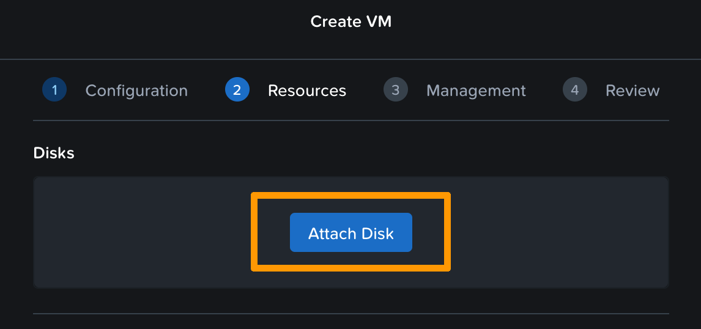
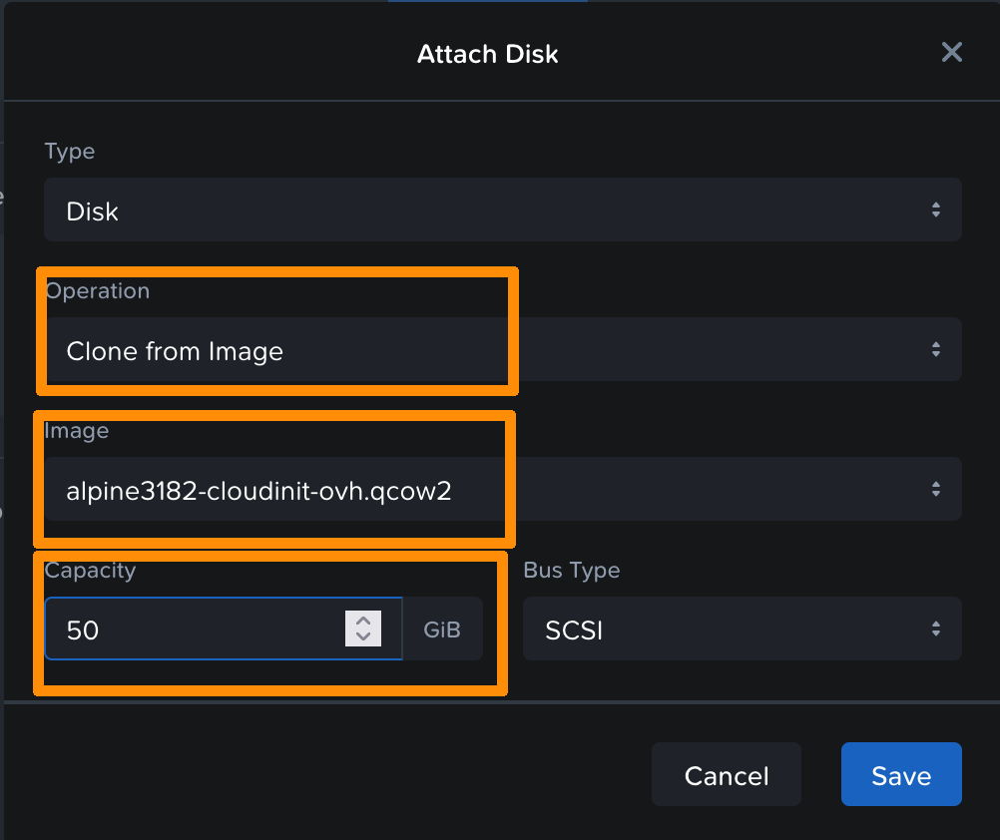
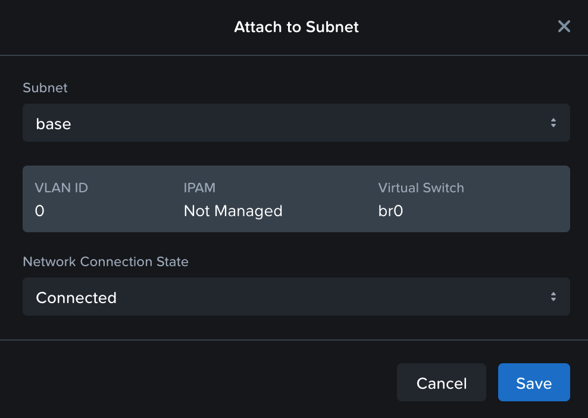

**Dernière mise à jour le 07/08/2023**

## Objectif

« OVHgateway » est le nom du point de sortie de votre cluster vers Internet.

**Ce guide vous décrit le fonctionnement de cette passerelle, et la méthode pour la redéployer.**

## En pratique

### Détails techniques

#### Informations générales

La VM est basée sur Alpine Linux 3.18.2.

> [!primary]
> La gateway est construite sur une base Alpine Linux, sur laquelle nous avons ajouté les paquets nécessaires à cloud-init.

> [!primary]
> Vous devez ipérativement remplacer cette passerelle par une de votre choix. La OVHgateway n'est pas manageable. Vous ne pouvez pas vous connecter dessus pour effectuer des modifications.
> Il n'y a aucun moyen de se connecter avec SSH ou tout autre protocole.
> Il n'est pas non plus possible de se loguer depuis la console via Prism Central.
> Vous pouvez-vous aider de ce guide : [Remplacement de l'OVHgateway](/pages/cloud/nutanix/30-software-gateway-replacement).

La passerelle OVHgateway a un design léger, avec 2 NICs, 1 vCPU, 1 GB de mémoire et 1 GiB d'espace-disque.

`eth0` est l'interface pour le réseau externe et possède l'adresse Additional IP dans le sous-réseau **base** avec le VLAN 0. <br>
`eth1` est l'interface pour le réseau interne dans le sous-réseau **infra** avec le VLAN 1.

> [!primary]
> La VM est utilisée uniquement pour le trafic NAT entre les hosts, le CVM, la VM et Internet.
>
Les requêtes ICMP ne sont autorisées que dans le réseau privé.

#### Script de données utilisateur

La VM est déployée avec *cloud-init*, un outil qui applique automatiquement les données utilisateur à vos instances.

```yaml
#cloud-config
---
hostname: gw
fqdn: gw.ovh.cloud
users:
  - name: ovh
    shell: /bin/nologin

write_files:
  - path: /etc/network/interfaces
    content: |
      auto lo
      iface lo inet loopback

      auto eth0
      iface eth0 inet static
      address PUBLICIP
      netmask PUBMASK
      gateway PUBLICGW

      auto eth1
      iface eth1 inet static
      address PRIVATEIP
      netmask GWNETMASK

  - path: /etc/local.d/firewall.start
    content: |
      #!/bin/sh
      iptables -F
      iptables -X
      iptables -t nat -F
      iptables -t nat -X
      iptables -t mangle -F
      iptables -t mangle -X
      iptables -P INPUT DROP
      iptables -P OUTPUT DROP
      iptables -P FORWARD ACCEPT
      iptables -A INPUT -i eth1 -p ICMP -j ACCEPT
      iptables -A OUTPUT -p ICMP -j ACCEPT
      iptables -A INPUT -i eth0 -m state --state ESTABLISHED,RELATED -j ACCEPT
      iptables -A INPUT -i eth1 -j ACCEPT
      iptables -t nat -A POSTROUTING -o eth0 -j MASQUERADE

runcmd:
  - echo "nameserver DNS" > /etc/resolv.conf
  - rc-service networking restart
  - apk update
  - apk upgrade
  - echo "net.ipv4.ip_forward=1" >> /etc/sysctl.conf
  - iptables -t nat -A POSTROUTING -o eth0 -j MASQUERADE
  - rc-update add local boot
  - chmod +x /etc/local.d/firewall.start
  - usermod -p "*" root
  - usermod --expiredate 1 root
  - reboot
final_message: "The system is finally up, after $UPTIME seconds"
```

### Comment redéployer la passerelle de la VM avec l'interface Prism central

#### Étape 1 : collecter les informations

Pour redéployer la VM de la passerelle, vous aurez besoin des éléments suivants :

- Adresse Additional IP
- Sous-réseau LAN (sous-réseau des hyperviseurs CVM, Prism Central, AHV)
- Nom du sous-réseau

##### **Vérifier l'adresse Additional IP**

Connectez-vous à l'[espace client OVHcloud](https://www.ovh.com/auth/?action=gotomanager&from=https://www.ovh.com/fr/&ovhSubsidiary=fr) et accédez à la gestion de votre [vRack](https://www.ovh.com/fr/solutions/vrack/){.external}. Vérifiez l'adresse Additional IP utilisée par le cluster Nutanix.

{.thumbnail}

> [!primary]
> Les instructions suivantes vont utiliser le bloc IP 198.51.100.0/30 à titre d'exemple.
>

Dans le cadre d'une utilisation du [vRack](https://www.ovh.com/fr/solutions/vrack/){.external}, la première adresse, l'avant-dernière et la dernière adresse d'un bloc IP donné sont toujours réservées respectivement à l'adresse réseau, à la passerelle réseau et au broadcast du réseau. Cela signifie que la première adresse utilisable est la seconde adresse du bloc, comme indiqué ci-dessous :

```console
198.51.100.0  Reserved: Network address
198.51.100.1  First usable IP
198.51.100.2  Reserved: Network gateway
198.51.100.3  Reserved: Network broadcast
```

##### **Vérifier l'adresse IP privée du sous-réseau ou de la passerelle privée**

Si la passerelle existe toujours, rendez-vous sur la VM de la section VM de l'interface web Prism Central.

L'IP de la passerelle est affichée ici.

{.thumbnail}

Cependant, si la passerelle n'est pas présente, vérifiez le sous-réseau en vous rendant dans les menus « Hardware » puis « Hosts » de  l'interface web Prism Central.

{.thumbnail}

Dans ce cas, le sous-réseau est 192.168.0.0/24. Dans la configuration par défaut, l'adresse IP de la passerelle est donc 192.168.0.254.

##### **Récupérer les noms des sous-réseaux**

Si la passerelle existe toujours, rendez-vous sur la VM de la section VM de l'interface web Prism Central.

Cliquez sur la VM OVHgateway et ouvrez l'onglet « NICs ».

{.thumbnail}

#### Étape 2 : créer la VM 

Connectez-vous à Prism Central puis créez une vm.

Personnalisez le nom et les caractéristiques de la VM.

{.thumbnail}

Cliquez sur `Next`{.action}

Vous devez ensuite attacher un disque. Pour cela, vous pouvez sélectionner l'image utilisée pour créer la gateway d'origine.

{.thumbnail}

{.thumbnail}

Ajoutez ensuite **deux nics** sur le réseau « base » :

{.thumbnail}

{.thumbnail}

Cliquez sur `Next`{.action}.

Dans l'interface de gestion, choisissez `cloud-init` dans la partie « Guest customization ».

{.thumbnail}

Il faut maintenant créer un script yaml pour définir les paramètres. Ce script contient les données utilisateur. Au démarrage du système, ces paramètres tels que les utilisateurs, les paquets, les fichiers, etc. seront appliqués à la VM.

Vous trouverez ci-dessous un template que vous pourrez modifier avec vos valeurs pour créer votre VM.

> [!primary]
> Vous pouvez utiliser le fichier d'origine de création de la VM ou utiliser un fichier personnalisé pour créer votre propre gateway. C'est ce que nous verrons dans cet exemple.
>

> [!primary]
>
> - Remplacez les valeurs « hostname », « fqdn », « name », « passwd », « ssh-autorized-keys » et les adresses IP par les valeurs souhaitées.
> - Ce fichier crée la configuration réseau; redimensionne le disque pour occuper tout l'espace, puis redémarre.
> - Attention, une fois crtée votre VM est exposé sur internet.
>

```yaml
hostname: <yourhostname>
fqdn: <yourhostname>.<yourdomain>
users:
  - name: <yourusername>
    sudo: ALL=(ALL) NOPASSWD:ALL
    groups: sudo
    shell: /bin/sh
    lock_passwd: false
    plain_text_passwd: <your password>
    ssh-authorized-keys:
      - ssh-autorized-keys1
      - ssh-autorized-keys2
growpart:
  mode: growpart
  devices: ["/dev/sda2"]
  ignore_growroot_disabled: true

write_files:
   - path: /etc/network/interfaces
     content: |
        auto lo
        iface lo inet loopback

        auto eth0
        iface eth0 inet static
        address 198.51.100.1
        netmask 255.255.255.252
        gateway 198.51.100.2

        auto eth1
        iface eth1 inet static
        address 192.168.0.254
        netmask 255.255.255.0

   - path: /etc/local.d/firewall.start
     content: |
       #!/bin/sh
       iptables -t nat -A POSTROUTING -o eth0 -j MASQUERADE
   
runcmd:
   - echo "nameserver 213.186.33.99" > /etc/resolv.conf
   - rc-service networking restart
   - apk update
   - apk upgrade
   - echo "net.ipv4.ip_forward=1" >> /etc/sysctl.conf
   - iptables -t nat -A POSTROUTING -o eth0 -j MASQUERADE
   - rc-update add local boot
   - chmod +x /etc/local.d/firewall.start
   - apk add sudo
   - lvextend -l +100%FREE /dev/vg0/lv_root
   - resize2fs /dev/vg0/lv_root
   - reboot

final_message: "The system is finally up, after $UPTIME seconds"
```

Collez ce script dans la zone prévue à cet effet.

{.thumbnail}

Cliquez sur `Next`{.action}, puis sur `Create VM`{.action}.

> [!primary]
> Attendez quelques minutes pour que la VM prenne en compte tous les paramètres.

## Aller plus loin

Si vous avez besoin d'une formation ou d'une assistance technique pour la mise en oeuvre de nos solutions, contactez votre commercial ou cliquez sur [ce lien](https://www.ovhcloud.com/fr/professional-services/) pour obtenir un devis et demander une analyse personnalisée de votre projet à nos experts de l’équipe Professional Services.

Échangez avec notre communauté d'utilisateurs sur <https://community.ovh.com/>.
