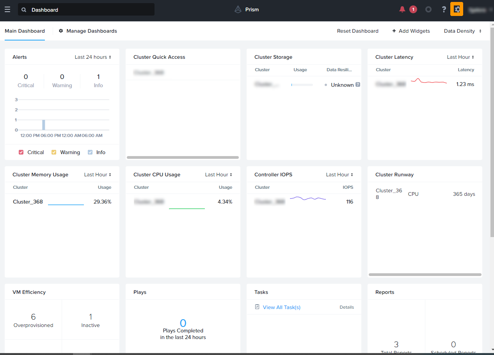
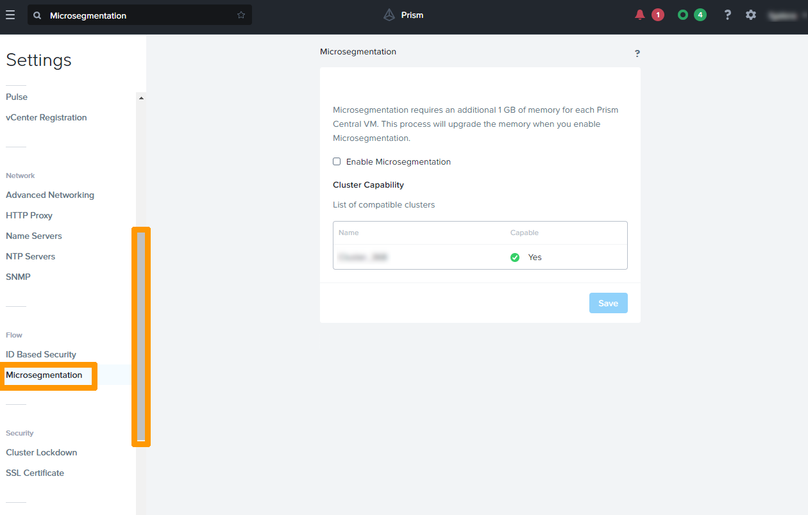
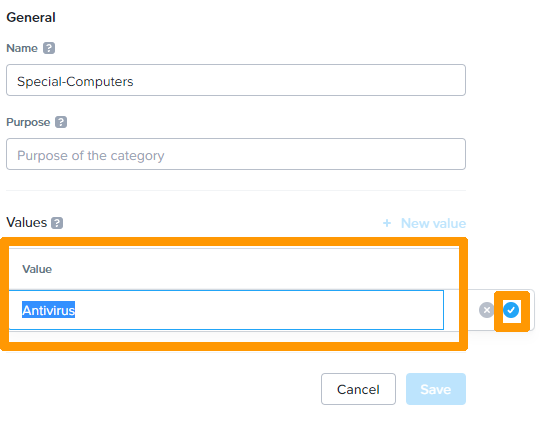
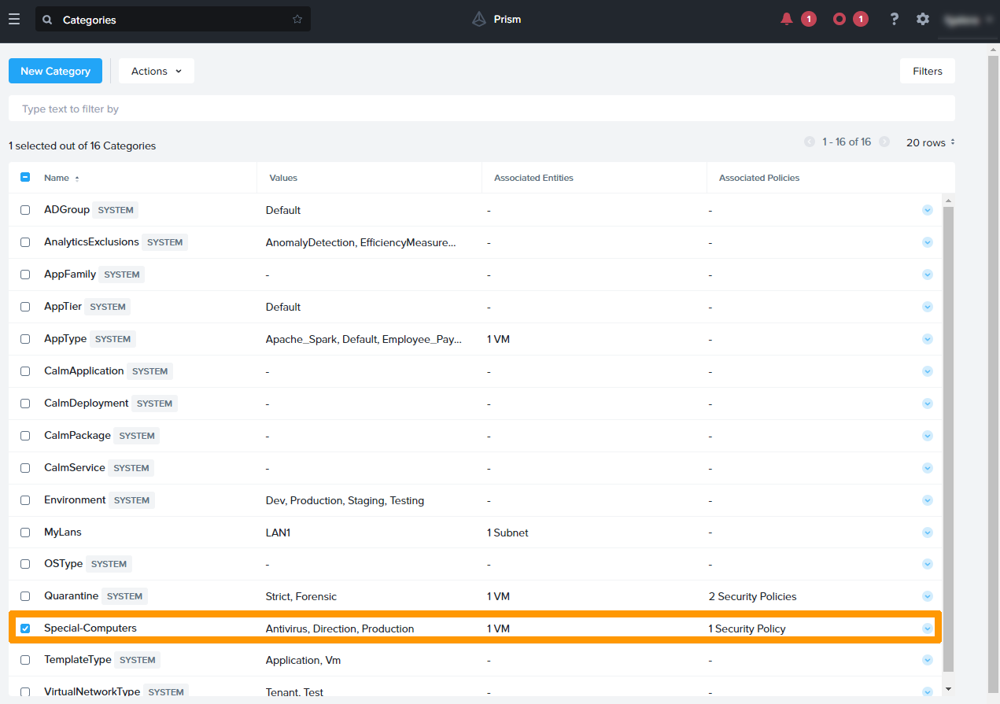
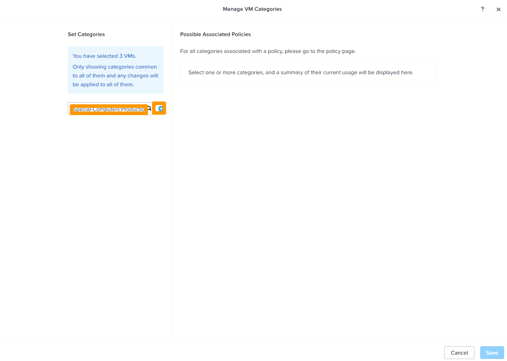
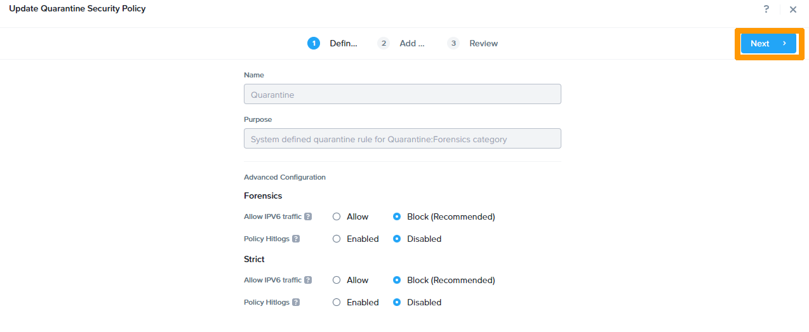
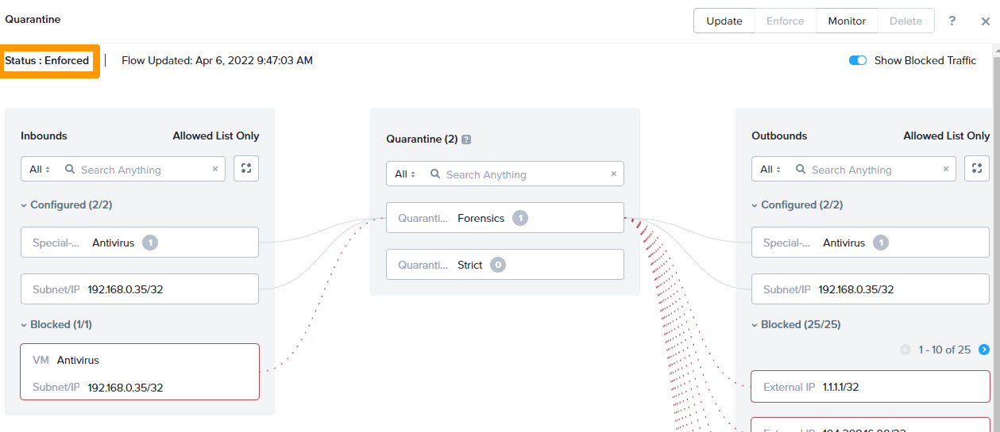
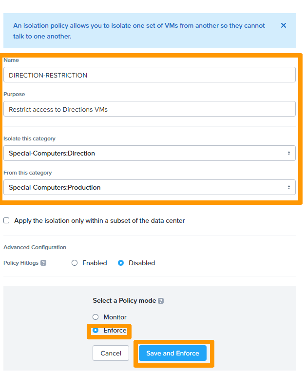
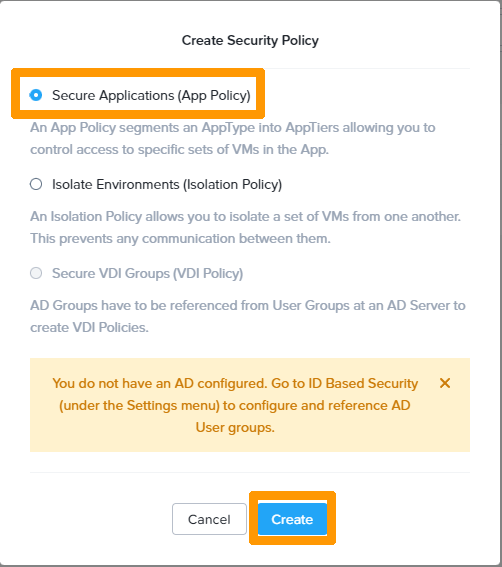
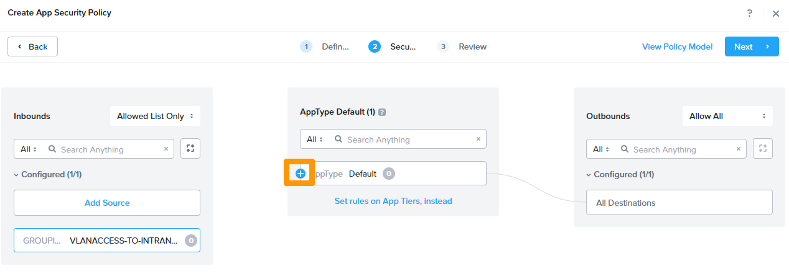

**Last updated 08/04/2022**

## Objective

Nutanix Flow is available on all **Hosted Private Cloud Powered by Nutanix** offers. This option secures the network in one or more clusters managed by **Prism Central**

**Learn how to use Nutanix Flow for network security within a Nutanix cluster.**

> [!warning]
> OVHcloud provides services for which you are responsible, with regard to their configuration and management. It is therefore your responsibility to ensure that they work properly.
>
> This guide is designed to assist you as much as possible with common tasks. Nevertheless, we recommend contacting a specialist provider if you experience any difficulties or doubts when it comes to managing, using or setting up a service on a server.
>

## Instructions

Log in to **Prism Central**.

To connect to a Nutanix cluster, if required, see the [Go further](#gofurther) section in this guide. 

### Enabling **Nutanix Flow**

Click the gear in the top right to change the settings.

{.thumbnail}

Click `Microsegmentation`{.action} from the scroll bar on the left.

{.thumbnail}

Select the **Enable Microsegmentation** checkbox and click `Save`{.action}.

{.thumbnail}

Microsegmentation is enabled. You can always disable it.

{.thumbnail}

### Category configuration 

A category is an object that can contain one or more values

When installing a cluster, some categories already exist and can be modified, other categories can be added.

Entities, such as virtual machines, subnets, or images, can be among the categories used for a tool like **Flow**, for example.

#### Creating a category

From the main menu, click `Categories`{.action} on the `Administration` submenu.

{.thumbnail}

Click `New Category`{.action}.

{.thumbnail}

Type the name of the category in **Name** and click `New Value`{.action}.

{.thumbnail}

Type a name in **Value** and click the blue validation button on the right. 

{.thumbnail}

Click `Save`{.action}.

{.thumbnail}

The new category appears in the category list.

{.thumbnail}

#### Modifying a Category

Select the `Special-Computers category`{.action}

{.thumbnail}

Click `Update`{.action} on the `Actions menu`{.action}

{.thumbnail}

Click `New value`{.action}

{.thumbnail}

Enter a value in the **Value** column and click the validation icon.

{.thumbnail}

Click `New Value`{.action}.

{.thumbnail}

Enter another value in the **Value** column and click the validation icon.

{.thumbnail}

Click `Save`{.action} to commit the category change.

{.thumbnail}

The category is visible in the category dashboard with these two new values.

{.thumbnail}

#### Assigning a Category to a Virtual Machine

In the main menu, click `VMs`{.action} under `Compute & Storage.`

{.thumbnail}

Select the virtual machine by ticking on the left.

{.thumbnail}

Click `Actions`{.action}, then click `Manage Categories`{.action}. 

{.thumbnail}

Type `categoryName:value` and click the `+`{.action} sign.

{.thumbnail}

Click `Save`{.action} to save the virtual machine to a category.

{.thumbnail} 

#### Assigning a category to multiple VMs

Select three virtual machines using the `check`{.action} boxes on the left.

{.thumbnail}

Click the `Actions`{.action} menu and select `Manage Categories`{.action}.

{.thumbnail}

Type `categoryName:value` and click `+`{.action}.

{.thumbnail}

Click `Save`{.action}.

{.thumbnail}

#### Assigning a Category to Subnets

From the main menu, click `Subnets`{.action} under `Network & Security`.

{.thumbnail}

Select the subnets by checking their left. 

{.thumbnail}

Click the `Actions`{.action} menu and select `Manage Categories`{.action}.

{.thumbnail}

Type `categoryName:value` and click `+`{.action}.

{.thumbnail}

Click `Save`{.action}.

{.thumbnail}

### Network quarantine management.

Network quarantine allows you to isolate a virtual machine from the entire network, or allow it restricted access to certain repair tools that are on the network.

#### VM quarantine

In the main menu, click `VMs`{.action} under `Compute & Storage.`

{.thumbnail}

Select the virtual machine by ticking on the left. 

{.thumbnail}

Click `Actions`{.action} and choose `Quarantine VMs`{.action} from the menu.

{.thumbnail}

Select `Forensic`{.action} in `Quarantine Method` and click `Quarantine`{.action}.

{.thumbnail}

The virtual machine is now in quarantine.

#### Customising the network quarantine.

There are currently no blockages affecting the quarantined virtual machine. Follow these instructions to configure the quarantine.

From the main menu, click `Security Policies`{.action} in the `Network & Security` submenu.

{.thumbnail}

Click the number next to `Quarantined` to view the quarantined virtual machines.

{.thumbnail}

The list of quarantined VMs appears in the **Name** column. Click `Close`{.action} to return to the previous menu.

{.thumbnail}

Click `Quarantine`{.action} below the **Name** column to edit the rule.

{.thumbnail}

The rule status is in `monitoring` mode, as shown in the top left-hand corner. 

Traffic is not blocked but monitored. Connections between the quarantined VMs and the rest of the network are represented by orange lines attached to rectangles representing the IP address of the source or destination.

Click `Enforce`{.action} in the top right-hand corner to switch from **Monitoring** mode to **Enforcing** mode with traffic blocking.

{.thumbnail}

Type `ENFORCE`{.action} and click `Confirm`{.action}.

{.thumbnail}

The rule status is now on `Enforced`.

Traffic is blocked. We see attempts to access VMs in quarantines via red dotted lines to blocks containing the IP address of the VM.

Click `Update`{.action} in the top right-hand corner to edit the rule to allow certain network streams.

{.thumbnail}

Click `Next`{.action}.

{.thumbnail}

Move your mouse over an incoming connection attempt and click `Allow Traffic`{.action}

{.thumbnail}

Select the checkbox to the left of the **Source** to select the incoming discovered traffic, then click `Allow 1 Discovered Traffic`{.action} to allow only the discovered traffic, such as ICMP below.

{.thumbnail}

Move your mouse over an outgoing connection attempt and click `Allow Traffic`{.action}.

{.thumbnail}

Select the checkbox to the left of the **Source** to select the outbound discovered traffic, then click `Allow 1 Discovered Traffic`{.action} to allow only the discovered traffic.

{.thumbnail}

The authorised traffic is now visible via grey lines, while the blocked traffic is in red.

To create a rule manually without going through network discovery, left-click `Add Source`{.action} to allow an incoming connection to the quarantine.

{.thumbnail}

Enter the category name and its value in `Add source by: Category`, then click `Add`{.action}.

{.thumbnail}

The source appears in `Configured`.

Click `+`{.action} to the left of **Quarantine: Forensics**.

{.thumbnail}

Allow all traffic and click `Save`{.action}.

{.thumbnail}

Right-click `Add Destination`{.action} to allow an outgoing rule from quarantine.

{.thumbnail}

Enter the category name and its value in `Add source by: Category`, and then click `Add`{.action}.

{.thumbnail}

Click `+`{.action} to the right of **Quarantine: Forensics**.

{.thumbnail}

Allow all traffic and click `Save`{.action}.

{.thumbnail}

Click `Next`{.action}.

{.thumbnail}

Click `Save and Enforce`{.action} to apply the quarantine rule changes.

{.thumbnail}

Click `Quarantine`{.action} to view quarantine rule details.

{.thumbnail}

The rule status is on `Enforced`, the **Forensic** mode has been customised.

A virtual machine in **Strict** mode will be completely isolated from the network, while in **Forensic** mode it will have access to the areas defined in the quarantine rule.

{.thumbnail}

### Creating an isolation rule

An isolation rule allows blocking of network communications between two categories (virtual machines or subnets).

For more information about managing categories, see the [Setting up categories](#gocategoriesemanage) section in this guide. 

From the main menu, click `Securities Policies`{.action} in the `Network & Security` submenu.

{.thumbnail}

Click `Create Security Policy`{.action}.

{.thumbnail}

Select `Isolation Policy`{.action} and click `Create`{.action}.

{.thumbnail}

Type the rule name in `Name`{.action} and then add a comment in `Purpose`{.action}, choose a category in `Isolate this category`{.action}, followed by another category in `From this category`{.action}.

Select `Enforce` in **Select a Policy mode**, then click `Save and Enforce`{.action}. 

{.thumbnail}

The rule is active in the list of security rules.

Click `The rule`{.action} name below the **Name** column to view details.

{.thumbnail}

The status of the rule indicates `Enforced`, and you can see that no connection attempt between the two zones is detected, as this message indicates: **No Traffic between them has been discovered**.

{.thumbnail}

If a network connection attempt is detected between these two zones, the message changes to **Traffic between them has been discovered**.

{.thumbnail}

### Setting up an application rule.

An application rule limits access to certain ports, protocols, or services for members of a category from another category.

This rule can only be used with a category named **Applications** that can be edited but not deleted.

For more information about managing categories, see the [Setting up categories](#gocategoriesemanage) section in this guide.

From the main menu, click `Security Policies`{.action} in the `Network & Security` submenu.

{.thumbnail}

Click `Create Security Policy`{.action}.

{.thumbnail}

Select `Secure Application (App Policy)`{.action} and click `Create`{.action}.

{.thumbnail}

Enter the **Name** fields for the rule name, **Purpose** for comment, **Secure this App** by choosing an existing application category, and click `Next`{.action}.

{.thumbnail}

Click `Add Source`{.action} on the left.

{.thumbnail}

Choose the `category` for the VLAN and click `Add`{.action}.

{.thumbnail}

Click `+`{.action} to connect the application to the source.

{.thumbnail}

Select `Select a Service`{.action}, choose the category in **Protocol/Service**, search for the service name in **Port/Service Details**, and click `Save`{.action}.

{.thumbnail}

Click `Next`{.action}.

{.thumbnail}

Select `Enforce`{.action} and click `Save and Enforce`{.action} to enable this rule.

{.thumbnail}

The rule you created is in the list of rules.

{.thumbnail}

## Go further 

[Hyperconvergenza Nutanix (EN)](https://docs.ovh.com/it/nutanix/nutanix-hci/)

[Presentation of Nutanix FLOW](https://portal.nutanix.com/page/documents/solutions/details?targetId=TN-2094-Flow:TN-2094-Flow)

[Nutanix FLOW security rules](https://portal.nutanix.com/page/documents/details?)

[Categories in Nutanix](https://portal.nutanix.com/page/documents/details?targetId=Prism-Central-Guide-Prism-vpc_2022_1:ssp-ssp-categories-manage-pc-c.html)

Join our community of users on <https://community.ovh.com/en/>.
