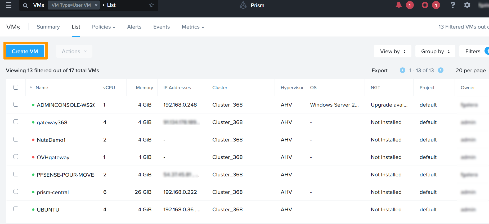
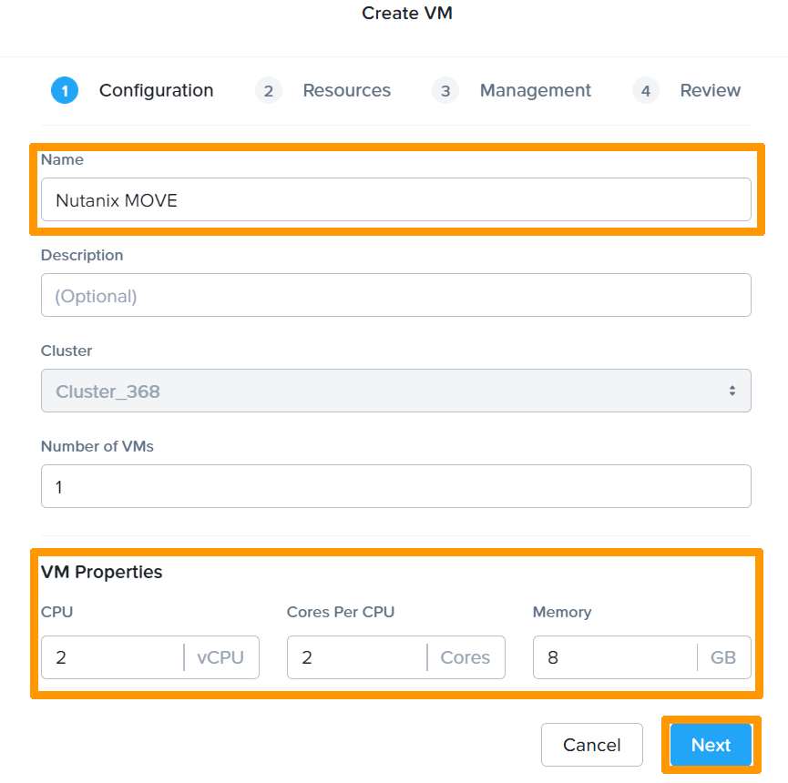
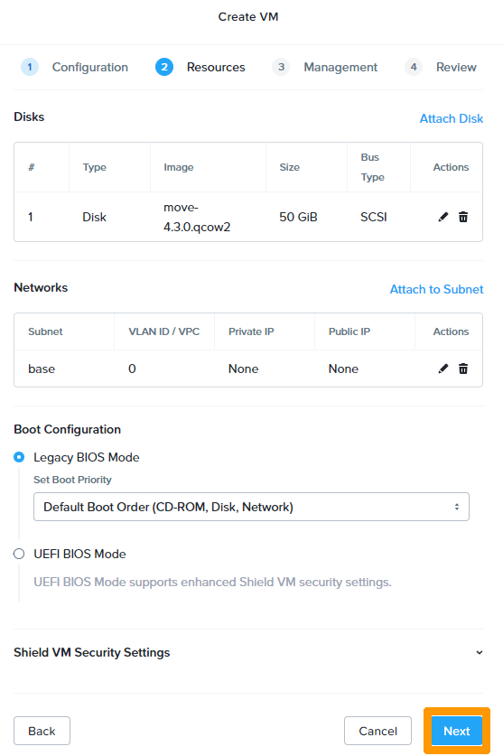
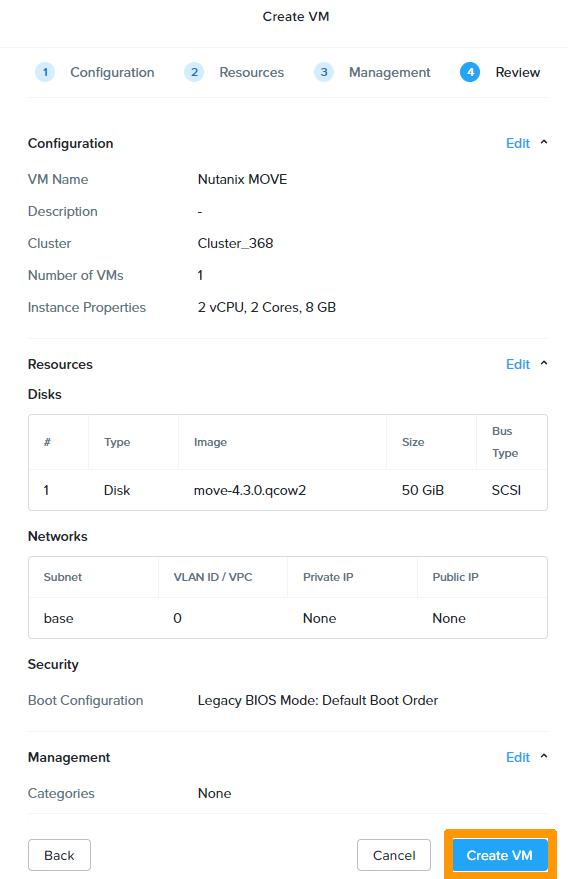
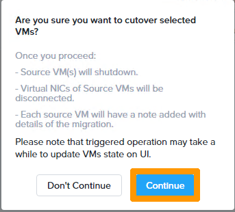
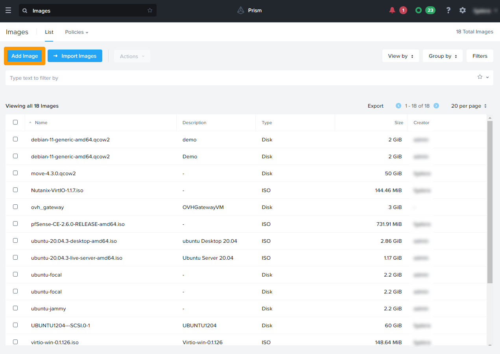
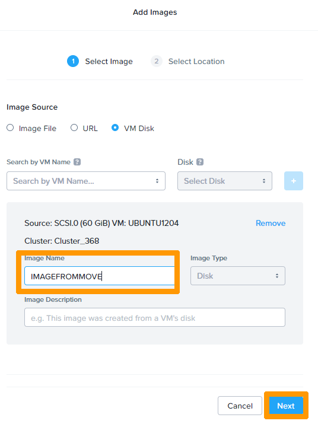

**Dernière mise à jour le 30/03/2022**

## Objectif

Nutanix fourni un outil qui se nomme **Nutanix MOVE** et qui permet de faire des migrations depuis d'autres environnements vers **AHV**

**Ce guide vous explique comment effectuer une migration avec ce logiciel**.

> [!warning]
> OVHcloud vous met à disposition des services dont la configuration, la gestion et la responsabilité vous incombent. Il vous appartient donc de ce fait d’en assurer le bon fonctionnement.
>
> Ce guide a pour but de vous accompagner au mieux sur des tâches courantes. Néanmoins, nous vous recommandons de faire appel à un prestataire spécialisé si vous éprouvez des difficultés ou des doutes concernant l’administration, l’utilisation ou la mise en place d’un service sur un serveur.
>
> Certaines options comme l'utilisation de la compression ou de la déduplication nécessitent des licences particulières fournies par Nutanix au travers d'OVHcloud, nous vous invitons à vous renseigner auprès du service commercial OVHcloud pour plus d'informations.

## Prérequis

- Disposer d'un cluster Nutanix dans votre compte OVHcloud
- Être connecté à votre [espace client OVHcloud](https://www.ovh.com/auth/?action=gotomanager&from=https://www.ovh.com/fr/&ovhSubsidiary=fr)
- Être connecté sur le cluster via Prism Central
- Avoir une connexion à un environnement autre que Nutanix 

## Présentation de **Nutanix MOVE**

**Nutanix Move** est un outil qui permet d'effectuer des migrations de machines virtuelles depuis **VMware ESXI**, **Hyper**, **Azure** et **AWS** vers **AHV**.

Il peut aussi être utilisé pour faire des migrations de Nutanix **AHV** vers **AWS**.

Ce logiciel fonctionne sur une machine virtuelle dont les sources sont disponibles sur le site de Nutanix avec un compte client.

Pour une utilisation optimale il est conseillé d'installer **Nutanix Move** au plus près de la destination.

le logiciel **Nutanix Move** est le seul à communiquer entre la source et la destination.

> [!warning]
> Il est fortement déconseillé d'utiliser **Nutanix Move** Avec des machines virtuelles sous Windows Server exécutant **Active Directory** ou **Microsoft Exchange** il est plus judicieux de faire une migration selon les préconisations de Microsoft.
>
> Pour les machines virtuelles qui utilisent des bases de données sous **Microsoft SQL** lors de finalisation d'une migration il est préférable d'avoir le service de la base de données stoppé.
>
> IL faut vérifier la compatibilité la machine virtuelle d'origine avec l'environnement Nutanix de destination.

## En pratique

Nous allons voir comment effectuer une migration entre un environnement distant sur HYPERV et un environnement NUTANIX OVHCloud.

La source et la destination sont sur deux réseaux privés interconnectés au travers d'un **VPN IPSEC**.

### Préparation des machines virtuelles d'origines avant migration.

La machine virtuelle doit faire partie de la liste des machines virtuelles supportées dans la matrice de compatibilité pour que la migration fonctionne.

Connectez-vous sur ce site ci-dessous pour vérifier la compabilité des machines sources avec l'environnement de destination sous Nutanix :

[Matrice de comptatibilité Nutanix](https://portal.nutanix.com/page/documents/compatibility-interoperability-matrix/guestos)

#### Spécificité des machines virtuelles sous LINUX

Certaines machines virtuelles ne démarrerons pas correctement après la migration avec **Nutanix MOVE**, vérifiez la liste de compatibilité car il est probable que le pilote SCSI ne soit pas supporté et qu'il soit nécessaire de le changer avec le pilote PCI , dans cas il faudra suivre cette procédure [Changer le contrôleur disque d'une Machine Virtuelle](#changediskcontroller) après la migration de la machine virtuelle.

#### Particularité de l'environnement Microsoft

Microsoft ne fournit pas les pilotes **Virtio** de la carte SCSI et de la carte réseau. Il faut Installer ces pilotes avant de faire une migration, ces pilotes sont disponibles sur le site de Nutanix avec un compte client.

> [!primary]
> Microsoft Windows 2008 n'est plus supporté ni par Microsoft ni par Nutanix mais néanmoins il est possible d'installer d'anciens pilotes **Virtio** et de tenter une migration.
>

Connectez-vous sur le site de Nutanix avec un compte client pour télécharger les pilotes VIRTIO.

[Lien de téléchargement des pilotes VIRTIO](https://portal.nutanix.com/page/downloads?product=ahv&bit=VirtIO)

Saisissez votre nom d'utilisateur dans `Emails`{.action}, votre mot de passe dans `Password`{.action} et cliquez sur `Log In`{.action}.

Cliquant sur le `Download`{.action} qui vous convient.

Nous allons prendre le pilote pour **Amd64**.

A partir d'une machine virtuelle sous Windows de l'environnement HYPER-V double-cliquez sur `Nutanix-VirtIO-1.1.7-amd64`{.action}.

Cliquez sur `I accept the terms in the license Agreement`{.action} ainsi que sur `Install`{.action}

Cliquez sur `Finish`{.action} pour terminer l'installation sans avoir à redémarrer la machine virtuelle.

### Installation de MOVE sur le Cluster NUTANIX.

#### Téléchargement et importation des sources. 

Récupérez le fichier au format **qcow2** sur ce site [Lien de téléchargement de Nutanix MOVE](https://portal.nutanix.com/page/downloads?product=move)

Connectez-vous avec un compte enregistré chez Nutanix

Cliquez sur `Downloads`{.action} à droite de Move QCOW2 file for AHV.

Importez l'image téléchargée de **Nutanix Move** dans le cluster. Pour plus d'informations sur l'importation d'images cliquez sur ce lien [Importation d'images](https://docs.ovh.com/fr/nutanix/image-import/).

#### Installation de la machine virtuelle **Move**

Créez une machine virtuelle à partir de l'image Move

Depuis **Prism Central** ouvrez le menu principal en cliquant sur le bouton en haut à gauche.

Cliquez dans le menu sur `VMs`{.action}

Cliquez sur `Create VM`{.action}

Saisissez **Nutanix MOVE** dans `Name`{.action}  

Choisissez ces options **2 vCPU**, **2 Cores** et **8 GB** dans `VM Properties`{.action} et Cliquez sur `Next`{.action}

Cliquez sur `Attach Disk`{.action}

Choisissez ces options **Disk**, **Clone from Image** et **move-4.3.0.qcow2**  ensuite cliquez sur `Save`{.action}

Cliquez sur `Attach to Subnet`{.action}

Choisissez le réseau dans `Subnet`, vérifiez qu'il soit bien connecté dans `Network Connection State` et cliquez sur `Save`{.action}

Cliquez sur `Next`{.action} 

Laissez les options de timezone par défaut et cliquez sur `Next`{.action}

Cliquez sur sur `Create VM`{.action} pour finaliser l'installation de la machine virtuelle **Nutanix Move**

Sélectionnez la machine virtuelle **Nutanix Move** et cliquez sur le menu `Actions`{.action}

Cliquez sur `Power On`{.action} dans le menu action pour démarrer la machine virtuelle.

La machine virtuelle est démarrée et l'on obtient une adresse IP si un serveur **DHCP** est opérationnel sur ce réseau.

Cette installation de **Nutanix Move** se fait sur un réseau ou il y'a un serveur DHCP mais il est possible de configurer la machine virtuelle sur un réseau sans serveur **DHCP** 

Pour plus de détails sur **Nutanix MOVE**, reportez-vous à la section « [Aller plus loin](#gofurther) » de ce guide.

### Configuration de **Nutanix Move** 

#### Connexion à l'interface WEB et création d'environnements pour la migration

Connectez-vous à l'adresse IP de la machine virtuelle **Nutanix Move** au travers d'un navigateur WEB en HTTPS comme ceci **https://addresseipnutanixmove/**

Cliquez sur `I have read and agree to terms and conditions`{.action} suivi de  `Continue`{.action} pour accepter la licence

Cliquez sur `OK`{.action} pour poursuivre

Choisissez un mot de passe dans `Enter new Password`{.action} , confirmez le dans `Re-Enter new Password`{.action} et cliquez sur `Set Password`{.action} pour valider la création du mot de passe de Nutanix Move.

Saisissez le mot de passe dans `Password`{.action} et cliquez sur `Log In`{.action} pour se connecter à l'interface WEB de **Nutanix MOVE**.

Cliquez sur `Add Environment`{.action}

Choisissez `Nutanix AOS`{.action} 

Saisissez ces informations **PRISM-CENTRAL-DESTINATION** dans `Environment Name`{.action}, l'adresse IP privée de **Prism Central** dans `Nutanix Environment`{.action}, Un compte d'administration de **Prism Central** dans `Username `{.action}, le mot de passe du compte dans `Password`{.action} et cliquez sur `ADD`{.action} pour ajouter un environnement **Prism Central**. 

Choisissez `Microsoft Hyper-V`{.action} 

Cliquez sur `Add Environment`{.action}

Saisissez ces informations **HYPERV-SOURCE** dans `Environment Name`{.action}, l'adresse IP privée du serveur **HYPER-V** dans `Hyper-V Server/Cluster`{.action}, un compte d'administration **HYPER-V** dans `Username `{.action} , le mot de passe de ce compte dans `Password`{.action} et cliquez sur `ADD`{.action} pour ajouter un environnement **HYPER-V**. 

Les deux environements de migrations apparaissents en haut à gauche.

#### Création d'un plan de migration

Nous allons créer un plan de migration à partir des deux environnements créés précédemment.

La source sera le serveur **HYPER-V** et la destination le cluster **NUTANIX**.

Cliquez sur `Create a Migration Plan`{.action}

Choisissez un nom dans `Plan Name`{.action} et cliquez sur `Proceed`{.action}

Saisissez ces informations **HYPERV-SOURCE** dans `Select a Source`{.action},  **PRISM-CENTRAL-DESTINATION** dans `Hyper-V Server/Cluster`{.action}, le nom du CLUSTER dans `Target Cluster`{.action}, le nom du container de destination dans `Target Container`{.action} ensuite cliquez sur `NEXT`{.action} pour passer à l'étape suivante.

Sélectionnez les machines virtuelles que vous voulez migrer de l'environnement **HYPER-V** vers **AOS** en cliquant à gauche de la VM sur l'icone `Clic ICONE`{.action}, sélectionnez les machines virtuelles et cliquez sur `Next`{.action} pour continuer la création du plan de migration.

Choisissez le réseau dans `Target Network`{.action} et cliquez sur `Next`{.action}.

Cliquez sur `Next`{.action} pour valider la migration.

Cliquez sur `Save`{.action} pour Enregistrer le plan de migration sans l'éxécuter.

#### Lancement de la migration

Le plan de migration est créé, il est possible de le lancer manuellement.

Sélectionnez la `Case à cocher près du Plan de migration`{.action}.

Dans le menu `Action` cliquez sur `Start`{.action}.

La migration est en cours, sur la colonne `Status`  on voit l'état de la migration si elle est lancée elle apparait `in progress` à droite de l'écran.

#### Finalisation de la migration

Contrôler l'état de la migration en se positionnant avec la souris sur `In Progress` un fenêtre doit apparaitre avec cette information **Ready to Cutover N** N correspond aux nombre d'ordinateurs qui peuvent basculer. Cliquez sur `In Progress`{.action} pour lancer le processus de finalisation.

Sélectionnez tous les ordinateurs en cliquant sur la case à cocher `VM Name`{.action} et cliquez sur `Cutover`{.action}.

Cliquez sur Continue. 

La finalisation est en cours veuillez attendre 

La migration est terminée dès que l'on voit **Completed** dans `Migration Status`

Connectez-vous sur **Prism Central** pour voir les 3 Ordinateurs virtuels migrés qui sont présents et démarrés.

#### Modification du controleur de disque sur une machine virtuelle LINUX 

Si la machine virtuelle ne démarre pas correctement après la migration c'est que probablement ce n'est pas le bon contrôleur de disque dans la configuration de la machine virtuelle. Dans ce cas il faut le changer avec cette procédure.

Allez dans le menu Principal de **Prism Central** Cliquez sur `VMs`{.action}

Assurez-vous que la machine virtuelle est bien éteinte.

Revenez sur le Menu Principal et cliquez sur `Images`{.action}.

Cliquez sur `add images`{.action}.

Choisissez **VM Disk** dans `Image Source`{action} , Ensuite saisissez un nom dans `Search by VM Name`{action} et cliquez sur le `Signe+`{action}.

Mettez un nom à `Image Name`{action} et cliquez sur `Next`{action}.

Sélectionnez `Place image on source VM's cluster`{action} et cliquez sur `Save`{action}.

L'image créé à partir de la machine virtuelle apparait au bout de quelques instants.

Cliquez sur le `Menu principal`{action} et choisissez `VMs`{action} pour revenir sur le Machine virtuelles.

Sélectionnez la machine virtuelle en cliquant sur la `case à cocher`{action} à gauche de cette machine virtuelle.

Cliquez sur le menu `Actions`{action} et choisissez `Update`{action}

Cliquez sur la `corbeille`{action} à coté du lecteur de CDROM.

Cliquez sur la `corbeille`{action} à coté du lecteur de disque.

Cliquez sur la `Attach Disk`{action}.

Choisissez **Disk** Dans `Type`{action}, prenez l'option **Clone from image** saisissez **Nom image créé** à `Image`{action}, mettre PCI à `Type`{action} et cliquez sur `Save`{action}

Cliquez sur `Next`{action}.

Cliquez sur `Next`{action}.

Cliquez sur `Save`{action}.

le contrôleur de disque a été modifié et la machine virtuelle demarre correctement.

## Aller plus loin 

[Installation et configuration de Move](https://portal.nutanix.com/page/documents/details?targetId=Nutanix-Move-v4_3:Nutanix-Move-v4_3)

Échangez avec notre communauté d'utilisateurs sur <https://community.ovh.com/>.
