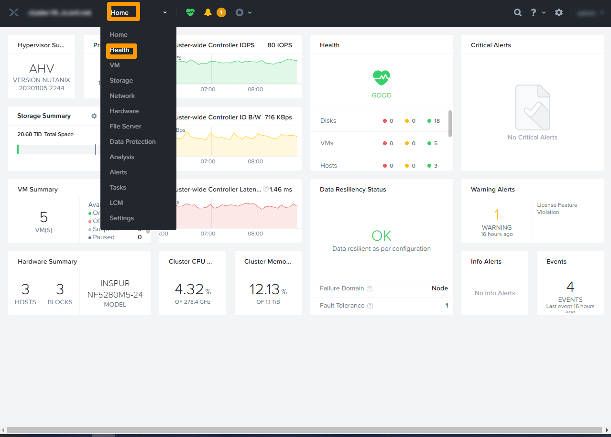
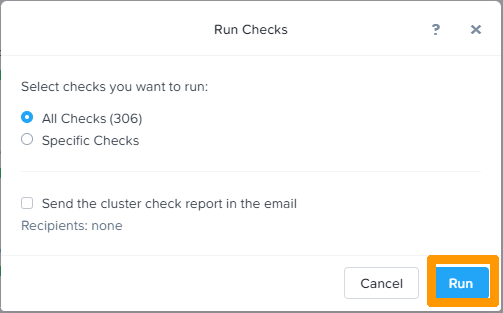
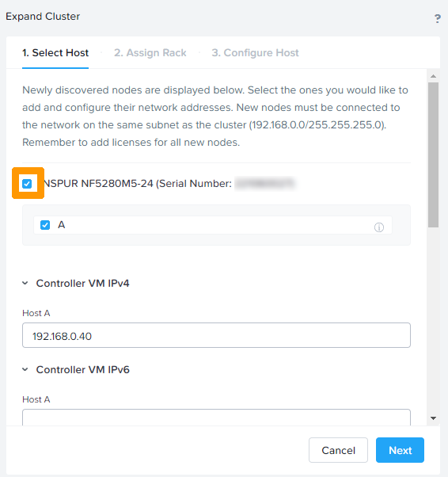
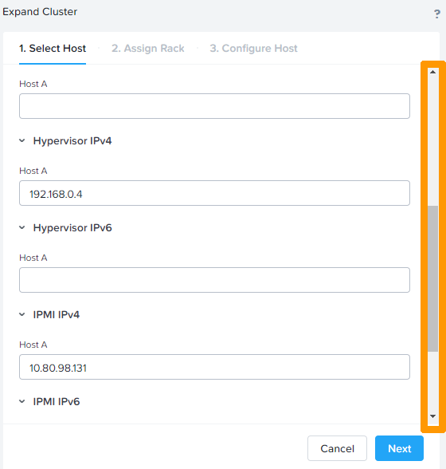
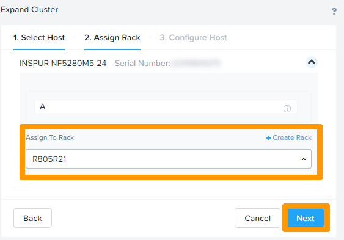
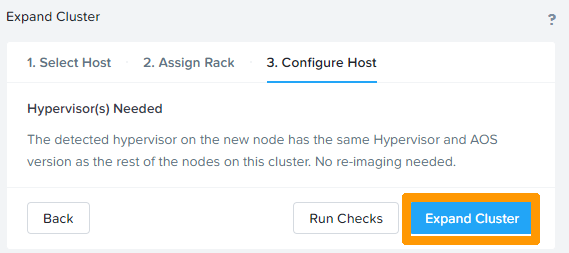

**Last updated 11th April 2022**

## Objective

Nutanix clusters are scalable. You can add nodes to an existing cluster.

**This guide will show you how to add a node and ensure it works properly.**

> [!warning]
> OVHcloud provides services for which you are responsible, with regard to their configuration and management. You are therefore responsible for ensuring they function correctly.
>
> This guide is designed to assist you in common tasks as much as possible. Nevertheless, we recommend that you contact a specialist service provider if you have difficulties or doubts concerning the administration, usage or implementation of services on a server.

## Requirements

- A Nutanix cluster in your OVHcloud account
- Access to the [OVHcloud Control Panel](https://ca.ovh.com/auth/?action=gotomanager&from=https://www.ovh.com/world/&ovhSubsidiary=ws)
- You must be connected to the cluster via Prism Central.
- A ready-to-configure physical server added to the OVHcloud Control Panel.

## Technical information

The **Hosted Private Cloud solution powered by Nutanix** enables you to have between 3 and 18 nodes on the same cluster.

It is possible to add several nodes when expanding the cluster.

The nodes to be added must have the same version of **AOS** as the existing cluster.

## Instructions

### Add a node to a Nutanix cluster.

Connect to **Prism Element** through **Prism Central**.

For more information on connecting to the cluster; see the « [Go further](#gofurther) » section of this guide. 

On the dashboard, the 3 nodes are visible in the `Hardware Summary`. Click on `View Details`{.action} in the middle left to bring up more details.

{.thumbnail}

A more detailed view is displayed with information such as total space and storage resilience capacity. 
Click `Close`{.action} to close this window.

{.thumbnail}

Open the `Home`{.action} menu and choose `Health`{.action} to perform a cluster analysis before adding the node.

{.thumbnail}.

Click on `Actions`{.action} in the top right-hand corner and choose `Run NCC Check`{.action}.

{.thumbnail}

Click `Run`{.action} to launch a control and wait for the operation to complete.

{.thumbnail}

After the check, click the `cogwheel`{.action} icon at the top right to change the settings.

{.thumbnail}

Click `Expand Cluster`{.action}.

{.thumbnail}

Check the box next to the discovered host to display the node details.

{.thumbnail}

Scroll to see the options.

{.thumbnail}

Scroll down to the bottom of the window and click on `Next`.
{.action}.

{.thumbnail}

Choose the Rack in `Assign to Rack` and click `Next`{.action}.

{.thumbnail}

Click `Expand Cluster`{.action}.

{.thumbnail}

Click `Open`{.action} to view the cluster expansion details.

{.thumbnail}

{.thumbnail}

The addition of the node is completed when the *Expanding Cluster* progress is 100%.

{.thumbnail}

Four nodes are visible in `Hardware Summary`, click `View Details`{.action} for more information.

{.thumbnail}

Click `Close`{.action} to return to the dashboard.

{.thumbnail}

## Go further 

[Nutanix Hyperconvergence](https://docs.ovh.com/us/es/nutanix/nutanix-hci/)

[Nutanix Node Addition Guide](https://portal.nutanix.com/page/documents/details?targetId=Web-Console-Guide-Prism-v5_20:wc-cluster-expand-wc-t.html)

Join our community of users on <https://community.ovh.com/en/>.