**Dernière mise à jour le 25/05/2022**

## Objectif

Veeam Backup est un logiciel de sauvegarde disponible pour Nutanix. 

**Apprenez à installer, configurer et utiliser Veeam sur un cluster Nutanix**

> [!warning]
> OVHcloud vous met à disposition des services dont la configuration, la gestion et la responsabilité vous incombent. Il vous appartient donc de ce fait d’en assurer le bon fonctionnement.
>
> Ce guide a pour but de vous accompagner au mieux sur des tâches courantes. Néanmoins, nous vous recommandons de faire appel à un [prestataire spécialisé](https://partner.ovhcloud.com/fr/) si vous éprouvez des difficultés ou des doutes concernant l’administration, l’utilisation ou la mise en place d’un service sur un serveur.
>

## Prérequis

- Disposer d'un cluster Nutanix dans votre compte OVHcloud.
- Être connecté à votre [espace client OVHcloud](https://www.ovh.com/auth/?action=gotomanager&from=https://www.ovh.com/fr/&ovhSubsidiary=fr).
- Être connecté sur le cluster via **Prism Central**. 
- **Veeam Backup & Replication** installé sur une machine virtuelle de votre cluster Nutanix via cette procédure : [Installer Veeam Backup & Replication](https://docs.ovh.com/fr/storage/veeam-backup-replication/).
- Connaître l'adresse IP publique utilisée par **Veeam Backup** pour accéder à Internet.
- Disposer de 4 Go de mémoire vive, 60 Go de stockage et 4 vCPU pour l'ajout d'une machine virtuelle supplémentaire lors de la configuration des extensions pour **Veeam Backup & Replication**.
- Posséder un stockage distant hors du cluster, de type [Enterprise File Storage OVHcloud](https://www.ovhcloud.com/fr/storage-solutions/enterprise-file-storage/).

## En pratique

Nous allons personnaliser **Veeam Backup & Replication** pour l'utilisation sur un cluster Nutanix, avec un dépôt distant de ce cluster chez OVHcloud grâce à la solution [Enterprise File Storage OVHcloud](https://www.ovhcloud.com/fr/storage-solutions/enterprise-file-storage/).

### Ajouter un utilisateur dans Prism Element pour Veeam Backup

Il faut tout d'abord créer un utilisateur spécifique dans Prism Element pour l'utilisation de Veeam Backup.

Par le biais de **Prism central**, connectez-vous à **Prism Element** en cliquant sur le cluster sous `Cluster Quick Access`.

{.thumbnail}

Une fois dans **Prism Element**, rendez-vous dans les paramètres en cliquant sur l'icône représentant un `engrenage`{.action} en haut à droite.

{.thumbnail}

Déroulez le menu à gauche à l'aide de la barre de défilement.

{.thumbnail}

Cliquez sur `Local User Management`{.action}.

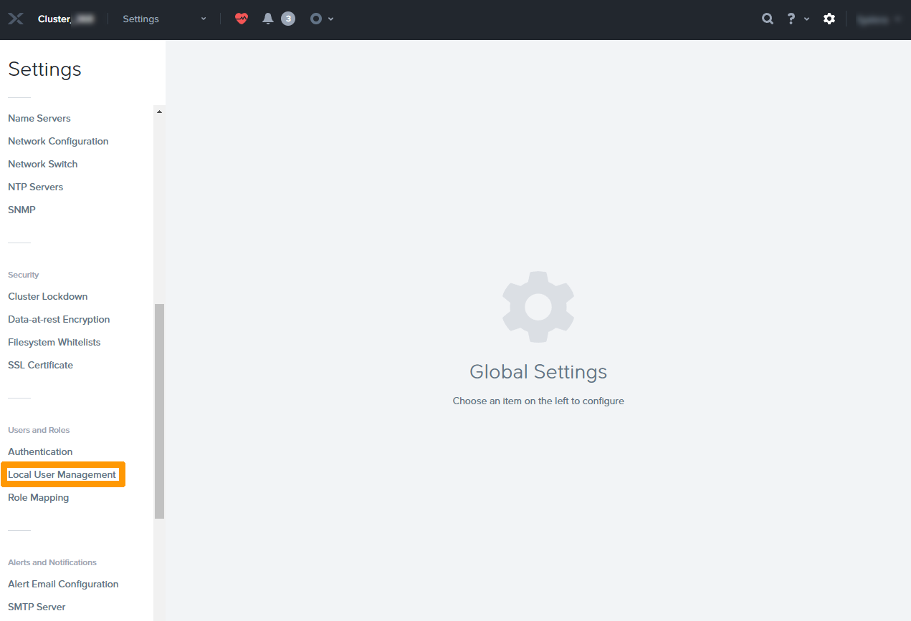{.thumbnail}

Cliquez sur le bouton `New User`{.action}.

{.thumbnail}

Saisissez les informations :

- **Username** : `svc_veeam`
- **First Name** : `Veeam`
- **Last Name** : `Backup`
- **Email** : `veeam@example.com`
- **Password** : `mot de passe`

> [!primary]
> Ces données sont fournies à titre d'exemple. L'adresse de messagerie est obligatoire mais n'est pas utilisée.

Cochez la case `Cluster Admin`{.action} et cliquez sur `Save`{.action}

{.thumbnail}

Ce compte utilisateur est créé et il est ajouté dans la liste des utilisateurs de **Prism Element**.

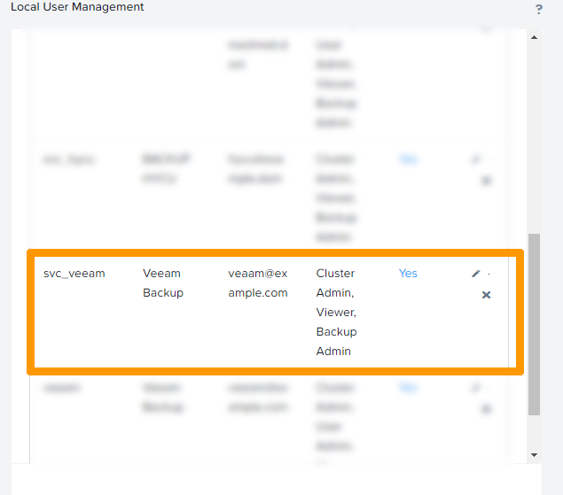{.thumbnail}

### Télécharger et installer l'extension pour un cluster Nutanix sous AHV

Connectez-vous sur la machine virtuelle où se trouve Veeam Backup.

A partir d'un navigateur Web, téléchargez la dernière version de l'[extension AHV pour Veeam](https://www.veeam.com/availability-nutanix-ahv-download.html). Vous devez disposer d'un compte utilisateur sur le site de **Veeam**, vous pouvez le créer librement et gratuitement.

Lancez l'installation de l'extension.

> [!warning]
> Avant de lancer l'installation, assurez-vous que la console **Veeam Backup & replication** soit fermée.
>

Ouvrez l'installateur « NutanixAHPlugin ».

{.thumbnail}

Acceptez les conditions générales d'utilisation du logiciel et cliquez sur `Next`{.action}.

{.thumbnail}

Cliquez sur `Next`{.action}.

{.thumbnail}

Cliquez sur `Install`{.action}.

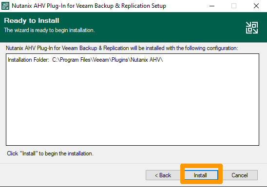{.thumbnail}

Une fois l'installation terminée, cliquez sur `Finish`{.action}.

{.thumbnail}

### Intégrer le cluster Nutanix dans la configuration de **Veeam Backup**

Lors de La configuration de Veeam Backup pour Nutanix, une nouvelle machine virtuelle est ajoutée dans le cluster, elle sert d'interface entre le logiciel de sauvegarde **Veeam Backup** et le cluster.

Lancez la console **Veeam Backup** et cliquez sur `Connect`{.action}.

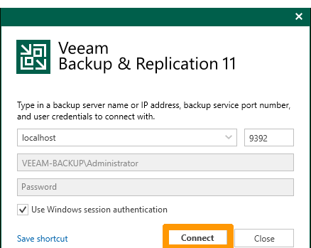{.thumbnail}

Positionnez-vous dans `Backup Infrastucture`{.action} dans le menu en bas à droite, choisissez `Managed Servers`{.action} et cliquez sur `Add Server`{.action}.

{.thumbnail}

Cliquez sur `Nutanix AHV`{.action}.

{.thumbnail}

Saisissez `l'adresse IP privée`{.action} de **Prism Element** dans « DNS name or IP address » et cliquez sur `Next`{.action}.

{.thumbnail}

Cliquez sur `Add`{.action} pour ajouter le compte utilisateur de **Prism Element**

{.thumbnail}

Saisissez les informations correspondant au compte créé précédemment dans **Prism Element** :

- **Username** : `svc_veeam`
- **Password** : `Mot de passe`

Cliquez sur `OK`{.action}.

{.thumbnail}

Vérifiez, dans le champ « Credentials », que le compte créé est sélectionné et cliquez sur `Next`{.action}.

{.thumbnail}

Cliquez sur `Continue`{.action} pour valider le message d'avertissement concernant le certificat.

{.thumbnail}

Cochez `Use the following IP address`{.action} et choisissez une adresse IP privée non-utilisée (cette adresse sert au moment des sauvegardes et des restaurations de fichiers), puis cliquez sur `Next`{.action}.

{.thumbnail}

Cliquez sur `Next`{.action}.

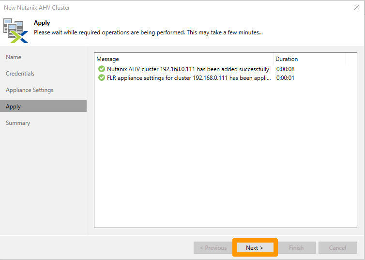{.thumbnail}

Cliquez sur `Finish`{.action}.

{.thumbnail}

Cliquez sur `Yes`{.action}.

{.thumbnail}

Sélectionnez `Deploy a new proxy`{.action} et cliquez sur `Next`{.action}.

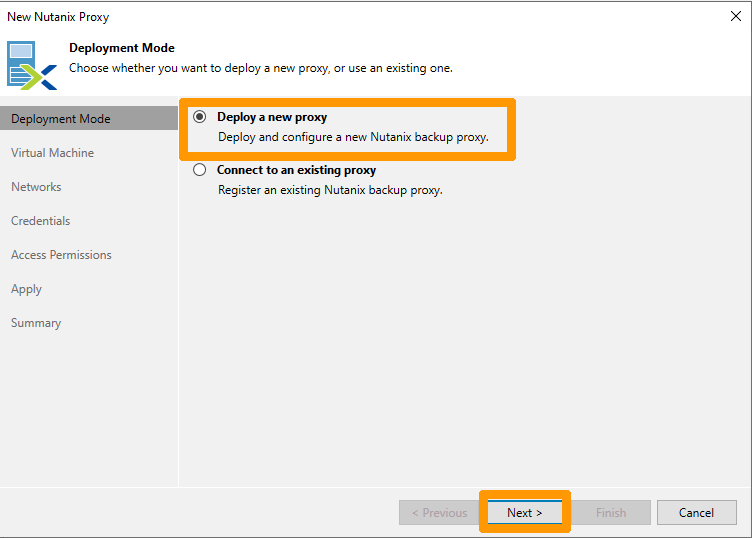{.thumbnail}

Nommez la VM dans le champ « Name » et cliquez sur `Next`{.action}. 

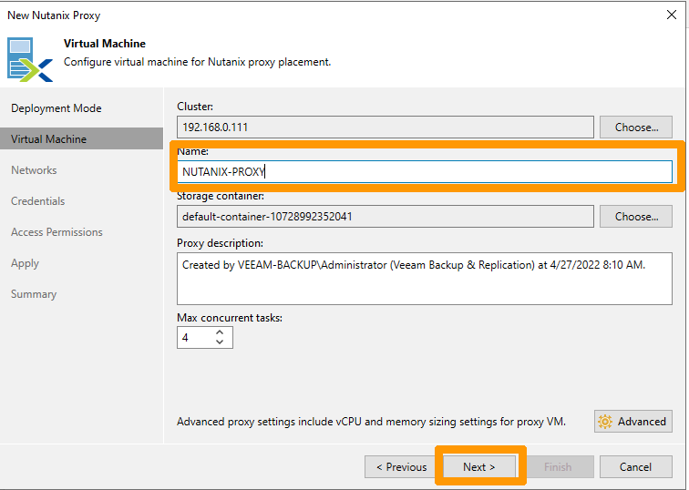{.thumbnail}

Cliquez sur `Configure`{.action}. 

{.thumbnail}

Choisissez `une adresse IP`{.action} non-utilisée sur le réseau local pour la machine virtuelle et cliquez sur `OK`{.action}. 

{.thumbnail}

Cliquez sur `Next`{.action}. 

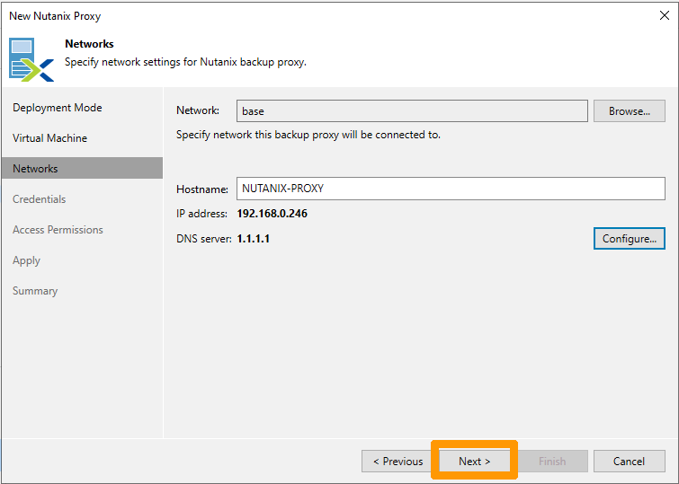{.thumbnail}

Cliquez sur `Add`{.action} pour ajouter et créer le compte de connexion à la machine virtuelle **NUTANIX-PROXY**. Cette VM est ajoutée lors de l'ajout d'un cluster Nutanix dans la console **Veeam Backup et replication**.

> [!warning]
> Prenez bien notre du compte utilisateur et du mot de passe créés. Ces identifiants vous permettront de vous connecter sur la nouvelle machine virtuelle au travers du navigateur WEB sans passer par le logiciel **Veeam backup**. L'URL sera similaire à `https://adressipprivee:8100`.

{.thumbnail}

Saisissez les informations correspondant au compte créé précédemment dans Prism Element :

- **Username** : `proxy_user`
- **Password** : `Mot de passe`

Cliquez sur `OK`{.action}.

{.thumbnail}

Vérifiez le compte utilisateur dans le champ « Credentials » et cliquez sur `Next`{.action}.

{.thumbnail}

Cochez la case `Allow access to all backup repositories`{.action} et cliquez sur `Next`{.action}.

{.thumbnail}

Patientez quelques minutes.

{.thumbnail}

L'installation se termine par un message d'avertissement. N'en tenez pas compte car il s'agit du serveur DNS public qui n'arrive pas à résoudre le nom du serveur Veeam.<br>
Cliquez sur `Next`{.action}.

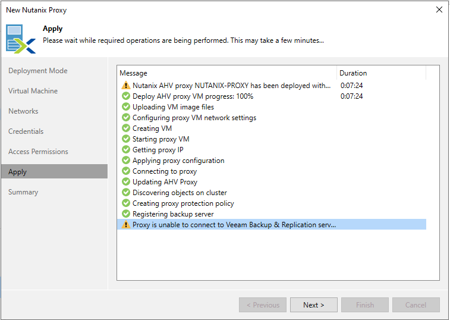{.thumbnail}

#### Modification du fichier host de la machine virtuelle d'interface

> [!primary]
> 
> Cette opération est nécessaire si vous n'utilisez pas de serveur DNS en interne pour effectuer la résolution des noms de VMs.
> Notamment la VM qui sert pour le logiciel Veeam Backup. 

Via **Prism Central**, connectez-vous à la machine virtuelle NUTANIX-PROXY. 

Ouvrez le menu principal en haut à gauche et choisissez `VMs`{.action}.

{.thumbnail}

Cliquez sur la machine virtuelle NUTANIX-PROXY. 

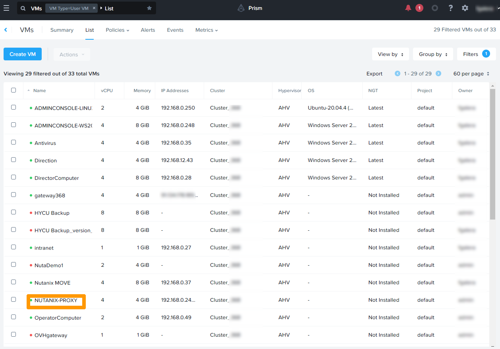{.thumbnail}

Cliquez sur `Launch console`{.action}.

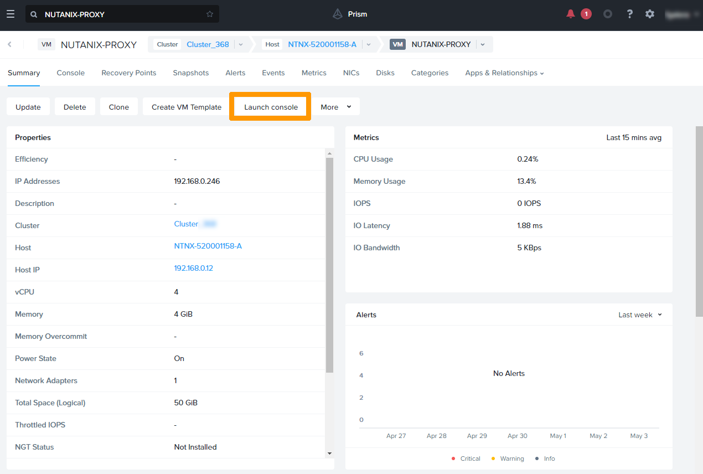{.thumbnail}

Connectez-vous avec le compte utilisateur créé précédemment et le mot de passe associé à ce compte.

{.thumbnail}

A partir de la console, modifiez le ficher `/etc/hosts` :

```bash
proxy_user@NUTANIX-PROXY~$sudo nano /etc/hosts
[sudo] password for proxy_user:
```

Ajoutez cette information qui correspond à l'adresse IP et le nom de la machine virtuelle où est installé Veeam Backup :

```bash
192.168.0.245 VEEAM-BACKUP 
```

Enregistrez le fichier et lancez cette commande :

```bash
proxy_user@NUTANIX-PROXY~$sudo /etc/init.d/networking restart
[sudo] password for proxy_user:
```

### Création du volume Enterprise File Storage via l'espace client d'OVHcloud

Connectez-vous à votre [espace client OVHcloud](https://www.ovh.com/auth/?action=gotomanager&from=https://www.ovh.com/fr/&ovhSubsidiary=fr). Depuis l'onglet `Bare Metal Cloud`{.action} rendez-vous dans `Storage et Backup`{.action}. Sélectionnez `Enterprise File Storage`{.action} puis le service qui servira pour la sauvegarde **Veeam Backup**.

{.thumbnail}

Dans l'onglet `Volumes`{.action}, cliquez sur `Create a volume`{.action}.

{.thumbnail}

Choisissez ces options pour créer un volume de 500 Go.

- **Nom du volume (optionnel)** : `BACKUP`
- **Description (optionnel)** : `BACKUP`
- **Taille du volume** : `500`

{.thumbnail}

Modifiez les paramètres du nouveau volume via le bouton `...`{.action}. Choisissez l'option `Modifier le volume`{.action}.

{.thumbnail}

Dans l'onglet `Contrôle d'accès (ACL)`{.action}, cliquez sur `Ajouter un nouvel accès`{.action}.

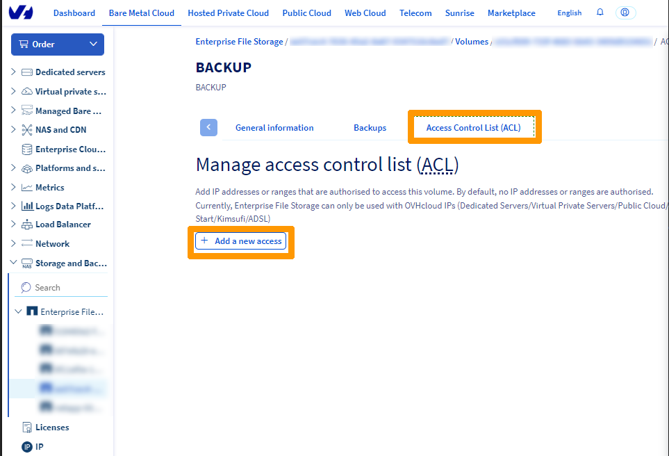{.thumbnail}

Saisisissez, dans le champ « Access à », l'adresse IP publique utilisée sur la VM Veeam Backup qui sert de passerelle Internet.
Choisissez, dans le champ « Autorisations d'accès », `Read and write`{.action}.

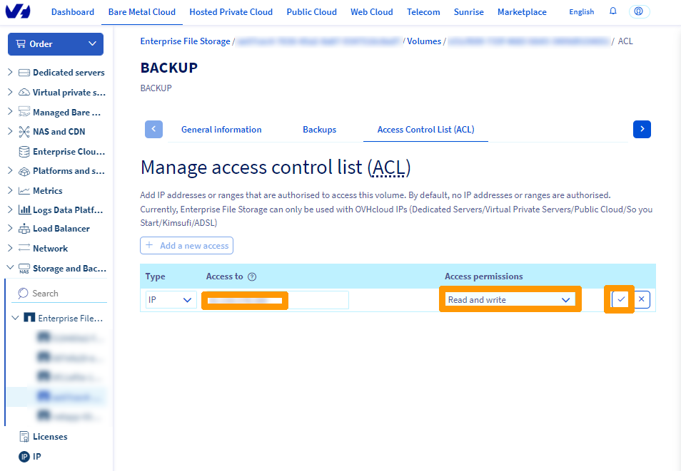{.thumbnail}

Un fois validé, un message vous informe que le contrôle d'accès a été créé.

{.thumbnail}

Dans l'onglet `Informations générales`{.action}, cliquez maintenant sur l'icône de `Copie`{.action} pour copier le chemin d'accès (*Mount path*).  

> [!primary]
> L'élément copié est le dépôt qui est utilisé par **Veeam Backup**.
> La syntaxe doit être similaire à : **adresseip://share_name**.
>

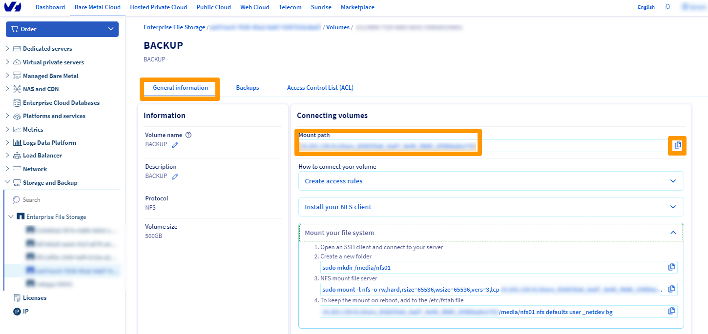{.thumbnail}

### Ajouter le dépôt Enterprise File Storage dans Veeam Backup

Via la console **Veeam Backup**, cliquez en bas à droite sur `Backup Infrastructure`{.action}, choisissez `Backup Repositories`{.action} et cliquez sur `Add repository`{.action}. 

{.thumbnail}

Choisissez `Network attached storage`{.action}. 

{.thumbnail}

Cliquez sur `NFS share`{.action}.

{.thumbnail}

Nommez le dépôt et cliquez sur `Next`{.action}.

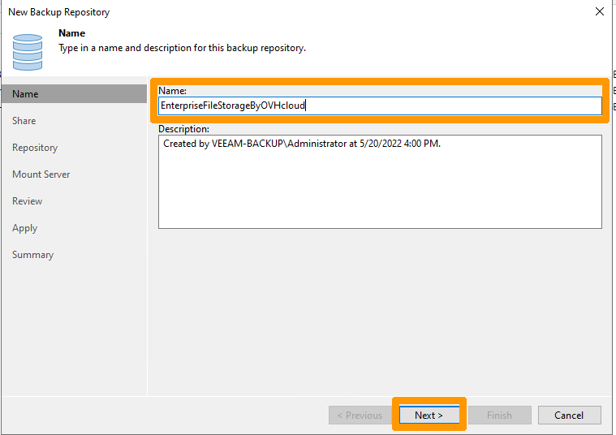{.thumbnail}

Dans le champ « Shared folder », saisissez ou collez le nom du volume partagé et cliquez sur `Next`{.action}.

> [!primary]
> Saisissez ici le chemin d'accès (*Mount path*) copié depuis l'espace client OVHcloud.
>

{.thumbnail}

Cliquez sur `Next`{.action}.

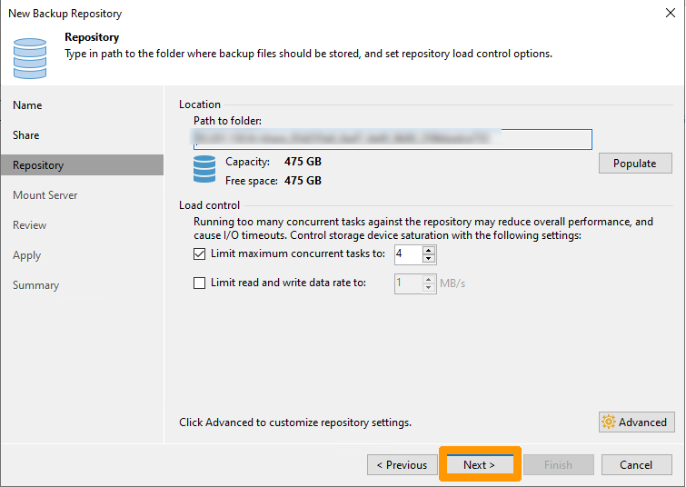{.thumbnail}

Cliquer sur `Next`{.action}.

{.thumbnail}

Cliquez sur `Apply`{.action}.

{.thumbnail}

Cliquez sur `Next`{.action}.

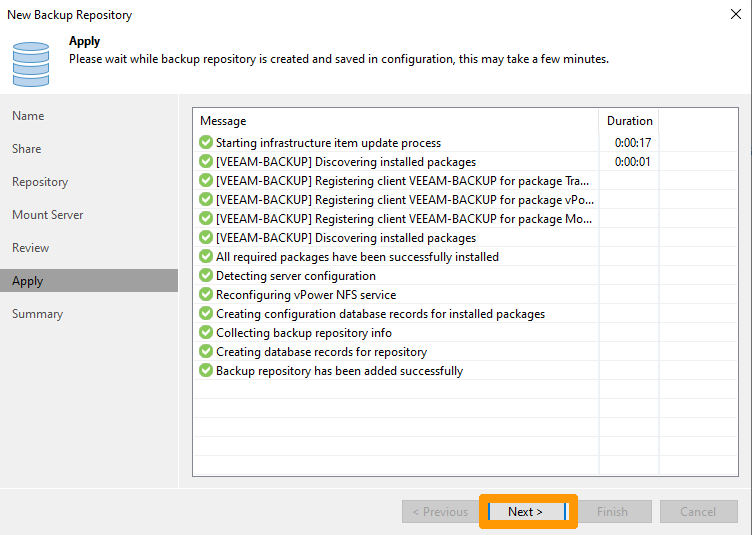{.thumbnail}

Cliquez sur `Finish`{.action}.

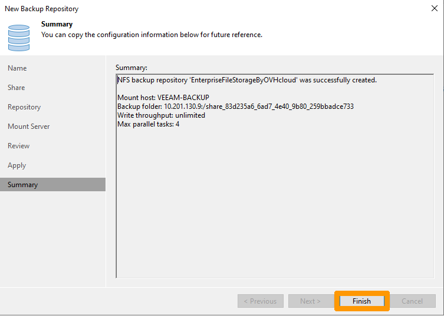{.thumbnail}

### Mise en place d'une sauvegarde automatisée

Dans **Veeam backup**, ouvrez le menu `Home`{.action} (en bas à gauche), puis le menu `Backup Job`{.action} et choisissez `Nutanix AHV`{.action}.

{.thumbnail}

L'interface WEB du **Proxy AHV** s'ouvre.

Nommez la tâche à créer, cochez l'option `Backup job`{.action} et cliquez sur `Next`{.action}.

{.thumbnail}

Cliquez sur `Add`{.action}.

{.thumbnail}

Sélectionnez les machines virtuelles que vous souhaitez sauvegarder et cliquez sur `Add`{.action}.

{.thumbnail}

Cliquez sur `Next`{.action}.

{.thumbnail}

Sélectionnez le dépôt dans `Backup repository`{.action} et cliquez sur `Next`{.action}.

{.thumbnail}

Cochez la case `Run the job automatically`{.action}, définissez la périodicité et cliquez sur `Next`{.action}.

{.thumbnail}

Cliquez sur `Finish`{.action} pour enregistrer la tâche de sauvegarde.

{.thumbnail}

La sauvegarde est visible au travers de l'interface WEB du **Proxy AHV**.

{.thumbnail}

Revenez dans la console **Veeam Backup** via le menu `Home`{.action} (en bas à gauche). Cliquez sur `Jobs`{.action} pour voir la tâche de sauvegarde créée.

{.thumbnail}

### Restauration d'un ordinateur virtuel

Pour tester le bon fonctionnement des sauvegardes, nous allons exécuter une tâche de restauration.

Cliquez en bas à gauche sur `Home`{.action}. Dans l'option `Restore`{.action}, sélectionnez `Nutanix AHV`{.action}.

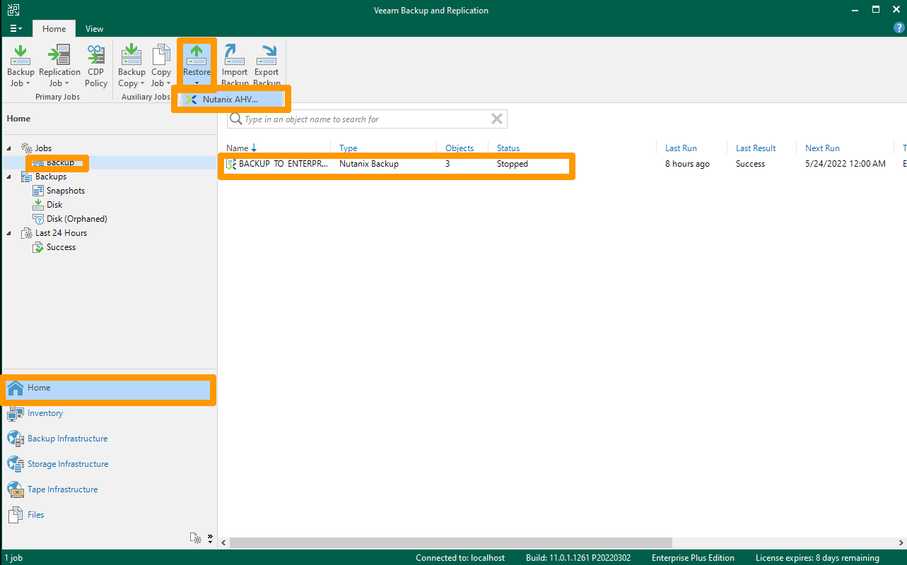{.thumbnail}

Cliquez sur `Restore from AHV backup`{.action}.

{.thumbnail}

Cliquez sur `Entire VM restore`{.action}.

{.thumbnail}

Cliquez sur `Add`{.action}.

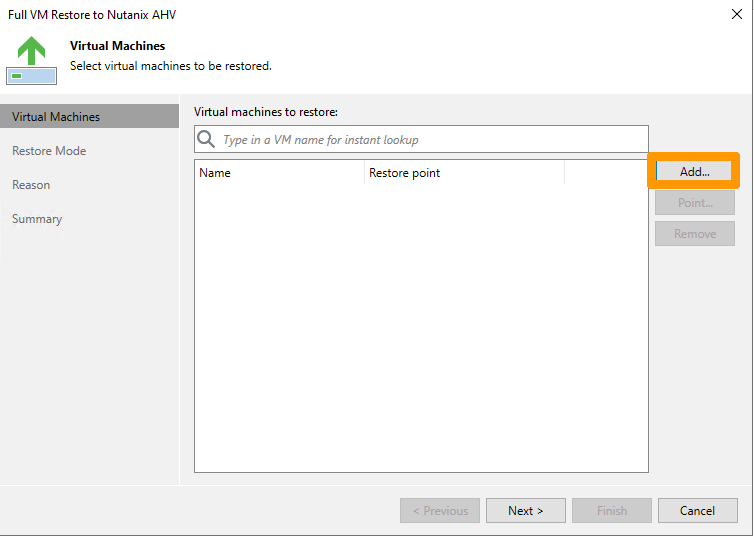{.thumbnail}

Sélectionnez une machine virtuelle et cliquez sur `Add`{.action}.

{.thumbnail}

Cliquez sur `Next`{.action}.

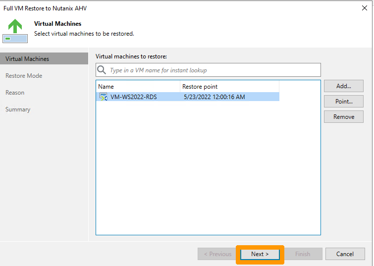{.thumbnail}

Choisissez l'option `Restore to a new location, or with different settings`{.action} et cliquez sur `Next`{.action}.

{.thumbnail}

Cliquez sur `Next`{.action}.

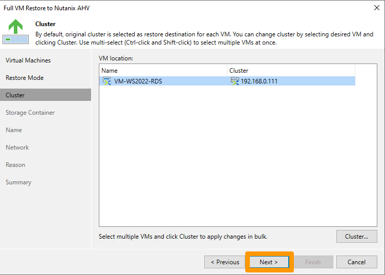{.thumbnail}

Cliquez sur `Next`{.action}.

{.thumbnail}

Renommez la VM dans `New name`{.action} et cliquez sur `Next`{.action}.

{.thumbnail}

Cliquez sur `Disconnect`{.action} pour isoler la machine virtuelle restaurée du réseau.

{.thumbnail}

Cliquez sur `Next`{.action}.

{.thumbnail}

Cliquez sur `Next`{.action}.

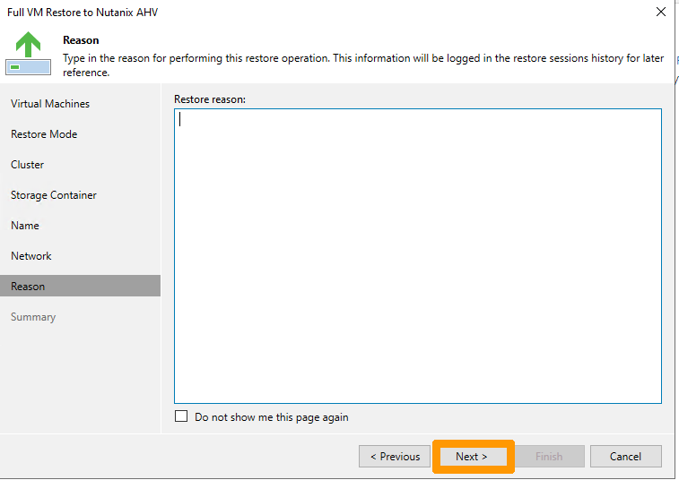{.thumbnail}

Cliquez sur `Finish`{.action}.

{.thumbnail}

Un aperçu de l'état de la restauration se lance, il faut patienter quelques temps en fonction de la taille de la machine virtuelle.

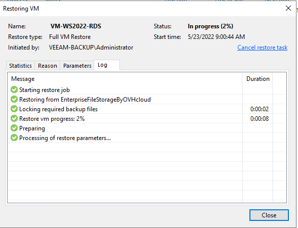{.thumbnail}

## Aller plus loin <a name="gofurther"></a>

[Documentation VEEAM sur l'installation de VEEAM Backup pour Nutanix AHV](https://helpcenter.veeam.com/docs/van/userguide/installing.html?ver=30)

[Les solutions de stockage OVHcloud](https://docs.ovh.com/fr/storage/)

Échangez avec notre communauté d'utilisateurs sur <https://community.ovh.com/>.
