## Objectif

Ce guide vous détaille comment mettre en place des réplications et des plans de reprises d'activités avancés avec **Nutanix Leap** dans **Prism Central**.

## Présentation

Nutanix Leap permet :

- de faire des réplication asynchrones et synchrones en fonction du pack de licence choisi ;
- de tester les réplications ;
- de faire des plans de reprises d'activités avancés avec le démarrage de machine virtuelles et, dans certains cas, une automatisation de la bascule d'un cluster à l'autre (uniquement avec une réplication synchrone et un témoin de cluster) ;
- d'avoir une destination vers le cloud de Nutanix avec **Xi Leap** (attention, cette solution n'est pas disponible avec les licences fournies par OVHcloud).

> [!warning]
> OVHcloud vous met à disposition des services dont la configuration, la gestion et la responsabilité vous incombent. Il vous appartient donc de ce fait d’en assurer le bon fonctionnement.
>
> Ce guide a pour but de vous accompagner au mieux sur des tâches courantes. Néanmoins, nous vous recommandons de faire appel à un prestataire spécialisé si vous éprouvez des difficultés ou des doutes concernant l’administration, l’utilisation ou la mise en place d’un service sur un serveur.
>

## Prérequis

- Disposer de deux clusters Nutanix dans votre compte OVHcloud.
- Être connecté à votre [espace client OVHcloud](https://www.ovh.com/auth/?action=gotomanager&from=https://www.ovh.com/fr/&ovhSubsidiary=fr).
- Être connecté à vos clusters via **Prism Central**.
- Avoir mis en place une interconnexion entre deux clusters, par exemple à l'aide de ces technologies :
    - via un VPN IPsec comme détaillé dans le guide « [Interconnexion IPsec entre deux sites](/pages/cloud/nutanix/44-ipsec-interconnection) »;
    - ou via une connexion [vRack](https://www.ovh.com/fr/solutions/vrack/).
- **Prism Central** a besoin de plus de ressources en fonction du mode :
    - Single Mode : 4Go de RAM supplémentaires.
    - Scale Mode avec 3 machines virtuelles **Prism Central** : 8 Go de RAM supplémentaires par machine virtuelle.

## En pratique

Notre plan de reprise d'activité au travers de **Nutanix Leap** sera mis en place entre deux clusters, les deux se trouvant dans des datacenters OVHcloud distants, l'un au Canada et l'autre en France. Les deux clusters sont reliés par un VPN IPSec avec cette configuration réseau :

- LAN d'administration du cluster en France : **192.168.0.0/24**.
- LAN d'administration du cluster au Canada : **192.168.10.0/24**.

- LAN de production pour les machines virtuelles, commun aux deux clusters : **192.168.50.0/24** sur le VLAN 50.
- LAN de test commun aux deux clusters : **192.168.51.0/25** sur le VLAN 51.

### Mise en service de Nutanix Leap

#### Ajout d'une adresse IP en iSCSI sur chaque cluster

Avant d'activer **Nutanix Leap**, il est nécessaire de rajouter une adresse IP pour les connexions iSCSI sur chacun des clusters.

Par le biais de **Prism Central**, connectez-vous à **Prism Element** sur le cluster se trouvant en France. Vous pouvez utiliser le guide [Hyperconvergence Nutanix](/pages/cloud/nutanix/03-nutanix-hci) pour vous aider.

En haut à gauche du tableau de bord de **Prism Element**, cliquez sur `Le nom du cluster`{.action}.

{.thumbnail}

Vérifiez l'adresse IP dans le champ **iSCSI Data Service IP**.

{.thumbnail}

Toujours via **Prism Central**, effectuez maintenant la même opréation sur le cluster se trouvant au Canada.

En haut à gauche du tableau de bord de **Prism Element**, cliquez sur `Le nom du cluster`{.action}.

{.thumbnail}

Vérifiez l'adresse IP dans le champ **iSCSI Data Service IP**.

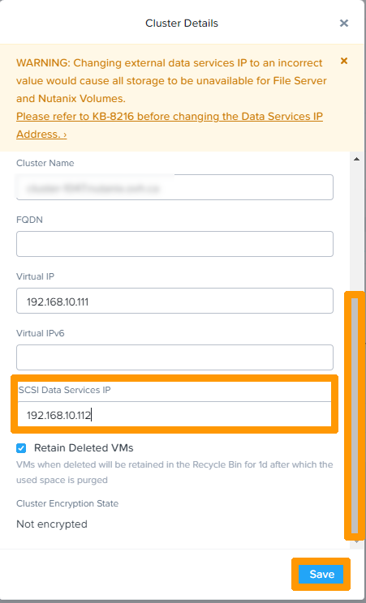{.thumbnail}

#### Activation de Leap

Revenez sur l'interface **Prism Central** du cluster se trouvant en France.

Depuis le menu principal, cliquez sur `Recovery Plans`{.action} dans le sous-menu `Data Protection`

{.thumbnail}

Cliquez sur `Enable Leap`{.action}.

{.thumbnail}

Lorsque la mention `Prechecks successful` apparaît à l'écran, cliquez sur `Enable`{.action}.

{.thumbnail}

Revenez à présent sur l'interface **Prism Central** du cluster se trouvant au Canada et effectuez la même manipulation.

Cliquez sur `Recovery Plans`{.action}.

{.thumbnail}

Cliquez sur `Enable Leap`{.action}.

{.thumbnail}

Là aussi, Lorsque la mention `Prechecks successful` apparaît à l'écran, cliquez sur `Enable`{.action}.

{.thumbnail}

Chacun des clusters a maintenant une **Availability zone**, ce qui permet de les interconnecter.

### Connexion des deux clusters.

Restez sur **Prism Central** dans le cluster se trouvant au Canada.

Depuis le menu principal, cliquez sur `Availability Zones`{.action} sous `Administration`.

{.thumbnail}

Cliquez ensuite sur `Connect to Availability Zone`{.action}.

{.thumbnail}

Saisissez ces informations :

- **Availability Zone Type** : `Physical Location`.
- **IP Address for Remote PC** : `Adresse IP du Prism Central distant`.
- **Username** : `Compte administrateur du Prism Central distant`.
- **Password** : `Mot de passe du compte du Prism Central distant`.

Cliquez ensuite sur `Connect`{.action}.

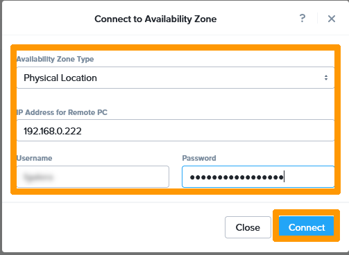{.thumbnail}

Le cluster distant apparait avec comme nom l'adresse IP privée du **Prism Central** se trouvant en France, précédé de **PC_**.

{.thumbnail}

Connectez-vous au cluster en France avec **Prism Central**. 

Depuis le menu principal, cliquez sur `Availability Zones`{.action} dans le sous-menu `Administration`. Vous constaterez que le site distant du Canada apparait avec l'adresse IP privée du **Prism Central** se trouvant au Canada précédé de **PC_**.

{.thumbnail}

### Mise en place d'une réplication à partir du Canada vers la France

> [!warning]
> Les machines virtuelles qui seront protégées avec **Nutanix Leap** ne doivent pas être membres d'un **Domain Protection** créé à partir de **Prism Element**. Il existe une procédure sur le site de Nutanix pour effectuer cette migration : [Migration depuis un Domain Protection](https://portal.nutanix.com/page/documents/details?targetId=Leap-Xi-Leap-Admin-Guide-v6_1:ecd-ecdr-migratevm-protectiondomaintoprotectionpolicy-pc-t.html){.external}. 
>

#### Création d'une catégorie contenant les machines virtuelles à répliquer

Depuis le menu principal, cliquez sur `Categories`{.action} dans le sous menu `Administration`.

{.thumbnail}

Cliquez sur `New Category`{.action}.

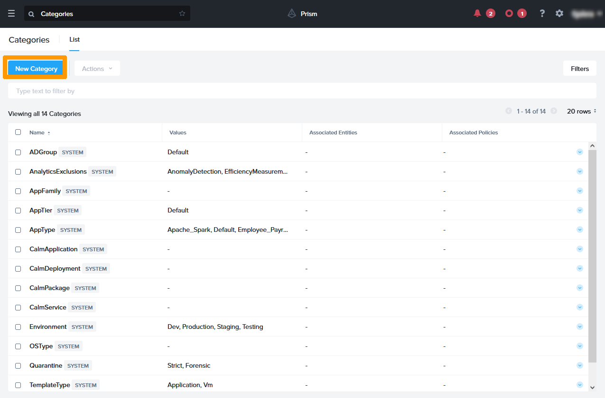{.thumbnail}

Saisissez ces informations :

- **Name** : `replicated-vm`
- **values** : `from-canada`

Cliquez ensuite sur `Save`{.action}.

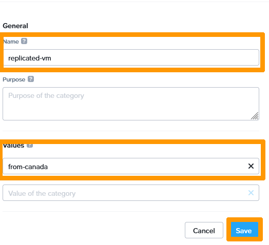{.thumbnail}

De retour dans le menu principal, sélectionnez `VMs`{.action} sous `Compute and Storage`.

{.thumbnail}

Sélectionnez la machine virtuelle à l'aide de la `case à cocher`{.action} à sa gauche puis cliquez sur le bouton `Actions`{.action}.

{.thumbnail}

Dans ce menu, cliquez sur `Manage Categories`{.action}.

{.thumbnail}

Sélectionnez la catégorie créée et cliquez sur le bouton `+`{.action} de couleur bleue.

{.thumbnail}

Cliquez sur `Save`{.action}.

{.thumbnail}

#### Création de la stratégie de protection

Une stratégie de protection crée une réplication planifiée entre deux *Availability zones*. Vous pouvez choisir ce type de planning en fonction de la licence dont vous disposez : 

- asynchrone toutes les heures ;
- *nearsync* entre 1 & 15 minutes ;
- synchrone avec un délai de 0 secondes (ce mode nécessite une latence réseau inférieure à 5ms entre les deux clusters).

Depuis le menu principal, cliquez sur `Protection Policies`{.action} sous `Data Protection`.

{.thumbnail}

Cliquez sur `Create Protection Policy`{.action}. 

{.thumbnail}

Saisissez `le nom de la stratégie` dans le champ **Policy name**.

Dans le cadre **Primary location**, choisissez ces options : 

- **Location** : `Local AZ` pour choisir la zone contenant le cluster local.
- **Cluster** : `Cluster contenant les machines virtuelles à répliquer`.

Cliquez sur `Save`{.action}.

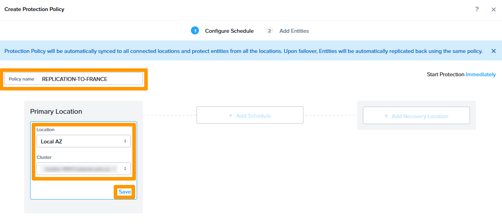{.thumbnail}

Dans le cadre **Recovery location**, choisissez ces options :

- **Location** : `Zone du cluster distant`.
- **Cluster** : `Cluster de destination`.

Cliquez sur `Save`{.action}.

{.thumbnail}

Cliquez ensuite sur `+ Add schedule`{.action}.

{.thumbnail}

Choisissez `Asynchronous` comme **Protection Type**.

Modifiez l'option **Take Snapshot Every** à `Minutes : 15` pour faire une réplication *nearsync*.

Cochez la case `Take App-Consistent Snapshots` et cliquez sur `Save Schedule`{.action}.

{.thumbnail}

Cliquez sur `Next`{.action}.

{.thumbnail}

Sélectionnez la `catégorie` où la machine virtuelle a été ajoutée et cliquez sur `Add`{.action}.

{.thumbnail}

Cliquez sur `Create`{.action}.

{.thumbnail}

La stratégie de protection est activée et apparaît dans le tableau de bord des **Protection Policies**.

{.thumbnail}

### Gestion des plans de reprises d'activité

#### Présentation 

Il est possible de créer des plans de reprises d'activités avec diverses options : 

- Lancement manuel du plan de reprise d'activité si l'on n'a pas de témoin de cluster.
- Automatisation du plan de reprise d'activité en réplication synchrone avec un témoin de cluster.
- Choix du démarrage des machines virtuelles lors de l'activation du plan de reprise d'activité avec la possibilité d'exécuter un script.

Dans notre exemple, il s'agira d'un plan de reprise d'activité manuel comprenant le démarrage automatique des machines virtuelles.

#### Création du plan de reprise d'activité

Depuis le menu principal, choisissez `Recovery Plans`{.action} sous `Data Protection`.

{.thumbnail}

Cliquez sur `Create New Recovery Plan`{.action}. 

{.thumbnail}

Saisissez ces valeurs : 

- **Recovery Plan Name** : `nom du plan de reprise d'activité`.
- **Primary Location** : `Local AZ` pour choisir la zone contenant le cluster local.
- **Recovery Location** : `Nom de la Zone distante` qui servira pour le plan de reprise d'activité.

Cliquez sur `Next`{.action}. 

{.thumbnail}

Cliquez sur `Add Entities`{.action}. 

{.thumbnail}

Cochez la `case`{.action} à côté de la machine virtuelle qui fait partie du plan de reprise d'activité puis cliquez sur `Add`{.action}.

{.thumbnail}

Cochez la `case`{.action} à coté de la machine virtuelle qui doit démarrer automatiquement lors de l'activation du plan de reprise d'activité.

Cliquez ensuite sur `Next`{.action}. 

{.thumbnail}

Après avoir pris connaissance de la présentation du plan de reprise d'activité, cliquez sur `OK, Got it`{.action}. 

{.thumbnail}

Sur le site primaire, choisissez ces options :

- **Production** : `VLAN de production`.
- **Test Failback** : `VLAN de test`. 

Sur le site de reprise, choisissez ces options :

- **Production** : `VLAN de production`.
- **Test Failback** : `VLAN de test`. 

Cliquez ensuite sur `Done`{.action}. 

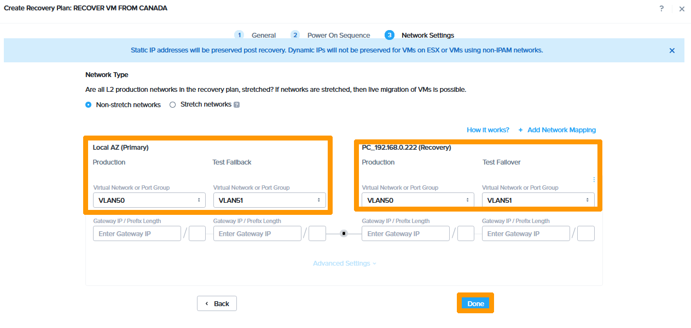{.thumbnail}

Le plan de reprise d'activité apparaît dans la liste.

{.thumbnail}

#### Migration programmée 

##### **Migration du site se trouvant au Canada vers la France**

Connectez-vous avec **Prism Central** sur le cluster en France pour basculer la machine virtuelle du Canada vers la France.

Depuis le menu principal, choisissez `Recovery Plans`{.action} dans la rubrique `Data Protection`.

{.thumbnail}

Sélectionnez le plan de reprise d'activité en utilisant la `case à cocher` à sa gauche puis cliquez sur le bouton `Actions`{.action} pour faire apparaitre le menu.

{.thumbnail}

Cliquez sur `Failover`{.action}. 

{.thumbnail}

Sélectionnez `Planned Failover`{.action} comme type de Failover puis cliquez sur le bouton `Failover`{.action}.

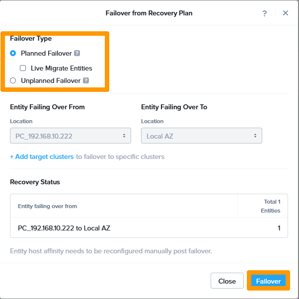{.thumbnail}

Saisissez `Failover`{.action} dans le champ de confirmation et cliquez sur le bouton `Failover`{.action}.

{.thumbnail}

Les étapes de migration sont décrites ci-dessous :

1. Arrêt de la machine virtuelle sur le cluster d'origine.
2. Synchronisation des dernières modifications.
3. Suppression de la machine virtuelle sur le cluster d'origine.
4. Ajout de la machine virtuelle sur le cluster de destination.
5. Démarrage de la machine virtuelle sur le cluster de destination.

Le résultat de de la migration apparait dans la colonne **Last Failover Status** avec le statut `Succeeded` si tout s'est bien passé.

{.thumbnail}

##### **Inversion de la réplication**

Dans le cas d'un basculement programmé, vous devez inverser la réplication pour continuer à avoir la redondance entre les deux sites.

Par le biais de **Prism Central**, connectez-vous sur le cluster de destination en France.

Dans le menu principal, choisissez `Protection Policies`{.action} dans le sous-menu `Data Protection`.

{.thumbnail}

Cochez la `case`{.action} à gauche de la stratégie de protection et cliquez sur le bouton `Actions`{.action}.

{.thumbnail}

Cliquez sur le bouton `Update`{.action}.

{.thumbnail}

Positionnez-vous à gauche en dessous de `Primary Location` jusqu'à ce qu'un menu apparaisse. Cliquez sur `Edit`{.action}.

{.thumbnail}

Modifiez les informations suivantes dans le cadre **Primary Location** :

- **Location** : `Local AZ`
- **Cluster** : `cluster de la zone locale`

Cliquez ensuite sur `Save`{.action}.

{.thumbnail}

Cliquez sur `Update Location`{.action}.

{.thumbnail}

Positionnez-vous à droite en dessous de la destination jusqu'à ce qu'un menu apparaisse. Cliquez sur `Edit`{.action}.

{.thumbnail}

Modifiez alors les informations suivantes dans le cadre **Recovery Location** :

- **Location** : `zone de destination`.
- **cluster** : `cluster de la zone de destination`.

Cliquez sur `Save`{.action}.

{.thumbnail}

Cliquez sur `Update Location`{.action}.

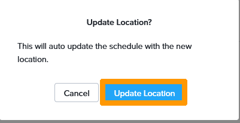{.thumbnail}

Cliquez sur `Next`{.action}. 

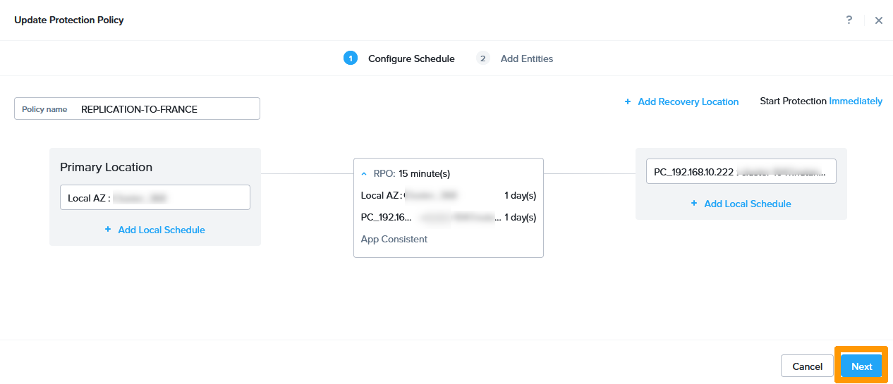{.thumbnail}

Cliquez sur `Update`{.action} pour finaliser l'inversion.

{.thumbnail}

##### **Modification du plan de reprise d'activité**

Vous devez aussi modifier le plan de reprise d'activité en inversant la source et la destination.

Dans le menu principal, choisissez `Recovery Plans`{.action} dans le sous-menu `Data Protection`.

{.thumbnail}

Sélectionnez le plan de reprise d'activité à l'aide de la `case à cocher`{.action} à sa gauche puis cliquez sur le bouton `Actions`{.action}.

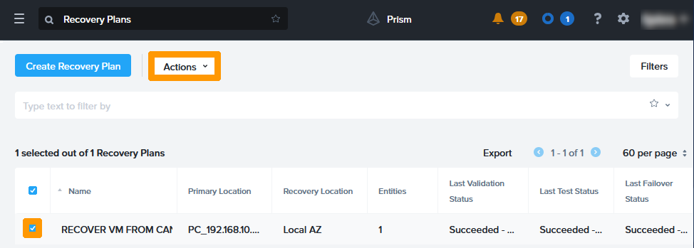{.thumbnail}

Dans le menu d'actions, cliquez sur `Update`{.action}.

{.thumbnail}

Remplacez, dans le menu déroulant **Primary Location** à gauche, le cluster distant par `Local AZ`{.action}.

{.thumbnail}

Choisissez `La zone distante`{.action} dans **Recovery Location** à droite à la place de Local AZ.

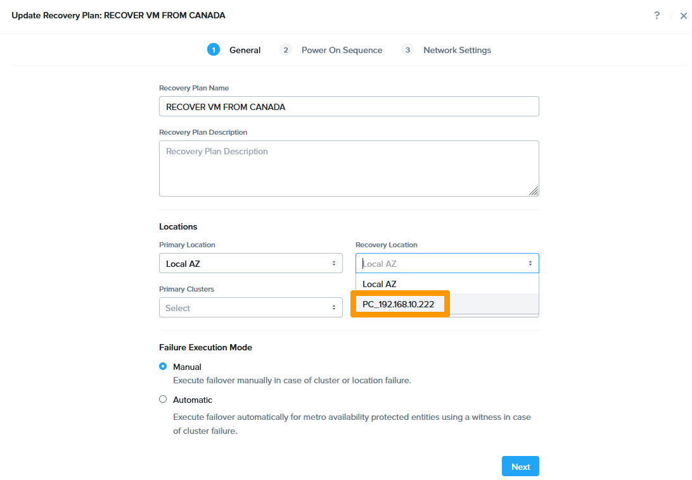{.thumbnail}

Maintenant que la source et la destination du plan de reprise d'activité sont modifiées, cliquez sur `Next`{.action}.

{.thumbnail}

Cliquez sur `Proceed`{.action}.

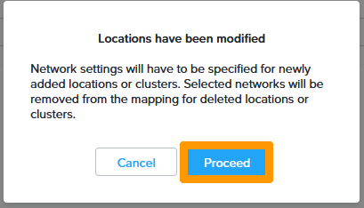{.thumbnail}

Sélectionnez la `Machine virtuelle` qui doit démarrer lors du plan de reprise d'activité et cliquez sur `Next`{.action}.

{.thumbnail}

Sur le site primaire, choisissez ces options :

- **Production** : `VLAN de production`
- **Test Failback** : `VLAN de test` 

Sur le site de destination choisissez ces options :

- **Production** : `VLAN de production`
- **Test Failover** : `VLAN de test` 

Cliquez ensuite sur `Done`{.action}. 

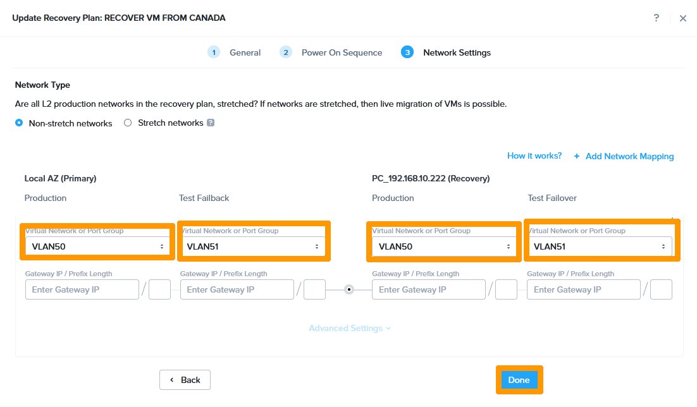{.thumbnail}

Le plan de reprise d'activité est modifié pour permettre la bascule des machines virtuelles du cluster se trouvant en France vers celui se trouvant au Canada. 

Si vous souhaitez revenir au fonctionnement d'origine, vous devrez refaire un failover, modifier la réplication et le plan de reprise d'activité.

{.thumbnail}

#### Activation du plan de reprise d'activité suite à un incident sur le cluster d'origine

Le plan de reprise d'activité sert aussi en cas de problème sur le cluster d'origine. Dans ce cas, l'activation se fera sans les données modifiées depuis la dernière synchronisation.

Si l'on utilise une solution de réplication synchrone, aucune perte de données ne sera à déplorer.

Dans notre cas, la réplication est programmée toutes les 15 minutes, le risque de perte de données peut, dans le pire des cas, correspondre à cette durée.

Depuis **Prism Central**, connectez-vous au cluster qui est le destinataire des replications.

Dans le menu principal, choisissez `Recovery Plan`{.action} dans le sous menu `Data Protection`.

{.thumbnail}

Sélectionnez le plan de reprise d'activité avec `la case à cocher`{.action} et cliquez sur le bouton `Actions`{.action}.

{.thumbnail}

Choisissez `Failover`{.action} dans le menu. 

{.thumbnail}

Cochez `Unplanned Failover`{.action} et cliquez sur `Failover`{.action}

{.thumbnail}

Saisissez `Failover` dans le champ de confirmation et cliquez sur `Failover`{.action}

{.thumbnail}

La machine virtuelle membre du plan de reprise d'activité va démarrer sur le cluster de destination avec le contenu de la dernière réplication.

## Aller plus loin

[Plan de reprise d'activité sur Nutanix](/pages/cloud/nutanix/43-disaster-recovery-plan-overview)

[Interconnexion IPsec entre deux sites](/pages/cloud/nutanix/44-ipsec-interconnection)

[OVHcloud vRack](https://www.ovh.com/fr/solutions/vrack/)

[Documentation Nutanix Leap](https://portal.nutanix.com/page/documents/details?targetId=Leap-Xi-Leap-Admin-Guide-v6_1:Leap-Xi-Leap-Admin-Guide-v6)

Si vous avez besoin d'une formation ou d'une assistance technique pour la mise en oeuvre de nos solutions, contactez votre commercial ou cliquez sur [ce lien](https://www.ovhcloud.com/fr/professional-services/) pour obtenir un devis et demander une analyse personnalisée de votre projet à nos experts de l’équipe Professional Services.

Échangez avec notre communauté d'utilisateurs sur <https://community.ovh.com/>.
