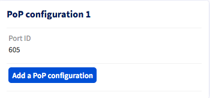
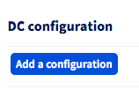
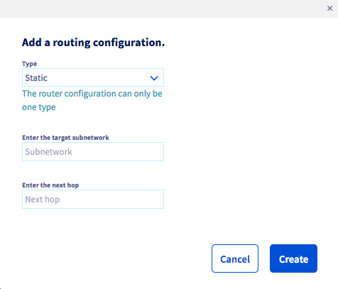
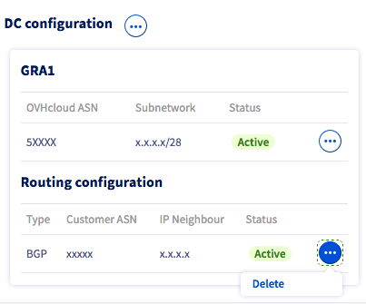

**Last updated 28th September 2020**

## Objective

With OVHcloud Connect, you can link your company network to your private OVHcloud vRack network, without creating a VPN tunnel through the internet. This will give you a quicker, more stable connection with guaranteed bandwidth. 

**This guide will show you how to set up the OVHcloud Connect Provider solution via the OVHcloud Control Panel**

## Requirements

> [!warning]
> To ensure correct operation of this service, you must be aware of the [technical capabilities and limitations of the OVHcloud Connect solution](/pages/cloud/ovhcloud-connect/occ-limits) and configure your network devices accordingly.
>

- An [OVHcloud Connect Provider solution](https://www.ovhcloud.com/en-ie/network-security/ovhcloud-connect/)
- An OVHcloud [vRack](https://www.ovh.co.uk/solutions/vrack/)
- Access to the [OVHcloud Control Panel](https://www.ovh.com/auth/?action=gotomanager&from=https://www.ovh.ie/&ovhSubsidiary=ie)

## Instructions

### Step 1: Ordering your solution

Once you have ordered your OVHcloud Connect Provider solution, you will receive an order confirmation via email, along with a service key.

Depending on the provider you have chosen, go to their portal to log in via the link provided in the order confirmation email. Then enter your service key and confirm the order presented to you.

Next, check the activation status of your solution in the [OVHcloud Control Panel](https://www.ovh.com/auth/?action=gotomanager&from=https://www.ovh.ie/&ovhSubsidiary=ie). To do this, go to the `Bare Metal Cloud`{.action} section and click on `Network`{.action}. Next, open `OVHcloud Connect`{.action} and click on your solution. Your solution's status should have changed to “Active”.

### Step 2: Associating a vRack

Log in to the [OVHcloud Control Panel](https://www.ovh.com/auth/?action=gotomanager&from=https://www.ovh.ie/&ovhSubsidiary=ie), go to the `Bare Metal Cloud`{.action} section and click on `Network`{.action}. Next, open `OVHcloud Connect`{.action} and click on your solution.

{.thumbnail}

You will need to link a vRack to your solution first. Click the `Attach a vRack`{.action} button and select an existing vRack from the drop-down menu. 

{.thumbnail}

A message will confirm the vRack association.

{.thumbnail}

### Step 3: Adding a PoP configuration

> [!warning]
> The OVHcloud Connect Provider solution requires an L3 level configuration.
>

Once you have connected your vRack, click `Add a PoP configuration`{.action}  and select the L3 configuration from the drop-down menu.

{.thumbnail}

You will then need to enter the following:

| Information    | Description |
|:-------:|:------:|
| Customer ASN    | Your AS BGP number, which is configured on your router located in the PoP |
| OVHcloud ASN     | The OVHcloud AS number that will be configured on the OVHcloud Connect routers located in the PoP |
| Subnetwork in /30    | A size /30 IPv4 block, used for the link between your router and the OVHcloud Connect router located in the PoP |

{.thumbnail}

The `PoP configuration` menu will then appear.

{.thumbnail}

### Step 4: Adding a data centre configuration 

When your PoP configuration has been set, click `Add a configuration`{.action} under the `DC configuration` menu.

{.thumbnail}

Select a data centre from the dropdown menu, then enter the information required. 

| Information    | Description |
|:-------:|:------:|
| OVHcloud ASN   | The OVHcloud AS number that will be configured on the OVHcloud Connect routers located in the DC. This number may be different from the ASN chosen for the PoP |
| A /28 subnetwork    |  A private subnetwork configured in your vRack in the selected DC. This can be an IPv4 block of size /28 or higher |

{.thumbnail}

You can add additional data centre configurations by clicking on the `...`{.action} button, then `Add a configuration`{.action}.

{.thumbnail}

You must also add a routing configuration.

##### **Adding a routing configuration**

Click on the `...`{.action} button on the desired data centre then on `Add routing configuration`{.action}.

{.thumbnail}

Then choose the routing type between Static and BGP.

{.thumbnail}

If you choose the BGP type, then enter the required information:

| Information    | Description |
|:-------:|:------:|
| Customer ASN    | Your AS BGP number, which is configured on your router located in the DC |
| IP Neighbour    | IP address of the BGP neighbour of your router in the DC. This address must be part of the subnet specified in the `DC Configuration` menu |

{.thumbnail}

If you choose the Static type, enter the required information:

| Information    | Description |
|:-------:|:------:|
| Subnetwork    | A prefix using CIDR notation |
| Next hop    | IP address acting as gateway in the subnet range |

{.thumbnail}

You can add multiple routing configurations within the same data centre. The configuration type (BGP or Static) chosen for your first configuration will then apply to the next configuration in the same data centre.

{.thumbnail}

### Deletion of vCenter resources

Each resource (PoP or DC) can be deleted individually, but deleting a parent resource such as DC or POP will automatically delete all the subresources.

Recursive removal is slower than sequential removal of each resource.

> [!primary]
> If a DC configuration is shared between two or more OVHcloud Connect services, removing the PoP configuration from a single OVHcloud Connect service will not affect the DC resource.
>

#### Deleting a Routing Configuration

To delete a routing configuration, click the `...`{.action} button on the routing configuration to delete, then click `Delete`{.action}.

{.thumbnail}

#### Deleting a DC configuration

To delete a DC configuration, click the `...`{.action} button on the DC configuration to delete, then click `Delete`{.action}.

{.thumbnail}

> [!primary]
> Deleting a DC configuration will delete the related routing configurations.
>

#### Enabling the configuration

To delete a PoP configuration, click the `...`{.action} button on the PoP configuration, then click `Delete configuration`{.action}.

{.thumbnail}

> [!primary]
> Deleting a PoP configuration will delete the DC and routing configurations.
>

## Go further

If you need training or technical assistance to implement our solutions, contact your sales representative or click on [this link](https://www.ovhcloud.com/en-ie/professional-services/) to get a quote and ask our Professional Services experts for assisting you on your specific use case of your project.

Join our community of users on <https://community.ovh.com/en/>.
