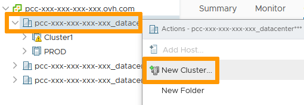

**Last Updated on 07/02/2022**

## Objective

You can set up multiple clusters in your environment to segment your activities. 
Learn how to create them and configure their functionalities (DRS, HA & EVC).

**This guide offers a step by step study case to achieve the objective.**

## Requirements

- Be an administrative contact of your [Hosted Private Cloud infrastructure](https://www.ovhcloud.com/en-gb/enterprise/products/hosted-private-cloud/) to receive login credentials
- Have a user account with access to vSphere (created in the [OVHcloud Control Panel](https://www.ovh.com/auth/?action=gotomanager&from=https://www.ovh.co.uk/&ovhSubsidiary=GB))

## Instructions

### Cluster creation

In the vSphere interface menu, go to the `Networking and Security`{.action} dashboard.

{.thumbnail}

Right click on your Datacenter. 
Select `New Cluster`{.action}.

{.thumbnail}

In the pop up window, name your cluster and select the relevant options you want set.

{.thumbnail}

> [!success]
>
> Ces options peuvent être modifier par la suite, lorsque le cluster est crée, mais il est préférable de le faire lors de création.
> 

> [!warning]
>
> vSAN requires vSAN compatible hosts. Check out [here](https://docs.ovh.com/gb/en/private-cloud/control-panel-ovh-private-cloud/) how to order them if you need.
> 

### DRS

DRS spreads the compute load accross your hosts. 
If you activated the option, it is set on "Fully Automated" by default.

Select your cluster. in the `Configure`{.action} tab, select `vSphere DRS`{.action} and click `Edit`{.action}.

{.thumbnail}

Three options are available to you:

- Manual Mode. DRS generates both power-on placement recommendations, and migration recommendations for virtual machines. Recommendations need to be manually applied or ignored.
- Partially Automated. DRS automatically places virtual machines onto hosts at VM power-on. Migration recommendations need to be manually applied or ignored.
- Fully Automated. DRS automatically places virtual machines onto hosts at VM power-on, and virtual machines are automatically migrated from one host to another to optimize resource utilization.

Automated modes also allow to set the sensitivity of the service, from the most conservative to the most aggressive threshold.

{.thumbnail}

### HA

High Availability allows for redundancy so a failing host will not impact the services running in your VMs. 
If you activated the option, it is set on its default settings.

To modify them, select your cluster. in the `Configure`{.action} tab, select `vSphere HA`{.action} and click `Edit`{.action}.

{.thumbnail}

The response types for the different host failure can be custom set to your need.

{.thumbnail}

### EVC

EVC (Enhanced vMotion Compatibility) allows for migration of live VMs between hosts.

> [!primary]
>
> OVHcloud hosts do not all have same generation CPUs. You'll have to check the hosts in vSphere to determine the right settings.
> 

#### Dedicated Cloud

Si vous disposez d'un Private Cloud de la gamme Dedicated Cloud, vous devrez choisir le mode "AMD Opteron Gen. 3 (no 3DNow!)" visable dans la partie pour les hôtes AMD.

#### SDDC

Si vous disposez d'un Private Cloud de la gamme SDDC, vous devrez choisir le mode "Intel  "Ivy Bridge" Generaton" visible dans la partie pour les hôtes Intel.

#### Avant création

Il vous suffit de choisir la génération correspondante selon la gamme de l'offre Private Cloud que vous avez.

{.thumbnail}

#### Après création

L'activation de l'EVC après a création du cluster se fait dans les paramètres du cluster.

{.thumbnail}

> [!warning]
>
> Attention, l'activation du mode EVC ne peut se faire que sur un cluster n'ayant pas de VM démarré. Sur un cluster en production, deux solutions sont possibles : 
> 
> - Extinction de toutes les VMs, et activation du mode EVC sur le cluster.
>
> - Migration vers un autre cluster en déplaçant les VMs au fur et à mesure :
>
> A - Création d'un autre cluster avec le mode EVC activé (sur la bonne génération)
> 
> B - Mise en maintenance d'un hôte et déplacement de l'hôte sur ce cluster
>
> C - Extinction d'une VM et déplacement vers le nouveau cluster
>
> D - Répétez l'opération B et C jusqu’à ce que l'ancien cluster soit vide.
>

## Aller plus loin

Échangez avec notre communauté d'utilisateurs sur <https://community.ovh.com>.
