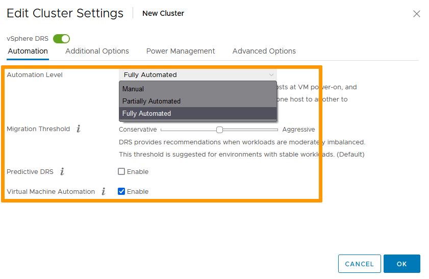
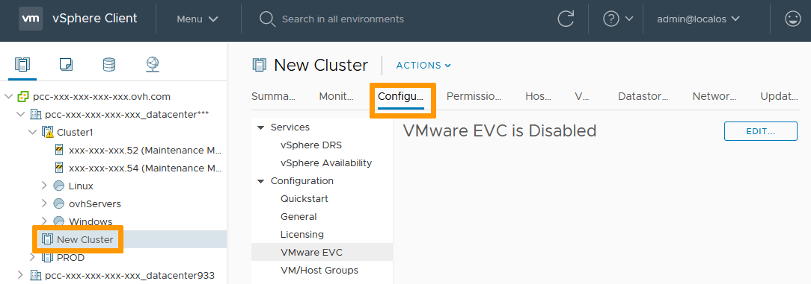
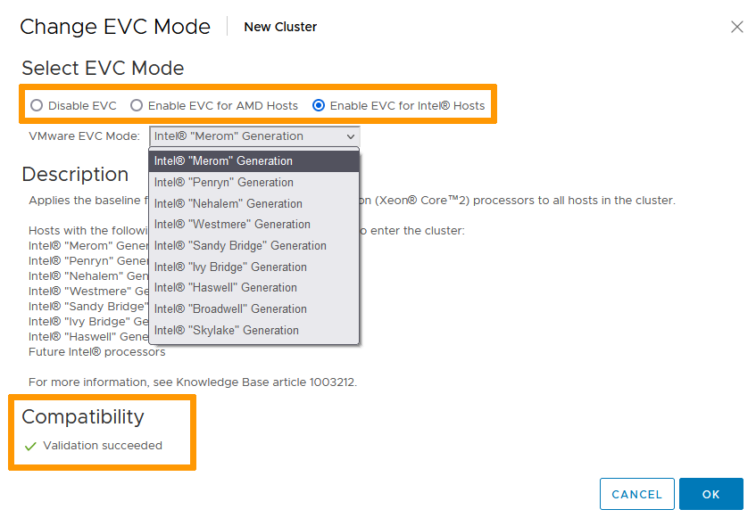

**Dernière mise à jour le 08/02/2022**

## Objectif

Il est possible de créer plusieurs clusters dans votre infrastructure afin de segmenter vos activités. 
Découvrez comment créer et configurer les fonctionaltités de clusters (DRS, HA & EVC).

**Ce guide est un cas d'étude avec les étapes d'installation et de configuration.**

## Prérequis

- Être contact administrateur du [Hosted Private Cloud infrastructure](https://www.ovhcloud.com/fr/enterprise/products/hosted-private-cloud/), pour recevoir des identifiants de connexion.
- Avoir un identifiant utilisateur actif (créé dans l'[espace client OVHcloud](https://www.ovh.com/auth/?action=gotomanager&from=https://www.ovh.com/fr/&ovhSubsidiary=fr))

## En pratique

### Création du cluster

Dans l'interface vSphere, allez dans le tableau de bord `Hôtes et clusters`{.action}.

{.thumbnail}

### Cluster creation

In the vSphere interface menu, go to the `Networking and Security`{.action} dashboard.

{.thumbnail}

Right click on your Datacenter. 
Select `New Cluster`{.action}.

{.thumbnail}

In the pop up window, name your cluster and select the relevant options you want set. 
Click `OK`{.action} when done.

{.thumbnail}

> [!warning]
>
> vSAN requires vSAN compatible hosts. Check out [here](https://docs.ovh.com/gb/en/private-cloud/control-panel-ovh-private-cloud/) how to order them if you need.
> 

### DRS

DRS spreads the compute load accross your hosts. 
If you activated the option, it is set on "Fully Automated" by default.

Select your cluster. in the `Configure`{.action} tab, select `vSphere DRS`{.action} and click `Edit`{.action}.

{.thumbnail}

Three options are available to you:

- Manual Mode. DRS generates both power-on placement recommendations, and migration recommendations for virtual machines. Recommendations need to be manually applied or ignored.
- Partially Automated. DRS automatically places virtual machines onto hosts at VM power-on. Migration recommendations need to be manually applied or ignored.
- Fully Automated. DRS automatically places virtual machines onto hosts at VM power-on, and virtual machines are automatically migrated from one host to another to optimize resource utilization.

Automated modes also allow to set the sensitivity of the service, from the most conservative to the most aggressive threshold. 
Click `OK`{.action} when done.

{.thumbnail}

### HA

High Availability allows for redundancy so a failing host will not impact the services running in your VMs. 
If you activated the option, it is set on its default settings.

To modify them, select your cluster. in the `Configure`{.action} tab, select `vSphere HA`{.action} and click `Edit`{.action}.

{.thumbnail}

The response types for the different host failures can be custom set to your need. 
Click `OK`{.action} when done.

{.thumbnail}

### EVC

EVC (Enhanced vMotion Compatibility) allows for migration of live VMs between hosts.

Prior to activating the functionality, check your hosts summary pages to determine their types.

{.thumbnail}

Select your cluster. in the `Configure`{.action} tab, select `VMware EVC`{.action} and click `Edit`{.action}.

{.thumbnail}

Enable EVC for the type of CPUs your hosts hold. 
Downward compatibility is assured. To help you verify the settings are working, you will see a compatibility validation at the bottom of the window. 
Click `OK`{.action} when done.

{.thumbnail}

> [!warning]
>
> EVC activation can only happen on a cluster with no active VM running. Make sure to turn off or evacuate all VMs before doing it. 
>

### DRS

L'option DRS permet de répartir automatiquement les VMs en fonction de la charge présente sur les hôtes.

> [!success]
>
> Vous pouvez retrouver plus d'informations sur la KB VMware suivante : 
> [https://kb.vmware.com/s/article/2149938](https://kb.vmware.com/s/article/2149938)
> 

Cochez la case pour activer l'option et choisissez le mode de migration.

{.thumbnail}

- En mode "manuelle", DRS ne déplacera pas les VMs, vous devrez gérer le déplacement et la répartition de vos VMs de manière autonome.

- En mode "partiellement automatisé", DRS vous conseillera sur des migrations de vos VMs, mais ne les fera que si vous validez le déplacement.

- En mode "Entièrement automatisé", DRS déplacera les VMs automatiquement sans validation de votre part, et en fonction de la charge présente sur les hôtes.

Dans les deux modes "automatisé", il est possible de régler le seuil de migration sur cinq niveaux, de modéré à élevé (1 étant le plus modéré, et 5 le plus élevé).

Plus le seuil est élevé, plus le service DRS sera sensible à l'équilibre du cluster.

### HA

L'option HA permet de redémarrer des machines virtuelles en cas de dysfonctionnement survenant sur un hôte.

> [!success]
>
> Vous pouvez retrouver plus d'informations sur la KB VMware suivante : 
> [https://kb.vmware.com/s/article/2148003](https://kb.vmware.com/s/article/2148003)
> 

> [!warning]
>
> Si le service HA n'est pas activé, les SLA ne seront pas applicables.
> 

{.thumbnail}

- Après avoir créé un cluster, la "surveillance d'hôte" permet à l'hôte maître du cluster HA de répondre aux défaillances des hôtes ou des machines virtuelles et à l'isolation du réseau de gestion. La priorité de redémarrage et la réponse d'isolement des hôtes et des VMs déterminent comment vSphere HA répond aux défaillances des hôtes et aux isolations.

- Le "contrôle d'admission" permet de spécifier si les machines virtuelles peuvent être démarrées si elles violent les contraintes de disponibilité. Le cluster réserve des ressources pour permettre le basculement de toutes les machines virtuelles en cours d'exécution sur le nombre d'hôtes spécifié.

- La fonction "surveillance des machines virtuelles" utilise les informations de signal de pulsation capturées par VMware Tools comme proxy pour la disponibilité des systèmes d'exploitation clients. Cette fonction permet à vSphere HA de réinitialiser ou de redémarrer automatiquement les machines virtuelles qui ont perdu leur capacité de produire un signal de pulsation.

### EVC

L'option EVC (Enhanced vMotion Compatibility) permet de déplacer des machines virtuelles à chaud entre des hôtes disposant de processeurs avec des générations différentes.

> [!primary]
>
> OVH pouvant mettre à disposition des hôtes disposant de processeur de génération différente, il est important d'activer cette option sur votre cluster afin de ne pas être bloquer dans la migration de machines virtuelles.
> 

> [!success]
>
> Vous pouvez retrouver plus d'informations sur les KB VMware suivantes : 
>
> [https://kb.vmware.com/s/article/1005764](https://kb.vmware.com/s/article/1005764)
> 
> [https://kb.vmware.com/s/article/1003212](https://kb.vmware.com/s/article/1003212)
>

#### Dedicated Cloud

Si vous disposez d'un Private Cloud de la gamme Dedicated Cloud, vous devrez choisir le mode "AMD Opteron Gen. 3 (no 3DNow!)" visable dans la partie pour les hôtes AMD.

#### SDDC

Si vous disposez d'un Private Cloud de la gamme SDDC, vous devrez choisir le mode "Intel  "Ivy Bridge" Generaton" visible dans la partie pour les hôtes Intel.

#### Avant création

Il vous suffit de choisir la génération correspondante selon la gamme de l'offre Private Cloud que vous avez.

{.thumbnail}

#### Après création

L'activation de l'EVC après a création du cluster se fait dans les paramètres du cluster.

{.thumbnail}

> [!warning]
>
> Attention, l'activation du mode EVC ne peut se faire que sur un cluster n'ayant pas de VM démarré. Sur un cluster en production, deux solutions sont possibles : 
> 
> - Extinction de toutes les VMs, et activation du mode EVC sur le cluster.
>
> - Migration vers un autre cluster en déplaçant les VMs au fur et à mesure :
>
> A - Création d'un autre cluster avec le mode EVC activé (sur la bonne génération)
> 
> B - Mise en maintenance d'un hôte et déplacement de l'hôte sur ce cluster
>
> C - Extinction d'une VM et déplacement vers le nouveau cluster
>
> D - Répétez l'opération B et C jusqu’à ce que l'ancien cluster soit vide.
>

## Aller plus loin

Échangez avec notre communauté d'utilisateurs sur <https://community.ovh.com>.
