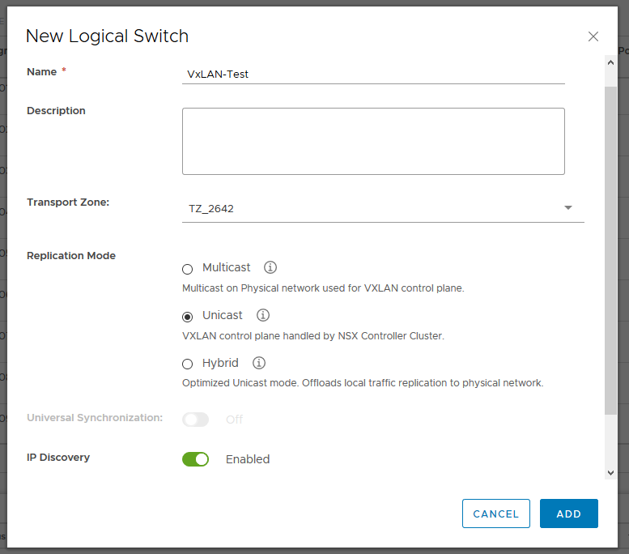

> [!primary]
> Diese Übersetzung wurde durch unseren Partner SYSTRAN automatisch erstellt. In manchen Fällen können ungenaue Formulierungen verwendet worden sein, z.B. bei der Beschriftung von Schaltflächen oder technischen Details. Bitte ziehen Sie beim geringsten Zweifel die englische oder französische Fassung der Anleitung zu Rate. Möchten Sie mithelfen, diese Übersetzung zu verbessern? Dann nutzen Sie dazu bitte den Button «Mitmachen» auf dieser Seite.
>

**Letzte Aktualisierung am 12.10.2020**

## Ziel

In einer Hosted Private Cloud Infrastruktur verfügen Sie über eine Basis von 10 von NSX gelieferten VxLANs und 11 mit dem vRack gelieferten VLANs.

**Diese Anleitung erläutert die Erstellung zusätzlicher V(x)LANs.**

## Voraussetzungen

- Sie haben Zugriff auf den vSphere Web Client (HTML5)

## In der praktischen Anwendung

Bei den Hosted Private Cloud Angeboten verfügen Sie über zwei verteilte virtuelle Switches (vDS). 

Diese *vDS* haben mehrere *port groups*, die jeweils von Nutzen sind.

Der erste gemeinsame vDS für beide Angebote verfügt über zwei Arten von *port groups*: 

- VMnetwork für die Kommunikation ins Internet
- von NSX verwaltete VxLANs zur Isolierung privater Kommunikation innerhalb der Hosted Private Cloud

Der zweite vDS verfügt über eine einzige Art von *port groupp*: 

- VLANs zur Isolierung privater Kommunikation innerhalb der Hosted Private Cloud und zwischen den verschiedenen vRack kompatiblen OVHcloud Diensten (Dedicated Server, Public Cloud...) 

### VxLAN - NSX 

In den Angeboten Hosted Private Cloud verfügen Sie über einen ersten virtuellen Switch. 

Auf diesem Switch werden 10 VxLANs als Basis erstellt. Indem Sie die `NSX`-Berechtigung [für die Benutzerverwaltung Ihres Kundencenters eingeben](../manager-ovh-private-cloud/#benutzer), können Sie auf das NSX-Interface zugreifen und zusätzliche VxLANs erstellen.

Gehen Sie zunächst in die Ansicht `Networking and security` des vSphere Clients und klicken Sie dann auf `Logical Switches`{.action}.

Klicken Sie auf den Button `+`{.action}, um mit der Erstellung zu beginnen:

{.thumbnail}

Geben Sie im ersten Schritt Ihrer *port group* eine Bezeichnung:

{.thumbnail}

Wählen Sie anschließend die Transportzone aus: 

{.thumbnail}

> [!primary]
>
> Der Transportbereich überprüft, welche Hosts ein logischer Schalter erreichen kann. In einer Infrastruktur der Hosted Private Cloud erstellt OVHcloud eine Transportzone pro virtuellem Rechenzentrum.
> Es ist möglich, eine gemeinsame Transportzone für die verschiedenen virtuellen Rechenzentren einzurichten oder bestehende zu erweitern.
>
> Die Art des Kontrollplans für einen Transportbereich wird monoverteilt, um die Kommunikation zwischen den Hosts mithilfe von NSX-Controllern zu verwalten.
>

Durch die Entdeckung von IP-Adressen kann die Überlastung des ARP-Traffics in den einzelnen VxLAN-Segmenten, d. h. zwischen den virtuellen Maschinen, die mit demselben logischen Switch verbunden sind, begrenzt werden.

MAC Learning erstellt auf jedem vNIC eine VLAN/MAC Learning Tabelle. Diese Tabelle wird mit den dvfilter-Daten gespeichert. In vMotion nimmt dvfilter die Tabelle auf und stellt sie am neuen Standort wieder her. Anschließend erzeugt der Switch RARP für alle VLAN/MAC Einträge in der Tabelle. Vielleicht möchten Sie das MAC Learning aktivieren, wenn Sie virtuelle Netzwerkkarten verwenden, die den VLAN-Übergang ausführen.

OVHcloud empfiehlt, nur die Entdeckung von IP-Adressen zu verwenden.

Wenn Sie alle diese Elemente angegeben haben, können Sie die Erstellung bestätigen:

{.thumbnail}

Ihre *port group* wurde erstellt und funktioniert, Sie finden sie in der Ansicht der logischen Switches: 

{.thumbnail}

Aber auch in der Ansicht `Networking view`.

{.thumbnail}

### VLAN - vRack

Sie verfügen auch über einen zusätzlichen verteilten virtuellen Switch (vDS).

Auf diesem Switch wurden 11 VLANs als Basis erstellt (VLAN10 bis VLAN20). Indem Sie `Administrator`-Rechte für den `Zugang zum V(x)LAN` in [der Benutzerverwaltung Ihres Kundencenters einräumen](../manager-ovh-private-cloud/#benutzer), können Sie zusätzliche VLANs erstellen.

Gehen Sie zunächst in die Netzwerkansicht. Deployen Sie den **vRack** Ordner, klicken Sie mit der rechten Maustaste auf **dVS**, die mit *-vRack* endet, und klicken Sie dann auf `New Distributed Port Group`{.action}.

{.thumbnail}

{.thumbnail}

Als nächster Schritt benennen Sie Ihre **PortGroup**:

{.thumbnail}

Konfigurieren Sie dann die von OVHcloud empfohlenen Einstellungen:

- **Port Binding**: Static (Reservierung und Zuweisung des Ports zu einer virtuellen Maschine)
- **Port allocation**: Elastic (Erlaubt die Erweiterung der Port-Anzahl im laufenden Betrieb)
- **Number of ports**: 24
- **VLAN Type**: VLAN (die anderen sind [PVLAN](https://kb.vmware.com/s/article/1010691){.external} und Trunk)
- **VLAN ID**: 21 (Die ID kann zwischen 1 und 4096 konfiguriert sein)
- Setzen Sie einen Haken bei der *Customize default policies configuration*.

{.thumbnail}

Sie haben 3 Sicherheitseinstellungen, die bei Bedarf aktiviert werden können: 

- *Promiscuous mode*: Eliminiert jegliche Eingangsfilterung, die der Adapter für die virtuelle Maschine durchführen kann, damit das Gastbetriebssystem den gesamten im Netzwerk beobachteten Traffic empfängt.
- *MAC address changes*: Beeinträchtigt den Traffic, den eine virtuelle Maschine empfängt. Wenn die Option auf **Accept** festgelegt ist, akzeptiert ESXi Anfragen zur Änderung der tatsächlichen MAC-Adresse auf eine andere Adresse als die ursprüngliche MAC-Adresse.
- *Forged Transmits*: Beeinträchtigt den von einer virtuellen Maschine übertragenen Traffic. Wird die Option auf **Accept** gesetzt, vergleicht ESXi die Quell- und die tatsächliche MAC-Adresse nicht.

> [!primary]
>
> Die häufigste Verwendung dieser 3 Parameter ist CARP, insbesondere bei **pfSense**.
> 

{.thumbnail}

Wir lassen die [Traffic-Shaping](https://docs.vmware.com/en/VMware-vSphere/6.5/com.vmware.vsphere.networking.doc/GUID-CF01515C-8525-4424-92B5-A982489BACE2.html){.external} deaktiviert.

{.thumbnail}

Wählen Sie auf Loadbalancing-Ebene *Route based on IP hash* aus, was die beste Methode für Redundanz und Verteilung ist.

> [!warning]
>
> Bitte beachten Sie bei der Konfiguration der Failover-Reihenfolge: Der `lag1` Uplink muss als *Active* (Verbindung zwischen dem virtuellen Netzwerk und dem physischen Netzwerk) eingerichtet werden, da ansonsten keine Kommunikation zwischen den Hosts möglich ist.
>

{.thumbnail}

`Netflow` ist deaktiviert (Aktivitätsverhältnis zu den Traffic-Strömen).

{.thumbnail}

Geben Sie den Wert `Block All Ports` auf "No".

{.thumbnail}

Sie erhalten eine Zusammenfassung der Änderungen. Klicken Sie auf `Finish`, um die Erstellung zu bestätigen.

{.thumbnail}

Hier stellen wir fest, dass **VLAN21** verfügbar und funktionsfähig ist.

{.thumbnail}

## Weiterführende Informationen

Für den Austausch mit unserer User Community gehen Sie auf <https://community.ovh.com/en/>.
