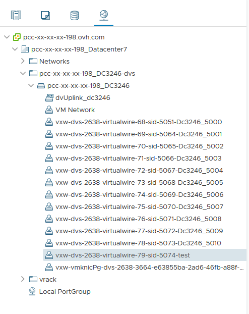
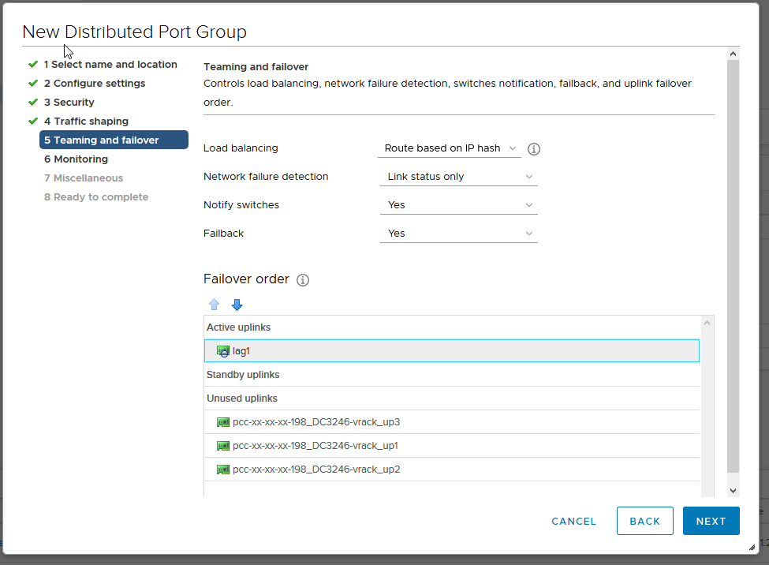

**Last updated 12th October 2020**

## Objective

In a Hosted Private Cloud infrastructure, you have a base of 10 VxLANs provided by NSX, and 11 VLANs provided with the vRack.

**This guide shows how to create additional V(x)LANs.**

## Requirements

- access to the vSphere Web client (HTML5)

## Instructions

In the Hosted Private Cloud solutions, you get two virtual distributed switches (vDS). 

These *vDS* have several different *portGroups*, each with their own purpose.

The first vDS common to both solutions has two *portGroup* types: 

- The VMnetwork that enables communication to the internet
- VxLANs managed by NSX, allowing private communications to be isolated within the Hosted Private Cloud.

The second vDS has only one type of *portGroup*: 

- VLANs that can be used to isolate private communications within the Hosted Private Cloud, and between different OVHcloud services that are vRack-compatible (Dedicated Server, Public Cloud, etc.). 

### VxLan - NSX 

In the Hosted Private Cloud solutions, you get a first virtual switch. 

On this switch, 10 VxLANs are created as standard. By giving the `NSX` permission in [the users management tab of your Control Panel](../control-panel-ovh-private-cloud/#users-tab), you can access the NSX interface and thus create additional VxLANs.

First, go to the `Networking and security` view of your vSphere client, then click `Logical Switches`{.action}.

Click the `+`{.action} button to start the creation:

{.thumbnail}

The first step is to name your **portGroup**:

{.thumbnail}

Then choose the transport zone: 

{.thumbnail}

> [!primary]
>
> The transport area controls which hosts a logical switch can reach. In a Hosted Private Cloud infrastructure, OVHcloud creates a transport zone per virtual data centre.
> You can create a common transport zone for different virtual data centres, or you can extend existing data centres.
>
> The control plan mode for a transport area is unicast, allowing communication between hosts to be managed using NSX controllers.
>

IP address discovery limits the saturation of ARP traffic in individual VxLAN segments, that is, between virtual machines connected to the same logical switch.

MAC learning builds a VLAN/MAC learning table on each vNIC. This table is stored with dvfilter data. In vMotion, dvfilter saves and restores the table to the new location. Then, the switch generates RARPs for all VLAN/MAC entries in the table. You may want to enable MAC learning if you are using virtual network adapters that are performing VLAN trunking.

OVHcloud recommends using only IP address discovery.

Once you have entered all of this information, you can confirm that you want to create it:

{.thumbnail}

Your portGroup is now created and functional, you will find it in the Logical Switches view: 

{.thumbnail}

But also in the `Networking view`

{.thumbnail}

### VLAN - vRack

You also have an additional virtual distributed switch (vDS).

On this switch, 11 VLANs are created as standard (VLAN10 to VLAN20). By giving the `administrator` right on `Access to the V(x)LAN` in [the users management tab of your Control Panel](../control-panel-ovh-private-cloud/#users-tab), you can create additional VLANs.

First, go to your vSphere client's `networking` view. Deploy the **vrack** folder then right-click on the **dVS** ending in *-vrack* and finally click on `New Distributed Port Group`{.action}.

{.thumbnail}

{.thumbnail}

The next step is to name your **PortGroup**:

{.thumbnail}

Then configure the settings recommended by OVHcloud:

- **Port binding**: Static (reserving and assigning the port to a virtual machine)
- **Port allocation**: Elastic (Allows the number of ports to be hot-wired)
- **Number of ports**: 24
- **VLAN type**: VLAN (The others are [PVLAN](https://kb.vmware.com/s/article/1010691){.external} and Trunk)
- **VLAN ID**: 21 (Knowing that the ID can be configured from 1 to 4096)
- Check the option *Customize default policies configuration*.

{.thumbnail}

You have 3 security settings that can be activated according to your need: 

- *Promiscuous mode*: Eliminates any filtering that the VM adapter can perform so that the guest operating system receives all observed traffic on the network.
- *MAC address changes*: When set to **Accept**, ESXi will accept requests to change the effective MAC address to an address other than the initial MAC address.
- *Forged transmits*: Affects traffic transmitted from a virtual machine. When set to **Accept**, ESXi does not compare the source and effective MAC addresses.

> [!primary]
>
> The most frequent use of these 3 parameters is the CARP, especially used on **pfSense**.
> 

{.thumbnail}

We leave [Traffic shaping](https://docs.vmware.com/en/VMware-vSphere/6.5/com.vmware.vsphere.networking.doc/GUID-CF01515C-8525-4424-92B5-A982489BACE2.html){.external} disabled.

{.thumbnail}

In terms of load balancing, select *Route Based on IP hash*, which is the best method for redundancy and load balancing.

> [!warning]
>
> Be careful when configuring the failover order: It is necessary to set the `lag1` uplink to *Active* (connection between the virtual network and the physical network), otherwise no communication between the hosts will be possible.
>

{.thumbnail}

The `NetFlow` is disabled (traffic flow activity report).

{.thumbnail}

Leave the `Block All Ports` value at "No".

{.thumbnail}

You will then be presented with a summary of the changes. Click `Finish` to confirm the creation.

{.thumbnail}

Here we can see that **VLAN21** is available and functional.

{.thumbnail}

## Go further

Join our community of users on <https://community.ovh.com/en/>.
