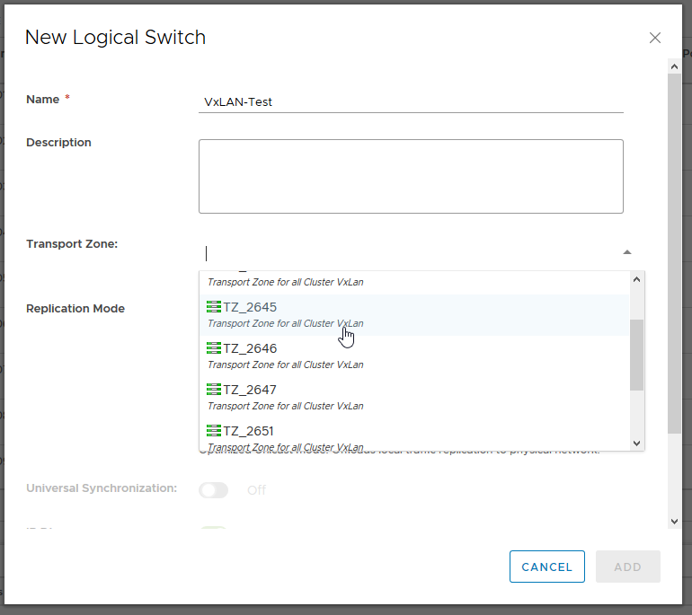
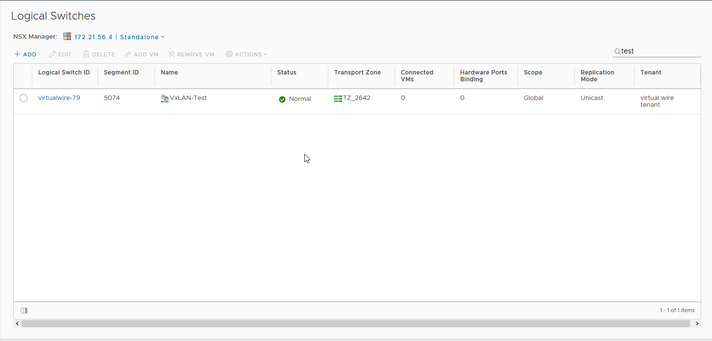
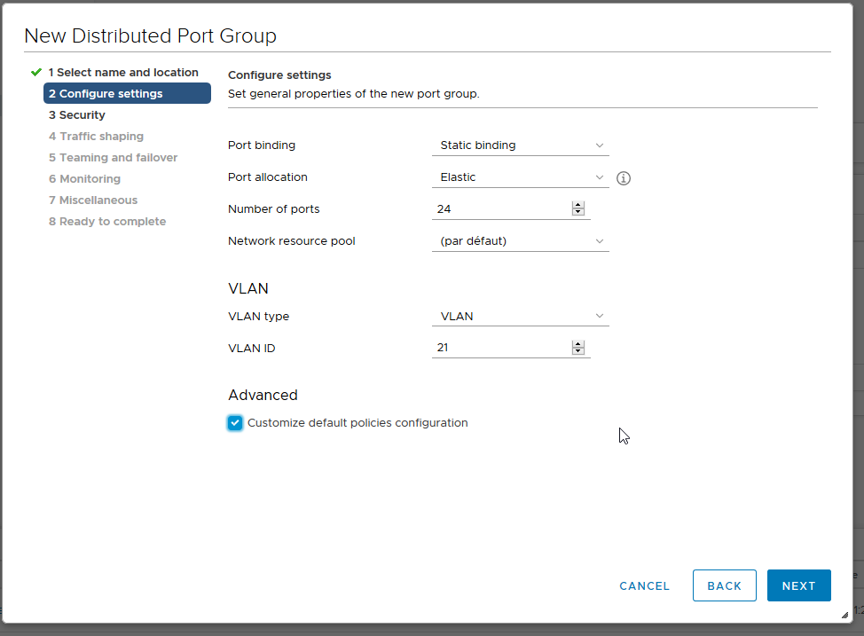

> [!primary]
> Tłumaczenie zostało wygenerowane automatycznie przez system naszego partnera SYSTRAN. W niektórych przypadkach mogą wystąpić nieprecyzyjne sformułowania, na przykład w tłumaczeniu nazw przycisków lub szczegółów technicznych. W przypadku jakichkolwiek wątpliwości zalecamy zapoznanie się z angielską/francuską wersją przewodnika. Jeśli chcesz przyczynić się do ulepszenia tłumaczenia, kliknij przycisk „Zaproponuj zmianę” na tej stronie.
> 

**Ostatnia aktualizacja z dnia 12-10-2020**

## Wprowadzenie

W infrastrukturze Hosted Private Cloud dysponujesz podstawą 10 VxLAN dostarczanych przez NSX oraz 11 VLAN dostarczanych wraz z vRack.

**Niniejszy przewodnik wyjaśnia, jak utworzyć dodatkowe sieci v(x)LAN**

## Wymagania początkowe

- Dostęp do klienta vSphere Web (HTML5)

## W praktyce

W ofercie Hosted Private Cloud dysponujesz dwoma wirtualnymi switchami (vDS). 

Do *vDS* zalicza się kilka *portGroup*, z których każdy ma swoją użyteczność.

Pierwszy wspólny vDS dla obu ofert dysponuje dwoma rodzajami *portGroup*: 

- VMnetwork pozwalający na komunikację z Internetem.
- Sieci VxLAN zarządzane przez NSX, umożliwiające odizolowanie prywatnej komunikacji w ramach usługi Hosted Private Cloud.

Drugi vDS dysponuje jednym typem *portGroup*: 

- Sieci VLAN umożliwiające odizolowanie prywatnej komunikacji w ramach usługi Hosted Private Cloud oraz między różnymi usługami OVHcloud kompatybilnymi z vRack (Serwer dedykowany, Public Cloud...). 

### VxLan - NSX 

W ofercie Hosted Private Cloud dysponujesz pierwszym wirtualnym switchem. 

Na tym switchu tworzone są 10 sieci VxLAN. Dzięki uprawnieniu `NSX` do zarządzania [użytkownikami w Panelu klienta](../manager-ovh-private-cloud/#uzytkownicy), będziesz mógł przejść do interfejsu NSX i tworzyć dodatkowe sieci VxLAN.

Po pierwsze, przejdź do widoku `Konfiguracja sieci i bezpieczeństwo` klienta vSphere, a następnie kliknij `Przełączniki logiczne`{.action}.

Kliknij na przycisk `+`{.action}, aby rozpocząć tworzenie:

{.thumbnail}

Pierwszy etap polega na nadaniu nazwy **portGroup**:

{.thumbnail}

Następnie wybierz obszar transportu: 

{.thumbnail}

> [!primary]
>
> Obszar transportu kontroluje, które hosty logiczny przełącznik może osiągnąć. W infrastrukturze Hosted Private Cloud OVHcloud ustanawia strefę transportu wirtualnym centrum danych.
> Można utworzyć wspólną strefę transportową dla poszczególnych wirtualnych centrów danych lub rozszerzyć istniejące centra danych.
>
> Tryb planu kontroli obszaru transportu jest jednokanałowy, pozwalający na zarządzanie komunikacją między hostami za pomocą kontrolerów NSX.
>

Odkrycie adresów IP pozwala na ograniczenie wysycenia ruchu ARP w poszczególnych segmentach VXLAN, tj. między wirtualnymi maszynami podłączonymi do tego samego logicznego przełącznika.

Uczenie się MAC buduje tabelę uczenia VLAN/MAC dla każdego vNIC. Tabela ta jest przechowywana z danymi dvfilter. W vMotion dvfilter rejestruje i przywraca stół w nowej lokalizacji. Następnie przełącznik generuje RARP dla wszystkich wejść VLAN/MAC tabeli. Możesz włączyć naukę MAC, jeśli używasz wirtualnych kart sieciowych wykonujących połączenie VLAN.

OVHcloud zaleca korzystanie wyłącznie z odkrycia adresów IP.

Po wprowadzeniu wszystkich elementów możesz potwierdzić utworzenie:

{.thumbnail}

Twój portGroup jest już utworzony i działa. Możesz go odnaleźć w świetle przełączników logicznych: 

{.thumbnail}

Ale również w widoku `Tworzenie sieci`

{.thumbnail}

### VLAN - vRack

Dysponujesz również dodatkowym wirtualnym switchem (vDS).

W tym switchu 11 sieci VLAN są tworzone w oparciu o podstawowe projekty (VLAN10 w VLAN20). Dzięki uprawnieniu `administratora` do `dostępu do v(x)LAN` w [zarządzaniu użytkownikami w Panelu klienta](../manager-ovh-private-cloud/#uzytkownicy), będziesz mógł utworzyć dodatkowe sieci VLAN.

Po pierwsze, przejdź do widoku `tworzenia sieci` Twojego klienta vSphere. Uruchom folder **vrack**, kliknij prawym przyciskiem myszy **na serwer **dVS** kończący się *-vrack*, a następnie kliknij `New Distributed Port Group`{.action}.

{.thumbnail}

{.thumbnail}

Następnym krokiem jest nazwa Twojego **PortGroup**:

{.thumbnail}

Następnie skonfiguruj parametry zalecane przez OVHcloud:

- **Port Binding**: Static (Rezerwacja i przypisanie portu do wirtualnej maszyny)
- **Port przydział**: Elastic (Pozwala na zwiększenie liczby portów bez przerwy w działaniu)
- **Numer portu**: 24
- **VLAN typu**: VLAN (inne to [PVLAN](https://kb.vmware.com/s/article/1010691){.external} i Trunk)
- **VLAN ID**: 21 (wiedząc, że ID może być skonfigurowany w zakresie od 1 do 4096)
- Zaznacz opcję *Customize default policies configuration*.

{.thumbnail}

Masz 3 ustawień bezpieczeństwa, które mogą być aktywowane w zależności od potrzeb: 

- *Promiscuous tryb* (Eliminacja wszelkich filtrowania odbioru, które adapter wirtualnej maszyny może wykonać, aby wybrany system operacyjny otrzymywał cały ruch zaobserwowany w sieci.)
- *Adres MAC dla zmian* (wpływa na ruch, który otrzymuje wirtualna maszyna. Jeśli opcja jest zdefiniowana w **Akceptuj**, ESXi akceptuje wnioski o zmianę rzeczywistego adresu MAC na inny adres niż początkowy adres MAC.)
- *Forged transfer* (wpływa na ruch przesyłany z wirtualnej maszyny. Jeśli opcja jest zdefiniowana w **Akceptuj**, ESXi nie porównuje źródłowych i rzeczywistych adresów MAC).

> [!primary]
>
> Najczęstszym zastosowaniem tych 3 parametrów jest CARP, w tym **pfSense**.
> 

{.thumbnail}

Pozostawiamy [wygładzanie ruchu](https://docs.vmware.com/en/VMware-vSphere/6.5/com.vmware.vsphere.networking.doc/GUID-CF01515C-8525-4424-92B5-A982489BACE2.html){.external} wyłączony.

{.thumbnail}

Na poziomie Load Balancing wybierz *Route Based on IP hash*, które jest najlepszą metodą redundancji i rozdzielania.

> [!warning]
>
> Uwaga na poziomie konfiguracji kolejności przełączania, konieczne jest umieszczenie łącza `typu alg` w *Active* (połączenie między siecią wirtualną i siecią fizyczną), w przeciwnym razie nie będzie możliwe połączenie między hostami.
>

{.thumbnail}

Netflow `jest wyłączony` (stosunek aktywności do ruchu)

{.thumbnail}

Pozostaw wartość `Block All Ports` na "No".

{.thumbnail}

Otrzymasz wówczas podsumowanie zmian. Kliknij przycisk `Zakończ`, aby potwierdzić utworzenie.

{.thumbnail}

W tym miejscu widzimy, że **VLAN21** jest dobrze dostępny i działa.

{.thumbnail}

## Sprawdź również

Dołącz do społeczności naszych użytkowników na stronie<https://community.ovh.com/en/>.
