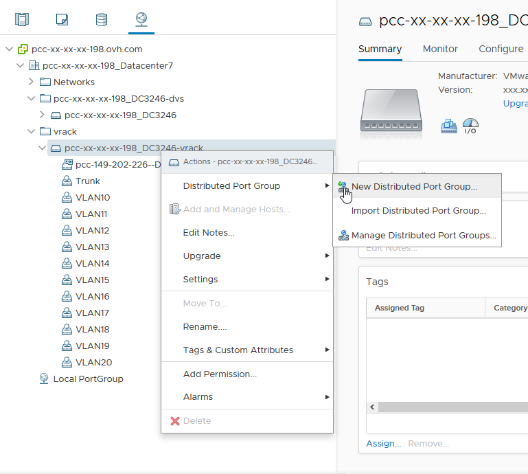

**Última atualização: 22/10/2020**

## Objetivo

Numa infraestrutura Hosted Private Cloud, dispõe de base de 10 VxLAN fornecidas pela NSX e de 11 VLAN fornecidas com o vRack.

**Este manual mostra a criação de V(x)LAN adicionais**

## Requisitos

- Ter acesso ao vSphere Web Client (HTML5)

## Instruções

Nas soluções Hosted Private Cloud, dispõe de dois switchs virtuais distribuídos (vDS). 

Estes *vDS* comportam várias *portGroup*, cada uma com uma utilidade.

O primeiro vDS comum às duas ofertas dispõe de dois tipos de *portGroup*: 

- A VMnetwork que permite comunicar para a Internet.
- VxLAN geridas pela NSX para isolar comunicações privadas no interior do Hosted Private Cloud.

O segundo vDS dispõe de um único tipo de *portGroup*: 

- VLAN que permitem isolar comunicações privadas no Hosted Private Cloud e entre os diferentes serviços da OVHcloud compatíveis com vRack (servidor dedicado, Public Cloud, etc.). 

### VxLan - NSX 

Nas soluções Hosted Private Cloud dispõe de um primeiro switch virtual. 

Neste switch, são criadas 10 VxLAN de base. Ao dar o direito `NSX` na [gestão dos utilizadores da sua Área de Cliente](../manager-ovh-private-cloud/#utilizadores), poderá aceder à interface NSX e assim criar VxLAN adicionais.

Em primeiro lugar, aceda a `Networking and security` do seu cliente vSphere e clique em `Logical Switches`{.action}.

Clique no botão `+`{.action} para começar a criação:

{.thumbnail}

A primeira etapa é dar um nome ao seu **portGroup**:

{.thumbnail}

Escolha a zona de transporte: 

{.thumbnail}

> [!primary]
>
> A zona de transporte controla quais os hosts que um switch lógico pode atingir. Numa infraestrutura Hosted Private Cloud, a OVHcloud cria uma zona de transporte por datacenter virtual.
> É possível criar uma zona de transporte comum para os diferentes datacenters virtuais ou ampliar os existentes.
>
> O modo de plano de controlo de uma zona de transporte está em monodifusão, permitindo a gestão da comunicação entre os hosts com a ajuda dos controladores NSX.
>

A descoberta de endereços IP permite limitar a saturação do tráfego ARP nos segmentos VXLAN individuais, ou seja, entre as máquinas virtuais ligadas ao mesmo switch lógico.

A aprendizagem MAC constrói uma tabela de aprendizagem VLAN/MAC em cada vNIC. Esta tabela é armazenada com os dados dvfilter. No vMotion, o dvfilter regista e restaura a tabela na nova localização. De seguida, o switch gera RARP para todas as entradas VLAN/MAC da tabela. Pode querer ativar a aprendizagem MAC se utilizar placas de rede virtuais que efetuem a ligação VLAN.

A OVHcloud recomenda que se utilize apenas a descoberta de endereços IP.

Depois de inserir todos estes elementos, pode confirmar a criação:

{.thumbnail}

O seu portGroup está agora criado e funcional, e poderá encontrá-lo na vista dos switchs lógicos: 

{.thumbnail}

Mas também na vista `Networking view`

{.thumbnail}

### VLAN - vRack

Dispõe igualmente de um switch virtual distribuído (vDS) adicional.

Neste switch, são criadas 11 VLANs de base (VLAN10 a VLAN20). Ao dar o direito de `administrator` sobre o `Access to the V(x)LAN` na [gestão dos utilizadores da sua Área de Cliente](../manager-ovh-private-cloud/#utilizadores){.external-link}, poderá criar VLAN adicionais.

Em primeiro lugar, aceda à vista de `networking` do seu vSphere. Implemente a pasta **vrack**, clique com o botão direito do rato no **dVS** que termina com *-vrack* e, por fim, clique em `New Distributed Port Group`{.action}.

{.thumbnail}

{.thumbnail}

O próximo passo é dar um nome o seu **PortGroup**:

{.thumbnail}

De seguida, configure os parâmetros recomendados pela OVHcloud:

- **Port Binding**: Static (reserva e atribuição da porta a uma máquina virtual)
- **Port allocation**: Elastic (permite alargar a quente o número de portas)
- **Number of ports**: 24
- **VLAN type**: VLAN (as outras são [PVLAN](https://kb.vmware.com/s/article/1010691){.external} e Trunk)
- **VLAN ID**: 21 (sabendo que o ID pode ser configurado de 1 a 4096)
- Selecione a opção *Customize default policies configuration*.

{.thumbnail}

Tem 3 parâmetros de segurança que podem ser ativados em função das suas necessidades: 

- *Promiscious mode*: elimina qualquer filtragem de receção que o adaptador de máquina virtual possa efetuar para que o sistema operativo convidado receba todo o tráfego observado na rede.
- *MAC address changes*: afeta o tráfego que uma máquina virtual recebe. Quando a opção está definida em **Accept**, o ESXi aceita os pedidos de modificação do endereço MAC efetivo num endereço diferente do endereço MAC inicial.
- *Forged transmits*: afeta o tráfego transmitido a partir de uma máquina virtual. Quando a opção está definida em **Accept**, o ESXi não compara os endereços MAC fonte e efetivo.

> [!primary]
>
> A utilização mais frequente destes 3 parâmetros é o CARP, utilizado principalmente em **pfSense**.
> 

{.thumbnail}

Deixamos a [adaptação de tráfego](https://docs.vmware.com/en/VMware-vSphere/6.5/com.vmware.vsphere.networking.doc/GUID-CF01515C-8525-4424-92B5-A982489BACE2.html){.external} desativado.

{.thumbnail}

Ao nível do Load Balancing, selecione *Route Based on IP hash* que é o melhor método em termos de redundância e repartição.

> [!warning]
>
> Atenção: ao configurar a ordem de migração, é necessário colocar a ligação ascendente `lag1` em *Active* (ligação entre a rede virtual e a rede física), caso contrário não será possível qualquer comunicação entre os hosts.
>

{.thumbnail}

O `Netflow` está desativado (relação de atividade sobre os fluxos de tráfego).

{.thumbnail}

Deixe o valor `Block All Ports` em "No".

{.thumbnail}

Receberá então um resumo das alterações. Clique em `Finish` para confirmar a criação.

{.thumbnail}

É possível constatar que a **VLAN21** está disponível e funcional.

{.thumbnail}

## Quer saber mais?

Fale com a nossa comunidade de utilizadores em <https://community.ovh.com/en/>.
