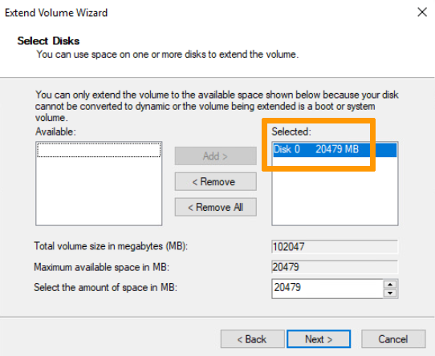
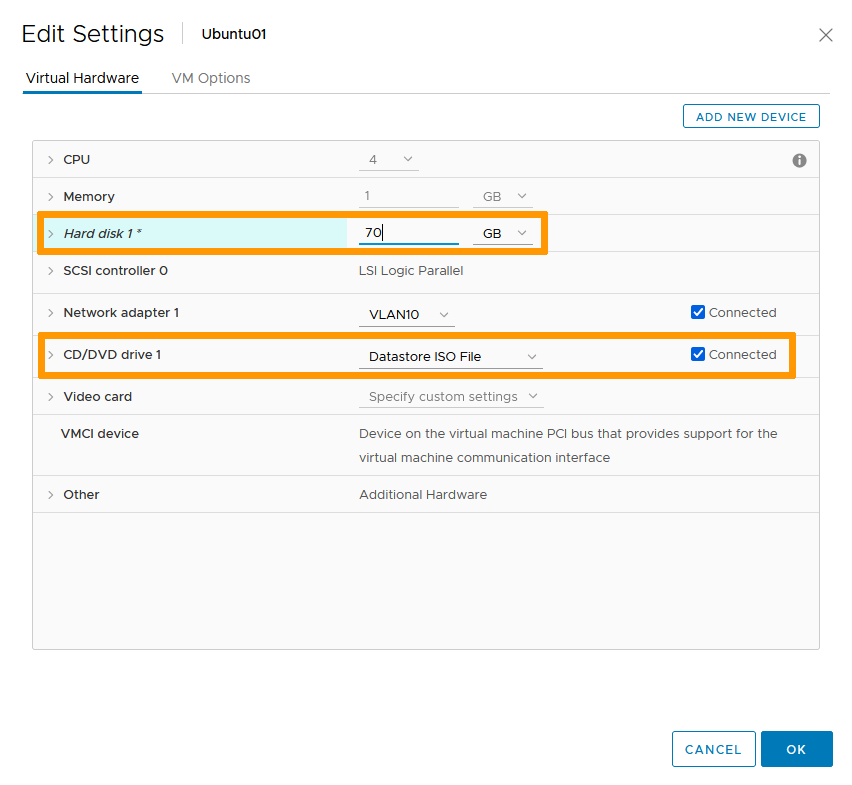
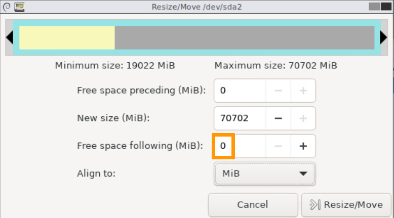
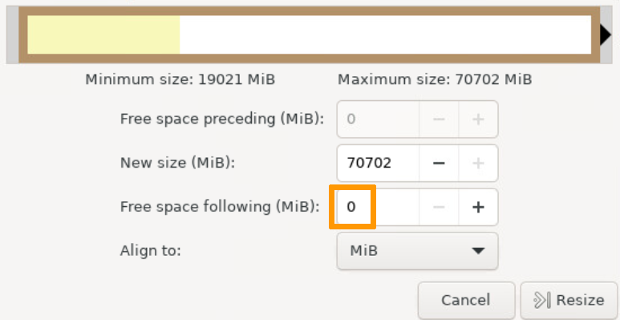

**Dernière mise à jour le 13/01/2022**

## Objectif

Nous allons vous montrer comment utiliser vSphere et les outils de gestion d'OS pour augmenter la taille d'un disque virtuel sous Windows et sous Linux.

**Ce guide est un cas d'étude avec toutes les étapes pour atteindre l'objectif**

## Prérequis

- Être contact administrateur du [Hosted Private Cloud infrastructure](https://www.ovhcloud.com/fr/enterprise/products/hosted-private-cloud/), pour recevoir des identifiants de connexion.
- Avoir un identifiant utilisateur actif (créé dans l'[espace client OVHcloud](https://www.ovh.com/auth/?action=gotomanager&from=https://www.ovh.com/fr/&ovhSubsidiary=fr))

## En pratique

> [!warning]
>
> Avant de procéder à ce type de changement, nous recommandons une sauvegarde complète ou un clonage de la machine virtuelle.
>

### VM Windows

Dans l'interface vSphere, allez dans le tableau de bord `Hôtes et clusters`{.action}.

{.thumbnail}

Sur la gauche de votre écran, naviguez vers la VM à modifier, faites un clic droit et selectionnez `Modifier les paramètres`{.action}.

{.thumbnail}

Trouvez le disque à étendre et modifier la valeur de la taille (dans notre exemple, changement de 80 à 100 GB). 
Cliquez `OK`{.action}.

{.thumbnail}

Vous pouvez vérifier que le changement a été appliqué dans la vue des tâches récentes.

{.thumbnail}

Connectez-vous à la VM et rendez-vous dans la console de gestion des disques. 
Un moyen simple est de faire un clic droit sur Démarrer puis un clic sur `Gestion des disques`{.action}.

{.thumbnail}

Dans la console, vous constatez qu'il y a 20 GB d'espace disponible, soit l'espace précédement ajouté au disque virtuel.

{.thumbnail}

Faites un clic droit sur le volume existant et selectionnez `Étendre le volume`{.action}.

{.thumbnail}

Cliquez `Suivant`{.action} dans la première fenêtre de l'installateur. 
Dans la deuxième, tout l'espace est selectionné et appliqué par défaut. Cliquez `Suivant`{.action}. 
Cliquez `Terminer`{.action} dans la dernière fenêtre.

{.thumbnail}

Le disque est maintenant étendu et prêt à l'usage.

{.thumbnail}

### VM Linux

> [!primary]
>
> For Linux VMs, we'll use a partition utility. There are many available products and we do not recommend any over the others. Our use of [GParted LiveCD](http://gparted.sourceforge.net/livecd.php) is in no way an endorsement.
> 
> For creating an ISO library and mounting an ISO to a VM, refer to [How to connect an ISO image to a VM](https://docs.ovh.com/gb/en/private-cloud/connect_iso_to_vm/)

In the vSphere interface menu, go to the `Hosts & Clusters`{.action} dashboard.

{.thumbnail}

On the left side, navigate to the VM you wish to modify, right click on it and select `Edit Settings`{.action}.

{.thumbnail}

Connect the utility ISO to your VM ([How to connect an ISO image to a VM](https://docs.ovh.com/gb/en/private-cloud/connect_iso_to_vm/)).  
Find the disk you are expanding and modify the size value as needed (in our case, changed the value from 20 to 70 GB). 

{.thumbnail}

In the `VM Options`{.action} tab, check the During the next boot, force entry into the BIOS setup screen box so you can boot on the partition utility. 
Click `OK`{.action}.

{.thumbnail}

You can verify the change was applied in your recent tasks view.

{.thumbnail}

Boot (or reboot) the VM and start the partition utiliy. 
*Refer to the software developer documentation to boot and get to the management console.* 
In the management console, you can see there is 50GB of unallocated space, corresponding to the space added to the virtual disk previously.

{.thumbnail}

Right click on the existing logical volume and select `Resize/Move`{.action}.

{.thumbnail}

Drag the right arrow to select the whole available space or type 0 in the Free Space Following field. 
Click `Resize/Move`{.action}.

{.thumbnail}

Click the green checkmark to apply all operations.

{.thumbnail}

Click `Apply`{.action} to confirm.

{.thumbnail}

Click `Close`{.action} when done.

{.thumbnail}

You can now see your volume contains the unallocated space. 
We still need to apply the space to the disk.

{.thumbnail}

Right click on the existing disk and select `Resize/Move`{.action}.

{.thumbnail}

Drag the right arrow to select the whole available space or type 0 in the Free Space Following field. 
Click `Resize`{.action}.

{.thumbnail}

Click the green checkmark to apply all operations.

{.thumbnail}

Click `Apply`{.action} to confirm.

{.thumbnail}

Click `Close`{.action} when done.

{.thumbnail}

You can now see your vitual disk is extended and ready for use. 

{.thumbnail}

## Go further

Join our community of users on <https://community.ovh.com/en/>.
