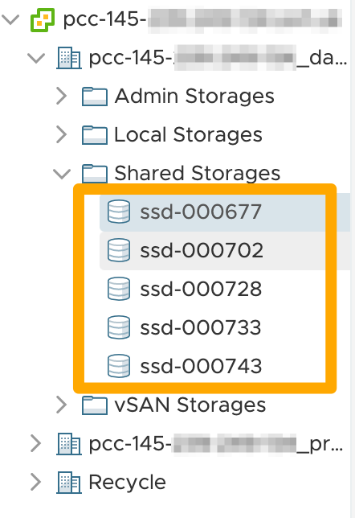
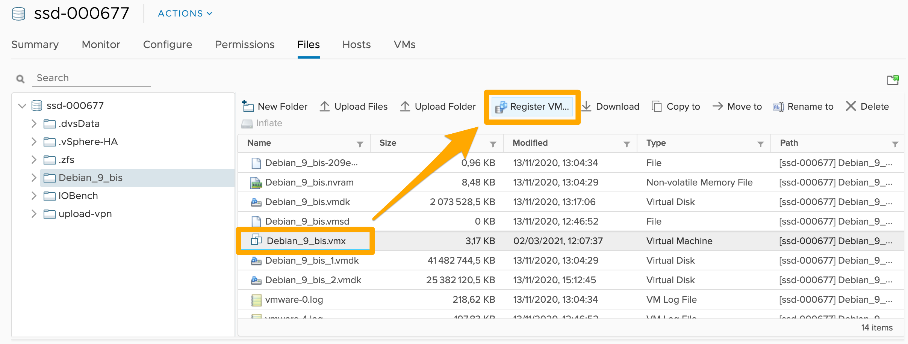
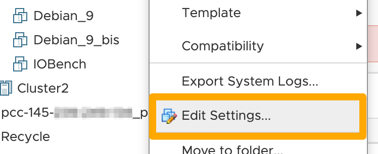

**Dernière mise à jour le 22/03/2021**

## Objectif

Suite à un incident, vous pouvez restaurer vos VM sur un nouveau PCC.

**Découvrez comment restaurer des VM sur un nouveau service depuis d'anciens datastores**

## Prérequis

- Posséder un produit [Hosted Private Cloud](https://www.ovhcloud.com/fr/enterprise/products/hosted-private-cloud/){.external}.
- Être connecté à votre [interface vSphere](../connexion-interface-vsphere/).
- Disposer de datastores restaurés ou sauvegardés.

## En pratique

Dans votre [interface vSphere](../connexion-interface-vsphere/), placez-vous dans la vue `Stockage`.

{.thumbnail}

Sélectionnez un datastore dans la liste.

{.thumbnail}

Dans les dossiers de ce datastore, sélectionnez le fichier `.vmx` et cliquez sur `Enregistrer la VM`.

{.thumbnail}

Complétez les informations requises puis cliquez sur `Terminer`.

{.thumbnail}

Ces mêmes opérations sont à répéter sur chaque datastore pour chaque VM à restaurer.

Vérifiez les paramètres de vos VM (nom, paramètres réseau, portgroup, etc...) en faisant un clic droit sur chacune d'elles puis en sélectionnant `Edit Settings`.

{.thumbnail}

En cas d'erreur de paramétrage, un message d'erreur vous sera affiché lorsque vous rallumerez la VM.

Vous pourrez rallumer une VM en faisant un clic droit sur celle-ci puis en cliquant sur `Power On`

{.thumbnail}

## Aller plus loin

Échangez avec notre communauté d'utilisateurs sur <https://community.ovh.com>.
