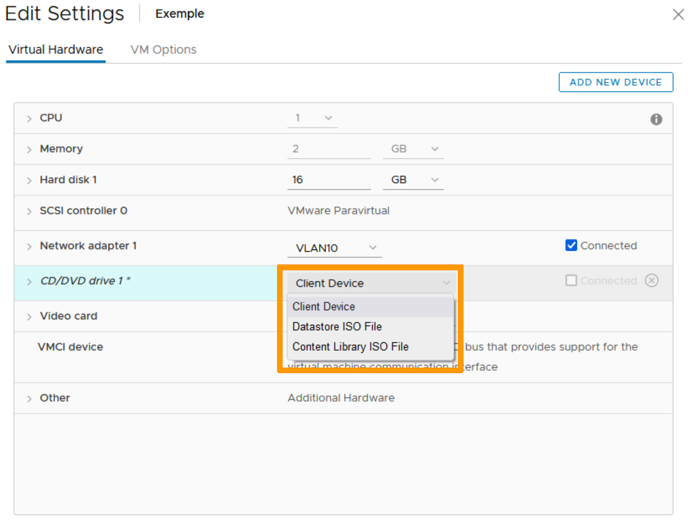
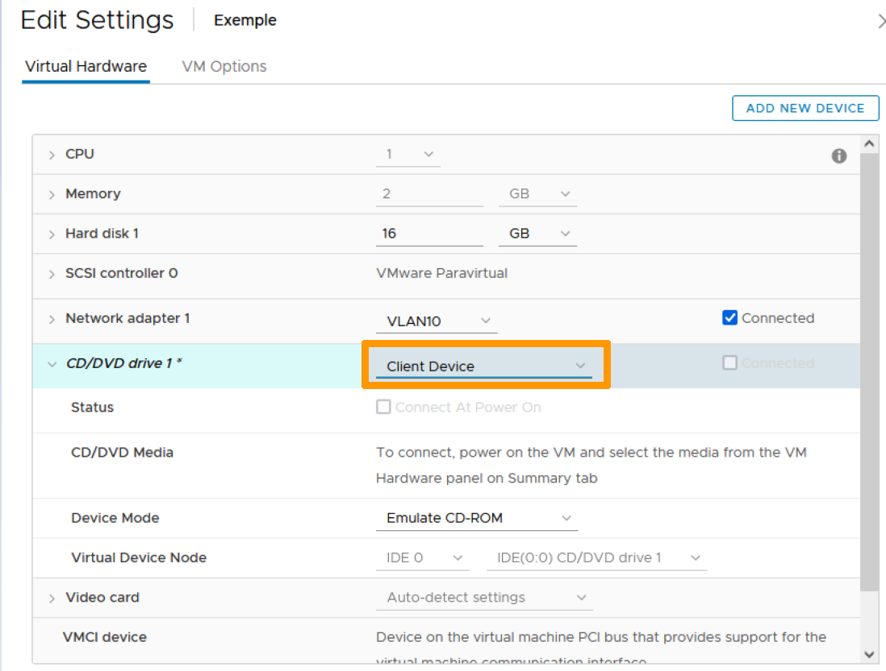

**Dernière mise à jour le 27/04/2022**

## Objectif

Si un ISO est connecté à une VM, celle-ci ne peut être migrée, ni manuellement, ni automatiquement. Cela peut donc empêcher le fonctionnement correct de DRS et la mise en maintenance de l'hôte qui l'héberge.

## Prérequis

- Être contact administrateur de l'infrastructure [Hosted Private Cloud](https://www.ovhcloud.com/fr-ca/enterprise/products/hosted-private-cloud/), afin de recevoir les identifiants de connexion.
- Avoir un identifiant utilisateur actif (créé dans l'[espace client OVHcloud](https://ca.ovh.com/auth/?action=gotomanager&from=https://www.ovh.com/ca/fr/&ovhSubsidiary=qc))

## En pratique

Si vous décochez simplement la case `Connecter`{.action} du Datastore ISO File, la VM est toujours liée à l'ISO :

{.thumbnail}

Pour déconnecter l'ISO, cliquez d'abord sur la flèche déroulante à côté de CD/DVD drive 1 et sélectionnez `Client Device`{.action}.

{.thumbnail}

L'ISO est maintenant déconnecté :

{.thumbnail}

## Aller plus loin

Échangez avec notre communauté d'utilisateurs sur <https://community.ovh.com>.