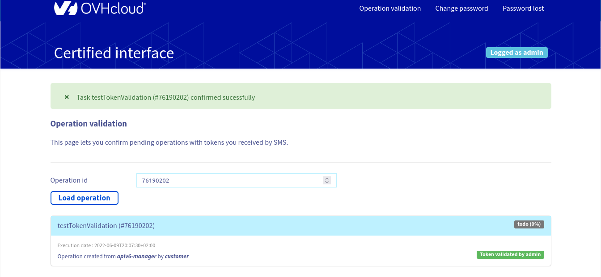

**Last updated 3rd September 2020**

## Objective

Through the secure interface, you can validate sensitive operations (such as changing passwords, adding a user, etc.) performed by users or third-parties on your Private Cloud Healthcare (HDS) or PCI DSS.

**Find out how to use the secure interface to validate sensitive operations.**

## Requirements

- an infrastructure with the [**advanced security** option](https://www.ovhcloud.com/en-gb/enterprise/products/hosted-private-cloud/safety-compliance/sddc/), which allows validation (this is included in the [PCI DSS plan](https://www.ovhcloud.com/en-gb/enterprise/solutions/certified-cloud-solutions/financial-data-hosting-pci-dss/) and the [healthcare solution](https://www.ovhcloud.com/en-gb/enterprise/products/hosted-private-cloud/safety-compliance/hds/))
- access to the secure interface of the Private Cloud concerned, i.e. `https://pcc-xxx-xxx-xxx-xxx.ovh.com/secure/` (be careful not to forget the final "/" of the address)

## Instructions

The validation of "sensitive" operations from the secure interface is only possible for users with the **token validator** permission. The admin already has this privilege, since it is required to activate the **advanced security** option. Note that it is also possible to grant this permission to other users via the OVHcloud Control Panel. Refer to our [Introduction to the OVHcloud Private Cloud Control Panel](../control-panel-ovh-private-cloud/) documentation, if necessary.

From the secure interface, you can perform three operations. Please refer to the relevant section of this guide, depending on how you wish to proceed: 

- [Confirm an operation with a token](./#confirm-an-operation-with-a-token)
- [Change the user password](./#change-the-user-password)
- [Reset a password](./#reset-a-password)

### Confirm an operation with a token

When a token is received via SMS, it must be entered in the secure interface in order to start the pending task.

> [!warning]
>
> The token provided is only valid for 15 minutes. Without your approval, the task will be cancelled once this time has elapsed.
> 
> It will then be offered again (in the case of maintenance), or you will have to restart it (if it follows an action on your part). 
> 

Here is an example of an SMS that would be sent: 

{.thumbnail}

This message contains: 

- the user with the **token validator** permission who received the SMS. This can help you manage the tokens to be validated if you have entered your phone number in several user accounts.
- the name of the operation that requires validation
- the operation ID
- validation token
- a link to validate the operation (please note, if your phone is not connected to a network whose [IP is authorised](../control-panel-ovh-private-cloud/#security-tab), the page will not appear).

To validate the operation, log in via the link shown in the message. Then go to the `Operation Validation`{.action} section.

{.thumbnail}

A login window will open, in which only a user with the **token validator** permission can execute a validation.

Load the operation by entering its ID in the `Operation id` field, then clicking the `Load operation`{.action} button. Then enter the token you have just received via SMS and click `Confirm operation`{.action}.

{.thumbnail}

An SMS confirming the validation of the operation will then be sent to users with the **token validator** permission. Here is an example: 

{.thumbnail}

As you will see, this message contains: 

- the user with the **token validator** permission who received the SMS
- the name of the operation and its ID
- the user with the **token validator** permission who confirmed the validation 

### Change the user password

Any user can change their password, even without **token validator** permissions. However, this person must possess their current password in order to perform the manipulation.

> [!primary]
>
> If the user no longer has their password, they must ask another user with the **token validator** permission to make the change for them, via the [password reset](./#reset-a-password) procedure.
> 

To change a user's password, log in to the secure interface (`https://pcc-xxx-xxx-xxx-xxx.ovh.com/secure/`) and click the `Change Password`{.action} button.

{.thumbnail}

In the page that appears, select the user concerned, and then set their new password.

A token will then be sent to users with the [token validator](./#confirm-an-operation-with-a-token) permission, so they can **confirm the operation**.

{.thumbnail}

### Reset a password

This procedure is only available to users with the **token validator** permission.

> [!primary]
>
> If a user who does not have the **token validator** permission loses their password, they will have to ask a user with this privilege to reset it.
> 

To reset a user's password, log in to the secure interface (`https://pcc-xxx-xxx-xxx-xxx.ovh.com/secure/`) and click the `Password lost`{.action} button.

{.thumbnail}

A message will indicate that you must be able to receive SMS messages to continue. If this is the case, fill in the requested information (including the user that requires a reset) and click `Next step`{.action}.

{.thumbnail}

Enter the two tokens received via SMS and email, then set the new password.

> [!primary]
>
> If the reset is done for another user, the person who performed the procedure must provide the new password. We then strongly recommend [changing this password](./#change-the-user-password) as soon as possible.
> 

{.thumbnail}

## Go further

Join our community of users on <https://community.ovh.com/en/>.
