**Derniére mise à jour le 04/10/2021

## Objectif

Configurer le KMS CipherTrust.

**Ce guide explique comment configuer un KMS Thales CipherTust.**

## Prérequis

Les prérequis nécessaires à la mise en place de l’infrastructure sont :

* Posséder un service Hosted Private Cloud [Private Cloud](https://www.ovhcloud.com/fr/enterprise/products/hosted-private-cloud/){.external}.
* Être connecté à votre [interface vSphere](../connexion-interface-vsphere/).
* Avoir une IP publique par instance de KMS
* Avoir les fichiers du modèle OVF présent sur son poste de travails
* La partie publique de la clé SSH 
* Récupération de l'OVA [KMS](https://ovh.to/W2gBYe)
* Une machine permettant l’exécution d’un script bash ayant :
    * jq installé (permettant le parsing de fichier json)
	* ksctl présent sur la machine [utilitaire Thales](https://thalesdocs.com/ctp/cm/latest/get_started/deployment/install-cli-toolkit/index.html)


## En pratique 

### Installer les OVA CipherTrust Manager

Etapes :

* Se connecter au vCenter avec un compte permettant le déploiement d’un modèle OVF

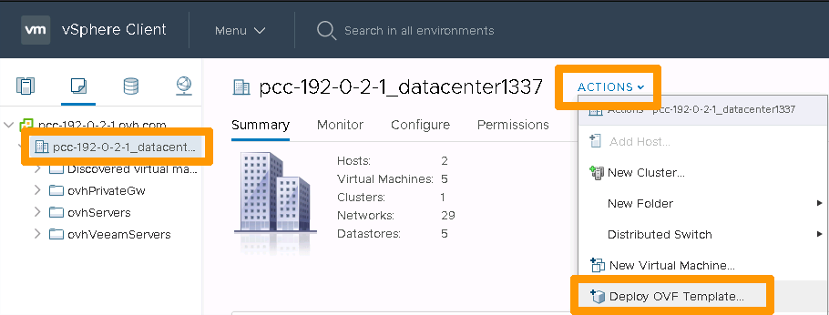{.thumbails}

* Dans le menu Hôte et cluster, sélectionner le cluster, puis cliquer sur Actions > Déployer un modèle OVF 


* Suivre les étapes du wizard d’installation :

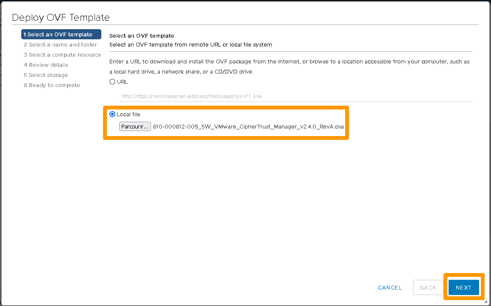{.thumbails}


* Sélectionner les fichiers locaux liés au modèle OVA : 610-000612-005_SW_VMware_CipherTrust_Manager_v2.4.0_RevA.ova
* cliquez sur le bouton `Next`{.action}

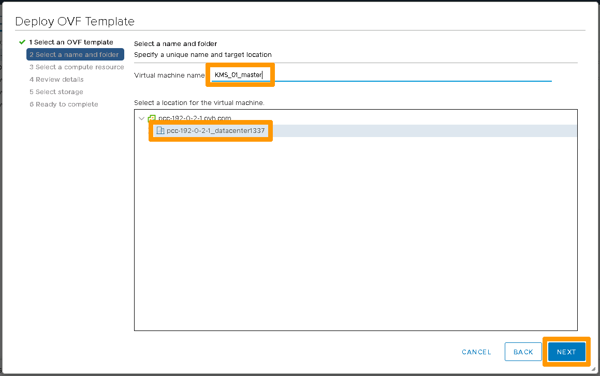{.thumbails}

* Renseigner le nom de la machine virtuelle. Le nom doit être différent entre chaque instance. Ici nous l’appellerons **KMS_01_master**
* Selectionner le datacenter où sera placer la VM
* Cliquez sur le bouton `Next`{.action}

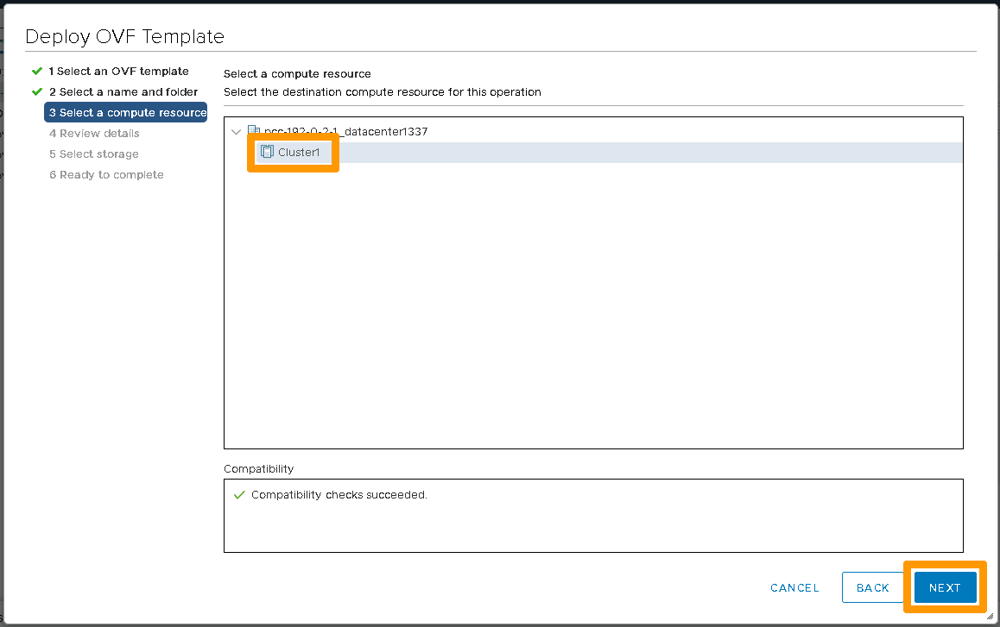{.thumbails}

* Sélectionner la ressource de compute, ici **Cluster1**
* Cliquez sur le bouton `Next`{.action}

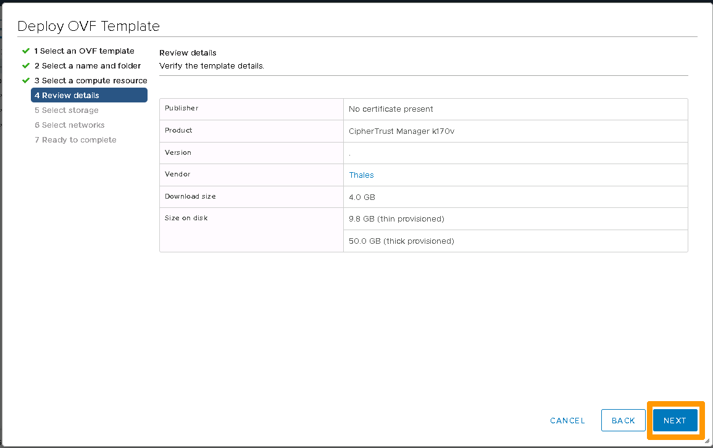{.thumbails}

* Vérifier les informations
* Cliquez sur le bouton `Next`{.action}

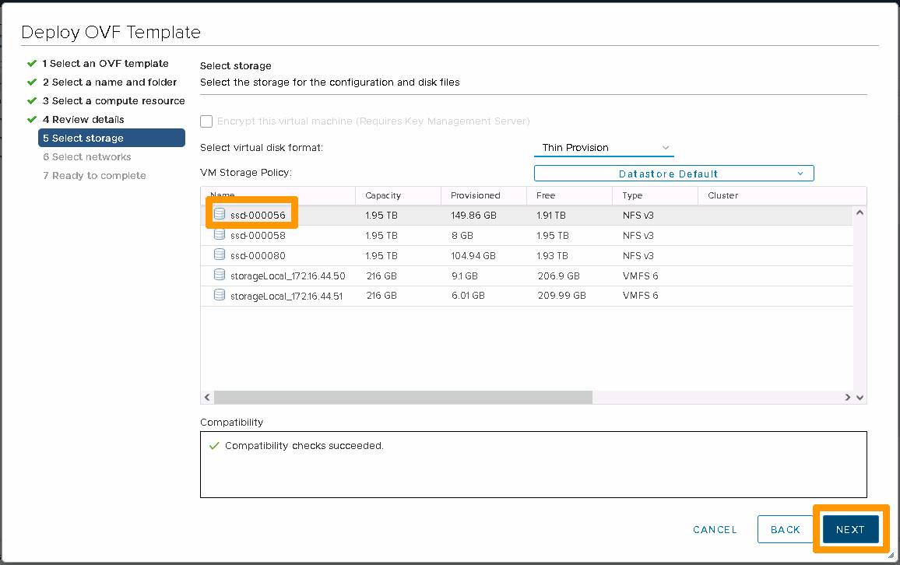{.thumbails}

* Sélectionner le périphérique de stockage
* Cliquez sur le bouton `Next`{.action}

{.thumbails}

* Sélectionner le réseaux approprié, ici **ADM**
* Cliquez sur le bouton `Next`{.action}

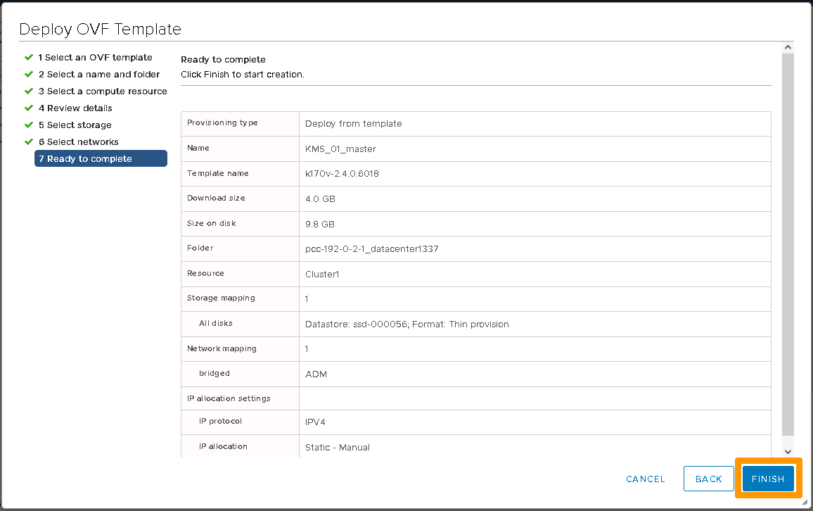{.thumbails}

* Vérifier les informations liées au déploiement
* Cliquez sur le bouton `Finish`{.action}

Une fois la VM déployées,

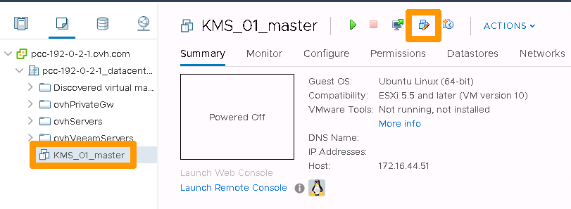{.thumbails}

* Sélectionner la VM
* Cliquez sur `Edit Settings`{.action}

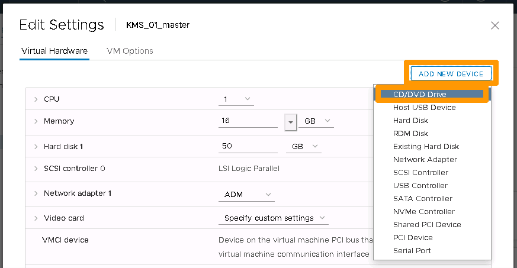{.thumbails}

* Dans l’onglet **Virtual Hardware**, cliquer sur `Add New Device`{.action}
* Sélectionner **CD/DVD Drive**

{.thumbails}

* Puis `OK`{.action}

Configuration de la VM

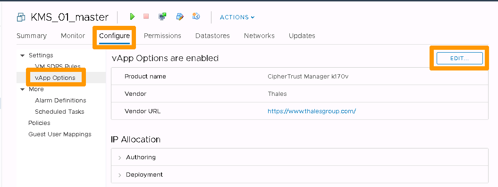{.thumbails}

* Aller dans l’onglet **Configure**
* Puis dans le menu de gauche **vApp Options**
* Cliquez sur `Edit...`{.action}

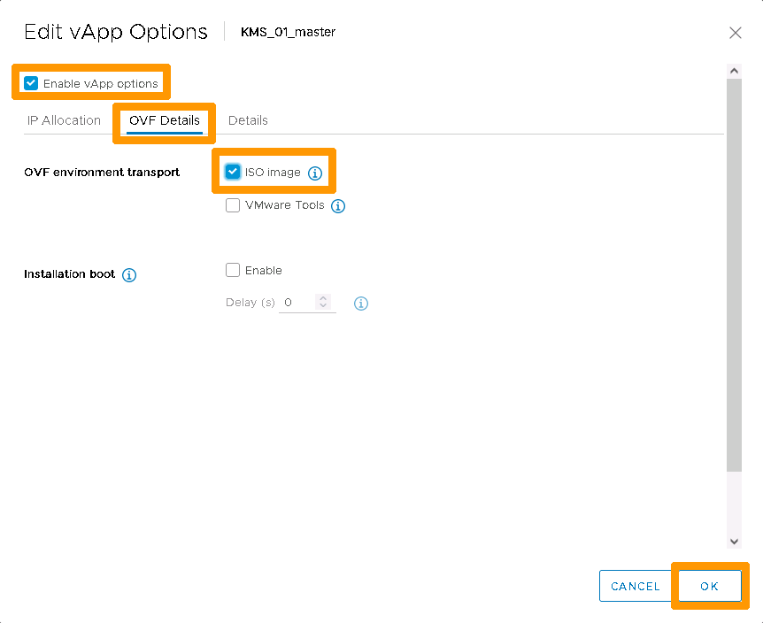{.thumbails}

* Vérifier que **Enable vApp options** est bien coché
* Aller dans l’onglet **OVF Details**
* Cocher **ISO images**
* Cliquez sur `OK`{.action}

Preparer le fichier cloud.init selon le modéle suivant

```
#cloud-config
keysecure:
    netcfg:
        iface:
            name: eth0
            type: static
            address: <IP publique ex : 24.42.24.42>
            netmask: <Masque de sous réseaux ex : 255.255.255.240>
            gateway: <Passerelle ex : 24.42.24.40>
    default-ca:
        CN: <CN de l’AC root ex: World CTM Root CA>
        emails:
          - <email ex : support-controltower@world.fr>
        names:
          - C: <Country pour le DN de l’AC ex :FR>
            ST: <State pour le DN de l’AC ex : IDF>
            L: <Locality pour le DN de l’AC ex : ILM>
            O: <Organisation pour le DN de l’AC ex : World>
            OU: <Département pour le DN de l’AC ex : World assistance>
```

Attention : 

*	ce fichier ne doit pas contenir de tabulation, uniquement les espace sont acceptés
*	Toutes les valeurs entre « < » et « > » doivent être remplacées par les bonnes valeurs


Mettre le fichier cloud.init en base 64. Exemple : 

```openssl base64 -in cloud.init -out cloudb64.init```

> [!warning]
>
> La chaine en base 64 doit être sur une seule ligne pour le reste de l’opération.
> 

Finalisation de la configuration de la VM,

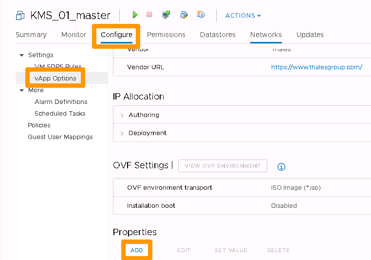{.thumbails}

* Aller dans l’onglet **Configure**
* Puis dans le menu de gauche **vApp Options**
* Puis dans la section **Properties**, cliquez sur `ADD`{.action}

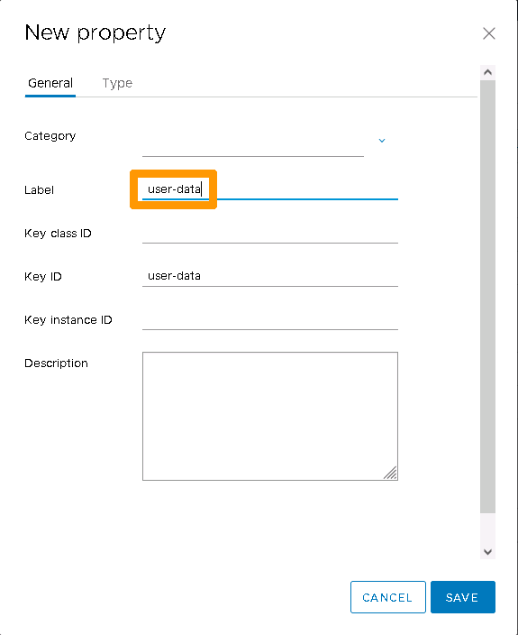{.thumbails}

* Dans l’onglet **General**
* Définir le lable à **user-data**

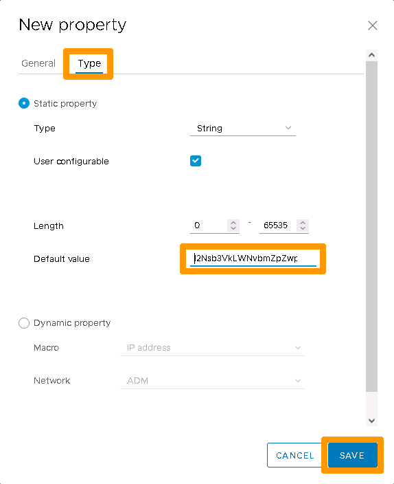{.thumbails}

* Dans l’onglet **Type**
* Saisir dans **Default value**, la chaine en base 64
* Cliquez sur `SAVE`{.action}

Démarrer la VM et vérifier qu’à l’issu du démarrage l’IP configurée est bien présente.

Repéter les étapes pour la seconde instance **KMS_01_master**

A l’issue de ces étapes, les différentes instances doivent être visibles. Exemple : 

{.thumbails}

{.thumbails}

{.thumbails}

## Pré-configurer chaque instance

Attention : dans ces étapes, il est important que la clé SSH ainsi que les mots de passe définits dans les différentes instances d’un client soient identiques.

Lors de la génération du mot de passe temporaire, attention à ce que le mot de passe respecte les policy suivantes.

{.thumbails}


Etapes:

Première authentification au KMS
*	Se connecter sur l’appliance : adresseIp
*	Renseigner la clé SSH publique du client

{.thumbails}

*	L’insertion peut prendre quelques minutes afin que les microservices puissent se lancer

Changement du mot de passe
*	Depuis la fenêtre, rentrer les mots de passes par défaut : admin / admin
*	Une nouvelle fenêtre arrive afin de renouveler le mot de passe. Positionner un mot de passe temporaire qui sera à transmettre au client afin que ce dernier puisse le modifier par la suite.

{.thumbails}

*	Cliquer sur « Change Password »
*	Authentifier vous pour vérifier la bonne prise en compte du mot de passe

{.thumbails}

## Créer le script de configuration automatique

Etapes :

* Se positionner sur une machine ayant un accès aux IPs publiques des instances du KMS
* Désarchiver le package réceptionné et vérifier ll’arborescence :

*	config
*	config.yaml
*	configprofile.json
*	cloud.init.template
*	ext_ca
*	sectigo_rsa.cer
*	usertrust_rsa.cer
*	kmip_ssl
*	kmip_user
*	logs
*	web_ssl
*	config.json
*	ctmInit.sh
*	ksctl.exe
*	ksctlversion
*	ksctl

KSCTL et fournit par Thales en version exécutable windows, Linux et darwin.
A la racine du package, la version windows est présente, la version Linux est quant à elle disponible dans le répertpore ksctlversion.

Avant de continuer, il est important de positionner, à la racine du package, la version de KSCTL correspondant au system d’exploitation utilisé.

Attention : le script est un script bash, dans le cas d’une utilisation sous Windows, penser à utiliser un mobaXterm ou autre outil permettant de simuler un environnement Linux

* Configuration d’accès au KMS
 * Editer le fichier config/config.yaml
 * Modifier les éléments suivants :

* KSCTL_PASSWORD : password mis à jour lors de l’étape 2 du §3
* KSCTL_URL : https://<ip>:443 en utilisant l’IP de l’une des deux instances

Exemple de fichier :
```
KSCTL_VERBOSITY: false
KSCTL_RESP: json
KSCTL_USERNAME: admin
KSCTL_PASSWORD: supernova123!
KSCTL_URL: https://51.222.126.181:443
KSCTL_JWT:
KSCTL_NOSSLVERIFY: true
KSCTL_TIMEOUT: 30
```

* OPTIONNEL
Configuration du profile de certificat utilisateur kmip
*	Editer le fichier config/configprofile.json
*	Ce fichier est à modifier uniquement dans le cas où l’on souhaite changer le nom de l’utilisateur kmip. Dans cette hypothèse, modifier la proproété « csr_cn »

```
Exemple de fichier :
{
    "cert_user_field": "CN",
    "csr_cn": "kmip_user",
    "csr_org_name": "",
    "csr_org_unit": "",
    "csr_email": "",
    "csr_city": "",
    "csr_state": "",
    "csr_country": "",
    "csr_uid": ""
}
```

* Configuration du script :

* Editer le fichier config.json
* Mettre à jour les informations :

Exemple et explication : 
```
{
	
  "logfile": "logs/init.log", #path et nom du fichier de logs
  "yamlconffile": "config/config.yaml", #path et nom du fichier de de configuration d’accès aux instances KMS
  "kmip_profile_cnf": "config/configprofile.json", #path et nom du fichier de configuration du profile de certificats KMIP client
  "kms_ip": "51.222.126.181", #IP du master node
  "kms_ip_other_nodes":"51.222.126.182", #IP des nœuds secondaires. Si plus de 2 instances, indiquer les IP des instances 2 à X séparés par des « , » exemple : x.x.x.x,y.y.y.y
  "ca_external1": "ext_ca/sectigo_rsa.cer", # path et nom du premier certificat externe à importer
  "ca_external2": "ext_ca/usertrust_rsa.cer", #path et nom du second certificat externe à importer
  "kmip_ssl_crt": "kmip_ssl/kmip_ssl_crt.pem", #path et nom du certificat SSL KMIP à générer
  "kmip_ssl_key": "kmip_ssl/kmip_ssl_key.key", #path et nom de la clé privée du certificat SSL KMIP à générer
  "kmip_ssl_cn":"kmip.server", #CN du certificat SSL KMIP
  "web_ssl_crt": "web_ssl/web_ssl_crt.pem", #path et nom du certificat SSL WEB à générer
  "web_ssl_key": "web_ssl/web_ssl_key.key", #path et nom de la clé privée du certificat SSL WEB à générer
  "web_ssl_cn":"kmip.server", #CN du certificat SSL WEB	
  "kms_kmip_user_pwd": "TotoTest123_", #Mot de passe temporaire du user KMIP
  "kmip_profile_name": "kmip_user_profile", #Nom du profile KMIP à créer
  "kmip_user_cert": "kmip_user/kmip_user_cert.pem", #path et nom de la clé privée du certificat client KMIP à générer
  "kmip_user_key": "kmip_user/kmip_user_ckey.key", #path et nom de la clé privée du certificat client KMIP à générer
  "kmip_server_cert_duration": 365, #durée de validité du certificat SSL server KMIP
  "kmip_client_cert_duration": 365, #durée de validité du certificat SSL client KMIP
  "web_server_cert_duration": 365, #durée de validité du certificat SSL server WEB
}
```

## Exécuter le script de configuration automatique

Le script de configuration automatique permet de réaliser les opérations suivantes :

* Création du cluster
* Ajout des instances complémentaires dans le cluster
* Création d’un utilisateur KMIP 
* Ajout des privilèges à cet utilisateur
* Ajout des ACs externes (ACs utilisées par le manager OVH)
* Génération des certificats SSL Server pour les services KMIP et WEB
* Modification des configurations des interfaces KMIP et WEB
* Configuration du profile d’utilisateur KMIP
* Création d’un registration token
* Génération du certificat KMIP SSL client (qui sera ensuite configuré dans vCenter)

Cette étape ne peut être réalisées que si les étapes précédentes ont été réalisées avec succès.
Une fois les prérequis validés :

`./ctmInit.sh -c config.json` 

Durant l’exécution du script, les interfaces WEB et KMIP des instances du KMS seront redémarrés, les accès WEB peuvent donc être bloqués jusqu’à la fin.

Une fois que le script a rendu la main, effectuer les vérifications d’usage :

* Se connecter sur une instance 
* Access Managerment > User => vérifier que l’utilisateur KMIP est créé
* CA > External CA => Vérifier que les 2 ACs externes ont été configurées
* Admin Settings > Cluster => Vérifier que les deux nœuds sont actifs
* Products > KMIP > Registered client => Vérifier que le client KMIP a bien été enregistré
* Sur le file system ou le script a été exécuté, vérifié dans les différents répertoires que les certificats sont bien présents, ont le bon CN et ont la bonne durée de vie

La configuration automatique est terminée.


## Activer la licence KMS

Dans le cadre de l’installation par client, deux types de licences sont à installer par client :
* Virtual CipherTrust Manager : licence propre à une instance :

* Il faudra activer les licences unitairement pour chaque instance à l’aide du « Key Manager Lock Code »
*	L’installation devra être réalisée par appliance
*	KMIP : licence pour les clients KMIP
*	Activation de la licence en fonction du besoin. L’activation est réalisée à l’aide du « Connector Lock Code »
*	L’installation devra être réalisée une seule fois avant d’être propagée sur les membres du cluster.

Afin de réaliser l’activation et l’installation des licences :
*	Se connecter sur chacune des instances du client :
*	Dans Admin Settings > Licensing > Lock Codes, récupérer :
*	Key Manager Lock Code
*	Connector Lock Code
*	Récupérer le / les document livré par Thales concernant la commande de licences
*	Suivre le mode opératoire inscrit sur la documentation.

Rappel : 
*	Key Manager Lock Code à utiliser pour l’activation de la licence de l’appliance virtuelle
*	Connector Lock Code à utiliser pour les licences de connecteur comme KMIP.


Votre KMS est prêt à etre utilisé.
